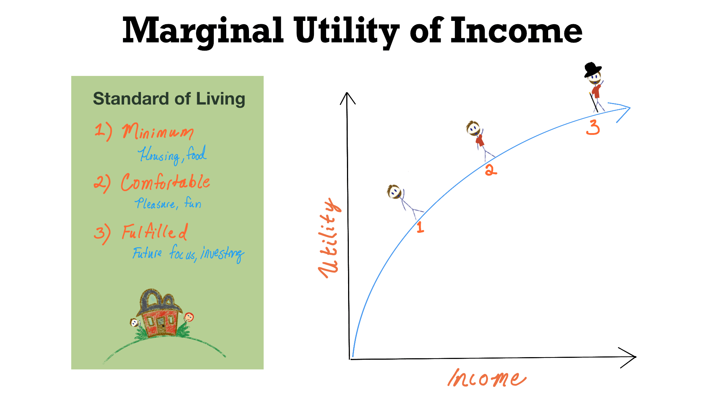

## Table of Contents

## What is marginal utility?

Marginal utility is the extra satisfaction or happiness a person gets from having one more unit of something. Imagine you're eating slices of pizza. The first slice might make you very happy because you're hungry. But as you keep eating, each additional slice might not make you as happy as the one before it. That extra happiness you get from the next slice is what we call marginal utility.

This concept is important because it helps explain how people make choices. If the marginal utility of something is high, people will want more of it. But if it starts to decrease, they might stop wanting more. For example, after eating a few slices of pizza, you might not want any more because the joy from eating another slice isn't worth it. Economists use this idea to understand how people decide what to buy and how much.

## How does marginal utility apply to income?

Marginal utility applies to income by showing how the value of each additional dollar changes for someone. Think of it like this: if you're earning very little money, getting an extra dollar can be really important. It might mean you can buy food or pay for a basic need. So, the marginal utility of that dollar is high because it makes a big difference in your life.

As your income grows, the extra dollars you earn might not be as important. For example, if you're already earning enough to cover your basic needs, an extra dollar might not change your life much. You might use it to buy something nice but not necessary. So, the marginal utility of that dollar is lower because it doesn't add as much to your happiness or well-being. This is why people often say that money can't buy happiness beyond a certain point – the marginal utility of income decreases as you earn more.

## Why is the concept of marginal utility of income important in economics?

The concept of marginal utility of income is important in economics because it helps explain how people make choices about money. When someone's income goes up, the value they get from each extra dollar usually goes down. This means that if you're poor, getting more money can really help because it lets you buy important things like food and shelter. But if you're already rich, getting even more money doesn't make as big a difference. Understanding this helps economists see why people might spend their money differently depending on how much they earn.

This idea also helps in making policies that aim to make people happier. For example, if the government wants to help people, they might give more money to those who are poor because the extra money will make a bigger difference to them. This is based on the idea that the marginal utility of income is higher for people with less money. By understanding how the value of money changes as income changes, economists can better predict how people will react to different economic policies and help make decisions that can improve overall well-being.

## Can you explain the law of diminishing marginal utility in relation to income?

The law of diminishing marginal utility says that as you get more of something, each extra bit you get is less valuable to you. When it comes to income, this means that the first few dollars you earn are really important. If you're poor, getting a little more money can make a big difference because it helps you buy things you really need, like food or a place to live. So, the value of those first few dollars is high.

As your income goes up, the extra dollars you earn don't make as much of a difference. If you're already earning enough to cover your basic needs, getting more money might just mean you can buy things that are nice to have but not necessary. So, the value of each extra dollar goes down. This is why people say that money can't buy happiness beyond a certain point – because the more money you have, the less each extra dollar matters to you.

## How do economists measure the marginal utility of income?

Economists measure the marginal utility of income by looking at how people spend their money and how their happiness changes when they get more of it. They often use surveys to ask people about their income and how satisfied they feel with their lives. By comparing the answers from people with different incomes, economists can see how much extra happiness comes from earning more money. For example, if someone who earns $20,000 a year gets an extra $1,000 and feels much happier, but someone who earns $100,000 a year doesn't feel much happier with that same extra $1,000, it shows that the marginal utility of income is higher for the person with less money.

Another way economists measure this is by looking at how people's spending changes when they get more money. If someone with a low income spends all their extra money on basic needs like food and housing, it shows that those extra dollars are very important to them. But if someone with a high income spends their extra money on things like vacations or luxury items, it shows that those extra dollars don't make as much of a difference in their lives. By studying these patterns, economists can understand how the value of money changes as people earn more, helping them make better economic policies.

## What factors can affect the marginal utility of income for an individual?

Several things can change how much an extra dollar means to someone. One big thing is how much money they already have. If someone doesn't have much money, an extra dollar can help them buy important things like food or a place to live. But if someone already has a lot of money, that extra dollar might not make much difference because they can already buy what they need. Another thing that matters is what someone wants or needs at the moment. If you're really hungry, getting money to buy food will make you much happier than if you're not hungry at all.

Other things like where someone lives and what they like to do can also change how they feel about extra money. If you live in a place where things cost a lot, an extra dollar might not go as far as it would in a cheaper place. Also, if someone likes to spend money on things that make them happy, like hobbies or travel, they might feel that extra money is more important than someone who doesn't care about those things. So, the value of an extra dollar can be different for everyone, depending on their life and what they need or want.

## How does the marginal utility of income vary across different income levels?

The marginal utility of income changes a lot depending on how much money someone already has. If someone is poor, an extra dollar can be really important. It can help them buy food, pay for a place to live, or take care of other basic needs. So, for people with low incomes, each extra dollar they get can make a big difference in their lives. This means the marginal utility of income is high for them because that extra money really helps.

But if someone already has a lot of money, getting an extra dollar doesn't mean as much. They can already buy what they need, so that extra dollar might just go towards something nice but not necessary, like a vacation or a new gadget. So, for people with high incomes, the value of each extra dollar goes down. This means the marginal utility of income is lower for them because the extra money doesn't change their lives as much.

## What are the implications of the marginal utility of income for income redistribution policies?

The idea of marginal utility of income is really important when we talk about moving money around from rich people to poor people. If we know that an extra dollar means a lot more to someone who doesn't have much money, then giving money to poor people can make them a lot happier. This is because they can use that money to buy things they really need, like food or a place to live. So, when the government thinks about taking money from rich people and giving it to poor people, they're trying to make everyone happier by making sure the money goes where it will help the most.

But it's not just about making poor people happier. It's also about making things more fair. If rich people have a lot of money and don't need more, but poor people are struggling to get by, moving some money around can help make things more equal. This can make society better because when people have what they need, they can do better in school, work, and life. So, understanding how much an extra dollar means to different people helps the government make choices that can help everyone.

## How does the concept of marginal utility of income relate to consumer behavior?

The concept of marginal utility of income helps explain how people decide to spend their money. When someone gets more money, they think about what they can buy with it. If they don't have much money, an extra dollar can help them buy important things like food or a place to live. So, they might spend that money on basic needs because it makes a big difference in their life. But if someone already has a lot of money, an extra dollar doesn't mean as much. They might spend it on things they want but don't need, like a new phone or a vacation. This shows that the value of money changes depending on how much someone already has.

Understanding the marginal utility of income also helps explain why people with different incomes might spend their money differently. If you're poor, you'll probably spend most of your money on things you need to survive. But if you're rich, you might spend more on things that make you happy or comfortable. This is because the extra money doesn't change your life as much when you already have enough. So, the way people spend their money can tell us a lot about how much they value each extra dollar they get.

## Can you discuss any empirical studies that have examined the marginal utility of income?

One important study that looked at the marginal utility of income is the one done by Daniel Kahneman and Angus Deaton in 2010. They found that happiness goes up as income goes up, but only until people earn about $75,000 a year. After that, more money doesn't make people much happier. This shows that the value of extra money, or the marginal utility of income, is high for people who don't have much, but it gets lower as people earn more.

Another study by Betsey Stevenson and Justin Wolfers in 2008 also looked at this. They found that in many countries, people's happiness keeps going up as their income goes up, no matter how much they earn. But they also saw that the happiness from extra money is bigger for poor people than for rich people. This supports the idea that the marginal utility of income is higher for people with less money. Both studies help us understand how money affects happiness and why giving money to poor people can make a bigger difference in their lives than giving it to rich people.

## How do different economic theories interpret the marginal utility of income?

Different economic theories have different ways of looking at the marginal utility of income. In neoclassical economics, they think about how each extra dollar changes a person's happiness. They believe that the first few dollars someone earns are really important because they help buy basic things like food and a place to live. But as someone earns more money, each extra dollar doesn't make as much of a difference. So, they say the value of money goes down as you get more of it. This helps explain why poor people might be happier with a little more money than rich people.

In behavioral economics, they look at how people actually spend their money and how that affects their happiness. They found that people don't always act in the way that neoclassical economics predicts. For example, people might spend money on things that make them happy right away, even if it's not the best choice for their future. Behavioral economists also study how things like where someone lives or what they like to do can change how much an extra dollar means to them. They use this to understand why people with the same income might spend their money differently and feel differently about getting more money.

## What are the criticisms and limitations of the marginal utility of income as a concept?

Some people think the idea of marginal utility of income is too simple. They say it doesn't take into account all the different things that can affect how much an extra dollar means to someone. For example, it doesn't look at how someone's health, where they live, or what they like to do can change the value of money. Also, this idea assumes people always make choices that will make them happier, but that's not always true. People might spend money on things that make them feel good right away, even if it's not the best choice for their future.

Another problem is that it's hard to measure how happy someone is with more money. People can say they feel happier, but it's not easy to put a number on happiness. Also, what makes one person happy might not make another person happy, so it's hard to compare. Some people also argue that this idea doesn't think about how money can affect other things, like how safe someone feels or how much they can help their family. So, while the idea of marginal utility of income can help us understand some things, it doesn't tell the whole story about how money affects people's lives.

## What is Understanding Marginal Utility in Economics?

Marginal utility is a core concept in economics, describing the additional satisfaction or benefit that a consumer derives from consuming one more unit of a good or service. This concept is central to understanding how consumers make choices, as it informs their decision-making process regarding which goods and services to purchase. Economically, it posits that consumers seek to maximize their total utility within the constraints of their income or budget, thereby influencing demand and the allocation of resources in the market.

The foundation of marginal utility lies in the principle of diminishing marginal utility, which states that as a person consumes more units of a good, the utility or satisfaction gained from each additional unit tends to decrease. For example, consider the eating of slices of pizza: the first slice may provide substantial satisfaction, the second slice may offer some additional pleasure, but by the fourth or fifth slice, the satisfaction derived from each additional slice may decrease significantly. Mathematically, this can be represented as:

$$
MU(x) = \frac{\Delta U}{\Delta x}
$$

Where $MU(x)$ is the marginal utility of consuming an additional unit $x$, $\Delta U$ is the change in total utility, and $\Delta x$ is the change in the number of units consumed.

This diminishing effect is crucial for predicting consumer behavior and optimizing market offerings. As marginal utility diminishes, a consumer reaches a point where consuming additional units is no longer justified by the utility received, influencing both their purchasing decisions and the overall demand curve in the market. Consequently, businesses use this understanding to tailor product offerings and pricing strategies that align with consumer preferences and maximize economic efficiency.

Marginal utility also plays an instrumental role in understanding the substitution effect, where consumers may replace a good that provides less marginal utility with another that offers higher utility per unit cost, in response to changes in price or income. This behavior directly impacts resource allocation, as producers adjust supply to match these shifting demand patterns.

Overall, marginal utility serves as a fundamental economic concept that shapes theories related to consumer choice, market behavior, and the efficient allocation of resources. Its application ranges from microeconomic analyses of individual consumer decisions to macroeconomic policies that aim to enhance societal welfare through optimized resource distribution.

## How can utility concepts be incorporated into algorithmic trading?

Utility concepts play a critical role in transforming algorithmic trading strategies to better align with investor preferences and risk profiles. By incorporating utility functions into trading algorithms, these systems can evaluate investment opportunities not just on potential return, but also in terms of risk-adjusted satisfaction. This shift from maximizing monetary return to maximizing expected utility represents a sophisticated approach to making trading decisions that are congruent with investor goals.

### Utility Functions in Trading Algorithms

Utility functions serve as the mathematical representation of an investor's risk tolerance. These functions are pivotal in facilitating decision-making processes in algorithmic trading. A common utility function used is the constant relative risk aversion (CRRA) utility function, defined as:

$$
U(x) = \frac{x^{1-\gamma}}{1-\gamma}
$$

where $x$ represents wealth and $\gamma$ denotes the coefficient of relative risk aversion. This function allows algorithms to weigh potential returns against the investor's risk profile, thus tailoring investment choices to specific preferences.

### Maximizing Expected Utility

Algorithmic systems using utility functions aim to optimize expected utility rather than merely maximizing returns. This involves computing the expected utility of potential trades and selecting those that offer the highest expected satisfaction, factoring in uncertainty and risk levels. In practical terms, expected utility optimization is performed through algorithms that consider a diverse set of market variables, enabling nuanced evaluations and strategic decisions.

Here is a basic Python snippet to illustrate expected utility maximization:
```python
import numpy as np

# Define CRRA utility function
def crra_utility(x, gamma):
    if gamma == 1:
        return np.log(x)
    else:
        return (x**(1-gamma))/(1-gamma)

# Simulate expected utility calculation
def expected_utility(returns, probabilities, gamma):
    utilities = crra_utility(returns, gamma)
    return np.dot(probabilities, utilities)

# Example trade returns and probabilities
returns = np.array([1.1, 0.9, 1.3])
probabilities = np.array([0.3, 0.4, 0.3])
gamma = 2  # Risk aversion coefficient

# Calculate expected utility
eu = expected_utility(returns, probabilities, gamma)
print("Expected Utility:", eu)
```

### Portfolio Optimization

Utility-based algorithms are instrumental in optimizing portfolio allocations. By considering the covariance of asset returns and their respective utilities, these systems can construct portfolios that aim to balance risk and return effectively. The Markowitz efficient frontier is often employed in this regard, integrating utility considerations to produce portfolios that offer the best possible expected utility.

### Adaptation to Market Conditions

These algorithms are adept at adjusting trading strategies to shifting market conditions. By constantly recalibrating the utility functions based on real-time data, algorithmic systems ensure that strategies remain aligned with both market dynamics and investor preferences. This adaptability is key in navigating the complexities of modern financial markets, ensuring optimized performance regardless of [volatility](/wiki/volatility-trading-strategies) or market trends.

In summary, the integration of utility concepts into algorithmic trading represents a significant advancement in aligning trading strategies with the nuanced preferences of investors. By focusing on maximizing expected utility rather than simple returns, these systems provide a more comprehensive and personalized approach to financial decision-making.

## References & Further Reading

[1]: Kahneman, D., & Tversky, A. (1979). ["Prospect Theory: An Analysis of Decision under Risk."](http://web.mit.edu/curhan/www/docs/Articles/15341_Readings/Behavioral_Decision_Theory/Kahneman_Tversky_1979_Prospect_theory.pdf) Econometrica, 47(2), 263-291.

[2]: Varian, H. R. (1992). ["Microeconomic Analysis."](https://archive.org/details/microeconomicana00vari_0) W.W. Norton & Company.

[3]: Lopez de Prado, M. (2018). ["Advances in Financial Machine Learning."](https://www.amazon.com/Advances-Financial-Machine-Learning-Marcos/dp/1119482089) John Wiley & Sons.

[4]: Chan, E. P. (2009). ["Quantitative Trading: How to Build Your Own Algorithmic Trading Business."](https://github.com/egorpe/EPChan-QuantitativeTrading/blob/master/example7_6.m) John Wiley & Sons.

[5]: Kelly, J. L. (1956). ["A New Interpretation of Information Rate."](https://www.princeton.edu/~wbialek/rome/refs/kelly_56.pdf) Bell System Technical Journal, 35(4), 917-926.