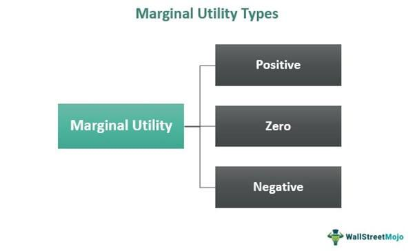

The interconnectedness of marginal utility, economics, income, and algorithmic trading forms a fascinating nexus in modern finance. These elements converge to shape financial systems, influencing both theoretical constructs and practical applications in trading and investment. Marginal utility, a fundamental concept in economics, describes the additional satisfaction a consumer receives from consuming one more unit of a good or service. This concept is crucial for understanding consumer behavior patterns and demand dynamics, forming the basis upon which economists predict how individuals allocate their resources.

Algorithmic trading, a modern innovation in financial markets, uses advanced mathematical models and computational algorithms to optimize trading strategies. By incorporating economic principles such as utility maximization, algorithmic trading systems strive to enhance decision-making accuracy and efficiency. This integration enables traders to execute large volumes of transactions at speeds beyond human capability, thus capitalizing on market inefficiencies with precision.



The interaction between marginal utility and income is also significant, as it dictates the spending behavior of consumers. Generally, as individuals' income increases, the marginal utility of additional income decreases, which affects how resources are distributed within an economy. This relationship is vital for devising economic policies that promote equitable wealth distribution and address socioeconomic disparities. By understanding consumer behavior through marginal utility, economists can aid in formulating tax policies and assessing economic inequality.

This article aims to explore these intricate relationships, providing insights into how concepts of marginal utility and income influence algorithmic trading strategies. By aligning financial decision-making with economic theories, traders can better meet investor preferences and optimize portfolio allocations. Through this exploration, we seek to illuminate the ways in which these theoretical concepts find practical application in the fast-paced world of modern finance, ultimately contributing to more efficient and predictive trading outcomes.

## Table of Contents

## Understanding Marginal Utility in Economics

Marginal utility is a core concept in economics, describing the additional satisfaction or benefit that a consumer derives from consuming one more unit of a good or service. This concept is central to understanding how consumers make choices, as it informs their decision-making process regarding which goods and services to purchase. Economically, it posits that consumers seek to maximize their total utility within the constraints of their income or budget, thereby influencing demand and the allocation of resources in the market.

The foundation of marginal utility lies in the principle of diminishing marginal utility, which states that as a person consumes more units of a good, the utility or satisfaction gained from each additional unit tends to decrease. For example, consider the eating of slices of pizza: the first slice may provide substantial satisfaction, the second slice may offer some additional pleasure, but by the fourth or fifth slice, the satisfaction derived from each additional slice may decrease significantly. Mathematically, this can be represented as:

$$
MU(x) = \frac{\Delta U}{\Delta x}
$$

Where $MU(x)$ is the marginal utility of consuming an additional unit $x$, $\Delta U$ is the change in total utility, and $\Delta x$ is the change in the number of units consumed.

This diminishing effect is crucial for predicting consumer behavior and optimizing market offerings. As marginal utility diminishes, a consumer reaches a point where consuming additional units is no longer justified by the utility received, influencing both their purchasing decisions and the overall demand curve in the market. Consequently, businesses use this understanding to tailor product offerings and pricing strategies that align with consumer preferences and maximize economic efficiency.

Marginal utility also plays an instrumental role in understanding the substitution effect, where consumers may replace a good that provides less marginal utility with another that offers higher utility per unit cost, in response to changes in price or income. This behavior directly impacts resource allocation, as producers adjust supply to match these shifting demand patterns.

Overall, marginal utility serves as a fundamental economic concept that shapes theories related to consumer choice, market behavior, and the efficient allocation of resources. Its application ranges from microeconomic analyses of individual consumer decisions to macroeconomic policies that aim to enhance societal welfare through optimized resource distribution.

## The Link Between Income and Marginal Utility

Income significantly influences the marginal utility of goods and services for individuals, often depicted within economic theory as a diminishing curve when graphed against income levels. Marginal utility is defined as the incremental benefit derived from consuming an additional unit of a good or service. Importantly, as an individual's income increases, the additional satisfaction or utility derived from each additional unit of income generally decreases.

This decrease in marginal utility with rising income reflects a broader economic principle known as the law of diminishing marginal utility. This principle suggests that consumption decisions transform as individuals' economic wealth expands: people tend to spend additional income on less essential items, experiencing lower levels of satisfaction compared to what was obtained from their prior, more necessary purchases. Mathematically, the concept can be expressed using a utility function $U$, defined over a set of goods $x_1, x_2, \ldots, x_n$, where $MU(x_i) = \frac{\partial U}{\partial x_i}$ decreases as $x_i$ increases, holding all else equal.

Understanding the relationship between income and marginal utility is vital for crafting economic models and public policies aimed at equity and efficiency in the distribution of wealth. For policymakers, these insights are crucial when devising fiscal policies such as taxation. Progressive tax structures, which levy higher tax rates on higher income brackets, are rooted in the principle that the marginal utility of income declines with rising income, thereby justifying the diminishing marginal contribution of each additional dollar earned by higher-income individuals.

Moreover, the assessment of socioeconomic inequalities is significantly informed by the interplay between income and marginal utility. Economic models that integrate this relationship can better evaluate disparities in wealth distribution and identify the necessary interventions to enhance social welfare. When strategic financial analyses incorporate these principles, they often reveal that income redistribution efforts could enhance overall economic well-being, assuming diminishing marginal utility across various income levels.

In summary, exploring the link between income and marginal utility provides valuable insights essential for creating economic strategies and policies that cater to an equitable wealth distribution while optimizing overall utility in society.

## Algorithmic Trading: An Overview

Algorithmic trading utilizes sophisticated computer programs and algorithms to execute trading strategies with speed and efficiency that surpass human capabilities. The foundation of [algorithmic trading](/wiki/algorithmic-trading) lies in data analysis, where historical and real-time market data are processed to identify and exploit inefficiencies. These inefficiencies, often transient and subtle, provide opportunities for algorithmic systems to make informed trading decisions based on predetermined criteria.

One of the primary advantages of algorithmic trading is its ability to process enormous volumes of data swiftly. Algorithms can analyze multiple variables and sources of information simultaneously to detect patterns and trends. This capability enables the execution of trades at an unparalleled pace, minimizing the latency that can be detrimental in fast-moving financial markets.

Moreover, algorithmic trading systems are not limited by biases or emotional factors that may affect human traders. By adhering strictly to their coded instructions, these systems maintain consistency in execution. Algorithms are designed to perform tasks such as [market making](/wiki/market-making), [arbitrage](/wiki/arbitrage), and [trend following](/wiki/trend-following). In market making, they supply [liquidity](/wiki/liquidity-risk-premium) by continuously quoting buy and sell prices, profiting from the spread. Arbitrage strategies involve the simultaneous purchase and sale of an asset in different markets to exploit price discrepancies, effectively ensuring market efficiency. Trend following utilizes historical price data to identify and capitalize on sustained movements in market prices.

The mathematical foundation of algorithmic trading is often rooted in statistical models and quantitative methods. These include regression analysis, time-series analysis, and [machine learning](/wiki/machine-learning) techniques that enhance predictive accuracy. For example, moving averages, oscillators, and other technical indicators are often integrated into algorithms to signal trading opportunities.

Python is a popular language for developing algorithmic trading strategies due to its extensive libraries and frameworks dedicated to financial analysis. Below is an example of a simple moving average crossover strategy implemented in Python:

```python
import pandas as pd
import numpy as np

# Load historical market data
data = pd.read_csv('market_data.csv')
data['SMA_50'] = data['Close'].rolling(window=50).mean()
data['SMA_200'] = data['Close'].rolling(window=200).mean()

# Trading signals based on moving average crossover
data['Signal'] = 0
data['Signal'][50:] = np.where(data['SMA_50'][50:] > data['SMA_200'][50:], 1, 0)
data['Position'] = data['Signal'].diff()

# Display signals and positions
print(data[['Close', 'SMA_50', 'SMA_200', 'Signal', 'Position']].tail())
```

Overall, algorithmic trading continues to transform financial markets by enhancing efficiency, reducing transaction costs, and driving liquidity. Its evolution is closely tied to advancements in computational capabilities, data availability, and quantitative finance methodologies.

## Incorporating Utility Concepts into Algorithmic Trading

Utility concepts play a critical role in transforming algorithmic trading strategies to better align with investor preferences and risk profiles. By incorporating utility functions into trading algorithms, these systems can evaluate investment opportunities not just on potential return, but also in terms of risk-adjusted satisfaction. This shift from maximizing monetary return to maximizing expected utility represents a sophisticated approach to making trading decisions that are congruent with investor goals.

### Utility Functions in Trading Algorithms

Utility functions serve as the mathematical representation of an investor's risk tolerance. These functions are pivotal in facilitating decision-making processes in algorithmic trading. A common utility function used is the constant relative risk aversion (CRRA) utility function, defined as:

$$
U(x) = \frac{x^{1-\gamma}}{1-\gamma}
$$

where $x$ represents wealth and $\gamma$ denotes the coefficient of relative risk aversion. This function allows algorithms to weigh potential returns against the investor's risk profile, thus tailoring investment choices to specific preferences.

### Maximizing Expected Utility

Algorithmic systems using utility functions aim to optimize expected utility rather than merely maximizing returns. This involves computing the expected utility of potential trades and selecting those that offer the highest expected satisfaction, factoring in uncertainty and risk levels. In practical terms, expected utility optimization is performed through algorithms that consider a diverse set of market variables, enabling nuanced evaluations and strategic decisions.

Here is a basic Python snippet to illustrate expected utility maximization:
```python
import numpy as np

# Define CRRA utility function
def crra_utility(x, gamma):
    if gamma == 1:
        return np.log(x)
    else:
        return (x**(1-gamma))/(1-gamma)

# Simulate expected utility calculation
def expected_utility(returns, probabilities, gamma):
    utilities = crra_utility(returns, gamma)
    return np.dot(probabilities, utilities)

# Example trade returns and probabilities
returns = np.array([1.1, 0.9, 1.3])
probabilities = np.array([0.3, 0.4, 0.3])
gamma = 2  # Risk aversion coefficient

# Calculate expected utility
eu = expected_utility(returns, probabilities, gamma)
print("Expected Utility:", eu)
```

### Portfolio Optimization

Utility-based algorithms are instrumental in optimizing portfolio allocations. By considering the covariance of asset returns and their respective utilities, these systems can construct portfolios that aim to balance risk and return effectively. The Markowitz efficient frontier is often employed in this regard, integrating utility considerations to produce portfolios that offer the best possible expected utility.

### Adaptation to Market Conditions

These algorithms are adept at adjusting trading strategies to shifting market conditions. By constantly recalibrating the utility functions based on real-time data, algorithmic systems ensure that strategies remain aligned with both market dynamics and investor preferences. This adaptability is key in navigating the complexities of modern financial markets, ensuring optimized performance regardless of [volatility](/wiki/volatility-trading-strategies) or market trends.

In summary, the integration of utility concepts into algorithmic trading represents a significant advancement in aligning trading strategies with the nuanced preferences of investors. By focusing on maximizing expected utility rather than simple returns, these systems provide a more comprehensive and personalized approach to financial decision-making.

## Practical Applications and Case Studies

Leading financial firms increasingly employ utility-maximization models to enhance portfolio allocations and risk management strategies. These models leverage the theoretical framework of utility to cater to the individual preferences and risk appetites of investors, thereby optimizing decision-making processes.

Several case studies highlight the effectiveness of utility-based trading strategies in improving decision-making. By accurately modeling investor behavior, these strategies allow for more precise responses to market conditions. For instance, when investors have varying degrees of risk aversion, utility functions can be designed to reflect these differences, enabling algorithms to make choices that maximize the expected utility rather than merely focusing on potential monetary gains.

In high-frequency trading systems, utility functions play a crucial role by guiding the algorithms to capitalize on short-term market anomalies with precision. These functions assess real-time data to identify profitable opportunities that align with specified investor utilities. The utility-based approach allows trading systems to adjust rapidly, choosing the best possible trade actions that meet set risk-return profiles. This adaptability is essential for navigating the fast-paced nature of financial markets where minute price discrepancies can translate into significant profits or losses.

Success stories emphasize the alignment of utility-based algorithms with financial goals and investor risk profiles. Fintech companies adopting these models report improved returns and more stable risk management outcomes. For example, a utility function $U(x) = ax - \frac{b}{2}x^2$ can represent an investor's satisfaction level concerning returns (x), where $a$ and $b$ are parameters indicating the risk-reward trade-off. By optimizing this function, trading algorithms can fine-tune allocations to maximize investor satisfaction.

In summary, integrating utility maximization into algorithmic trading offers substantial practical benefits, enhancing both the efficacy of portfolio management and the precision of high-frequency trading strategies. This approach assists in effectively aligning trading practices with investor objectives, thereby fostering more resilient financial strategies amidst evolving market complexities.

## Challenges and Limitations

Utility theory forms a cornerstone in economics and decision-making, particularly within algorithmic trading. However, its application is not without challenges and limitations, especially when confronted with real-world financial markets and human behavior.

Utility theory traditionally assumes that individuals behave rationally, seeking to maximize their utility based on available information. This assumption often falters when scrutinized against empirical evidence. Behavioral finance highlights deviations from rationality, introducing complexities that standard utility models may not adequately capture. Psychological biases, such as overconfidence, loss aversion, and herd behavior, can significantly influence investor decisions, requiring models that transcend the simplistic rational agent assumption.

The integration of utility concepts into algorithmic trading further involves computational challenges. Solving optimization problems related to trading strategies requires handling high-dimensional data efficiently. As financial markets generate large volumes of data, the complexity of these datasets poses significant hurdles. For instance, optimizing a portfolio to maximize expected utility involves calculations that increase exponentially with the number of assets, necessitating robust computational methods to solve them effectively.

Algorithmic trading relies on the adaptability of algorithms to remain relevant in ever-changing market conditions. Financial markets are dynamic, influenced by numerous factors such as economic indicators, geopolitical events, and technological advancements. Algorithms must be continuously updated and refined to account for these changes. This requirement adds layers of complexity to the design and maintenance of algorithmic systems, as developers must ensure these systems can learn and adapt without compromising accuracy or introducing new biases.

To address these limitations, researchers and practitioners are exploring more nuanced approaches. Incorporating insights from behavioral finance into utility models can improve their realism and predictive power. Advanced machine learning techniques, such as [reinforcement learning](/wiki/reinforcement-learning), are increasingly used to develop adaptive algorithms capable of learning from evolving market conditions. These methods can help overcome some challenges associated with high-dimensional data and the need for continuous adaptation.

In conclusion, while utility theory offers valuable insights for modeling economic behavior, its application in algorithmic trading faces notable challenges due to real-world complexities and computational demands. These limitations necessitate innovative approaches that integrate behavioral finance and advanced computational techniques to build more robust and adaptable trading systems.

## Conclusion

The integration of marginal utility economics into algorithmic trading represents a significant advancement in financial strategy development. By incorporating utility-based models, trading algorithms can more effectively optimize decision-making processes, offering a crucial competitive edge in the fast-paced financial markets. These models facilitate a deeper understanding of investor behavior, allowing for more precise alignment of trading strategies with risk preferences and expected returns.

As algorithmic trading continues to evolve, the enhancements in computational power and data processing capabilities will further expand the practical applications of these theoretical constructs. The increasing ability to process large datasets and adapt to rapidly changing market conditions will enable algorithms to predict market movements with greater accuracy. This progression holds immense potential for refining trading algorithms by integrating complex utility functions that accommodate various market scenarios.

The future landscape of trading is set to benefit from this fusion of economic insights with algorithmic precision. By harnessing the principles of marginal utility economics, financial systems can not only achieve enhanced efficiency but also exhibit increased robustness and predictive power. This integration paves the way for more strategic, informed trading decisions that align closely with both investor objectives and the evolving dynamics of global financial markets.

## References & Further Reading

[1]: Kahneman, D., & Tversky, A. (1979). ["Prospect Theory: An Analysis of Decision under Risk."](http://web.mit.edu/curhan/www/docs/Articles/15341_Readings/Behavioral_Decision_Theory/Kahneman_Tversky_1979_Prospect_theory.pdf) Econometrica, 47(2), 263-291.

[2]: Varian, H. R. (1992). ["Microeconomic Analysis."](https://archive.org/details/microeconomicana00vari_0) W.W. Norton & Company.

[3]: Lopez de Prado, M. (2018). ["Advances in Financial Machine Learning."](https://www.amazon.com/Advances-Financial-Machine-Learning-Marcos/dp/1119482089) John Wiley & Sons.

[4]: Chan, E. P. (2009). ["Quantitative Trading: How to Build Your Own Algorithmic Trading Business."](https://github.com/egorpe/EPChan-QuantitativeTrading/blob/master/example7_6.m) John Wiley & Sons.

[5]: Kelly, J. L. (1956). ["A New Interpretation of Information Rate."](https://www.princeton.edu/~wbialek/rome/refs/kelly_56.pdf) Bell System Technical Journal, 35(4), 917-926.