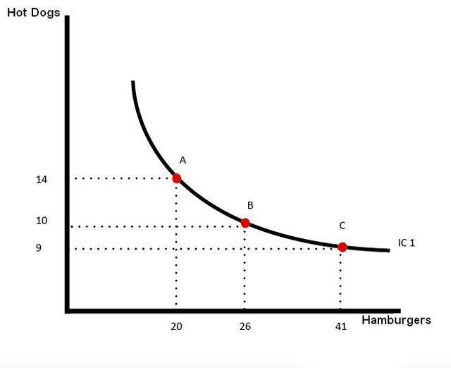

In today's rapidly advancing financial world, the intersection of microeconomics and algorithmic trading presents an invaluable framework for analyzing and understanding consumer behavior and market dynamics. This convergence is increasingly relevant as markets become more complex and data-driven decision-making takes center stage. By scrutinizing key microeconomic concepts such as marginal utility and indifference curves, financial analysts and traders are equipped with powerful tools to optimize trading strategies, leading to more informed and precise market behavior insights.

Marginal utility, a fundamental principle in microeconomics, assists in understanding how consumers derive satisfaction from incremental consumption, playing a crucial role in resource allocation under various budget constraints. Meanwhile, indifference curves illuminate consumer preferences by mapping combinations of goods that yield equal satisfaction, thus providing a visual representation of the trade-offs consumers make. These established concepts of microeconomics find new applications within the context of algorithmic trading, where they are harnessed to refine trading strategies and improve decision-making processes.

Algorithmic trading, which utilizes sophisticated computer algorithms to execute trades, has revolutionized financial markets by enhancing the speed, efficiency, and accuracy of trading operations. By incorporating microeconomic principles like marginal utility and indifference curves, trading algorithms can better assess market trends, evaluate potential asset substitutes, and make efficient trade-offs between investment options. The application of these theories assists in setting optimal trade thresholds and developing portfolio strategies that account for market fluctuations and diverse consumer behaviors.

As such, this article will explore the intricate relationship between these microeconomic principles and algorithmic trading, shedding light on their synergistic potential to optimize trading strategies. By integrating these insights, traders can navigate the complexities of financial markets more effectively, ultimately driving consumer satisfaction and sustained trading success in a rapidly evolving financial landscape.

## Table of Contents

## Understanding Marginal Utility

Marginal utility is a fundamental concept in microeconomics that measures the additional satisfaction or benefit derived from consuming one additional unit of a good or service. This notion is critical in consumer choice theory, as it dictates how individuals allocate their finite resources to maximize utility under budgetary constraints.

At the core of marginal utility is the idea that as a person consumes more of a good, the utility gained from each additional unit tends to decrease. This phenomenon is captured by the law of diminishing marginal utility, which posits that the marginal utility of a good or service diminishes as its consumption increases. In mathematical terms, if $U$ represents total utility, and $Q$ the quantity of goods consumed, then the marginal utility can be expressed as:

$$
MU = \frac{\Delta U}{\Delta Q}
$$

where $\Delta U$ is the change in utility and $\Delta Q$ is the change in the quantity of goods consumed.

This principle affects consumer decisions by informing how much of a good will be purchased. Consumers aim to balance their expenditures on various goods to reach an optimal level of satisfaction. When making choices, they compare the marginal utility per dollar spent on each good, seeking to equalize this ratio across all goods. This leads to the condition known as the optimal consumption rule:

$$
\frac{MU_x}{P_x} = \frac{MU_y}{P_y} = \ldots = \frac{MU_n}{P_n}
$$

where $MU_x$ and $MU_y$ are the marginal utilities of goods $x$ and $y$, and $P_x$ and $P_y$ are their respective prices.

The law of diminishing marginal utility also plays a role in shaping market demand. As the consumption of a good increases and the marginal utility decreases, consumers are less willing to pay high prices, leading to a downward-sloping demand curve. This relationship between marginal utility and demand underscores the importance of marginal utility in market dynamics, influencing price settings and resource allocations.

Understanding marginal utility is essential for analyzing consumer behavior and market trends, as it provides insights into how individuals make trade-offs between different products and services. This concept not only guides individual decision-making but also informs broader economic policies aimed at improving welfare and efficiency in the market.

## Indifference Curves in Microeconomics

Indifference curves are a fundamental concept in microeconomics, representing combinations of goods that yield the same level of satisfaction or utility for a consumer. These curves form the basis for understanding consumer preferences and the inherent trade-offs consumers are willing to make when choosing between different goods.

Indifference curves are graphically represented on a two-dimensional graph, where each axis denotes a different type of good. For example, on a graph plotting quantities of good X on the horizontal axis and quantities of good Y on the vertical axis, each curve depicts various combinations of X and Y that provide the consumer with equivalent satisfaction. One of the essential properties of indifference curves is that they slope downwards from left to right. This downward slope indicates that as a consumer increases consumption of one good, they must decrease consumption of the other to maintain the same level of overall utility.

The convex shape of indifference curves relative to the origin is another critical characteristic, reflecting diminishing marginal rates of substitution (MRS). The MRS is the rate at which a consumer is willing to substitute one good for another while maintaining the same level of utility. Mathematically, the MRS is expressed as the negative of the slope of the indifference curve at a given point, often denoted as:

$$
MRS_{xy} = - \frac{dy}{dx}
$$

Where $dy$ and $dx$ represent the infinitesimal changes in quantities of goods Y and X, respectively. The convexity implies that as a consumer substitutes more of good X for good Y, the amount of good Y they are willing to forgo decreases, demonstrating a declining willingness to substitute goods as one becomes more abundant in their consumption bundle.

Indifference curves also obey several assumptions and properties. They do not intersect, as each curve represents a distinct level of utility; higher curves (further from the origin) correspond to higher utility levels. This non-intersection premise ensures consistent preference ordering, reinforcing the assumption of rational consumer behavior.

Through the analysis of indifference curves, microeconomics can infer not only consumer preferences but also the idea of the optimal consumption point where a consumer can maximize their utility subject to their budget constraint. This intersection point, when overlaid with a budget line, is where the highest attainable indifference curve is tangent to the budget line, illustrating the optimal allocation of resources between goods given budget limits.

In sum, the examination of indifference curves provides crucial insights into consumer decision-making, highlighting how individuals navigate trade-offs to maximize satisfaction. By understanding these preferences, firms and policymakers can better predict consumer reactions to changes in prices or income, all pivotal within economic modeling and practical applications such as market analysis and product positioning.

## Algorithmic Trading and Microeconomic Principles

Algorithmic trading leverages computer algorithms to execute trades with precision and speed, employing complex mathematical models and vast arrays of market data. By incorporating microeconomic principles such as marginal utility and indifference curves, [algorithmic trading](/wiki/algorithmic-trading) systems enhance their decision-making processes, optimizing market participation.

Marginal utility, a cornerstone of microeconomics, provides insight into the additional satisfaction obtained from buying one more unit of a good. This concept can be applied to the trading world, where asset utility is evaluated in terms of expected return versus associated risk. An algorithm might weigh additional units of an asset against their expected contribution to portfolio utility, employing formulas akin to:

$$
MU_A = \frac{\partial U(x)}{\partial x_A}
$$

where $MU_A$ denotes the marginal utility of asset $A$, and $x_A$ represents the quantity of asset $A$.

Indifference curves, on the other hand, offer a graphical depiction of various combinations of assets that yield equal satisfaction to an investor. These curves are instrumental in constructing efficient portfolios that align with specified risk-reward preferences. In algorithmic trading, systems can simulate indifference curves to evaluate potential trade-offs between different investment options. The process typically involves assessing the marginal rate of substitution (MRS) between assets, defined mathematically as:

$$
MRS = \frac{MU_A}{MU_B}
$$

where $MU_A$ and $MU_B$ are the marginal utilities of assets $A$ and $B$ respectively. This rate provides a theoretical framework within which algorithms balance assets within a portfolio to maintain equilibrium.

Such microeconomic foundations play a critical role in enhancing the algorithms' ability to parse market data and execute beneficial trades across diverse scenarios. By understanding consumer preference models, algorithms can gauge market sentiment and adjust their operations dynamically, ensuring optimal trade execution tailored to current conditions.

Algorithmic systems utilize these economic principles to address the complex trade-offs present in market environments. For instance, an algorithm might continually adjust a portfolio by simulating changes in market prices and recalculating an investor's position on an indifference curve. Similarly, understanding marginal utility enables algorithms to prioritize asset allocations that maximize overall utility in response to fluctuating prices or new market data. These tools empower algo-trading systems to maintain competitiveness, adapt to evolving scenarios, and provide insights that ultimately lead to improved performance and strategic advantage in financial markets.

## Applying Indifference Curve Analysis in Algo Trading

Indifference curve analysis provides key insights into algorithmic trading by helping traders understand how to optimize their strategies under varying market conditions. By leveraging consumer preference models, traders can effectively balance risk and return, enhancing their portfolio performance.

Indifference curves, which graphically represent combinations of different goods yielding equal satisfaction, can be applied to trading strategies as a way to model preferences between different investment portfolios or assets. These curves allow traders to visualize and quantify the trade-offs they are willing to make between risk and potential returns. In this context, each point on an indifference curve represents a portfolio mix providing the same level of satisfaction, or expected utility, to the trader.

Traders incorporate these insights to set trade thresholds. For example, consider an algorithmic trading strategy that utilizes moving averages to determine buy or sell signals. By applying indifference curve analysis, traders can adjust the parameters—such as the length of the moving average or the size of the investment—to align with their risk-return preferences. This results in a strategy that not only aims for profitability but also adheres to the trader's subjective risk tolerance.

Furthermore, indifference curve analysis is instrumental in evaluating asset substitutes within a portfolio. Suppose a trader is considering substituting one asset with another to enhance returns or reduce risk. Indifference curves can help assess whether the new asset mix remains on the same utility level or shifts to a higher one, indicating a more favorable risk-return trade-off. This evaluation process often involves complex optimization techniques, such as linear programming or Monte Carlo simulations, to ensure that the portfolio aligns with the trader's desired balance between risk and utility.

Practical applications of these principles can be seen in algorithmic trading software that employs [machine learning](/wiki/machine-learning) algorithms to refine and adapt trading strategies. The software can be programmed to simulate various market scenarios, evaluate the resulting utility from different portfolio compositions, and automatically adjust trading parameters. By continuously learning and recalibrating based on historical data and market trends, these systems emulate human-like decision-making processes, albeit at much faster speeds and with greater precision.

The integration of indifference curve analysis into algorithmic trading is not without its challenges. Market dynamics are inherently volatile, and traders must consider assumptions around rational behavior and consistent preferences. Nevertheless, indifference curves provide a powerful tool for systematically incorporating a trader's risk-return preferences into automated trading strategies, ultimately supporting more informed and effective decision-making in complex financial markets.

## Challenges and Assumptions

The integration of marginal utility and indifference curves into algorithmic trading requires a series of assumptions that can, at times, restrict the applicability of these economic concepts. A primary assumption is consumer rationality, suggesting that consumers consistently make choices intended to maximize their utility. However, real-world behavior often deviates from this assumption, as factors such as emotions, biases, and imperfect information can influence decision-making. Algorithmic trading systems may thus face limitations when relying on models premised on rational consumer behavior, potentially leading to suboptimal trading outcomes.

Another assumption is the continuity of preferences, which implies that small changes in consumption bundles lead to small changes in utility. In dynamic financial markets where prices and information frequently fluctuate, this assumption may result in inaccuracies when assessing consumer preferences over time. Algorithmic systems relying on continuous preference models must adapt to rapid market changes to remain effective.

One notable challenge is addressing the [volatility](/wiki/volatility-trading-strategies) and unpredictability of market prices. The rapid fluctuations characteristic of financial markets pose a significant challenge for algorithms based on static economic models like indifference curves, as these models may not fully accommodate the complexities and speed of market dynamics.

Additionally, the concept of price-taking behavior presents a circular problem. While traditional economic models assume that traders are price takers, automatically accepting prevailing market prices without influencing them, large-scale algorithmic trading can impact market prices due to the [volume](/wiki/volume-trading-strategy) and speed of trades. This influence contradicts the price-taking assumption and highlights a fundamental limitation in the application of standard economic models to algorithmic trading.

To overcome these challenges, trading models must accommodate the nuances of real-world consumer behavior and market conditions. This includes integrating more realistic assumptions that account for irrational behavior, emotional responses, and shifts in preferences. Advanced algorithms employing machine learning techniques could potentially address these limitations by identifying patterns and adjusting to market variability more effectively. Such models not only enhance the adaptability of trading systems but also increase the precision of economic theories when applied in fast-paced market environments.

## Conclusion

Marginal utility and indifference curve analysis are essential tools in the optimization of algorithmic trading strategies. These microeconomic frameworks are instrumental in facilitating a deeper understanding of consumer behavior and market dynamics, which are crucial for traders aiming to optimize their strategies in volatile financial environments. By integrating these theories with sophisticated trading algorithms, traders gain a robust mechanism to assess and respond to shifting market trends and consumer preferences effectively. 

Algorithmic trading, driven by regular advancements in computer technology and data analytics, greatly benefits from the incorporation of marginal utility and indifference curve concepts. These principles guide the formulation of algorithms capable of evaluating and making strategic decisions on trade-offs between risk and potential reward, ensuring the maximization of returns within given market constraints. For instance, understanding the law of diminishing marginal utility can help predict when the additional risk of an investment no longer leads to proportional increases in expected returns, allowing for better-informed trading decisions.

Furthermore, indifference curves help identify optimal combinations of financial assets that provide equivalent satisfaction or utility, enabling traders to diversify their portfolios efficiently while maintaining a balance between risk and return. This is especially valuable in dynamic market conditions where traders must adapt quickly to changes in asset valuations and consumer sentiment.

Continued research and refinement of these microeconomic principles are necessary for adapting algorithmic trading strategies to the ever-evolving market landscape. As new data sources and computational techniques emerge, the integration of these economic theories will be pivotal to maintaining competitive trading approaches. The pursuit of a deeper understanding and application of these concepts promises enhanced trading performance and increased consumer satisfaction, ensuring that traders can achieve sustainable success in the financial markets.

## References & Further Reading

[1]: Varian, H. R. (1992). ["Microeconomic Analysis"](https://archive.org/details/microeconomicana0000vari_g1b1). W. W. Norton & Company.

[2]: Friedman, M. (1949). ["The Utility Analysis of Choices Involving Risk."](https://www.jstor.org/stable/1826045) Journal of Political Economy, 57(4), 279-304.

[3]: Samuelson, P. A., & Nordhaus, W. D. (2010). ["Economics"](https://books.google.com/books/about/EBOOK_Economics.html?id=rMovEAAAQBAJ). McGraw-Hill Education.

[4]: Benninga, S. (2008). ["Financial Modeling"](https://www.amazon.com/Financial-Modeling-Press-Simon-Benninga/dp/0262027283). MIT Press.

[5]: Lopez de Prado, M. (2018). ["Advances in Financial Machine Learning"](https://www.amazon.com/Advances-Financial-Machine-Learning-Marcos/dp/1119482089). Wiley.

[6]: Hull, J. (2017). ["Options, Futures, and Other Derivatives"](https://elibrary.pearson.de/book/99.150005/9781292212920). Pearson.

[7]: Train, K. (2003). ["Discrete Choice Methods with Simulation"](https://eml.berkeley.edu/books/choice2.html). Cambridge University Press.