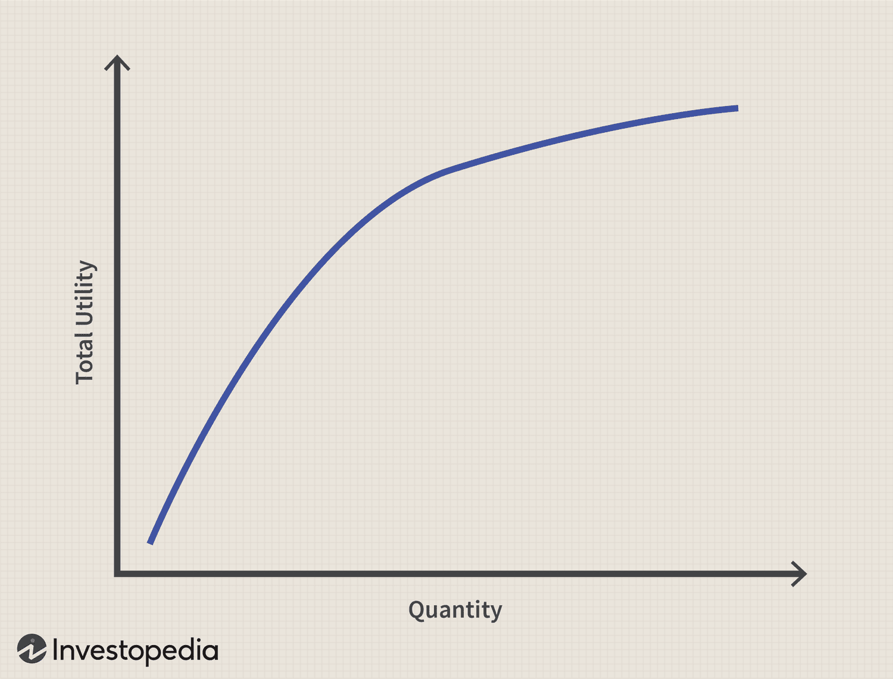

In today's rapidly evolving financial markets, understanding key economic concepts such as marginal value and marginal utility is crucial for those involved in algorithmic trading. These concepts form the foundation of economic theory and are instrumental in explaining consumer behaviors and market dynamics. Traders who grasp these notions can develop more effective trading strategies and optimize their decision-making processes.

Marginal utility refers to the additional satisfaction or utility a consumer derives from consuming an additional unit of a good or service; it generally decreases with each successive unit consumed. This is known as the law of diminishing marginal utility, a principle that helps explain why demand curves typically slope downwards. In contrast, marginal value represents the worth of an extra unit of a good or service in the context of other goods or currency, thus influencing economic decision-making and consumption patterns.



Understanding these concepts is essential for analyzing consumer decisions and market trends, which are critical for formulating trading strategies. Moreover, the synergy between marginal value, marginal utility, and trading highlights the potential for these economic principles to advance financial technology. By integrating these principles into algorithmic trading models, traders can enhance market efficiency and adaptability.

This article aims to provide a thorough understanding of how marginal value and marginal utility can be incorporated into algorithmic frameworks to improve trading strategies. By the end of this exploration, readers will have a comprehensive view of the significance of these economic concepts in the evolving landscape of financial markets, and how they can be leveraged for more effective and efficient trading models.

## Table of Contents

## Understanding Marginal Utility and Marginal Value

Marginal utility is defined as the additional satisfaction or utility that a consumer derives from consuming an extra unit of a good or service. According to the law of diminishing marginal utility, each additional unit consumed results in progressively lesser utility. This principle helps to explain the common consumer experience where, for instance, the enjoyment from the first slice of pizza is significantly higher than from subsequent slices.

Mathematically, marginal utility (MU) can be expressed as:

$$
MU = \frac{\Delta U}{\Delta Q}
$$

where $\Delta U$ is the change in utility, and $\Delta Q$ is the change in quantity consumed.

In contrast, marginal value refers to the value of one additional unit of a good in terms of other goods or currency. This concept is closely tied to economic decision-making. For instance, a consumer’s willingness to pay for another unit of a good diminishes as the marginal utility decreases, influencing purchasing behaviors and consumption patterns.

The concept of diminishing marginal utility directly influences the shape of demand curves in economics. As the additional utility derived from each unit decreases, consumers are willing to purchase fewer units at higher prices, contributing to the downwards slope of the demand curve.

Consider the example of a consumer purchasing slices of pizza. The first slice provides considerable utility, but as more slices are consumed, the satisfaction from each additional slice diminishes, ultimately impacting the consumer’s willingness to pay for further slices. This behavior aligns with the law of diminishing marginal utility and can be observed across various consumer goods and services.

Understanding marginal utility and marginal value provides valuable insights into consumer behavior and market dynamics. By analyzing how these principles influence consumer decisions, traders and economists can develop more effective trading strategies that align with market trends. These economic concepts are crucial for predicting how changes in consumer preferences and utility perceptions can affect market demand, thereby assisting in strategic planning and decision-making in financial markets.

## The Role of Marginal Utility in Consumer Behavior

Consumer behavior in economic theory focuses on examining how individuals make decisions about purchases and allocate their limited resources to maximize their utility or satisfaction. Central to this understanding is the concept of marginal utility, which explains the additional satisfaction a consumer gains from consuming an extra unit of a good or service. As consumers continue to use more units, the marginal utility typically decreases, which is encapsulated by the law of diminishing marginal utility. This principle is essential for comprehending how consumer preferences are shaped and how they decide to spend their budgets across various goods and services. 

According to the law of diminishing marginal utility, the first unit of a product consumed tends to confer the highest utility, with each subsequent unit providing less additional satisfaction. This effect greatly influences demand, as consumers are less willing to pay high prices as their consumption increases and utility derived decreases. It is this declining marginal utility that explains why demand curves generally slope downwards, indicating a lower quantity demanded at higher prices.

Beyond the concept of diminishing marginal utility, several psychological and socio-economic factors also affect consumers' utility perceptions and purchasing choices. These factors introduce complexities in market analysis, as they encompass personal preferences, income levels, cultural influences, and individual psychological factors such as risk aversion and impulsive behaviors. For instance, a high-income consumer may derive different utility from a luxury car compared to a middle-income consumer, whose priorities might lie in more essential needs. 

Recognizing consumer behavior patterns that arise from these influences can enable businesses and traders to create more accurate predictive models for market trends and consumers' reactions to changes in price or product offerings. This knowledge is crucial in sectors where consumer demand can be highly elastic or influenced by specific preferences, such as technology and consumer goods. For example, in the technology industry, the introduction of a new smartphone often follows a demand curve where initial high interest leads to rapid adoption, followed by a tapering demand as the product becomes ubiquitous and consumers wait for newer models. This pattern reflects diminishing marginal utility, indicating that each additional feature or model yields decreasing satisfaction unless it introduces significant innovations.

Through this understanding of consumer behavior, businesses can adapt their pricing, product development, and marketing strategies to align with the anticipated utility that consumers will obtain from their products. This strategic alignment can lead to more effective product launches, competitive pricing strategies, and improved market positioning.

## Algorithmic Trading: A Modern Financial Strategy

Algorithmic trading, commonly referred to as algo trading, represents a contemporary approach to executing trading strategies using computer algorithms. These pre-programmed algorithms are designed to analyze vast amounts of data and [carry](/wiki/carry-trading) out trades with remarkable speed and precision. 

From an economic perspective, [algorithmic trading](/wiki/algorithmic-trading) benefits significantly from principles such as diminishing marginal utility. By understanding that each additional unit of a consumed good yields less satisfaction, algo trading platforms can anticipate market dynamics more effectively. This principle aids in crafting algorithms that refine trading models, leading to enhanced performance.

Moreover, these algorithms are deeply embedded with economic theories aimed at optimizing trade execution and managing risk. The goal is to identify and seize small, profitable opportunities within the market. For instance, by employing the concept of marginal utility, algorithms can adapt to price fluctuations and shifting market conditions, thereby minimizing risks and maximizing potential returns.

The rapid growth of algorithmic trading underscores its capacity to enhance market efficiency. As this trading approach evolves, it encourages a closer examination of consumer and economic behaviors, informing strategic development. By understanding and predicting these behaviors, algorithmic systems gain a robust edge, allowing traders to respond adeptly to changing market landscapes.

In conclusion, the intersection of economic concepts with algorithmic trading fosters the development of more robust and adaptive systems. By integrating insights from economic theories, these systems are better equipped to navigate market complexities and capitalize on emerging opportunities, offering traders a competitive advantage in their operations.

## Integrating Economic Concepts with Algorithmic Trading

Integrating marginal utility and value into algorithmic trading involves leveraging these economic principles to refine both the predictive and adaptive capabilities of trading algorithms. By understanding how these concepts influence market dynamics and consumer decisions, traders can develop more sophisticated models that enhance profitability while minimizing risk.

Economic theories, such as the law of diminishing marginal utility, provide a framework for algorithms to better anticipate market changes. This law suggests that as a consumer acquires more units of a good, the additional satisfaction derived from each subsequent unit decreases. Translating this into market terms, traders can predict how changes in price may alter consumer demand, which in turn can impact overall market trends. By incorporating this understanding into trading algorithms, they can not only predict price actions but also react accordingly.

One method to integrate these concepts is by developing algorithms that analyze historical data to establish patterns of consumer behavior and price movements. For instance, algorithms can be programmed to detect signals of diminishing marginal utility, such as when trading volumes of a particular asset begin to plateau despite rising prices. This can be achieved using statistical models and [machine learning](/wiki/machine-learning) techniques. Consider the following Python code snippet that uses machine learning to detect such patterns in historical trade data:

```python
import pandas as pd
from sklearn.linear_model import LinearRegression

# Load historical trade data
data = pd.read_csv('trade_data.csv')

# Assume data has columns: 'price', 'quantity'
X = data[['price']]
y = data['quantity']

# Fit a linear regression model
model = LinearRegression()
model.fit(X, y)

# Predict future trade quantity
future_price = [[105]]  # example of future price
predicted_quantity = model.predict(future_price)

print(f"Predicted trade quantity at price {future_price[0][0]} is {predicted_quantity[0]}")
```

By integrating economic principles with cutting-edge technology, traders can simulate various market scenarios, gaining insights into potential future market behaviors. These simulations enable the development of more responsive algorithms that are better equipped to adapt to sudden changes in market conditions.

Moreover, innovation in algorithmic trading can be accelerated by merging these foundational economic theories with advancements in data analytics and financial technologies. This convergence allows for the design of models that can dynamically adjust strategies based on real-time data, further optimizing trade execution and risk management.

Thus, integrating economic concepts with algorithmic trading creates a synergy that enhances the accuracy and efficiency of trading systems. By harnessing the predictive power of economic theories, traders can develop robust models that offer a competitive edge in today's volatile financial markets.

## Challenges and Opportunities

The integration of economic concepts like marginal utility and value into algorithmic trading is poised to enhance trading strategies, but it is not without its challenges. One of the primary hurdles lies in accurately modeling complex human behaviors and economic interactions. Human decision-making is influenced by a multitude of factors beyond pure economic rationale, incorporating elements of psychology, sociology, and external market shocks. This complexity presents a substantial challenge for traders and financial analysts attempting to construct models that can reliably predict market movements and consumer behaviors.

Despite these challenges, significant opportunities exist. Furthering our understanding of consumer psychology and economic responses can greatly enhance algorithmic trading algorithms. By incorporating behavioral economic insights, trading models can become more sophisticated, better recognizing patterns that are not solely based on historical data trends but also acknowledge psychological triggers. This might involve using sentiment analysis tools or integrating variables that account for consumer confidence indexes.

Advancements in data analysis and computational power open new possibilities for refining trading algorithms. The rise of big data technologies enables traders to process and analyze vast quantities of market information in real-time. By employing techniques like natural language processing (NLP) and [deep learning](/wiki/deep-learning), algorithms can become more adept at interpreting complex datasets and identifying subtle trends that could predict future market behaviors.

Moreover, the future prospects of algorithmic trading are heavily tied to the development of machine learning (ML) and [artificial intelligence](/wiki/ai-artificial-intelligence) (AI). These technologies offer the potential to create trading strategies that continuously adapt and learn from new data, allowing for dynamic and responsive trading systems. Investment in AI and ML could lead to improvements in efficiency, accuracy, and risk management within trading operations, leveraging economic insights to foster smarter trading decisions.

In conclusion, while there are challenges in integrating economic concepts like marginal utility into algorithmic trading due to the complexities of human behavior, the potential benefits are significant. The combination of advanced data analysis tools and AI technologies promises to overcome current limitations and push the boundaries of what algorithmic trading systems can achieve. Future developments hold promise for creating more adaptive and effective trading strategies, ultimately contributing to more efficient financial markets.

## Conclusion

The exploration of marginal value and utility's application in algorithmic trading elucidates their pivotal role in formulating effective financial strategies. Marginal utility and marginal value provide critical insights into consumer behavior and market dynamics, allowing for a refined understanding of demand and price fluctuations. These economic concepts, rooted in the idea of diminishing returns with additional consumption, help traders anticipate market trends and enhance decision-making.

Improved knowledge of these principles enables traders and economists to construct predictive models that more accurately reflect real-world market activities. By harnessing these foundational economic theories, trading algorithms can become more responsive to shifts in market conditions, thereby enhancing trade execution and risk management. This synergy optimizes performance, maximizes profitability, and minimizes risks associated with volatile market environments.

As financial markets continue to evolve, the intersection between economic theories and algorithmic trading emerges as a fertile ground for innovation. The ongoing refinement of algorithms that integrate principles like diminishing marginal utility offers the promise of more efficient and effective trading systems. This integration not only boosts market efficiency but also drives the development of cutting-edge financial technologies.

Looking ahead, the fusion of economic principles with algorithmic trading is set to deepen, with future innovations enhancing adaptability and sophistication. As machine learning and artificial intelligence advance, the ability to process vast amounts of data and incorporate economic insights will likely lead to transformative changes in trading strategies, ensuring competitive advantages in a rapidly changing financial landscape.

## References & Further Reading

[1]: Bergstra, J., Bardenet, R., Bengio, Y., & Kégl, B. (2011). ["Algorithms for Hyper-Parameter Optimization."](https://dl.acm.org/doi/10.5555/2986459.2986743) Advances in Neural Information Processing Systems 24.

[2]: ["Advances in Financial Machine Learning"](https://www.amazon.com/Advances-Financial-Machine-Learning-Marcos/dp/1119482089) by Marcos Lopez de Prado

[3]: ["Evidence-Based Technical Analysis: Applying the Scientific Method and Statistical Inference to Trading Signals"](https://www.amazon.com/Evidence-Based-Technical-Analysis-Scientific-Statistical/dp/0470008741) by David Aronson

[4]: ["Machine Learning for Algorithmic Trading"](https://github.com/stefan-jansen/machine-learning-for-trading) by Stefan Jansen

[5]: ["Quantitative Trading: How to Build Your Own Algorithmic Trading Business"](https://www.amazon.com/Quantitative-Trading-Build-Algorithmic-Business/dp/1119800064) by Ernest P. Chan