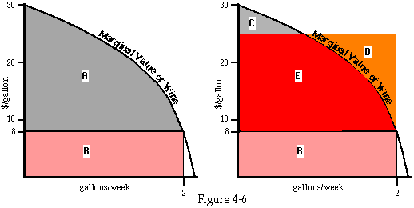

## Table of Contents

## What is marginal utility?

Marginal utility is a concept in economics that describes how much more satisfaction or happiness a person gets from having one more unit of something. Imagine you are eating slices of pizza. The first slice might make you very happy, but by the time you get to the fourth or fifth slice, you might not enjoy it as much. That extra happiness you get from eating one more slice is called marginal utility.

This idea is important because it helps explain how people make choices. If the marginal utility of something is high, people will want more of it. But as they get more and more of it, the marginal utility usually goes down. This is known as the law of diminishing marginal utility. For example, the first glass of water on a hot day is very satisfying, but the tenth glass might not be as enjoyable. Understanding marginal utility helps businesses set prices and helps people make better decisions about what to buy or consume.

## What is marginal value?

Marginal value is similar to marginal utility but focuses on the value or worth of an additional unit of something. Imagine you're collecting stamps. The first stamp might be very valuable to you because it completes your collection. But if you already have many stamps, adding one more might not increase the value of your collection as much. That extra value from adding one more stamp is what we call marginal value.

This concept is useful in many areas, like economics and business. Companies use it to decide how much to produce or sell. If making one more product adds a lot of value, it might be worth doing. But if the marginal value is low, it might not be worth the effort. Understanding marginal value helps people and businesses make better choices about what to do with their time and resources.

## How do marginal utility and marginal value differ?

Marginal utility and marginal value are similar ideas but they focus on different things. Marginal utility is about how much more happiness or satisfaction you get from having one more of something. For example, if you're eating cookies, the first cookie might make you really happy, but the fifth one might not be as exciting. That extra happiness from the next cookie is the marginal utility.

On the other hand, marginal value is about how much more worth or value something has when you add one more unit. Using the same cookie example, the first cookie might be very valuable to you because you're hungry, but the fifth cookie might not add as much value to your overall satisfaction. So, marginal value focuses on the worth or importance of that extra unit, not just the happiness it brings.

Both concepts help people and businesses make decisions. Marginal utility helps you understand your own satisfaction, while marginal value helps you see the worth of adding more of something. They often go hand-in-hand, but they look at different aspects of the same situation.

## Can you provide an example of marginal utility in everyday life?

Imagine you are at a buffet. When you first start eating, the first plate of food tastes amazing. You feel really happy and satisfied with each bite. This is because the first plate gives you a lot of marginal utility – it adds a lot to your happiness. But as you keep eating, the second and third plates don't make you as happy. You start feeling full, and the food doesn't taste as good. The extra happiness you get from each new plate goes down. This is the law of diminishing marginal utility.

Now, think about buying clothes. When you get your first new shirt, it's exciting and makes you happy. You feel good wearing it and it adds a lot to your wardrobe. That's high marginal utility. But if you keep buying more and more shirts, after a while, adding one more shirt doesn't make you as happy. You might already have enough shirts, so the new one doesn't add much to your happiness. The marginal utility of each additional shirt gets lower and lower.

## How does the concept of marginal value apply in business?

In business, marginal value helps companies decide how much to produce and sell. Imagine a factory making toys. If making one more toy adds a lot of value, like making customers happy or bringing in more money, then it's worth it to make that extra toy. But if making one more toy doesn't add much value, maybe because there are already too many toys in the market, then it might not be worth the effort. Businesses use marginal value to figure out if it's a good idea to keep making more of something or if they should stop.

This concept also helps businesses set prices. If the marginal value of a product is high, meaning customers really want it, the business might charge more for it. But if the marginal value is low, they might lower the price to sell more units. Understanding marginal value helps businesses make smart choices about what to produce, how much to produce, and how to price their products to make the most money and keep their customers happy.

## What is the law of diminishing marginal utility?

The law of diminishing marginal utility says that as you get more and more of something, the extra happiness or satisfaction you get from each new piece goes down. Imagine you are eating slices of pizza. The first slice tastes amazing and makes you really happy. But by the time you get to the fourth or fifth slice, you might not enjoy it as much. That extra happiness you get from eating one more slice is less and less each time.

This idea is important because it helps explain how people make choices. If you know that the next piece of pizza won't make you as happy as the first one, you might decide to stop eating. Businesses use this idea too. They know that if they keep giving customers more of something, the customers won't be as excited about it. So, they try to find the right amount to give, so people keep feeling happy and satisfied.

## How does the law of diminishing marginal utility affect consumer behavior?

The law of diminishing marginal utility affects how people decide what to buy and use. Imagine you are at a store buying chocolate bars. The first chocolate bar makes you really happy because you love chocolate. But if you keep buying more and more, each new chocolate bar makes you less excited. You might decide to stop buying them because the next one won't make you as happy as the first one did. This is why people often stop buying or using something once they feel they have enough.

This idea also helps explain why people spread out their spending. If you get a lot of one thing at once, like buying ten chocolate bars in one go, the last few won't make you as happy as the first ones. So, you might choose to buy them over time instead. That way, each new chocolate bar still feels special. Understanding this law helps people make choices that keep them feeling satisfied without overdoing it on any one thing.

## In what ways can marginal value influence pricing strategies?

Marginal value helps businesses decide how much to charge for their products. If the marginal value of a product is high, it means customers really want it and are willing to pay more for it. For example, if a new smartphone comes out and everyone wants it, the company can set a higher price because the extra value of having that phone is big. But if the marginal value is low, like if there are already a lot of similar smartphones on the market, the company might need to lower the price to sell more units. This way, they can still make money even if each phone doesn't bring in as much.

Understanding marginal value also helps businesses with discounts and promotions. If they know the marginal value of a product is going down, they might offer a sale to get rid of extra stock. For example, if winter coats are not selling well as spring approaches, a store might put them on sale. This lowers the price to match the lower marginal value, making it more attractive for customers to buy them. By doing this, the business can keep making money and keep customers happy, even when the value of the product goes down.

## How do economists measure marginal utility?

Economists measure marginal utility by looking at how much more happiness or satisfaction someone gets from having one more of something. They often use surveys or experiments to see how people feel about adding more of a product. For example, they might ask people to rate their happiness before and after getting an extra slice of pizza. By comparing these ratings, economists can figure out the marginal utility of that extra slice.

Another way economists measure marginal utility is by looking at how much people are willing to pay for one more unit of something. If someone is willing to pay a lot for an extra chocolate bar, it shows that the marginal utility of that chocolate bar is high for them. Economists use this information to understand how people make choices and to help businesses decide how to price their products. By studying these patterns, they can see how the value of extra units changes and how it affects what people buy.

## What are the challenges in quantifying marginal value?

Measuring marginal value can be tricky because it's not always easy to put a number on how much something is worth to someone. People's feelings and wants can change a lot, and what seems valuable to one person might not be as important to another. For example, if you're trying to figure out the marginal value of a new toy, some kids might really want it, while others might not care as much. This makes it hard to come up with one clear number that fits everyone.

Another challenge is that the value of something can change over time. What someone values today might not be as important to them next week. This means that the marginal value can go up or down depending on many things like how much they already have, what else is available, and even their mood. Because of this, businesses and economists have to keep checking and updating their ideas about what things are worth to people, which can be a lot of work.

## How do marginal utility and marginal value impact decision-making in resource allocation?

Marginal utility and marginal value help people and businesses decide how to use their resources. Imagine you have a limited amount of money to spend. You want to buy things that make you the happiest or add the most value to your life. If buying one more book gives you a lot of happiness, you might choose to spend your money on that book. But if you already have a lot of books and the next one won't make you as happy, you might decide to spend your money on something else, like a new pair of shoes. This is how marginal utility helps you make choices about where to put your resources.

Businesses also use these ideas to decide what to make and sell. If making one more toy adds a lot of value, like making customers happy or bringing in more money, the business might decide to make more toys. But if making one more toy doesn't add much value, maybe because there are already too many toys in the market, the business might choose to make something else instead. By understanding marginal utility and marginal value, businesses can use their resources in the best way to keep their customers happy and make the most money.

## What advanced economic theories build upon the concepts of marginal utility and marginal value?

One advanced economic theory that builds on marginal utility and marginal value is consumer choice theory. This theory helps explain how people decide what to buy based on how much happiness each choice will bring them. It uses the idea of marginal utility to show that people will keep buying more of something until the extra happiness from the next unit isn't worth the cost. For example, if you're buying apples, you'll keep buying them until the happiness from eating one more apple is less than the price you have to pay for it. This helps businesses understand how to set prices and how much to produce to make customers happy and make money.

Another theory is the theory of demand, which also uses the ideas of marginal utility and marginal value. This theory says that the more of something you have, the less you want to pay for one more unit of it. This is because the marginal utility goes down as you get more and more of something. Businesses use this to set prices that match how much people are willing to pay. For example, if a store sells a lot of a certain type of candy, they might lower the price to keep selling more, because the marginal value of each extra piece of candy goes down as people buy more. Both of these theories help businesses and economists understand how people make choices and how to use resources in the best way.

## What is the understanding of Marginal Utility and Marginal Value?

Marginal utility is defined as the additional satisfaction or utility that a consumer derives from consuming an extra unit of a good or service. According to the law of diminishing marginal utility, each additional unit consumed results in progressively lesser utility. This principle helps to explain the common consumer experience where, for instance, the enjoyment from the first slice of pizza is significantly higher than from subsequent slices.

Mathematically, marginal utility (MU) can be expressed as:

$$
MU = \frac{\Delta U}{\Delta Q}
$$

where $\Delta U$ is the change in utility, and $\Delta Q$ is the change in quantity consumed.

In contrast, marginal value refers to the value of one additional unit of a good in terms of other goods or currency. This concept is closely tied to economic decision-making. For instance, a consumer’s willingness to pay for another unit of a good diminishes as the marginal utility decreases, influencing purchasing behaviors and consumption patterns.

The concept of diminishing marginal utility directly influences the shape of demand curves in economics. As the additional utility derived from each unit decreases, consumers are willing to purchase fewer units at higher prices, contributing to the downwards slope of the demand curve.

Consider the example of a consumer purchasing slices of pizza. The first slice provides considerable utility, but as more slices are consumed, the satisfaction from each additional slice diminishes, ultimately impacting the consumer’s willingness to pay for further slices. This behavior aligns with the law of diminishing marginal utility and can be observed across various consumer goods and services.

Understanding marginal utility and marginal value provides valuable insights into consumer behavior and market dynamics. By analyzing how these principles influence consumer decisions, traders and economists can develop more effective trading strategies that align with market trends. These economic concepts are crucial for predicting how changes in consumer preferences and utility perceptions can affect market demand, thereby assisting in strategic planning and decision-making in financial markets.

## References & Further Reading

[1]: Bergstra, J., Bardenet, R., Bengio, Y., & Kégl, B. (2011). ["Algorithms for Hyper-Parameter Optimization."](https://dl.acm.org/doi/10.5555/2986459.2986743) Advances in Neural Information Processing Systems 24.

[2]: ["Advances in Financial Machine Learning"](https://www.amazon.com/Advances-Financial-Machine-Learning-Marcos/dp/1119482089) by Marcos Lopez de Prado

[3]: ["Evidence-Based Technical Analysis: Applying the Scientific Method and Statistical Inference to Trading Signals"](https://www.amazon.com/Evidence-Based-Technical-Analysis-Scientific-Statistical/dp/0470008741) by David Aronson

[4]: ["Machine Learning for Algorithmic Trading"](https://github.com/stefan-jansen/machine-learning-for-trading) by Stefan Jansen

[5]: ["Quantitative Trading: How to Build Your Own Algorithmic Trading Business"](https://www.amazon.com/Quantitative-Trading-Build-Algorithmic-Business/dp/1119800064) by Ernest P. Chan