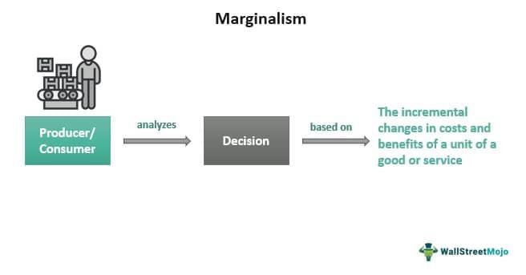

## Table of Contents

## What is marginalism in the context of microeconomics?

Marginalism is a key idea in microeconomics that focuses on the extra benefit or cost of doing a little bit more or less of something. It's about making decisions by looking at the impact of small changes. For example, if you're thinking about working an extra hour, marginalism helps you decide by considering only the additional money you'll earn and the extra time you'll spend working, not your total earnings or hours worked.

This concept is important because it helps explain how people make choices every day. When businesses set prices or decide how much to produce, they use marginalism to figure out if it's worth it to make one more item or sell one more service. By focusing on these small changes, they can find the best balance between what they gain and what they give up, leading to more efficient use of resources and better decision-making overall.

## How does marginalism differ from classical economics?

Marginalism and classical economics have different ways of looking at how people make choices and how economies work. Classical economics, which came before marginalism, focuses on the total value of things and the overall economy. It talks about big ideas like how much a whole country produces and how labor and capital are used to make goods. Classical economists, like Adam Smith, believed that the value of a product came from the amount of work put into making it. They looked at the big picture and thought economies would naturally find a balance where everyone could work and trade fairly.

Marginalism, on the other hand, looks at the small changes in decisions people make. Instead of focusing on the total value of things, it's about the extra value or cost of doing a little bit more or less. For example, if you're deciding whether to eat another slice of pizza, marginalism helps you think about just that one slice, not the whole pizza. This approach helps explain why people might choose to do something even if the total cost seems high, as long as the extra benefit is worth it. Marginalism became popular in the late 19th century and changed how economists think about decision-making, leading to more detailed and realistic models of how people and businesses behave.

## What is the concept of marginal utility and how is it used in marginalism?

Marginal utility is a big idea in marginalism. It's about how much more happiness or satisfaction you get from having one more of something. Imagine you're eating chocolate. The first piece tastes amazing, but by the time you get to the fifth piece, you might not enjoy it as much. That's because the marginal utility, or the extra happiness from each piece, goes down as you eat more.

This idea is super important in marginalism because it helps explain why people make the choices they do. If the extra happiness from one more thing is bigger than the extra cost, you'll probably do it. Businesses use this to set prices and decide how much to make. If making one more shirt gives them more money than it costs, they'll make it. This way, marginal utility helps everyone make better decisions by focusing on the little changes that matter.

## Can you explain the marginal rate of substitution and its significance in consumer theory?

The marginal rate of substitution (MRS) is a concept in economics that shows how much of one thing a person is willing to give up to get a little bit more of another thing, while still feeling just as happy. Imagine you're at a buffet with pizza and salad. If you really like pizza, you might be willing to give up a lot of salad to get one more slice of pizza. The MRS tells us how many plates of salad you'd trade for that one slice to feel the same level of satisfaction.

This idea is really important in consumer theory because it helps explain how people make choices between different goods. Economists use the MRS to understand how consumers balance their wants and needs. For example, if the price of pizza goes up, people might decide to eat less pizza and more salad. By looking at the MRS, economists can predict how changes in prices or income will affect what people buy, helping to understand and predict consumer behavior in the market.

## How does the principle of diminishing marginal utility affect consumer behavior?

The principle of diminishing marginal utility means that the more you have of something, the less extra happiness you get from having one more of it. Imagine you're eating your favorite ice cream. The first scoop tastes amazing, but as you keep eating, each new scoop doesn't make you as happy as the one before. This idea helps explain why people don't keep buying the same thing over and over, even if they really like it. They stop when the extra happiness they get isn't worth the cost.

Because of diminishing marginal utility, people spread out their spending on different things. If you have money to spend, you might buy a little bit of ice cream, some pizza, and a new book, instead of just buying more and more ice cream. This way, you keep the extra happiness from each thing higher. It's why variety is important in what people buy. They want to feel the most happiness from their money, so they mix it up to keep that extra joy coming from each new thing they get.

## What role does marginal cost play in a firm's production decisions?

Marginal cost is the extra cost a company pays to make one more item. It's super important for a company when they're deciding how much to produce. If making one more thing costs less than the money they can make from selling it, the company will usually choose to make it. This helps them earn more profit. But if the extra cost is more than the extra money they'd get, they'll stop making more because it's not worth it.

For example, imagine a bakery making cookies. If it costs them $1 to make one more cookie and they can sell it for $2, they'll keep making more cookies because they're [earning](/wiki/earning-announcement) an extra dollar each time. But if the cost of making one more cookie goes up to $2.50, they'll stop because they'd lose money on each new cookie. By looking at marginal cost, businesses can find the right balance to make the most profit without wasting resources.

## How do marginal revenue and marginal cost determine profit maximization for a firm?

Profit maximization for a firm is all about finding the sweet spot where making one more thing brings in more money than it costs. This is where marginal revenue and marginal cost come into play. Marginal revenue is the extra money a firm gets from selling one more item. Marginal cost is the extra cost to make that one more item. When a firm compares these two, they want to keep making more as long as the marginal revenue is higher than the marginal cost. This way, each new item they make adds to their profit.

If a firm keeps making more and more items, eventually the marginal cost will start to go up. This happens because they might need to pay workers overtime or use more expensive materials. At some point, the marginal cost will catch up to and then pass the marginal revenue. When this happens, making one more item will start to cut into their profit instead of adding to it. So, to maximize profit, a firm should stop making more items right at the point where marginal revenue equals marginal cost. This is the best they can do to earn the most money possible.

## Can you discuss the application of marginalism in pricing strategies, such as price discrimination?

Marginalism helps businesses set prices in smart ways, like using price discrimination. Price discrimination means charging different prices to different people for the same thing. Businesses do this because they know some people are willing to pay more than others. By using marginalism, they look at how much extra money they can make from each customer. If someone is willing to pay a lot more, the business might charge them a higher price. This way, they can make more money from each sale without losing customers who can't afford to pay as much.

For example, airlines use price discrimination all the time. They charge more for people who book last minute because those travelers really need to fly and are willing to pay more. But they offer cheaper tickets to people who book early because those travelers are more sensitive to price. By looking at the marginal revenue from each type of customer, airlines can set different prices to make the most money overall. This is all about using marginalism to see how much extra they can charge without losing too many sales.

## How has marginalism influenced the development of modern economic theories, such as behavioral economics?

Marginalism has played a big role in shaping modern economic theories, including behavioral economics. It started by changing how economists think about decision-making. Instead of looking at the total value of things, marginalism focuses on the extra benefit or cost of small changes. This idea helped economists understand that people make choices based on what they gain or lose from the next little bit of something. Behavioral economics took this idea and added psychology to it. They saw that people don't always make perfect choices and are influenced by things like emotions and biases. By combining marginalism with these insights, behavioral economists can better predict how people really behave, not just how they should behave in theory.

For example, behavioral economists use the concept of marginal utility to explore why people might overvalue the first few items they get and undervalue the next ones. This is called the endowment effect, where people feel attached to things they own and demand more to give them up than they'd pay to get them. Marginalism helps explain why this happens by looking at the extra happiness people get from each item. By understanding these small changes in happiness, behavioral economists can design better policies and marketing strategies that take into account how people actually make decisions, not just how they should make them according to traditional economics.

## What are the criticisms of marginalism from alternative economic schools of thought?

Some economists from different schools of thought don't agree with marginalism. They say it's too focused on small changes and doesn't look at the big picture. For example, Marxist economists think that marginalism misses the point about how workers are treated and how wealth is shared in society. They believe that looking at the extra benefit of one more thing doesn't help solve bigger problems like inequality and exploitation. They argue that economics should be about understanding how the whole system works, not just the tiny choices people make every day.

Another criticism comes from institutional economists. They think that marginalism ignores how rules, habits, and social structures affect economic choices. They say that people don't just make decisions based on the extra cost or benefit of something; they're also influenced by the world around them. For example, a person might choose a job not just because of the pay, but because of family traditions or social expectations. Institutional economists believe that understanding these bigger forces is more important than just looking at the small changes that marginalism focuses on.

## How do empirical studies support or challenge the assumptions of marginalism?

Empirical studies have both supported and challenged the assumptions of marginalism. On one hand, many studies show that people do think about the extra benefits and costs when making decisions, just like marginalism says. For example, research on consumer behavior often finds that people will buy more of something if the price goes down, because the extra benefit of having more of it is now worth the lower cost. This supports the idea of marginal utility, where the happiness from each additional item matters a lot in decision-making.

On the other hand, some studies challenge marginalism by showing that people don't always make choices based on these small changes. Behavioral economists have found that people can be influenced by emotions, habits, and social pressures, which can lead them to make decisions that don't fit with the neat calculations of marginalism. For instance, people might keep buying something even if the extra happiness they get from it is small, just because they're used to it or because it's what everyone else is doing. These findings suggest that while marginalism can explain a lot of economic behavior, it doesn't capture everything about how people really make choices.

## What are the latest advancements or debates in marginalism within the field of microeconomics?

In recent years, economists have been looking at how marginalism can be used with new technology and data. They're using big data and [machine learning](/wiki/machine-learning) to study how people make small choices in detail. For example, they can look at how someone's shopping habits change when prices go up or down. This helps them see if marginalism's ideas about extra benefits and costs still hold up in the real world. Some economists are also using experiments to test these ideas, like setting up games where people have to make choices and seeing if they act like marginalism predicts.

There's also a big debate about whether marginalism can explain everything about how people make choices. Some economists think that while marginalism is good for understanding small decisions, it might miss bigger things like social pressures and emotions. They argue that people don't always make perfect choices based on the extra benefit or cost. For example, someone might buy a lot of something just because it's on sale, even if they don't really need it. This has led to discussions about how to mix marginalism with ideas from behavioral economics to get a fuller picture of how people really behave.

## What is Understanding Marginalism in Microeconomics?

Marginalism is a cornerstone concept in microeconomics, emphasizing the importance of marginal analysis in understanding economic phenomena. At its core, marginalism is the study of the additional or incremental effects of a change in a variable. In economic analysis, it plays a crucial role in explaining how individuals and firms make decisions based on marginal costs and marginal benefits. By focusing on the marginal utility derived from consuming an additional unit of a good or service, marginalism provides insights into consumer behavior and market dynamics.

Historically, the marginalist revolution marked a significant shift in economic thought during the late 19th century. This intellectual transformation led to the development of microeconomic theory as a distinct field within economics. Three key figures in the marginalist revolution were William Stanley Jevons, Carl Menger, and Leon Walras. Jevons, in his work "The Theory of Political Economy," introduced the notion of marginal utility and argued that value is determined by the utility derived from the last unit consumed. Carl Menger, the founder of the Austrian School of Economics, independently developed similar ideas, emphasizing subjective valuation. Leon Walras, on the other hand, contributed to the formation of general equilibrium theory, using marginal analysis to explain how markets reach equilibrium.

Central to marginalist theory are the concepts of marginal utility and the law of diminishing marginal returns. Marginal utility refers to the additional satisfaction or benefit gained from consuming one more unit of a good or service. The utility, $U$, of a good to a consumer is often modeled as a function of quantity, $q$, and marginal utility is the derivative of this utility function:

$$
MU = \frac{dU}{dq}
$$

The law of diminishing marginal returns states that as more of a variable input is added to a fixed input, the incremental gains in output eventually decrease. This principle is fundamental in understanding production decisions and cost structures within firms. The diminishing marginal returns equation can be expressed in the context of a production function, $f(L, K)$, where $L$ represents labor and $K$ represents capital. 

In summary, the marginalist approach revolutionized economic thought by introducing a framework that focuses on the incremental changes in decision-making. It laid the groundwork for modern microeconomic theory, influencing how economists understand consumer choice, market prices, and production processes. These foundations continue to impact contemporary economic theories and practices.

## What is the role of marginalism in economic theory?

Marginalism represents a pivotal shift in economic theory from classical economics, fundamentally altering how we perceive and analyze economic behaviors. Classical economic thought, primarily rooted in labor theory of value, was significantly transformed by the marginalist perspective. Marginalism introduced the concept of value being determined by the marginal utility of goods, rather than the labor required to produce them. This shift towards subjective valuation emphasizes how individual preferences and the utility derived from consuming an additional unit of a good or service influence economic decisions.

One of the core applications of marginalist theories is in market pricing and consumer behavior. The marginal utility theory suggests that the value or price of a good is determined by the additional satisfaction or utility gained from consuming an extra unit. This idea helps explain the downward-sloping demand curve, which reflects the law of diminishing marginal utility: as more units of a good are consumed, the additional satisfaction derived from each new unit decreases, leading to lower willingness to pay. This principle aids businesses in setting prices that align with consumer valuations and maximizing profits through price discrimination strategies.

Marginalism also significantly impacts subjective valuation and rational decision-making. It posits that economic [agents](/wiki/agents) make decisions based on marginal analysis—assessing the additional benefits and costs of a decision. This principle can be applied through the formulation:

$$
\text{Profit Maximization: } MR = MC
$$

where $MR$ is marginal revenue and $MC$ is marginal cost. Rational decision-making involves equating the marginal cost to the marginal revenue, ensuring efficient allocation of resources under constraints.

The integration of marginalism into neoclassical economics led to a more comprehensive understanding of production and distribution. The marginalist theory of production examines how firms decide on the optimal combination of inputs to maximize output while minimizing costs, leading to the concept of marginal product. By equating marginal product to marginal cost, firms ensure production efficiency. The neoclassical framework uses these principles to analyze [factor](/wiki/factor-investing) markets and the distribution of income based on the marginal productivity of labor and capital, thereby refining classical theories on economic distribution.

Overall, marginalism represents a transformative leap in economic thought, bridging classical economics with modern interpretations of utility and decision-making, and laying the foundation for a more nuanced analysis of market behaviors and consumer choices.

## References & Further Reading

[1]: Jevons, W. S. (1871). ["The Theory of Political Economy"](https://archive.org/details/theoryofpolitica00jevouoft). Macmillan and Co.

[2]: Menger, C. (1871). ["Principles of Economics"](https://archive.org/details/PrinciplesOfEconomicsCarlMenger). Ludwig von Mises Institute.

[3]: Walras, L. (1976). ["Elements of Pure Economics, or the Theory of Social Wealth"](https://archive.org/details/elements-of-pure-economics_Leon-Walras). Allen and Unwin.

[4]: Lopez de Prado, M. (2018). ["Advances in Financial Machine Learning"](https://www.amazon.com/Advances-Financial-Machine-Learning-Marcos/dp/1119482089). Wiley.

[5]: Chan, E. P. (2009). ["Quantitative Trading: How to Build Your Own Algorithmic Trading Business"](https://github.com/ftvision/quant_trading_echan_book). Wiley.