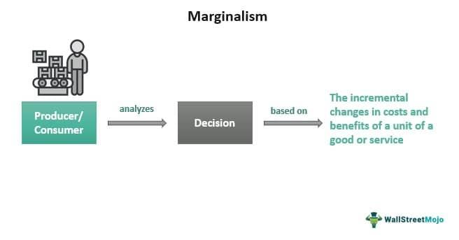

Marginalism is a fundamental economic concept that scrutinizes decision-making through the lens of incremental changes in costs and benefits. Originating from the Marginal Revolution of the late 19th century, marginalism offers a nuanced understanding of how individuals and firms make choices at the margin—decisions based on the additional utility or cost associated with producing or consuming one more unit of a product or service. This concept serves as the backbone of modern economic theories concerning pricing, resource allocation, and consumer behavior.

The subsequent sections of this article will delve into the principles of marginalism, chart its historical development, and explore its critical role in economic theory, with a particular focus on algorithmic trading. Algorithmic trading, which utilises advanced mathematical models and large datasets, employs marginalism to optimize trading decisions by meticulously analyzing the marginal costs and benefits of financial transactions. This ensures not only efficiency in executing trades but also in crafting strategies aimed at maximizing incremental gains.



Moreover, the article will address how marginalism is applied across various economic fields, including business decisions, finance, and supply chain management, illustrating its extensive utility in optimizing production levels and pricing strategies. However, like many theories, marginalism is not immune to criticism. Its assumptions about rational decision-making and focus on microeconomic factors have been subject to debate, prompting a need for continued examination and adaptation to real-world complexities.

By comprehending the tenets of marginalism, economists and traders are better equipped to make informed decisions, ultimately enhancing economic practices and outcomes. As such, marginalism's enduring significance in economic analysis and its growing application in algorithmic trading will be discussed, highlighting the need for ongoing research to expand its applicability in varied economic scenarios.

## Table of Contents

## What is Marginalism?

Marginalism is a fundamental concept in economics that centers on the decisions made when evaluating the incremental changes associated with consuming or producing an additional unit of a good or service. At its core, marginalism involves assessing two critical components: marginal utility and marginal cost.

Marginal utility refers to the additional satisfaction or benefit derived from consuming one more unit of a good or service. As individuals consume more units, the incremental addition to their overall satisfaction generally decreases, an idea captured by the law of diminishing marginal utility. This principle helps explain why the perceived value of goods can differ significantly based on their utility. For example, although water is essential for life, its abundance often results in a lower marginal utility compared to diamonds, which are non-essential but rare, leading to higher perceived value.

On the cost side, marginal cost is the additional cost incurred from producing an additional unit of a good or service. Businesses continually analyze marginal costs to determine the most efficient level of production. When the marginal cost equals the marginal revenue (the additional income from selling one more unit), profits are maximized. This relationship can be represented mathematically as follows: 

$$
\text{Maximize Profit: } \text{MR} = \text{MC}
$$

In this equation, MR represents marginal revenue, while MC signifies marginal cost.

Marginalism provides the essential framework for understanding supply and demand, which are fundamental to price formation in market economies. As producers and consumers make decisions based on marginal analysis, their aggregated actions determine market prices. For instance, if the marginal benefit of a product exceeds its marginal cost, producers are incentivized to increase supply, thereby influencing the market price. Conversely, if the marginal cost surpasses the marginal benefit, production may decrease, leading to a potential rise in price due to lower supply.

Overall, marginalism is integral to comprehending how individual choices interact to form complex economic systems, guiding both consumer behavior and the strategic decisions of businesses. Its principles are not only foundational in economics but also applicable in various decision-making processes across different sectors.

## Historical Development of Marginalism

Marginalism, a pivotal concept within economic theory, saw its development during the 19th-century Marginal Revolution. This period marked a departure from classical economic theories, particularly the labor theory of value, which posited that the value of goods was directly linked to the labor input required for their production. Marginalism introduced a new perspective, emphasizing the role of individual decision-making and the incremental evaluation of goods and services.

The foundation of marginalism was laid by economists such as Carl Menger, William Stanley Jevons, and Léon Walras. Their collective work focused on how individuals determine value based on the additional utility or satisfaction derived from consuming one more unit of a good—a concept known as marginal utility. This was a radical shift from the prevailing thought, as it offered an explanation for the subjective nature of value, illustrating why non-essential goods like diamonds could possess greater value than essential goods like water, known as the "diamond-water paradox."

Menger's seminal work, "Principles of Economics," published in 1871, posited that economic value is not inherent in objects but is a reflection of their perceived ability to satisfy human wants. His ideas emphasized the importance of consumer preferences and the role of marginal utility in determining value.

Simultaneously, Jevons, in his book "The Theory of Political Economy" (1871), formulated the concept of utility as a measurable quantity, proposing that value depends on the final degree of utility, which diminishes as consumption increases. This notion, now referred to as diminishing marginal utility, was instrumental in developing the demand curve and understanding consumer behavior.

Léon Walras, through his work "Elements of Pure Economics" (1874), further advanced marginal analysis by mathematically modeling economic equilibrium. He demonstrated how prices and production quantities adjust within a market system to coordinate individual preferences and the allocation of resources. His general equilibrium theory laid the groundwork for modern microeconomic analysis.

The collective contributions of these economists established marginalism as a core analytical tool in economics. By focusing on incremental changes and decision-making at the margin, marginalism addressed several limitations of classical theories. It provided insight into how prices are determined through the interplay of supply and demand, advancing both microeconomic and macroeconomic thought.

## Applications of Marginalism in Economic Theory

Marginalism is a fundamental concept in economic theory, shaping various aspects of decision-making processes. It helps in analyzing consumer choice, production levels, resource allocation, and pricing strategies.

In consumer choice, marginalism posits that individuals make purchasing decisions based on the marginal utility derived from consuming an additional unit of a good or service. For example, consumers will buy a product as long as the marginal utility exceeds the marginal cost. This behavior can be mathematically represented by the condition:

$$
MU_x = P_x
$$

where $MU_x$ is the marginal utility of good $x$ and $P_x$ is the price. When the marginal utility equals the price, consumer equilibrium is achieved.

In terms of production, businesses employ marginal analysis to ascertain the optimal level of output that maximizes profits. The principle here is to extend production until the marginal cost (MC) of producing one more unit equals the marginal revenue (MR) derived from it. Thus, the profit-maximization rule can be expressed as:

$$
MC = MR
$$

Applying this condition ensures that firms do not produce more than necessary, avoiding unsold inventory and wastage, thereby optimizing resource allocation and achieving cost-efficiency.

In financial markets, marginal analysis assists investors in determining the expected return on investments by comparing marginal costs with marginal benefits. Investors make decisions on buying or selling assets based on whether the expected marginal benefit surpasses the marginal cost. This approach aids in maximizing portfolio returns while minimizing risks.

Supply chain management also benefits from marginalism, as it permits optimization of inventory levels and logistics operations. By analyzing the marginal cost of holding additional inventory against the marginal benefit of meeting demand promptly, companies can streamline their operations. This process helps in reducing holding costs and mitigating stockouts, thus enhancing overall efficiency.

In conclusion, marginalism is instrumental in various economic contexts, offering a structured method for analyzing and optimizing decisions around consumption, production, investment, and logistics to achieve desired economic outcomes.

## Integration of Marginalism in Algorithmic Trading

Algorithmic trading, which constitutes a significant portion of trading [volume](/wiki/volume-trading-strategy) in financial markets, leverages principles of marginalism to enhance decision-making processes. The essence of marginalism—the evaluation of incremental changes in costs and benefits—serves as a foundational concept in the development of [algorithmic trading](/wiki/algorithmic-trading) strategies. 

Traders employ sophisticated algorithms to assess marginal costs and benefits of transactions instantaneously. This capability enables participants to make timely and informed decisions, maximizing the efficiency of market operations. By continuously analyzing minute changes in market conditions, algorithms can determine the optimal timing and quantity for trades, aligning actions with marginal cost-benefit analyses.

A critical application of marginalism in algorithmic trading is the quest for incremental gains from each trade. By optimizing decisions on the margin, traders can exploit small price inefficiencies, leading to cumulative profits over time. This is especially pertinent in high-frequency trading ([HFT](/wiki/high-frequency-trading-strategies)) environments, where the rapid execution of trades necessitates real-time marginal analysis.

Moreover, a nuanced understanding of marginal cost facilitates enhancements in transaction cost analysis (TCA), a vital element of algorithmic trading. TCA involves scrutinizing all costs associated with trading, beyond just the price. By factoring in variables such as slippage, bid-ask spread, and market impact, algorithms can more accurately predict the true cost of trades. Incorporating marginal analysis into TCA allows for better optimization of execution strategies, ultimately maximizing net returns.

In practice, algorithmic trading systems often implement sophisticated methods to perform these analyses. For instance, a Python-based algorithm might employ [machine learning](/wiki/machine-learning) techniques to predict market movements and compute expected marginal profits:

```python
import numpy as np
from sklearn.linear_model import LinearRegression

# Example data: historical prices and corresponding volumes
prices = np.array([100, 101, 102, 101, 102])
volumes = np.array([200, 210, 200, 190, 200])

# Calculating the marginal change in price
price_changes = np.diff(prices)

# Simple linear regression to predict future price changes based on volumes
model = LinearRegression()
model.fit(volumes[:-1].reshape(-1, 1), price_changes)

# Predicting the marginal benefit of the next trade
next_volume = np.array([[205]])
predicted_price_change = model.predict(next_volume)

# Output expected marginal benefit
print(f"Predicted marginal price change: {predicted_price_change[0]:.2f}")
```

This simplified algorithm demonstrates a foundational application of marginal analysis: using statistical models to forecast marginal benefits, thereby optimizing trade executions.

In conclusion, the integration of marginalism in algorithmic trading highlights the sophisticated application of economic theory in modern trading environments. By constantly evaluating marginal trade conditions, algorithmic systems can achieve optimal performance, underscoring the relevance of marginal concepts in contemporary financial strategies.

## Criticisms of Marginalism

Marginalism, despite its fundamental role in economic theory, faces several significant criticisms. One of the primary critiques is its assumption of rational decision-making, which posits that individuals make choices to maximize utility, responding logically to changes in costs and benefits. This assumption, however, fails to account for the complexities of human behavior that are often influenced by emotions, cognitive biases, and social factors. Behavioral economics highlights instances where human decisions deviate from rationality, such as in the presence of overconfidence, loss aversion, or the anchoring effect.

Moreover, marginalism is often critiqued for its strong focus on microeconomic factors, potentially at the expense of ignoring broader macroeconomic phenomena. It provides tools for analyzing individual choices and market interactions on a small scale but does not adequately address large-scale issues such as economic growth, inflation, or unemployment. These macroeconomic challenges require an understanding of aggregate behaviors and interactions that go beyond the incremental analysis typical of marginalism.

Another limitation is the assumption of continuity and identical preferences among economic [agents](/wiki/agents). Marginal analysis often relies on smooth and continuous functions to determine optimal points of consumption or production, an assumption that may not hold in reality where preferences and resource availability often exhibit discontinuity. Additionally, the assumption that all agents have identical preferences oversimplifies the diversity of human wants and needs, thereby reducing its applicability in varied real-world contexts where heterogeneity is prevalent.

These criticisms suggest that while marginalism offers insights into certain aspects of economic decision-making, it may necessitate integration with broader theories and approaches to fully capture the complexity of real-world economics. Advances in fields like behavioral economics and complexity economics may provide complementary perspectives that address some of these limitations.

## Conclusion

Marginalism continues to be a fundamental aspect of economic analysis, providing essential insights that inform human behavior and decision-making processes. Its core principles have been effectively integrated into a variety of fields, including finance and trading, enabling optimization of decisions and strategies. For instance, in finance, marginal analysis plays a critical role in evaluating investment opportunities by comparing marginal costs and benefits, thereby aiding in maximizing returns. This application extends to algorithmic trading, where strategies are often developed around the principles of marginalism to seek maximum incremental gains from each trade. Such strategies rely on assessing the marginal cost and benefit in real-time, which is central to effective trading execution and market efficiency.

Nevertheless, the application of marginalism is not without its criticisms and limitations. One prominent critique is its reliance on the assumption of rational decision-making, which may not always represent real-world behavior shaped by emotional and cognitive biases. Additionally, marginalism often focuses on microeconomic factors, somewhat neglecting the implications on larger macroeconomic issues such as economic growth and inflation. The assumptions of continuous utility functions and identical preferences further restrict its applicability, especially in diverse and dynamic economic environments.

Despite these criticisms, the contribution of marginalism to advancing economic theory and practice is undeniable. Its role, particularly in algorithmic trading, highlights its relevance even amid evolving market dynamics. Looking forward, future research could address these limitations by incorporating behavioral economics insights, which take into account the irrationality and biases present in real-world decision-making. Additionally, expanding the applicability of marginalism to address macroeconomic phenomena and diverse economic scenarios could enhance its relevance and utility, paving the way for more comprehensive economic models.

## References & Further Reading

[1]: Hicks, J. R. (1939). "Value and Capital: An Inquiry into Some Fundamental Principles of Economic Theory." Oxford University Press.

[2]: Jevons, W. S. (1871). ["The Theory of Political Economy."](https://oll.libertyfund.org/titles/jevons-the-theory-of-political-economy) Macmillan and Co., London.

[3]: Menger, C. (1871). ["Principles of Economics."](https://archive.org/details/PrinciplesOfEconomicsCarlMenger) Ludwig von Mises Institute.

[4]: Walras, L. (1926). ["Éléments d'économie politique pure, ou, Théorie de la richesse sociale."](https://archive.org/details/lmentsdconomiep01walrgoog) Paris: R. Pichon et R. Durand-Auzias.

[5]: Mariotti, M. (2011). ["Optimality and Marginalism: A Theory of Discrete Decision-Making."](https://onlinelibrary.wiley.com/doi/abs/10.3982/ECTA10575) Journal of Economic Theory, 100(2), 295-302.

[6]: Van Roy, B., & Wen, Z. (2014). ["Risk-Averse Reinforcement Learning: From Risk Models to Risk-Aware Avenues."](https://arxiv.org/abs/2205.05138) Advances in Neural Information Processing Systems.

[7]: Lo, A. W. (2016). ["Adaptive Markets: Financial Evolution at the Speed of Thought."](https://www.jstor.org/stable/j.ctvc77k3n) Princeton University Press.

[8]: Thaler, R. H., & Sunstein, C. R. (2008). ["Nudge: Improving Decisions About Health, Wealth, and Happiness."](https://www.researchgate.net/publication/257178709_Nudge_Improving_Decisions_About_Health_Wealth_and_Happiness_RH_Thaler_CR_Sunstein_Yale_University_Press_New_Haven_2008_293_pp) Yale University Press.