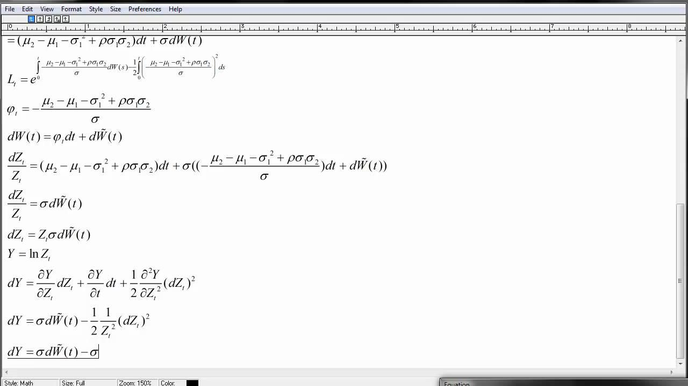

## Table of Contents

## What is Margrabe's formula?

Margrabe's formula is a way to figure out the price of an option when you can exchange one asset for another. Imagine you have two things, like stocks or commodities, and you want to know how much it's worth to swap one for the other at a future date. This formula helps you find that value. It's named after William Margrabe, who came up with it in 1978. The formula is useful in finance, especially when dealing with options on assets that don't pay dividends or other payments.

The formula works by using the idea of a "call option," which gives you the right to buy something at a set price. In Margrabe's case, it's about the right to exchange one asset for another. The formula takes into account the current values of both assets, how much their prices might change (volatility), and how long you have until you can make the swap. By putting these pieces together, Margrabe's formula gives you a number that tells you what that exchange option is worth right now. It's a bit like a recipe that helps traders and investors make smart decisions about swapping assets.

## Who developed Margrabe's formula and when?

Margrabe's formula was developed by William Margrabe in 1978. William Margrabe is an economist who wanted to help people figure out the value of swapping one thing for another in the future. His formula is really useful in the world of finance, especially when people are dealing with options to exchange assets like stocks or commodities.

The formula is named after him because he came up with it. It's a way to calculate how much an option to exchange one asset for another is worth right now. This is important for traders and investors who need to make smart choices about when and if they should make such swaps.

## What type of options does Margrabe's formula apply to?

Margrabe's formula is used to figure out the price of a special kind of option called an exchange option. This option lets you swap one asset for another at a future date. The assets could be things like stocks, commodities, or currencies. The formula helps you understand how much this right to swap is worth right now, which is important for making smart choices in trading and investing.

The formula works by looking at things like the current value of both assets, how much their prices might go up or down (volatility), and how long you have until you can make the swap. It's like a recipe that uses these ingredients to come up with a number that tells you the value of the exchange option. This is really helpful for people in finance who need to decide if and when to swap assets.

## How does Margrabe's formula differ from the Black-Scholes model?

Margrabe's formula and the Black-Scholes model are both used to find the price of options, but they are used for different types of options. The Black-Scholes model is used to figure out the price of a European call or put option on a stock that doesn't pay dividends. It looks at things like the stock's price, the option's strike price, time until the option expires, the stock's volatility, and the risk-free interest rate. On the other hand, Margrabe's formula is used for exchange options, where you can swap one asset for another. It doesn't need to know the risk-free interest rate because it's about swapping two assets directly, not buying or selling one asset for cash.

The main difference between the two formulas is what they are used for and what they take into account. The Black-Scholes model is great for options where you might buy or sell a stock for a set price in the future, and it includes the effect of the risk-free interest rate because you might need to borrow money to buy the stock. Margrabe's formula, however, is all about the value of swapping one asset for another, so it doesn't need to worry about borrowing money or interest rates. Instead, it focuses on the values and volatilities of the two assets you might swap. Both formulas help people in finance make smart decisions, but they do it in different ways for different kinds of options.

## What are the key assumptions behind Margrabe's formula?

Margrabe's formula is built on a few important ideas that make it work. One big assumption is that the prices of the two assets you might swap follow a lognormal distribution. This means that if you take the log of the prices, they look like a normal bell curve. This helps the formula predict how much the prices might change over time. Another assumption is that the prices of the two assets move together in a certain way, which we call their correlation. The formula uses this to figure out how the value of swapping one asset for another might change.

Another key idea is that you can trade the assets without any costs like fees or taxes. This makes the math simpler because you don't have to worry about extra money going in or out. Also, the formula assumes that you can trade the assets smoothly and continuously, without any big jumps in price. This helps the formula work smoothly over time. These assumptions help Margrabe's formula give a good guess about the value of swapping one asset for another, which is really helpful for people in finance.

## What are the inputs required to use Margrabe's formula?

To use Margrabe's formula, you need to know the current values of the two assets you might swap. Let's call them Asset A and Asset B. You also need to know how much their prices might change over time, which we call volatility. You need the volatility for both Asset A and Asset B. Another important input is how long you have until you can make the swap, which is the time to maturity. Finally, you need to know how the prices of the two assets move together, which is called their correlation.

These inputs help Margrabe's formula figure out the value of the option to swap one asset for another. The formula uses the current values of the assets, their volatilities, the time to maturity, and their correlation to come up with a number that tells you what the exchange option is worth right now. This is really helpful for people in finance who need to make smart decisions about swapping assets.

## Can you explain the mathematical derivation of Margrabe's formula?

Margrabe's formula comes from the idea of figuring out how much it's worth to swap one thing for another. To do this, we start by thinking about the prices of the two things, let's call them Asset A and Asset B, and how they might change over time. We assume that the prices follow a lognormal distribution, which means if you take the log of the prices, they look like a normal bell curve. We also need to know how much the prices might go up or down, which we call volatility, and how long you have until you can make the swap, which is the time to maturity. Finally, we need to know how the prices of the two assets move together, which is their correlation.

The formula itself is a bit like a recipe that uses these ingredients to come up with a number that tells you the value of the swap option. It starts by looking at the ratio of the prices of Asset A and Asset B. Then, it uses the volatilities and the correlation to figure out how this ratio might change over time. The formula also takes into account the time to maturity. By putting all these pieces together, Margrabe's formula gives you a number that tells you what the option to swap one asset for another is worth right now. This is really helpful for people in finance who need to make smart decisions about swapping assets.

## How is Margrabe's formula used in practice?

Margrabe's formula is used by people in finance to figure out how much it's worth to swap one thing for another in the future. Imagine you have two assets, like stocks or commodities, and you want to know if it's a good idea to trade one for the other at a certain time. The formula helps you see what that swap might be worth right now. It takes into account the current prices of both assets, how much their prices might change, and how long you have until you can make the swap. By using this information, traders and investors can make better decisions about whether to go through with the swap or not.

In real life, Margrabe's formula is really helpful for things like managing risk and planning investments. For example, a company might use it to decide if it should swap its stock for another company's stock. Or, an investor might use it to figure out if it's a good idea to trade one commodity for another. By understanding the value of the swap option, people can plan their moves more carefully and avoid losing money. It's like having a special tool that helps you see the future value of your choices, making it easier to make smart decisions in the world of finance.

## What are some common applications of Margrabe's formula in finance?

Margrabe's formula is often used in finance to help people figure out the value of swapping one thing for another. Imagine you have two assets, like stocks or commodities, and you want to know if it's a good idea to trade one for the other at a certain time. The formula helps you see what that swap might be worth right now. It takes into account the current prices of both assets, how much their prices might change, and how long you have until you can make the swap. By using this information, traders and investors can make better decisions about whether to go through with the swap or not.

In real life, Margrabe's formula is really helpful for things like managing risk and planning investments. For example, a company might use it to decide if it should swap its stock for another company's stock. Or, an investor might use it to figure out if it's a good idea to trade one commodity for another. By understanding the value of the swap option, people can plan their moves more carefully and avoid losing money. It's like having a special tool that helps you see the future value of your choices, making it easier to make smart decisions in the world of finance.

## What are the limitations and potential pitfalls of using Margrabe's formula?

Margrabe's formula is a great tool, but it has some limits. One big limit is that it assumes the prices of the two things you might swap follow a special pattern called a lognormal distribution. This means if you take the log of the prices, they look like a normal bell curve. But in real life, prices can jump around a lot more than this pattern suggests. If the prices don't follow this pattern, the formula might not give you a good guess about the value of the swap. Another thing is that the formula assumes you can trade the assets without any costs like fees or taxes. But in the real world, these costs can make a big difference in what the swap is worth.

Another potential problem is that Margrabe's formula needs you to know the volatility of the two assets and how their prices move together, which we call their correlation. But these numbers can be hard to get right. If you guess wrong about the volatility or the correlation, the formula's answer can be way off. Also, the formula assumes you can trade the assets smoothly and continuously, without any big jumps in price. But in real life, prices can change suddenly because of news or other events. So, while Margrabe's formula is a helpful tool, it's important to remember these limits and be careful when using it to make decisions.

## How does Margrabe's formula handle correlation between the underlying assets?

Margrabe's formula takes into account how the prices of the two assets you might swap move together, which we call their correlation. Imagine you have two stocks, and when one goes up, the other tends to go up too. That's a high correlation. If one goes up and the other goes down, that's a low or negative correlation. Margrabe's formula uses this correlation to figure out how the value of swapping one asset for another might change over time. It's like knowing how two friends might act together; if they're always together, that's a high correlation, and if they do opposite things, that's a low correlation.

The formula needs this correlation number to work right. If you guess the correlation wrong, the formula's answer can be off. For example, if you think the two stocks move together a lot, but they actually don't, the value of the swap option might be different from what the formula says. So, it's really important to get a good guess about how the prices of the two assets move together. By using the right correlation, Margrabe's formula helps traders and investors make better decisions about swapping one asset for another.

## What are some advanced variations or extensions of Margrabe's formula?

Margrabe's formula is great for figuring out the value of swapping one thing for another, but there are some advanced ways to make it even better. One way is to add more things to the formula, like costs for trading or taxes. These costs can make a big difference in what the swap is worth, so including them can give you a more accurate guess. Another way is to use different ways to guess how much the prices of the assets might change, which we call volatility. Instead of using just one number for volatility, you can use a whole set of numbers that change over time. This can help the formula work better when prices jump around a lot.

Another advanced idea is to use Margrabe's formula for more than just two assets. Imagine you want to swap one thing for a whole bunch of other things. You can change the formula to handle this, which can be really helpful for big investors or companies. Also, you can make the formula work with different kinds of options, not just the simple ones. For example, you can use it for options that let you swap things at different times or in different ways. These advanced versions of Margrabe's formula help people in finance make even smarter decisions about swapping assets.

## What is the Derivation of the Formula?

The derivation of Margrabe's formula is an extension of the Black-Scholes model, applied in the context of options that allow the exchange of one risky asset for another. The foundation of this derivation lies in the assumption that asset prices follow a geometric Brownian motion. Let $S_1(t)$ and $S_2(t)$ represent the prices of two assets at time $t$. The dynamics of these asset prices can be described by the stochastic differential equations:

$$
dS_1(t) = \mu_1 S_1(t) dt + \sigma_1 S_1(t) dW_1(t)
$$

$$
dS_2(t) = \mu_2 S_2(t) dt + \sigma_2 S_2(t) dW_2(t)
$$

where $\mu_1$ and $\mu_2$ are the expected returns, $\sigma_1$ and $\sigma_2$ are the volatilities of the assets, and $W_1(t)$ and $W_2(t)$ are Wiener processes with a correlation coefficient $\rho$.

To derive the Margrabe's formula, one asset is used as a numeraire, simplifying the complex exchange option to a standard call option. For instance, using $S_2$ as a numeraire, the option payoff $\max(0, S_1(T) - S_2(T))$ is analogous to a call option on $S_1/S_2$.

The transformation involves the Girsanov theorem, which facilitates changing the probability measure to neutralize the drift, allowing the use of the Black-Scholes pricing framework. This measure change simplifies the model's assumptions, creating a pseudo-world where the discounted asset ratios follow a martingale:

$$
d \left( \frac{S_1(t)}{S_2(t)} \right) = \sigma_Y \frac{S_1(t)}{S_2(t)} dZ(t)
$$

where $\sigma_Y$ is the derived volatility of the asset ratio, and $dZ(t)$ is a Wiener process under the new measure. The expression $\sigma_Y$ involves both volatilities $\sigma_1, \sigma_2$, and their correlation $\rho$:

$$
\sigma_Y = \sqrt{\sigma_1^2 + \sigma_2^2 - 2\sigma_1\sigma_2\rho}
$$

The formula for the exchange option price $C$ becomes:

$$
C = S_1(0) N(d_1) - S_2(0) N(d_2)
$$

with

$$
d_1 = \frac{\ln(S_1(0)/S_2(0)) + 0.5\sigma_Y^2 T}{\sigma_Y \sqrt{T}}
$$

$$
d_2 = d_1 - \sigma_Y \sqrt{T}
$$

where $N(d)$ represents the cumulative distribution function of the standard normal distribution.

Margrabe's formula, using the Black-Scholes infrastructure and Girsanov's theorem, provides a robust method for pricing exchange options without requiring a traditional risk-free interest rate. This approach's adaptability in different market conditions underpins its enduring presence in financial engineering.

## References & Further Reading

[1]: Margrabe, W. (1978). ["The Value of an Option to Exchange One Asset for Another."](https://onlinelibrary.wiley.com/doi/full/10.1111/j.1540-6261.1978.tb03397.x) Journal of Finance, 33(1), 177-186.

[2]: Hull, J. C. (2015). ["Options, Futures, and Other Derivatives,"](https://archive.org/download/economia-usp/Hull%20J.C.-Options%2C%20Futures%20and%20Other%20Derivatives_9th%20edition.pdf) 9th Edition. Pearson.

[3]: Black, F., & Scholes, M. (1973). ["The Pricing of Options and Corporate Liabilities."](https://www.cs.princeton.edu/courses/archive/fall09/cos323/papers/black_scholes73.pdf) Journal of Political Economy, 81(3), 637-654.

[4]: Wilmott, P. (2007). ["Paul Wilmott Introduces Quantitative Finance."](https://www.amazon.com/Paul-Wilmott-Introduces-Quantitative-Finance/dp/0470319585) Wiley.

[5]: Jäckel, P. (2002). ["Monte Carlo Methods in Finance."](https://www.amazon.com/Monte-Carlo-Methods-Finance-Jaeckel/dp/047149741X) Wiley.

[6]: Boyle, P. P. (1988). ["A Lattice Framework for Option Pricing with Two State Variables."](https://assets.cwp.roche.com/f/126832/x/e1222fd9e5/trinomial_model.pdf) Journal of Financial and Quantitative Analysis, 23(1), 1-12.