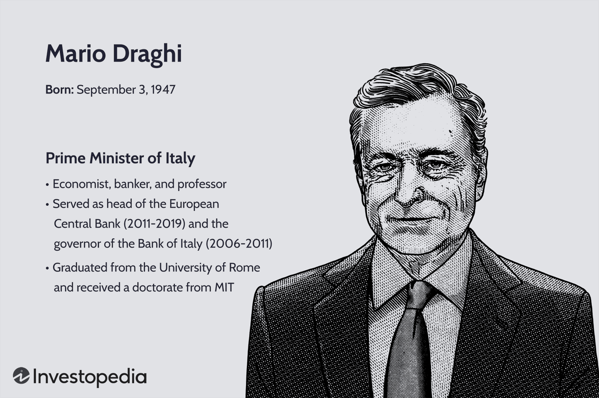

## Table of Contents

## Who is Mario Draghi?

Mario Draghi is a famous person from Italy. He was born on September 3, 1947. He used to be the Prime Minister of Italy. Before that, he was the head of the European Central Bank. This is a big bank that helps many countries in Europe with their money.

Draghi is known for helping to fix big money problems in Europe. When he was the head of the European Central Bank, he made important decisions that helped keep the money safe and stable. Many people think he did a good job. He also worked as an economist and a teacher before becoming a leader in the government and the bank.

## What is Mario Draghi's background in economics?

Mario Draghi studied economics at universities in Italy and the United States. He got his degree from La Sapienza University in Rome and then went to the Massachusetts Institute of Technology (MIT) for more studies. At MIT, he learned from famous economists and got his PhD. This gave him a strong base in economic theory and practice.

After finishing his studies, Draghi worked as an economics professor. He taught at places like the University of Florence and then at the prestigious University of Venice. While teaching, he also started working with the World Bank and the Bank of Italy. These jobs helped him learn about how to manage money and economies on a big scale. His time in these roles built his reputation as a smart and reliable economist.

## What positions has Mario Draghi held in his career?

Mario Draghi started his career as an economics professor. He taught at the University of Florence and later at the University of Venice. During this time, he also worked with the World Bank and the Bank of Italy. These jobs helped him learn a lot about managing money and economies. He became known as a smart and reliable economist.

Later, Draghi moved into bigger roles. He became the Governor of the Bank of Italy in 2006. This is a very important job where he helped manage Italy's money. Then, in 2011, he became the President of the European Central Bank. This is a big job where he helped manage the money for many countries in Europe. He made important decisions that helped keep the money safe and stable. In 2021, he became the Prime Minister of Italy. He led the country until 2022.

Overall, Mario Draghi has had a long career. He started as a teacher and economist, then became a leader in big banks, and finally led his country as Prime Minister. His work has been very important for Italy and Europe.

## What is Mario Draghi's most famous quote and its context?

Mario Draghi's most famous quote is, "Whatever it takes." He said this in July 2012 when he was the President of the European Central Bank. At that time, many countries in Europe were having big money problems. People were worried that the money in these countries might become worthless. Draghi wanted to calm everyone down and show that the European Central Bank would do everything possible to help.

When Draghi said "Whatever it takes," he meant that the bank would use all its power to keep the money safe and stable. This quote became very famous because it showed how strong and determined he was. It helped people feel more confident about the future of their money. Many people think that this promise helped stop the money problems from getting worse.

## How did Mario Draghi influence the European Central Bank (ECB)?

Mario Draghi had a big impact on the European Central Bank (ECB) when he was its President from 2011 to 2019. He came at a time when many countries in Europe were having money problems. Draghi made important decisions to help fix these problems. One of the biggest things he did was to promise to do "whatever it takes" to keep the money safe. This promise made people feel more confident and helped stop the money problems from getting worse.

Draghi also started new ways for the ECB to help the economy. He used something called "quantitative easing," which means the bank bought a lot of bonds to put more money into the economy. This helped businesses and people borrow money more easily. His actions helped make the money in Europe more stable and helped the economy grow. Many people think that Draghi's leadership was very important for the ECB and for Europe.

## What were the key economic policies implemented by Mario Draghi at the ECB?

When Mario Draghi was the President of the European Central Bank, he introduced some important economic policies to help fix the money problems in Europe. One of the biggest things he did was to start a program called "quantitative easing." This meant the ECB bought a lot of bonds from banks and governments. By doing this, they put more money into the economy. This helped businesses and people borrow money more easily, which was good for the economy.

Another key policy was Draghi's promise to do "whatever it takes" to keep the money safe. This promise was very important because it made people feel more confident. When people are confident, they are more likely to spend and invest money, which helps the economy grow. Draghi also made sure the ECB kept interest rates very low. Low interest rates make it cheaper for people and businesses to borrow money, which can help the economy get better.

Overall, Draghi's policies at the ECB were about making the money in Europe more stable and helping the economy grow. His actions helped stop the money problems from getting worse and made people feel more secure about their money. Many people think that his leadership was very important for the ECB and for Europe.

## How did Mario Draghi's leadership affect the Eurozone's economic stability?

Mario Draghi's leadership at the European Central Bank had a big impact on the Eurozone's economic stability. When he became President in 2011, many countries in Europe were facing serious money problems. Draghi made a famous promise to do "whatever it takes" to keep the money safe. This promise calmed people down and made them feel more confident. His strong words helped stop the money problems from getting worse and made people trust the Euro more.

Draghi also started a program called "quantitative easing." This meant the ECB bought a lot of bonds to put more money into the economy. This helped businesses and people borrow money more easily, which was good for the economy. He also kept interest rates very low, making it cheaper for people and businesses to borrow. These actions helped the Eurozone's economy grow and become more stable. Many people think that Draghi's leadership was very important for keeping the Eurozone's money safe and helping its economy.

## What was the impact of Mario Draghi's 'Whatever it takes' speech on financial markets?

Mario Draghi's 'Whatever it takes' speech had a big impact on financial markets. He said this in July 2012 when he was the President of the European Central Bank. At that time, many countries in Europe were worried about their money. People were afraid that the money in these countries might become worthless. When Draghi promised to do 'whatever it takes' to keep the money safe, it made people feel better. They started to trust the Euro more and felt more confident about their money. This promise helped stop the money problems from getting worse.

After the speech, financial markets started to calm down. The prices of bonds from countries like Spain and Italy went up because people felt safer buying them. This made it easier for these countries to borrow money. Stock markets also started to do better because people were more willing to invest. Overall, Draghi's words helped bring more stability to the financial markets in Europe. His promise showed that the European Central Bank was ready to take strong action to protect the Euro, and this made a big difference.

## How did Mario Draghi's quantitative easing program work, and what were its goals?

Mario Draghi's quantitative easing program worked by having the European Central Bank buy a lot of bonds. These bonds were from banks and governments in Europe. By buying these bonds, the ECB put more money into the economy. This made it easier for businesses and people to borrow money. When borrowing is easier, people can spend more, which helps the economy grow. Draghi started this program in 2015 and it lasted for several years.

The main goal of the quantitative easing program was to help the Eurozone's economy get better. At that time, many countries in Europe were having money problems. The program aimed to make the money more stable and help the economy grow. By putting more money into the economy, it helped businesses get the money they needed to grow and create jobs. It also made people feel more confident about their money. Many people think that Draghi's program was very important for helping the Eurozone's economy.

## What criticisms have been leveled against Mario Draghi's economic policies?

Some people did not like Mario Draghi's economic policies. They said that his quantitative easing program, where the European Central Bank bought a lot of bonds, could cause big problems. They worried that putting so much money into the economy might make prices go up too much, which is called inflation. They also thought that it might make it harder for people who save money because the money they save would be worth less over time. Some critics said that this program was like giving money to rich people and banks, not helping regular people.

Others criticized Draghi's low interest rates. They said that keeping interest rates so low made it too easy for countries to borrow money. This could lead to countries borrowing too much and getting into more debt. Some people also thought that Draghi's promise to do "whatever it takes" gave too much power to the European Central Bank. They worried that the bank might make decisions without thinking about all the risks. Overall, while many people thought Draghi's policies helped the Eurozone's economy, some critics believed they could cause problems in the future.

## How did Mario Draghi's policies influence global economic strategies?

Mario Draghi's policies at the European Central Bank had a big impact on how other countries thought about their own money strategies. When he started the quantitative easing program, other central banks around the world started to think about doing the same thing. They saw that putting more money into the economy could help it grow, so they tried it too. Draghi's promise to do "whatever it takes" also showed other countries that strong action could help calm down money problems. This made other central banks more willing to take big steps to help their own economies.

Even though Draghi's policies were for Europe, they influenced how people around the world thought about money and the economy. His ideas about keeping interest rates low and using quantitative easing became more popular. Many countries started to use these ideas to help their own economies. Draghi's leadership showed that being bold and taking action could make a big difference, and this influenced how other countries made their own economic plans.

## What is Mario Draghi's legacy in the field of economics and central banking?

Mario Draghi left a big mark on economics and central banking. He became famous for his time as the President of the European Central Bank. During his leadership, he helped fix big money problems in Europe. His most famous action was promising to do "whatever it takes" to keep the money safe. This promise made people feel more confident and helped stop the money problems from getting worse. Draghi also started a program called quantitative easing, where the bank bought a lot of bonds to put more money into the economy. This helped businesses and people borrow money more easily, which was good for the economy.

His work at the ECB showed other countries how to help their economies. Many central banks around the world started to use ideas like quantitative easing and low interest rates because they saw how well it worked in Europe. Draghi's leadership showed that being bold and taking action could make a big difference. Even after he left the ECB, his ideas kept influencing how other countries made their economic plans. Overall, Mario Draghi's legacy is about helping to make money more stable and helping economies grow, both in Europe and around the world.

## References & Further Reading

[1]: Draghi, M. (2012). ["Speech by Mario Draghi, President of the ECB, at the Global Investment Conference, London."](https://www.ecb.europa.eu/press/key/date/2012/html/sp120726.en.html) European Central Bank.

[2]: Bernanke, B. (2020). ["The New Tools of Monetary Policy."](https://www.jstor.org/stable/26921596) Journal of Economic Perspectives, 34(4), 3-30.

[3]: Lopez de Prado, M. (2018). ["Advances in Financial Machine Learning."](https://www.amazon.com/Advances-Financial-Machine-Learning-Marcos/dp/1119482089) Wiley.

[4]: Chan, E. P. (2008). ["Quantitative Trading: How to Build Your Own Algorithmic Trading Business."](https://github.com/ftvision/quant_trading_echan_book) Wiley.

[5]: Jansen, S. (2020). ["Machine Learning for Algorithmic Trading."](https://github.com/stefan-jansen/machine-learning-for-trading) Packt Publishing.

[6]: ECB. (2015). ["ECB announces expanded asset purchase programme."](https://www.ecb.europa.eu/press/pr/date/2015/html/pr150122_1.en.html) European Central Bank Press Release.

[7]: Aronson, D. R. (2006). ["Evidence-Based Technical Analysis: Applying the Scientific Method and Statistical Inference to Trading Signals."](https://www.amazon.com/Evidence-Based-Technical-Analysis-Scientific-Statistical/dp/0470008741) Wiley.

[8]: Taylor, J. B. (2013). ["The Effectiveness of Central Bank Forward Guidance under Inflation and Price-Level Targeting."](https://www.sciencedirect.com/science/article/pii/S0164070417302239) Journal of Economic Perspectives, 27(4), 185-206.