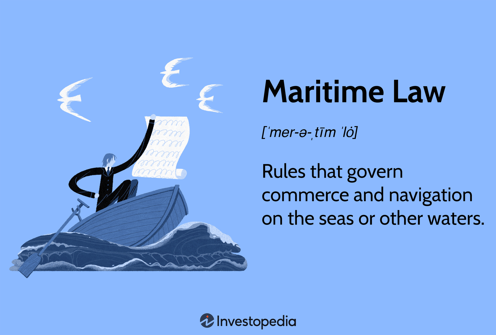

Maritime law, with its intricate web of regulations governing international waters, plays a pivotal role in shaping global trade and political relations. This complex domain not only encompasses the rules of navigation and marine commerce but also addresses disputes over maritime boundaries, which can lead to significant geopolitical tensions. As nations increasingly assert their territorial claims over lucrative sea routes and resources, the potential for conflict grows, consequently impacting international trade routes that lie at the heart of the global economy.

In recent years, the rise of algorithmic trading has introduced a new dynamic to this landscape, merging maritime law with the world of finance. Algorithmic trading, characterized by the use of computer algorithms to rapidly conduct market transactions, has transformed the foreign exchange and commodities markets. The volatility that accompanies maritime sovereignty disputes, such as those in the South China Sea, directly influences these markets, creating opportunities and risks for traders and investors.



This article examines how sovereignty disputes in international waters influence trading and investment strategies, highlighting the need for market participants to incorporate geopolitical analysis into their trading algorithms. By exploring the interconnectedness of maritime law and finance, we gain a deeper appreciation of how legal and diplomatic developments on the world's oceans can shape the economic and political fabric of our interconnected world.

## Table of Contents

## Understanding Maritime Law

Maritime law, also known as admiralty law, is a specialized body of law that governs a wide range of activities and disputes on the seas. This branch of law is essential for maintaining order in the complex and often contentious environment of international waters. Originating from ancient maritime codes, maritime law has developed over centuries to accommodate the evolving dynamics of marine commerce, navigation, and the protection of marine resources.

The earliest known maritime laws, such as the Laws of Rhodes, established foundational principles that facilitated trade and resolved disputes at sea. These ancient codes have significantly influenced the structure of modern maritime law, which has adapted to meet contemporary challenges. Modern maritime law addresses issues like shipping, ocean navigation, marine insurance, the safety of ships, and the rights of sailors and passengers.

A cornerstone of contemporary maritime law is the United Nations Convention on the Law of the Sea (UNCLOS), which was adopted in 1982. UNCLOS provides a comprehensive legal framework governing the rights and responsibilities of states in their use of the world's oceans, promoting the peaceful use of maritime resources and the conservation of marine life. The convention delineates various maritime zones, including territorial seas, contiguous zones, exclusive economic zones (EEZs), and the continental shelf, each defined by specific rights and regulations.

Customary international law also plays a critical role in maritime law, supplementing treaties like UNCLOS. These are practices and rules that, through widespread and consistent acceptance by the international community, have become legally binding. Customary law addresses areas not yet codified by international agreements and often serves as interpretative guides for resolving maritime disputes.

By combining historical precedents with modern legal instruments, maritime law effectively regulates international waters, ensuring that navigation, commerce, and resource conservation are conducted within a legal framework designed to prevent conflict and encourage cooperation among nations.

## International Waters and Sovereignty Disputes

International waters, often referred to as the high seas, are areas of the ocean that are not under the jurisdiction of any single nation. They encompass regions beyond national Exclusive Economic Zones (EEZs) and are governed by international agreements like the United Nations Convention on the Law of the Sea (UNCLOS). These agreements aim to regulate activities and ensure the equitable use of marine resources while protecting the maritime environment.

Sovereignty disputes over maritime boundaries and resources have been a long-standing issue, primarily due to overlapping territorial claims and the presence of valuable resources such as oil, gas, and fish stocks. These disputes often lead to tensions among neighboring countries, as control over maritime areas can significantly impact national economies and security.

One of the most notable areas of conflict is the South China Sea, a crucial maritime region through which an estimated $3.4 trillion in trade passes annually.[1] The sea is subject to competing claims from countries like China, Vietnam, the Philippines, and Malaysia, among others. China’s “nine-dash line” claim covers a large portion of the South China Sea, leading to international disputes and diplomatic tensions. The region is believed to possess extensive oil and natural gas reserves, making it a hotspot for geopolitical contention.

The Arctic region is another significant area where sovereignty disputes arise due to climate change-induced ice melt, opening new shipping routes and access to untapped resources. Countries bordering the Arctic—such as Russia, the United States, Canada, Norway, and Denmark (via Greenland)—are asserting claims over extended continental shelves, which would grant them rights to seabed resources. The melting ice is reshaping geopolitical dynamics, potentially leading to conflicts over territorial waters and the governance of newly accessible parts of the ocean.[2]

These sovereignty disputes are further complicated by the strategic military importance of control over sea lanes and maritime areas, leading to an increased military presence and exercises by nations asserting their claims. The resolution of such disputes often necessitates diplomatic negotiations, international treaties, and, in some cases, arbitration by international bodies such as the International Tribunal for the Law of the Sea (ITLOS) or the International Court of Justice (ICJ).

Balancing sovereign rights with the principles of freedom of navigation and the sustainable use of ocean resources remains a challenging task in managing international waters. Effective international cooperation and adherence to established legal frameworks are crucial for resolving disputes and ensuring that the oceans remain a shared resource for all nations.

[1] United Nations Conference on Trade and Development. (2018). "Review of Maritime Transport 2018". UNCTAD.
[2] Arctic Council. "Arctic Marine Shipping Assessment 2009 Report".

## The Legal Framework Governing Sovereignty Disputes

The United Nations Convention on the Law of the Sea (UNCLOS) serves as the primary international framework governing maritime sovereignty disputes. Adopted in 1982 and enacted in 1994, UNCLOS establishes guidelines for how countries interact concerning maritime resources and territorial waters. It defines the rights and responsibilities of nations with respect to their use of the world's oceans, facilitating navigation, conservation, and the fair utilization of marine resources.

Key provisions of UNCLOS include the delineation of maritime zones, such as territorial waters, exclusive economic zones (EEZs), and continental shelves. Territorial waters extend up to 12 nautical miles from a state's coastline, within which the state exercises sovereignty. Beyond this, the EEZ extends up to 200 nautical miles, granting a state special rights regarding the exploration and use of marine resources, though foreign nations maintain the right to navigation and overflight.

Customary international law and principles, such as equidistance, complement UNCLOS by guiding the delineation of maritime boundaries between neighboring states. The equidistance principle, particularly in contexts where the maritime zones of different states overlap, suggests that boundaries should be drawn at equal distances from the nearest points on the coastline of each state involved. This principle helps to ensure fair division of maritime spaces, although its application can vary based on geographic, historical, and other contextual factors.

International courts play a vital role in adjudicating disputes that arise concerning maritime sovereignty. The International Tribunal for the Law of the Sea (ITLOS), established by UNCLOS, provides a forum for resolving disputes pertaining to the interpretation and application of the Convention. ITLOS offers arbitration, special chambers, and advisory opinions to manage conflicts and ensure adherence to international maritime law.

Similarly, the International Court of Justice (ICJ) is instrumental in settling disputes that extend beyond the scope of UNCLOS. The ICJ, the principal judicial organ of the United Nations, addresses complex legal issues involving maritime boundaries and uses a diverse set of legal precedents and principles to deliver binding verdicts. Both ITLOS and the ICJ contribute significantly to promoting peaceful resolutions and maintaining stability in international waters through legal judgments and advisory roles.

The collaborative framework established by UNCLOS, complemented by customary laws and the jurisdiction of international courts, is crucial for managing sovereignty disputes in maritime domains. These legal structures facilitate cooperation and compliance among nations, thereby enhancing maritime security, resource management, and the peaceful resolution of conflicts.

## Algorithmic Trading in Forex and Commodities

Algorithmic trading employs computer algorithms to execute trades at unprecedented speeds, fundamentally transforming [forex](/wiki/forex-system) and commodities markets by optimizing trade execution and minimizing human intervention. This technology leverages sophisticated mathematical models and statistical analysis to predict market movements and act on trading opportunities more rapidly than manual trading.

In forex, the high [liquidity](/wiki/liquidity-risk-premium) and 24/5 market operation make [algorithmic trading](/wiki/algorithmic-trading) particularly effective. Traders use algorithms to capitalize on micro-movements in currency pairs, often through high-frequency trading strategies. The algorithm's capacity to analyze vast datasets, including economic indicators, interest rates, and geopolitical events, allows traders to optimize their strategies continually.

The relevance of maritime law in algorithmic trading emerges significantly when trading commodities such as oil and gas. Maritime disputes can affect the supply chains of these commodities, impacting market dynamics. For example, if geopolitical tensions disrupt shipping routes through conflict zones like the South China Sea, the supply flow of oil may be delayed, raising prices. Algorithms integrating geopolitical analysis can adjust their strategies to account for such supply disruptions, optimizing trade decisions based on the immediate availability and cost fluctuations of commodities.

Investors utilizing algorithmic trading require a robust understanding of how geopolitical tensions affect commodities markets. Geopolitical events can lead to [volatility](/wiki/volatility-trading-strategies), and traders may use algorithms to hedge their positions, reducing potential losses. Algorithms designed with predictive capabilities can anticipate changes in market sentiment triggered by announcement of maritime conflicts or resolutions, allowing traders to make informed decisions quickly.

Overall, the intersection between algorithmic trading and maritime law underscores the importance of incorporating geopolitical variables into trading algorithms. By doing so, investors can exploit [arbitrage](/wiki/arbitrage) opportunities and mitigate risks associated with maritime disputes, maintaining successful trading strategies in complex and fast-evolving markets.

## Impact of Maritime Sovereignty Disputes on Global Trading

Maritime sovereignty disputes significantly influence global trading by affecting the stability and efficiency of international supply chains. Central to this issue is the critical nature of regions like the South China Sea, a pivotal conduit for global shipping routes. It is estimated that approximately one-third of global shipping passes through this area, making it an essential artery for international trade. Consequently, any territorial conflicts that arise in these waters can have profound impacts on global commerce, leading to increased shipping costs, delays, and instability in supply chains.

Furthermore, these disputes often lead to the implementation of shipping restrictions or naval blockades, which exacerbate logistical challenges. For instance, tensions can result in rerouting of shipping lanes, which increases travel time and fuel consumption, consequently raising the operational costs for shipping companies. These increased costs often translate into higher prices for commodities, impacting global commodities trading, particularly in oil and seafood — two highly trafficked products in international waters. 

Algorithmic trading systems are particularly sensitive to these fluctuations in the maritime environment. These systems, which execute trades based on pre-programmed instructions, must incorporate geopolitical risk assessments to optimize their performance. Adapting to maritime sovereignty disputes requires algorithmic trading systems to continuously integrate real-time geopolitical data into their models. Here’s a simplified Python code snippet demonstrating how a basic geopolitical risk [factor](/wiki/factor-investing) might be included in an algorithmic trading strategy:

```python
import numpy as np

def compute_risk_factor(geopolitical_index, dispute_severity):
    # Calculate the risk factor based on geopolitical index and dispute severity
    return geopolitical_index * np.log1p(dispute_severity)

def adjusted_price(original_price, risk_factor):
    # Adjust price based on calculated risk factor
    return original_price * (1 + risk_factor)

# Example usage
geopolitical_index = 0.05  # This could be derived from various geopolitical risk assessments
dispute_severity = 3       # Hypothetical severity rating ranging from 1 to 5
current_price = 100        # Starting commodity price

# Calculate risk factor and adjust price
risk_factor = compute_risk_factor(geopolitical_index, dispute_severity)
new_price = adjusted_price(current_price, risk_factor)

print(f"Adjusted commodity price considering maritime disputes: {new_price}")
```

This example illustrates the integration of risk factors into pricing strategies, which is crucial for traders operating in markets susceptible to geopolitical instability. The capability to pivot based on updated information allows investment strategies to remain competitive in volatile environments.

In summary, maritime sovereignty disputes are more than legal entanglements; they pose tangible threats to global trading frameworks. Navigating these challenges demands heightened awareness and strategic adaptations from both commodity traders and algorithmic systems, ensuring resilience in facing fluctuating geopolitical tides.

## Case Studies of Resolved and Ongoing Disputes

The Bangladesh-Myanmar maritime dispute is a prominent example of how international law can be instrumental in resolving complex sovereignty issues. The dispute arose over the delineation of the maritime boundary in the Bay of Bengal, an area rich in natural resources. Both countries claimed overlapping areas, leading to heightened tensions. The case was eventually brought before the International Tribunal for the Law of the Sea (ITLOS) in 2009. In 2012, ITLOS delivered its judgment, which established an equitable boundary that aimed to serve the interests of both nations. This decision highlighted the importance of legal frameworks such as the United Nations Convention on the Law of the Sea (UNCLOS) in providing objective solutions based on equitable principles, thereby setting a precedent for similar disputes.

In contrast, the Greece-Turkey Exclusive Economic Zone (EEZ) conflict represents an ongoing dispute that underscores the challenges inherent in maritime boundary negotiations. The Aegean Sea, where the dispute is centered, is strategically significant and potentially resource-rich, leading to competing claims between the two nations. The core of the conflict lies in differing interpretations of international law and historical treaties, compounded by national interests and a lack of mutual recognition of zones. As of now, diplomatic efforts and international mediation have yet to yield a resolution, illustrating the complexities of sovereignty disputes when political and historical contexts play a significant role.

These case studies emphasize that while international legal institutions like ITLOS can effectively mediate and resolve disputes, the unique circumstances of each case can influence the outcome. Moreover, they demonstrate that successful resolution often requires not only legal clarity but also diplomatic goodwill and cooperation among the involved parties. These examples serve as important lessons, emphasizing adherence to international law and the understanding of geopolitical dynamics as crucial to resolving maritime disputes effectively.

## Future Trends and Considerations

Technological advancements, climate change, and the evolving geopolitical landscape are poised to substantially influence maritime sovereignty disputes and global trading patterns. Understanding the interplay of these factors is crucial for stakeholders navigating the complexities of maritime law and international commerce.

One significant technological advancement is the increased deployment of satellite technology, which offers enhanced capabilities for monitoring and surveilling maritime zones. High-resolution satellite imagery and advanced data analytics enable real-time tracking of vessel movements, facilitating better enforcement of maritime boundaries and resource management. The integration of satellite data can offer precise insights into maritime activities, thereby altering market dynamics and providing critical information for traders and policymakers. For example, the capability to monitor shipping lanes and detect illegal activities can help in assessing risk and adjusting trading strategies accordingly.

Climate change is another pivotal factor shaping future maritime sovereignty discussions. Rising sea levels, changing ocean currents, and the melting of polar ice are creating new navigation routes and altering existing maritime boundaries. The opening of the Northwest Passage and the Northern Sea Route due to Arctic ice melt presents new opportunities and challenges for global shipping and resource exploration. These changes necessitate the reevaluation of existing maritime boundaries and may exacerbate disputes over territory and access to resources.

Geopolitical landscapes are continually evolving, influenced by regional conflicts, economic interests, and shifting alliances. Nations with competing territorial claims are enhancing their maritime capabilities, which can escalate tensions and complicate resolution processes. In this context, strong collaboration and compliance with international laws, such as the United Nations Convention on the Law of the Sea (UNCLOS), are crucial to maintaining stability and fostering sustainable utilization of maritime resources. Strengthening diplomatic channels and promoting cooperative frameworks can aid in addressing complex maritime disputes, ensuring equitable access, and preserving marine biodiversity.

As the maritime domain adapts to these emerging trends, stakeholders must remain vigilant and adaptive. Leveraging cutting-edge technology, understanding environmental changes, and fostering international cooperation are vital for addressing the challenges and opportunities presented by future trends in maritime sovereignty and global trading.

## Conclusion

Maritime law and international sovereignty disputes play a crucial role in shaping global trade, particularly in the commodities and logistics sectors. As disputes over maritime boundaries and resources intensify, they exert a profound influence on shipping routes and commodity prices. For instance, the strategic chokepoints in regions like the South China Sea and the Strait of Hormuz are pivotal to the flow of global trade, and tensions there can cause significant disruptions to supply chains.

Investors and trading systems must navigate these complexities with agility, responding swiftly to evolving legal frameworks and geopolitical shifts. Algorithmic trading systems can benefit from integrating geopolitical analysis to anticipate market movements driven by such disputes. By leveraging real-time data and predictive models, traders can better gauge the implications of maritime sovereignty issues and adjust their strategies accordingly.

Moreover, a comprehensive understanding of the interplay between maritime law and global trading dynamics is essential. This knowledge provides a foundation for making informed investment decisions and developing resilient trading strategies in the face of uncertainty. Policymakers, investors, and trading companies must prioritize collaboration and compliance with international laws to maintain economic and political stability across interconnected markets.

In conclusion, the intricate ties between maritime disputes and global trade underscore the need for strategic foresight and adaptability. As technological advancements and geopolitical developments continue to reshape the maritime landscape, stakeholders must remain vigilant and proactive in addressing these challenges to sustain a stable and prosperous global economy.

## References & Further Reading

[1]: Rothwell, D. R., & Stephens, T. (2010). ["The International Law of the Sea."](https://assets.cambridge.org/97813165/16881/frontmatter/9781316516881_frontmatter.pdf) Hart Publishing.

[2]: Beckman, R., & Davenport, T. (2013). ["The South China Sea Disputes: International Law and Geopolitics."](https://books.google.com/books/about/Beyond_Territorial_Disputes_in_the_South.html?id=45mcY5XoseMC) Edward Elgar Publishing.

[3]: ["The United Nations Convention on the Law of the Sea: A Commentary"](https://archive.org/details/isbn_9780792324713_2) by Center for Oceans Law and Policy, University of Virginia

[4]: Fravel, M. T. (2011). ["China's Strategy in the South China Sea."](https://taylorfravel.com/documents/research/fravel.2011.CSA.china.strategy.scs.pdf) Contemporary Southeast Asia, 33(3), 292-319.

[5]: Lopez de Prado, M. (2018). ["Advances in Financial Machine Learning."](https://www.amazon.com/Advances-Financial-Machine-Learning-Marcos/dp/1119482089) Wiley.

[6]: Menkhaus, K. (1996). ["Environmental Security and the Collapse of Society: Evidence from Somalia."](https://www.semanticscholar.org/paper/Somalia:-State-Collapse-and-the-Threat-of-Terrorism-Menkhaus/b8b77a285b473f28c9d79c5cdfb904ba6555bb40) Review of African Political Economy, 23(70), 620-636.