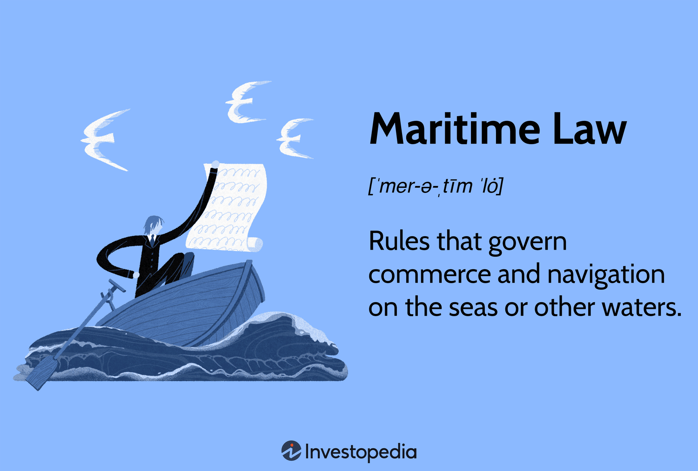

Admiralty law, frequently referred to as maritime law, is an essential framework that regulates activities on the seas and navigable waters. As global commerce intensifies, these regulations help maintain order and resolve disputes in the maritime industry. With the advent of algorithmic trading in the shipping and transportation sectors, it becomes increasingly crucial to understand the convergence of admiralty law and technology.

Algorithmic trading, which involves using computer algorithms to make trading decisions, has transformed various industries by optimizing transactions and enhancing decision-making processes. When applied to the maritime domain, algorithmic trading has the potential to revolutionize logistics management, improve operational efficiencies, and streamline supply chain processes. However, the integration of such technology into maritime operations presents unique legal challenges. Issues such as data security, compliance with existing maritime law, and the handling of automated transactions require careful consideration and adaptation of legal frameworks.



This article focuses on the significant legal aspects of admiralty and maritime law, particularly as they relate to algorithmic trading. Key concepts such as jurisdiction, contractual obligations, and liability in the context of automated trading are explored. Moreover, the role of technological advancements in shaping modern maritime governance frameworks is analyzed. Global maritime regulations must now consider the implications of digital trading innovations to ensure effective and comprehensive oversight.

Understanding the intersection of admiralty law and algorithmic trading elucidates new challenges and opportunities for stakeholders in both maritime and financial sectors. By examining these intersections, industry professionals can better navigate the evolving legal landscape and leverage technological advancements to enhance their operations while maintaining compliance with international maritime regulations.

## Table of Contents

## Understanding Admiralty and Maritime Law

Maritime or admiralty law encompasses regulations that specifically address private maritime business and nautical matters. This distinct legal jurisdiction operates independently from standard national laws, offering a specialized framework for the governance of activities on international waters. Its scope includes various key components that are crucial to the regulation and facilitation of maritime operations.

One essential aspect of maritime law is the management of the carriage of goods. This involves a complex set of rules that dictate the responsibilities and liabilities of parties engaged in the transport of goods by sea. These laws ensure that contracts for the transportation of goods are adhered to, allowing for smooth trade operations across different jurisdictions.

Insurance is another critical element under maritime law, providing financial protection against potential losses or damages incurred during maritime operations. Marine insurance contracts are specifically tailored to cover the unique risks associated with sea transport, such as weather hazards, piracy, and accidents at sea.

Contracts form the backbone of maritime business activities, with specific agreements such as charter parties and bills of lading playing crucial roles. Charter parties govern the leasing of vessels, while bills of lading serve as legal documents that detail the cargo being shipped and the terms of its transportation. These contracts are fundamental to establishing clear expectations and responsibilities among the parties involved in shipping activities.

Registration is an additional component of maritime law, involving the official recording of ships with a recognized authority. This process ensures that vessels comply with safety and operational standards, thereby fostering a secure maritime environment. It also aids in the identification and nationality of ships, which is critical in enforcement and regulatory measures.

Maritime disputes often arise due to the complex nature of international shipping and the multitude of parties involved. Admiralty laws provide a structured mechanism for resolving these disputes, whether they involve contractual disagreements, collisions, or salvage operations. Courts with specific expertise in maritime matters adjudicate these cases, ensuring informed and equitable resolutions.

The genesis of admiralty laws can be traced back to the necessity of managing disputes and enhancing shipping practices on international waters. These laws were established to facilitate and regulate the burgeoning trade routes that spanned across continents, providing a standardized system that transcended individual national laws.

The International Maritime Organization (IMO) plays a pivotal role in the current maritime legal landscape. As a specialized agency of the United Nations, the IMO is responsible for developing and updating international maritime conventions. It provides a global platform for countries to collaborate on the enhancement of safety, security, and environmental standards pertaining to shipping. By establishing comprehensive frameworks, the IMO ensures that maritime activities are conducted in a manner that promotes efficiency, safety, and environmental sustainability.

## Algorithmic Trading in Maritime Contexts

Algorithmic trading, a method of executing orders using automated pre-programmed trading instructions, has seen increasing application within maritime sectors. By harnessing the power of sophisticated algorithms, such as those used in financial markets, the maritime industry seeks to enhance operational efficiencies and improve economic outcomes.

One key area where [algorithmic trading](/wiki/algorithmic-trading) can make a substantial impact is in optimizing logistics operations. Shipping companies can utilize algorithms to determine the most efficient routes, taking into account variables such as fuel prices, weather conditions, and port congestion. This optimization reduces shipping times and fuel usage, leading to significant cost savings. Mathematical models and simulations are employed to predict and adjust shipping routes dynamically, leveraging real-time data inputs.

The potential of algorithmic trading to improve fuel efficiency is particularly relevant in the context of increasing environmental regulations. By optimizing engine loads and navigating through energy-efficient routes, shipping companies can significantly reduce greenhouse gas emissions. Algorithms evaluate multitudinous factors simultaneously to make instant decisions, offering a level of precision and speed that manual systems cannot match.

Supply chain management within maritime contexts stands to benefit greatly from algorithmic trading technologies. These systems facilitate just-in-time inventory systems and predictive maintenance, which anticipate equipment failures before they occur, thus minimizing downtime and improving vessel utilization rates. The comprehensive integration of these systems into supply chains enables seamless coordination and enhances the overall reliability of maritime operations.

However, the adoption of algorithmic trading introduces new challenges that require adjustments within existing maritime legal frameworks. Data security emerges as a primary concern due to the sensitive nature of the information processed by these algorithms. Protecting against data breaches and ensuring data integrity are critical to maintaining trust and compliance within the industry.

Digital contracts, such as smart contracts enabled by blockchain technology, present opportunities to automate and enforce agreements transparently and efficiently. As algorithmic trading becomes more prevalent, these contracts could provide solutions to complex maritime transactions, allowing instantaneous settlement and reducing the risk of human error.

Compliance with international maritime regulations is essential to facilitate the harmonious implementation of algorithmic systems. Regulatory bodies must evolve and establish guidelines that address these digital mechanisms' novel challenges, ensuring that the adoption of algorithmic trading aligns with global standards and ethical practices.

In conclusion, the maritime industry's integration of algorithmic trading represents a pivotal step towards modernizing logistics, enhancing efficiency, and meeting environmental targets. Despite the benefits, the sector must navigate the accompanying legal and regulatory challenges to fully realize these technologies' potential.

## Historical Background of Maritime Law

Maritime law, often synonymous with admiralty law, has a storied history that can be traced back to ancient civilizations, illustrating its critical role in shaping the governance of marine commerce and navigation. The earliest known regulations include the Rhodian Sea Laws around 900 BCE. These laws are believed to have originated on the island of Rhodes, which was a significant trading hub in the Mediterranean. The Rhodian Sea Laws introduced principles focused on the sharing of losses incurred at sea, an early precursor to the concept of general average in maritime law.

Centuries later, the Laws of Oleron emerged in the 12th century, serving as one of the first documented maritime codes in Western Europe. Originating from the Island of Oleron, off the French coast, these laws were reputedly promulgated by Eleanor of Aquitaine. They provided a systematic approach to maritime disputes and included rules for the conduct of shipmasters, details on freight charges, and guidelines for salvage operations. These ordinances were pivotal in influencing maritime judicial decision-making across Europe.

As maritime trade expanded in the late medieval and early modern periods, the need for comprehensive legal frameworks became more apparent. The establishment of various maritime codes across coastal nations further reinforced structured legal mechanisms. This development was essential in standardizing practices in sea trade, enhancing contractual certainty, and offering clear rules for dispute resolution. The prominence of maritime commerce necessitated laws that could operate across international waters, leading to the formation of conventions and organizations in later years, such as the International Maritime Organization (IMO).

Maritime law has continuously evolved alongside technological and economic shifts. The groundwork laid by ancient and medieval codes served as a foundation upon which modern maritime legal principles have been constructed, ensuring the sustainable and efficient regulation of marine activities across global waters.

## Key Legal Concepts in Maritime Law

Maritime law, or admiralty law, encompasses a variety of legal concepts crucial to the regulation of maritime activities, each with its specific jurisdictional purview, often transcending national borders. Understanding these key concepts is essential for smooth maritime operations and ensuring compliance with international legal standards.

**Jurisdiction**

Maritime law operates under distinct rules that often cross international boundaries due to the global nature of sea trade and navigation. The jurisdictional scope covers both domestic legislation and international agreements, enabling the resolution of legal disputes occurring on international waters. Courts with admiralty jurisdiction handle cases related to maritime activities, ensuring that the disputes are resolved under consistent legal principles applicable across multiple nations.

**Contract Law**

Central to maritime operations are various legally binding agreements, such as charter parties and bills of lading. Charter parties are contracts specifying the leasing of ships for cargo transport, detailing the rights and responsibilities of shipowners and charterers. Bills of lading act as receipts for shipped goods and serve as documents of title, essential for shipping and trading activities. These contracts must be meticulously drafted to define obligations, mitigate risks, and ensure legal protection for all involved parties.

**Maritime Liens**

Unique to maritime law, maritime liens are claims or privileges on maritime property, such as vessels, cargo, and salvage operations. These liens offer security to creditors by granting them a priority claim over other creditors in the event of a default or liquidation. They often arise from obligations like unpaid wages, repairs, and the provision of necessary supplies. Unlike other liens, maritime liens attach to the property, not the owner, and therefore survive changes in ownership.

**Environmental Regulations**

Given the ecological sensitivity of marine environments, maritime law includes stringent environmental regulations aimed at preventing marine pollution and promoting sustainable shipping practices. International conventions like the International Convention for the Prevention of Pollution from Ships (MARPOL) establish guidelines to minimize harmful discharges into the sea. These laws mandate that shipping companies adopt practices such as waste management and pollution control measures to mitigate their environmental impact.

These key legal concepts are pivotal in maintaining orderly maritime operations, facilitating trade, and protecting the maritime environment. Understanding their scope and application is imperative for stakeholders to navigate the complex web of maritime law effectively.

## Legal Implications of Algorithmic Trading in Maritime Law

Algorithmic trading within maritime law introduces several legal complexities that necessitate careful consideration and adaptation of existing frameworks. Key challenges include fraud prevention, ensuring compliance with regulations, and managing liability for automated transactions. These issues arise from the inherent nature of algorithmic systems, which operate based on predetermined instructions without human intervention.

Fraud prevention is a significant concern, as algorithmic systems may be vulnerable to manipulations that exploit the automated nature of trading processes. Ensuring the integrity of these systems requires robust security measures and consistent monitoring to detect and mitigate potentially fraudulent activities. Legal frameworks must evolve to incorporate guidelines that address these vulnerabilities and provide clear protocols for responding to incidents of algorithmic fraud.

Regulatory compliance represents another substantial challenge. Traditional maritime operations are subject to a variety of international regulations, and the introduction of algorithmic trading necessitates a reevaluation of these legal requirements. Ensuring that automated systems adhere to existing regulations while accommodating new digital trading practices is crucial. This may involve updates to standards governing data security, digital transactions, and operational transparency.

Liability in automated transactions is particularly complex, especially when algorithms are executing trade decisions without direct human oversight. Determining responsibility for errors or system failures in automated trading environments requires explicit definitions within contractual agreements. Parties involved in algorithmic trading must ensure that their contractual obligations are clearly defined to allocate liability appropriately and address potential disputes effectively.

Blockchain technology and smart contracts offer promising solutions for enhancing transparency and enforcing contractual agreements in this context. Blockchain provides a decentralized ledger that ensures the security and immutability of transaction records, which can be particularly beneficial in verifying and auditing maritime trade activities. Smart contracts, self-executing contracts with the terms directly written into code, facilitate automation while maintaining compliance and enforcing contractual obligations without the need for intermediaries.

Python code, for instance, can be employed to implement a simple smart contract for a maritime trade scenario:

```python
from web3 import Web3

# Connect to blockchain network
web3 = Web3(Web3.HTTPProvider('http://localhost:8545'))

# Sample smart contract code
contract_code = '''
pragma solidity ^0.5.0;

contract MaritimeContract {
    address payable public seller;
    address payable public buyer;
    uint public amount;

    constructor(address payable _buyer, uint _amount) public {
        seller = msg.sender;
        buyer = _buyer;
        amount = _amount;
    }

    function confirmDelivery() public {
        require(msg.sender == buyer, "Only buyer can confirm delivery");
        seller.transfer(amount);
    }
}
'''

# Compile and deploy contract code (code execution simplified)
compiled_contract = web3.eth.compile_source(contract_code)
contract_interface = compiled_contract['<stdin>:MaritimeContract']
MaritimeContract = web3.eth.contract(abi=contract_interface['abi'], bytecode=contract_interface['bin'])
transaction_hash = MaritimeContract.constructor(web3.toChecksumAddress("0xBuyerAddress"), 100).transact({'from': web3.eth.accounts[0]})
```

In this example, the smart contract enforces the payment from the buyer to the seller upon delivery confirmation, ensuring both parties meet their contractual obligations. Such innovations illustrate how algorithmic trading in maritime contexts can leverage technology to address legal challenges, enhance transparency, and maintain compliance with evolving regulatory landscapes.

## Future Trends and Developments

Technological advancements are significantly impacting maritime logistics and law, with a notable focus on autonomous ships and sustainable shipping practices. As these innovations continue to advance, they necessitate new regulatory frameworks that align with the evolving nature of maritime industries.

The rise of autonomous ships presents both opportunities and challenges. Autonomous vessels operate with minimal to no human intervention, relying heavily on [artificial intelligence](/wiki/ai-artificial-intelligence) (AI) for navigation, operational decision-making, and safety management. This technology can enhance operational efficiency, reduce labor costs, and improve safety by minimizing human error. However, it also raises complex legal questions regarding liability, compliance, and the establishment of international standards to ensure consistent operational protocols across jurisdictions. It is crucial for maritime law to evolve in order to address these issues adequately, possibly through new regulations akin to those developed for autonomous vehicles in other modes of transport.

Furthermore, AI integration extends beyond autonomous ships. It plays a pivotal role in optimizing logistics through predictive analytics and advanced data processing, improving fuel efficiency, and minimizing environmental impact. These applications contribute to more sustainable shipping practices, aligning with global environmental goals. However, they also pose challenges in terms of data security, privacy, and the need for transparent data governance policies.

Blockchain technology is another transformative force within maritime sectors. Its potential to enhance the reliability and transparency of maritime trading platforms is substantial. By enabling secure and decentralized transaction records, blockchain can streamline processes such as supply chain management, cargo tracking, and the validation of shipping documents. This technology also supports smart contracts, which automate and enforce contractual agreements without intermediaries, thereby reducing the potential for disputes and fraud.

In addition, blockchain can bolster traditional maritime insurance and liability structures by providing immutable records of incidents, aiding in claims processing and dispute resolution. The increased transparency and security offered by blockchain initiatives can foster greater trust among industry stakeholders, further integrating maritime operations within a cohesive digital ecosystem.

Overall, the future of maritime logistics and law will be characterized by ongoing technological integration, requiring adaptive legal frameworks to address emerging complexities. Stakeholders in the maritime sector must engage collaboratively with regulatory bodies to ensure that innovations are embraced while maintaining robust oversight and regulatory compliance.

## Conclusion

As algorithmic trading spreads across maritime sectors, understanding admiralty law is crucial for addressing emerging legal challenges. Maritime activities, inherently global and complex, require robust legal structures to manage issues such as liability, jurisdictional disputes, and contractual obligations. These challenges are amplified by the adoption of technologies like blockchain and artificial intelligence in trading and logistical operations.

The future of maritime law lies in its ability to adapt and integrate with advanced technologies. Legal frameworks must evolve to address issues related to cybersecurity, data management, and digital contract enforcement to ensure that maritime operations remain secure and legally compliant.

Leveraging modern technology can greatly enhance operational efficiency for stakeholders in maritime and trading industries. For example, blockchain has the potential to revolutionize the transparency and security of transactions by providing immutable records, thereby reducing fraud and dispute resolution times. Similarly, AI can improve logistics and decision-making processes, offering opportunities for streamlined operations and cost savings.

Global regulations must also reflect these technological advancements. The international nature of maritime activities necessitates cohesive policy development to ensure seamless operation across borders. This includes standardizing practices for data exchange, cybersecurity protocols, and liability management in automated trading systems.

By embracing these new technologies and updating legal frameworks, stakeholders can navigate the complexities of modern maritime and trading activities while ensuring compliance with global maritime regulations. This proactive approach not only secures maritime operations but also positions the sector to capitalize on technological innovations, ultimately leading to improved efficiency and sustainability.

## References & Further Reading

[1]: Tetley, W. (2003). ["Maritime Liens and Claims."](https://books.google.com/books/about/Maritime_Liens_and_Claims.html?id=sjMSAAAAYAAJ) Blais and Lamy.

[2]: International Maritime Organization. (2011). ["Introduction to IMO."](https://www.imo.org/en/About/Pages/Default.aspx) Accessed October 2023.

[3]: Van Hooydonk, E. (2010). ["The Law of the Sea and Maritime Boundaries."](https://www.semanticscholar.org/paper/The-law-of-unmanned-merchant-shipping%3A-an-Hooydonk/81f892b6515c1d22dfbf585574beb4900c8956fc) International Maritime Boundaries Series.

[4]: Scharfman, J. (2018). ["Alternative Investment Operations: Hedge Funds, Private Equity, and Fund of Funds."](https://link.springer.com/book/10.1007/978-3-030-46629-9) Wiley.

[5]: Bush, W. S., & Chiodo, M. (2004). ["The Role of the U.S. State Courts in Maritime Law."](https://www.jstor.org/stable/27552211) Journal of Maritime Law & Commerce, 35(1), 53-88.