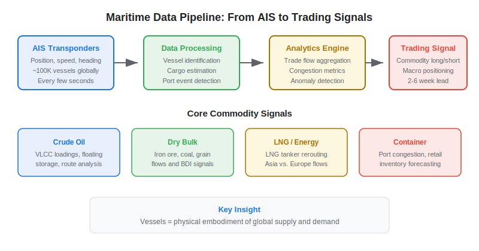
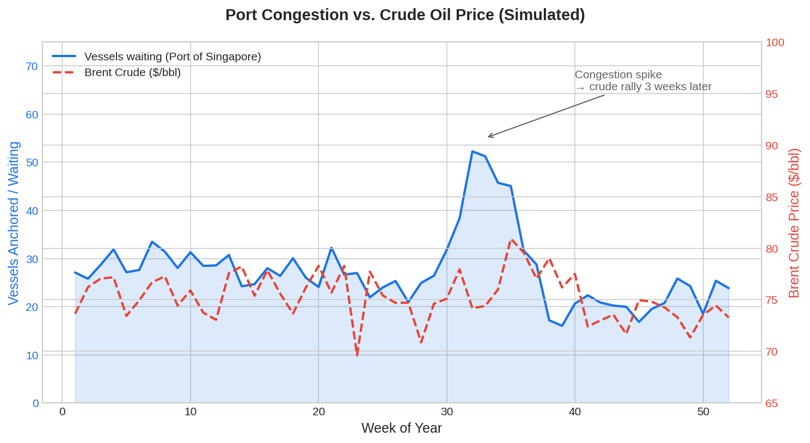

Maritime and supply chain data has emerged as one of the most information-rich [alternative data](https://paperswithbacktest.com/wiki/best-alternative-data) sources for commodity traders, macro funds, and equity analysts. By tracking the movement of every major vessel on the planet — tankers carrying crude oil, dry bulk carriers hauling iron ore, container ships transporting consumer goods — traders can nowcast global trade flows, predict commodity price movements, and detect supply disruptions weeks before they appear in official statistics.

## What Is Maritime Data in Trading?

Maritime data for trading refers to structured datasets derived from vessel tracking systems — primarily the Automatic Identification System (AIS) — combined with port analytics, cargo manifests, and logistics metrics. AIS transponders are legally required on all commercial vessels over 300 gross tons, and they broadcast vessel identity, position, speed, heading, and destination every few seconds.

When this raw AIS data is processed at scale — tracking ~100,000 commercial vessels globally — it reveals patterns in global trade that are invisible to traditional economic data. A surge in VLCC (Very Large Crude Carrier) loadings at Saudi Arabian ports signals increased oil supply. A backup of container ships at the Port of Los Angeles foreshadows retail inventory shortages. A rerouting of LNG tankers from Asia to Europe indicates shifting energy demand.

The key insight: **vessels are the physical embodiment of global supply and demand**. By monitoring them, traders observe the real economy in motion.

The use of maritime data in finance has a longer history than most people realize. Commodity trading houses like Vitol, Trafigura, and Glencore have tracked shipping movements for decades as core intelligence for their physical trading operations. What changed in the 2010s was the democratization of AIS data and the application of machine learning to process it at scale. Companies like Kpler (founded 2014) and Vortexa (founded 2016) built platforms that ingest billions of AIS position reports, combine them with port infrastructure databases and vessel characteristic data, and output cargo-level trade flow estimates that previously required teams of analysts and proprietary intelligence networks.

The COVID-19 pandemic and subsequent supply chain crisis of 2021–2022 dramatically raised the profile of maritime data in mainstream finance. As port congestion at Long Beach and Shanghai made front-page news, funds that had been quietly using maritime data for years found themselves with a significant informational advantage. They could quantify the severity of port backlogs, estimate the timeline for normalization, and position in affected sectors — container shipping equities, consumer retail stocks vulnerable to inventory shortages, and commodity futures — weeks before the economic impact appeared in official statistics.

For algo traders, the structural advantage of maritime data lies in its physics-based nature. Unlike sentiment data (which can be manipulated) or transaction data (which depends on panel construction), vessel positions are governed by the physical constraints of global shipping: a VLCC carrying 2 million barrels of crude oil takes 40 days to sail from the Persian Gulf to China, and there is no way to make it go faster. This predictability creates a window of informational advantage that is difficult to arbitrage away, because the lead time is determined by ship speed, not by market structure.



## Core Use Cases for Algo Trading

### Crude Oil and Energy Flows

The most established use case. Traders track oil tanker movements to estimate global crude supply in near-real-time. Key metrics include:

**Loading/unloading events**: When a VLCC sits at an oil terminal and its draft (how deep it sits in the water) increases, it is loading crude. The change in draft multiplied by the vessel's hull dimensions gives an estimated cargo volume.

**Floating storage**: Tankers anchored offshore with full cargoes serve as floating storage — a signal of oversupply. During the 2020 oil price collapse, satellite-derived counts of tankers used as floating storage became a leading indicator.

**Route analysis**: Tracking whether Saudi tankers head to China, India, or Europe reveals demand patterns. Shifts in routing can predict regional crude price differentials weeks ahead.

### Dry Bulk Commodities

Dry bulk carriers transport iron ore, coal, grain, and other commodities. The Baltic Dry Index (BDI), which measures shipping costs, is already widely used as an economic indicator. Maritime data adds granularity by tracking actual vessel movements:

$$\text{Implied Trade Flow} = \sum_{i=1}^{N} \text{Cargo}_i \times \mathbb{1}[\text{Route}_i = \text{target}]$$

Where $\text{Cargo}_i$ is the estimated cargo volume of vessel $i$ and the indicator function filters for a specific trade route (e.g., Australia-to-China iron ore).

### Container Shipping and Retail Supply Chain

Container shipping data predicts [consumer sector](https://paperswithbacktest.com/wiki/consumer-alternative-data) dynamics. Port congestion, container dwell times, and vessel schedule reliability affect inventory levels for retailers and manufacturers. During the 2021–2022 supply chain crisis, funds using maritime data detected port bottlenecks months before they became headline news.

### Port Congestion as a Macro Indicator

The number of vessels waiting outside a port — the queue length — is a powerful real-time indicator of economic activity and logistics stress:

| Port | Primary Commodity | Queue Length Signal |
|---|---|---|
| Shanghai / Ningbo | Containers, manufactured goods | Chinese export demand |
| Singapore | Crude oil, refined products | Asian energy demand |
| Santos, Brazil | Soybeans, sugar, coffee | Agricultural export supply |
| Rotterdam | Crude, containers, chemicals | European import demand |
| Long Beach / LA | Containers | US consumer import demand |
| Newcastle, Australia | Thermal coal | Asian coal demand |

A rising queue at a port historically correlates with upward pressure on the commodity being shipped and downward pressure on freight rates (as vessels get tied up, effective supply decreases).

## Key Maritime Data Vendors

| Vendor | Specialty | Data Coverage | Key Clients |
|---|---|---|---|
| Kpler | Oil, LNG, dry bulk cargo tracking | Global, real-time | Commodity traders, energy funds |
| Vortexa | Crude oil and refined products | Global, cargo-level | Oil majors, hedge funds |
| MarineTraffic | Vessel positions, port analytics | Global, AIS-based | Shipping, logistics, finance |
| Windward | Maritime risk and compliance | Global | Insurance, compliance, trading |
| Spire Global | AIS from satellite receivers | Polar and remote areas | Government, intelligence, finance |
| VesselsValue | Fleet valuation and ownership | Global commercial fleet | Shipping investors, banks |

For traders, the key differentiator is **cargo-level analytics** (what is on the ship?) versus **vessel-level tracking** (where is the ship?). Kpler and Vortexa excel at cargo estimation; MarineTraffic and Spire provide the broadest raw AIS coverage.

## Python Implementation: Vessel Congestion Monitor

Here is a practical example of computing port congestion from AIS position data:

```python
import numpy as np
import pandas as pd
from math import radians, sin, cos, sqrt, atan2

def haversine_km(lat1: float, lon1: float, lat2: float, lon2: float) -> float:
    """Compute great-circle distance in km between two points."""
    R = 6371  # Earth radius in km
    dlat = radians(lat2 - lat1)
    dlon = radians(lon2 - lon1)
    a = sin(dlat/2)**2 + cos(radians(lat1)) * cos(radians(lat2)) * sin(dlon/2)**2
    return R * 2 * atan2(sqrt(a), sqrt(1-a))

def count_vessels_near_port(
    vessel_positions: pd.DataFrame,
    port_lat: float,
    port_lon: float,
    radius_km: float = 30,
    speed_threshold_knots: float = 1.0
) -> dict:
    """
    Count vessels anchored/waiting near a port.
    
    Parameters:
    - vessel_positions: DataFrame with columns [mmsi, lat, lon, speed_knots, vessel_type]
    - port_lat, port_lon: Port coordinates
    - radius_km: Search radius around port
    - speed_threshold_knots: Below this speed = stationary/anchored
    """
    # Filter vessels within radius
    vessel_positions["dist_km"] = vessel_positions.apply(
        lambda r: haversine_km(r["lat"], r["lon"], port_lat, port_lon), axis=1
    )
    nearby = vessel_positions[vessel_positions["dist_km"] <= radius_km]
    anchored = nearby[nearby["speed_knots"] <= speed_threshold_knots]
    
    return {
        "port": f"({port_lat:.2f}, {port_lon:.2f})",
        "vessels_in_radius": len(nearby),
        "vessels_anchored": len(anchored),
        "congestion_ratio": len(anchored) / max(len(nearby), 1),
        "by_type": anchored["vessel_type"].value_counts().to_dict(),
    }

# Example: Simulate vessels near Port of Singapore (1.26°N, 103.84°E)
np.random.seed(42)
n_vessels = 200
vessels = pd.DataFrame({
    "mmsi": range(n_vessels),
    "lat": np.random.normal(1.26, 0.15, n_vessels),
    "lon": np.random.normal(103.84, 0.15, n_vessels),
    "speed_knots": np.random.exponential(2.0, n_vessels),
    "vessel_type": np.random.choice(["tanker", "bulk", "container", "other"], n_vessels, p=[0.35, 0.25, 0.3, 0.1]),
})

result = count_vessels_near_port(vessels, port_lat=1.26, port_lon=103.84, radius_km=30)
for k, v in result.items():
    print(f"  {k}: {v}")
```



## Building a Maritime Trading Strategy

A typical maritime data strategy follows this workflow:

**1. Define the commodity thesis**: Identify a commodity or sector where vessel flows are a leading indicator (e.g., crude oil, iron ore, containerized imports).

**2. Track vessel flows**: Monitor loadings, discharge events, and en-route vessels for the target commodity. Compute net flow changes versus seasonal baselines.

**3. Detect anomalies**: Flag unusual patterns — sudden drops in loadings from a major exporter, unexpected route changes, floating storage buildups — as potential signals.

**4. Cross-reference with fundamentals**: Validate maritime signals against EIA/IEA reports, USDA crop estimates, and trade statistics. Maritime data should lead these official sources by 2–6 weeks.

**5. Execute**: Integrate the signal into your alpha model alongside [other alternative data](https://paperswithbacktest.com/wiki/how-can-alternative-data-be-integrated-into-quantitative-trading). Position in commodity futures, energy equities, or shipping stocks as the thesis dictates.

## Limitations and Risks

**AIS spoofing and dark shipping**: Some vessels deliberately turn off AIS transponders or spoof their positions — particularly in sanctioned trade routes (Iran, Venezuela, North Korea). Satellite-based AIS receivers help detect dark shipping, but gaps remain.

**Cargo estimation uncertainty**: Inferring cargo type and volume from AIS data alone is imprecise. Draft changes can indicate loading, but the exact commodity is often inferred from port type and vessel class. Errors can reach 10–20% on individual vessels, though they average out across fleets.

**Weather and seasonal effects**: Storm diversions, ice conditions, and canal closures (Suez, Panama) create noise in vessel flow data. Models must account for seasonal routing patterns and exceptional weather events.

**Cost**: Institutional maritime data feeds from Kpler or Vortexa typically cost $100,000–$500,000 per year. Raw AIS data from MarineTraffic is cheaper but requires significant in-house processing.

## Conclusion

Maritime and supply chain data offers a uniquely physical window into global economic activity. For algo traders, vessel tracking transforms abstract macro narratives — "China is importing more oil" or "US retailers are restocking" — into measurable, tradeable signals with a 2–6 week lead over official data. Start with a single commodity focus (crude oil is the most mature), master the AIS data pipeline, and expand to dry bulk and containers as your infrastructure scales.

---

**Explore further on PapersWithBacktest:**
- Browse [backtested commodity and macro strategies](https://paperswithbacktest.com/strategies) with Python code and performance metrics
- Access [clean historical market data](https://paperswithbacktest.com/datasets) for equities, crypto, and futures
- Take the [algo trading course](https://paperswithbacktest.com/course) — 60+ video lessons and notebooks
- Related wiki pages: [Transportation Alternative Data](https://paperswithbacktest.com/wiki/transportation-alternative-data) · [Best Alternative Data Sources](https://paperswithbacktest.com/wiki/best-alternative-data)
