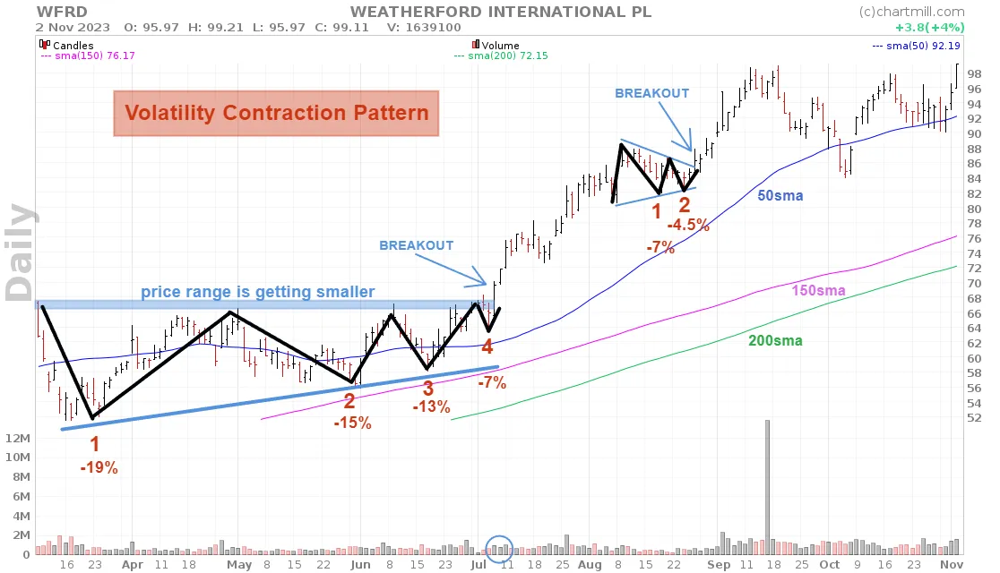

## Table of Contents

## Who is Mark Minervini and what is his background in trading?

Mark Minervini is a professional stock trader and the author of the book "Trade Like a Stock Market Wizard." He became famous for winning the U.S. Investing Championship, where he made a 155% return in a single year without losing money in any month during the competition. Mark started trading when he was young and faced many challenges, but he learned from his mistakes and developed his own successful trading strategies.

Mark's background in trading is unique because he did not have a traditional finance education. Instead, he learned by doing and through his own experiences in the market. Over the years, he refined his methods and created a system that focuses on buying strong stocks at the right time and managing risk carefully. Today, Mark shares his knowledge through his books, seminars, and his website, helping other traders learn how to succeed in the stock market.

## What are the core principles of Mark Minervini’s trading strategy?

Mark Minervini's trading strategy is based on a few key ideas. He looks for stocks that are doing well and are likely to keep going up. He uses something called the "VCP" pattern, which stands for Volatility Contraction Pattern. This means he waits for a stock's price to stop moving around a lot and start to move up in a more steady way. He also uses a tool called the "Minervini Trend Template" to pick stocks that are strong and likely to grow.

Another important part of Mark's strategy is managing risk. He never risks more than he can afford to lose on any one trade. He uses stop-loss orders to limit his losses if a stock starts to go down. Mark also believes in cutting losses quickly and letting winners run. This means he sells stocks that are losing money fast but holds onto stocks that are making money for a longer time. By following these principles, Mark aims to make more money than he loses over time.

## How does Minervini select stocks for his trading approach?

Mark Minervini picks stocks by looking for ones that are doing really well and are likely to keep going up. He uses a special pattern called the "VCP" pattern, which stands for Volatility Contraction Pattern. This means he waits for a stock's price to stop moving around a lot and start to move up in a more steady way. He also uses a tool called the "Minervini Trend Template" to find strong stocks. This template looks at things like how much the stock's price has gone up over time, how the stock is doing compared to the overall market, and other signs that the stock is healthy and growing.

Another important thing Mark does is manage risk. He never risks more money than he can afford to lose on any one trade. He uses stop-loss orders to limit his losses if a stock starts to go down. Mark believes in cutting losses quickly and letting winners run. This means he sells stocks that are losing money fast but holds onto stocks that are making money for a longer time. By [picking](/wiki/asset-class-picking) stocks carefully and managing risk well, Mark tries to make more money than he loses over time.

## What role does technical analysis play in Minervini’s strategy?

Technical analysis is a big part of Mark Minervini's way of picking stocks. He uses it to find patterns in how a stock's price moves. One pattern he looks for is called the "VCP" pattern, which stands for Volatility Contraction Pattern. This means he waits for a stock's price to stop moving around a lot and start to go up in a more steady way. He also uses a tool called the "Minervini Trend Template" to check if a stock is strong and likely to grow. This template looks at things like how much the stock's price has gone up over time and how it's doing compared to the overall market.

Besides finding good stocks, technical analysis helps Minervini manage risk. He uses stop-loss orders to limit his losses if a stock starts to go down. This is important because it helps him not lose too much money on any one trade. Mark believes in cutting losses quickly and letting winners run. This means he sells stocks that are losing money fast but holds onto stocks that are making money for a longer time. By using technical analysis to pick stocks and manage risk, Mark tries to make more money than he loses over time.

## Can you explain Minervini’s VCP (Volatility Contraction Pattern) and its importance?

Mark Minervini's VCP, or Volatility Contraction Pattern, is a way to spot stocks that are about to take off. It happens when a stock's price stops moving up and down a lot and starts to go up in a more steady way. This pattern shows that the stock is getting ready for a big move. Minervini looks for this pattern because it helps him find stocks that are likely to keep going up and make money.

The VCP is important because it helps Minervini pick the right time to buy a stock. When he sees a stock's price calm down and start to rise steadily, he knows it might be a good time to buy. This pattern helps him avoid buying stocks that are too risky or likely to go down. By waiting for the VCP, Minervini can increase his chances of making money in the stock market.

## What are the key indicators Minervini uses to time his entries and exits?

Mark Minervini uses a few key indicators to decide when to buy and sell stocks. For buying, he looks for the Volatility Contraction Pattern (VCP). This means he waits for a stock's price to stop moving around a lot and start to go up in a more steady way. He also uses the Minervini Trend Template, which checks if a stock is strong and likely to grow. This template looks at things like how much the stock's price has gone up over time and how it's doing compared to the overall market.

For selling, Minervini uses stop-loss orders to limit his losses if a stock starts to go down. This helps him not lose too much money on any one trade. He believes in cutting losses quickly and letting winners run. This means he sells stocks that are losing money fast but holds onto stocks that are making money for a longer time. By using these indicators, Minervini tries to make more money than he loses over time.

## How does Minervini manage risk and protect his capital?

Mark Minervini is very careful about managing risk and protecting his money. He never puts too much money into one trade. Instead, he decides how much he can lose before he starts trading. This way, he doesn't lose more than he can handle. He also uses something called a stop-loss order. This is like a safety net that tells the computer to sell the stock if it starts to go down too much. It helps him limit his losses and keep his money safe.

Another way Minervini protects his capital is by selling stocks that are losing money quickly. He believes it's better to get out of a bad trade fast than to wait and hope it gets better. But if a stock is doing well, he holds onto it longer to make more money. This way, he cuts his losses short and lets his winners run. By doing these things, Minervini tries to make sure he doesn't lose too much money and can keep trading for a long time.

## What are some common mistakes traders make when applying Minervini’s strategies?

One common mistake traders make when using Mark Minervini's strategies is not following the rules strictly. Minervini's approach requires discipline, like waiting for the right Volatility Contraction Pattern (VCP) before buying a stock. Some traders get too eager and buy stocks too early, before the pattern is complete. This can lead to buying stocks that aren't ready to go up, causing losses. Another mistake is not using stop-loss orders properly. Minervini stresses the importance of cutting losses quickly, but some traders hold onto losing stocks hoping they will turn around, which can hurt their overall performance.

Another frequent error is not managing risk well. Minervini never risks more than he can afford to lose on any one trade, but some traders put too much money into one stock, hoping for a big win. This can lead to big losses if the stock goes down. Also, some traders don't let their winners run long enough. Minervini advises holding onto stocks that are doing well to maximize gains, but impatience can cause traders to sell too soon and miss out on bigger profits. By understanding and avoiding these mistakes, traders can improve their chances of success using Minervini's strategies.

## How can a beginner start applying Minervini’s trading strategies?

A beginner can start applying Mark Minervini's trading strategies by first learning about the key concepts he uses, like the Volatility Contraction Pattern (VCP) and the Minervini Trend Template. These tools help find strong stocks that are likely to go up. A beginner should read Minervini's [books](/wiki/algo-trading-books), like "Trade Like a Stock Market Wizard," to understand how he picks stocks and manages risk. It's important to practice these strategies with a paper trading account before using real money. This way, a beginner can get a feel for how the strategies work without risking any money.

Once a beginner feels ready, they should start small and use stop-loss orders to limit losses. Minervini says to never risk more money than you can afford to lose on any one trade. A beginner should also be patient and wait for the right time to buy, which means waiting for the VCP pattern to show up. If a stock starts losing money, a beginner should sell it quickly to cut the loss. But if a stock is doing well, they should hold onto it longer to make more money. By following these simple steps and staying disciplined, a beginner can start using Minervini's strategies to trade successfully.

## What are some advanced techniques Minervini uses to optimize his trading?

Mark Minervini uses some advanced techniques to make his trading even better. One of these is looking at the stock's relative strength. This means he compares how well a stock is doing to how well other stocks are doing. If a stock is doing much better than others, it might be a good one to buy. He also looks at the stock's earnings and sales to make sure the company is healthy and growing. By combining these things with his VCP pattern and Trend Template, Minervini can pick the best stocks to trade.

Another advanced technique Minervini uses is called pyramiding. This means he adds more money to a trade as the stock goes up. Instead of putting all his money in at once, he buys a little at first and then buys more if the stock keeps going up. This way, he can make more money from winning trades without risking too much at the start. By using these advanced techniques, Minervini can make his trading strategy even more successful and keep his risks low.

## How has Minervini’s strategy performed historically, and what are the potential pitfalls?

Mark Minervini's strategy has done well over time. He became famous when he won the U.S. Investing Championship, making a 155% return in one year without losing money in any month. Many traders who follow his methods have also seen good results. Minervini's approach helps find strong stocks that are likely to go up and uses strict rules to manage risk. By sticking to these rules, traders can make more money than they lose over time.

However, there are some potential pitfalls to watch out for. One big problem is that not everyone follows Minervini's rules closely enough. It's easy to get too excited and buy stocks before they are ready or hold onto losing stocks too long. Another issue is that the stock market can be unpredictable. Even with a good strategy, there can be times when the market goes down and traders lose money. It's important for traders to stay patient and disciplined, and to always use stop-loss orders to limit their losses.

## Can you discuss any modifications or adaptations Minervini has made to his strategy over time?

Mark Minervini has made some changes to his trading strategy over time to make it better. One big change is that he now pays more attention to a stock's relative strength. This means he compares how well a stock is doing to how well other stocks are doing. If a stock is doing much better than others, it might be a good one to buy. He also looks more closely at a company's earnings and sales to make sure it's healthy and growing. By adding these checks to his VCP pattern and Trend Template, Minervini can pick even better stocks to trade.

Another change Minervini made is using a technique called pyramiding. This means he adds more money to a trade as the stock goes up. Instead of putting all his money in at once, he buys a little at first and then buys more if the stock keeps going up. This way, he can make more money from winning trades without risking too much at the start. These changes help Minervini keep his risks low while trying to make more money from his trades.

## References & Further Reading

[1]: Minervini, M. (2013). ["Trade Like a Stock Market Wizard: How to Achieve Super Performance in Stocks in Any Market"](https://www.amazon.com/Trade-Like-Stock-Market-Wizard/dp/0071807225) by Mark Minervini

[2]: Chan, E. P. (2009). ["Quantitative Trading: How to Build Your Own Algorithmic Trading Business"](https://github.com/ftvision/quant_trading_echan_book) by Ernest P. Chan

[3]: Jansen, S. (2020). ["Machine Learning for Algorithmic Trading"](https://github.com/stefan-jansen/machine-learning-for-trading) by Stefan Jansen

[4]: Pring, M. J. (2014). ["Technical Analysis Explained: The Successful Investor's Guide to Spotting Investment Trends and Turning Points"](https://www.amazon.com/Technical-Analysis-Explained-Fifth-Successful/dp/0071825177) by Martin J. Pring

[5]: Lopez de Prado, M. (2018). ["Advances in Financial Machine Learning"](https://www.amazon.com/Advances-Financial-Machine-Learning-Marcos/dp/1119482089) by Marcos Lopez de Prado

[6]: Aronson, D. (2007). ["Evidence-Based Technical Analysis: Applying the Scientific Method and Statistical Inference to Trading Signals"](https://www.amazon.com/Evidence-Based-Technical-Analysis-Scientific-Statistical/dp/0470008741) by David Aronson