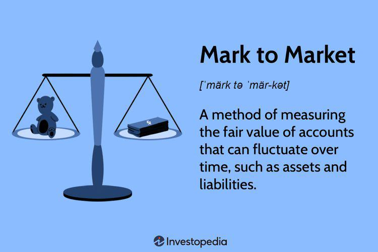

The modern financial landscape is a complex matrix of interconnected disciplines, each contributing significantly to the overall functionality of financial markets. This article focuses on the confluence of accounting, investing, mark-to-market valuation, finance, and algorithmic trading, highlighting the necessity for integration and understanding of these areas. Accounting provides the precise financial data that is fundamental for informed decision-making. It establishes the financial position and performance of a company through practices such as historical cost accounting and mark-to-market valuation, which influence asset valuation and reporting.

Investing strategies require comprehensive knowledge of market dynamics, risk management, and asset valuation. This expands into understanding various investment vehicles, including stocks, bonds, and derivatives, which are integral to achieving portfolio diversification. Investors rely on fundamental and technical analysis to guide their investment decisions effectively.



Mark-to-market (MTM) valuation offers a realistic snapshot of an entity's current financial condition, especially relevant under fluctuating market conditions. MTM's contribution to a transparent financial environment is counterbalanced by the challenges it faces during volatile periods when true asset values can be ambiguous.

Finance operates as a bridge between accounting and investing, utilizing accounting data to make strategic investment and funding decisions. Financial analysis is crucial in assessing company performance. Key metrics such as cash flow, profit margins, and asset management are indispensable in comprehensive financial planning.

Algorithmic trading, characterized by its speed, efficiency, and precision, has revolutionized modern markets. The embrace of algorithmic strategies automates decision-making, often surpassing traditional trading methods, and contributing to evolving market dynamics.

Understanding financial markets necessitates a grasp of the links between these elements. The interplay of accounting, investing, mark-to-market valuation, finance, and algorithmic trading constitutes the backbone of the financial industry. Engaging with these subjects allows investors, financial analysts, and other stakeholders to navigate and capitalize on financial markets, thereby enhancing their proficiency and adaptability in a continually evolving landscape.

## Table of Contents

## Accounting Principles in Finance

Accounting serves as the backbone of financial data provisioning, enabling informed decision-making across various sectors by offering a structured framework for recording, analyzing, and reporting financial transactions. Two key accounting practices that significantly influence asset valuation and financial reporting are historical cost and mark-to-market accounting.

Historical cost accounting involves recording assets at their original purchase price, which provides a stable and verifiable basis for financial statements. This method ensures consistency over time, enabling stakeholders to compare financial performance across different periods. However, one limitation of historical cost is that it does not account for changes in market value, potentially leading to outdated valuations during periods of economic [volatility](/wiki/volatility-trading-strategies).

In contrast, mark-to-market (MTM) accounting, also known as fair value accounting, values assets and liabilities at their current market price. This method aims to provide a more accurate reflection of an entity's financial status by considering prevailing market conditions. MTM is particularly relevant for financial instruments such as securities and derivatives, where market value fluctuations can be significant.

The choice between historical cost and MTM accounting can significantly impact financial statements and investment decision-making. Accurate accounting practices are essential for evaluating a company's financial health, allowing investors and analysts to make strategic investment decisions. Financial statements that reflect true asset valuations enable stakeholders to assess potential risks and returns effectively, ensuring that investment strategies are grounded in reliable data.

The integration of accurate accounting practices, whether historical cost or MTM, supports the identification of trends and patterns in financial performance. This allows for a more comprehensive understanding of a company's operational efficiency and financial stability. It is crucial for accountants and financial professionals to apply these principles meticulously to foster transparency and trust in financial reporting, underpinning sound strategic planning and resource allocation.

## Investing Strategies and Considerations

Investing requires a comprehensive understanding of market dynamics, risk management practices, and the valuation of various assets. Key to successful investing is recognizing market trends and adjusting strategies accordingly. An investor's toolkit includes a range of investment vehicles, such as stocks, bonds, and derivatives, each contributing differently to portfolio diversification.

Stocks, representing ownership in a company, offer potential for capital appreciation and dividend income. They often serve as a primary vehicle for long-term wealth accumulation. Bonds, on the other hand, are debt securities providing regular interest income and acting as a stabilizing force in a portfolio due to their relatively lower volatility compared to stocks. Derivatives, including options and futures, offer sophisticated avenues for hedging risk or speculating on market movements.

Portfolio diversification involves spreading investments across these different asset classes to mitigate risk. By not relying on a single investment type, the impact of adverse market movements in one asset class can be counterbalanced by stability or gains in another. A well-diversified portfolio uses a mix of assets to achieve a balance between risk and return, aligning with the investor's financial goals and risk tolerance.

Fundamental analysis is a core strategy in evaluating investment opportunities. It involves assessing a company’s financial health, business model, industry position, and economic conditions to determine its intrinsic value. Key metrics include earnings per share (EPS), price-to-earnings (P/E) ratio, and debt-to-equity ratio, among others. By analyzing these factors, investors can identify securities priced below their intrinsic value, targeting them for potential investment.

Conversely, technical analysis relies on statistical analysis of historical price and [volume](/wiki/volume-trading-strategy) data to predict future price movements. Tools such as moving averages, relative strength index (RSI), and chart patterns like head and shoulders are commonly used to identify trends and potential reversal points. While technical analysis does not consider an asset's intrinsic value, it aims to forecast market sentiment and price [momentum](/wiki/momentum), aiding investors in timing their buy and sell decisions effectively.

Successful investing therefore requires a blend of both fundamental and technical analysis to form a comprehensive view of the market. Combining these approaches allows investors to make well-informed decisions, balancing growth potential with manageable risk. As financial markets evolve, continuous learning and adaptation of these strategies remain essential for sustained investment success.

## The Mark-to-Market Valuation Method

Mark-to-market (MTM) accounting, also known as fair value accounting, is an essential method used for valuing assets and liabilities based on their current market prices rather than historical cost. This approach provides a more accurate reflection of an institution's financial condition by ensuring that balance sheets correctly represent the value of assets and liabilities at any given point in time. MTM is necessary because it aligns the recorded book value of an asset with its actual market value, allowing stakeholders to gain insights into potential gains or losses.

MTM provides several benefits, notably by enhancing transparency and allowing for real-time assessments of an organization's financial health. By valuing assets in alignment with current market conditions, MTM enables financial statements to be more representative of reality, which assists investors, analysts, and regulators in understanding an entity's true performance and risks.

Despite its advantages, the MTM method presents certain challenges and limitations, especially during volatile market conditions. In times of financial instability, market prices can fluctuate significantly, leading to considerable variations in asset valuations from one period to the next. Such fluctuations can amplify perceived volatility in financial results, potentially leading investors to make decisions based on short-term market movements rather than long-term fundamentals. This behavior can be particularly problematic for financial institutions holding large portfolios of market-sensitive assets.

A significant criticism of MTM accounting lies in its potential to exacerbate financial crises. During periods of extreme market downturns, the forced revaluation of assets at depressed market prices can trigger a downward spiral. This spiral may result as companies are required to recognize excessive losses, which can affect capital adequacy and [liquidity](/wiki/liquidity-risk-premium) positions, further fueling the crisis. 

Furthermore, MTM's reliance on active market prices may be problematic in illiquid markets where obtaining reliable market prices is difficult. In such scenarios, entities might have to resort to model-based valuations, which can introduce subjectivity and impair comparability across organizations.

In summary, while mark-to-market accounting provides a realistic and current valuation method for financial reporting, it is imperative for organizations and regulators to be aware of its limitations, particularly concerning market volatility and liquidity constraints. Balancing the need for accurate asset valuation with the potential for adverse effects in turbulent markets remains a critical consideration in the application of MTM accounting.

## Finance: Bridging the Gap Between Accounting and Investing

Finance serves as a critical link between accounting and investing by utilizing accounting data to make informed investment and funding decisions. It interprets financial statements prepared by accountants to provide insights into a company’s economic condition and prospects. This information is vital for determining both the viability and potential return on investments.

The role of financial analysis in assessing company performance and potential investments cannot be overstated. Financial analysts utilize a variety of key performance indicators (KPIs), financial ratios, and other metrics derived from accounting data to evaluate company performance. Key financial ratios include:

1. **Liquidity Ratios**: Measure the ability of a company to cover its short-term obligations. A common liquidity ratio is the Current Ratio, which is calculated as:
$$
   \text{Current Ratio} = \frac{\text{Current Assets}}{\text{Current Liabilities}}

$$

2. **Profitability Ratios**: Assess a company's ability to generate earnings relative to sales, assets, or equity. One such ratio is the Net Profit Margin, calculated as:
$$
   \text{Net Profit Margin} = \frac{\text{Net Income}}{\text{Revenue}} \times 100

$$

3. **Solvency Ratios**: Indicate a company's ability to meet long-term obligations. The Debt-to-Equity Ratio is a key solvency ratio, given by:
$$
   \text{Debt-to-Equity Ratio} = \frac{\text{Total Liabilities}}{\text{Shareholders' Equity}}

$$

These ratios provide a comprehensive view of the financial health and operational efficiency of a business, aiding in making informed investment decisions.

Cash flow, profit margins, and asset management are also fundamental elements considered in financial planning. Cash flow analysis involves evaluating the inflows and outflows of cash to ensure a company can meet its financial obligations. Monitoring profit margins helps in understanding the efficiency of a company in controlling costs relative to revenues. Effective asset management ensures that a company optimally utilizes its resources to maximize returns.

By bridging accounting data and investment analysis, finance plays a pivotal role in shaping strategic objectives, guiding decisions on resource allocation, and ultimately driving the growth and sustainability of businesses.

## Algorithmic Trading in Modern Markets

Algorithmic trading, often referred to as algo trading, represents a transformative evolution in financial markets. It employs complex mathematical models and sophisticated software to make high-speed, data-driven trading decisions. This paradigm shift has revolutionized how financial transactions are conducted, significantly affecting market dynamics and participant behavior.

Historically, trading in financial markets involved human decision-making processes that were time-consuming and susceptible to error. The advent of [algorithmic trading](/wiki/algorithmic-trading) introduced automation, allowing for the rapid execution of trades based on pre-defined criteria. Algorithms can handle vast amounts of data, analyzing historical data, real-time market information, and other financial indicators to optimize trading strategies. This capability enables traders to process a multitude of variables that would be impossible for human traders to consider concurrently.

In practice, algorithmic trading involves developing a trading strategy, which the algorithm then executes autonomously. These strategies can range from simple rules, such as moving average crossovers, to complex statistical models like mean reversion or [pair trading](/wiki/pair-trading). Below is a basic Python example of a simple moving average crossover strategy:

```python
import pandas as pd

def moving_average_crossover_strategy(data, short_window=40, long_window=100):
    data['Short_MA'] = data['Close'].rolling(window=short_window).mean()
    data['Long_MA'] = data['Close'].rolling(window=long_window).mean()

    data['Signal'] = 0
    data['Signal'][short_window:] = \
        np.where(data['Short_MA'][short_window:] > data['Long_MA'][short_window:], 1, -1)

    data['Position'] = data['Signal'].diff()
    return data

# Usage
# historical_data = pd.DataFrame(...)
# signals = moving_average_crossover_strategy(historical_data)
```

The impact of algorithmic trading on the financial markets is profound. One of the primary advantages is speed. Algorithms operate on a timescale of milliseconds or even microseconds, a pace unimaginable for human traders. This speed allows traders to capitalize on fleeting market opportunities and execute large orders without significantly affecting prices.

Efficiency is another critical benefit. Algorithms can simultaneously monitor a diverse range of markets and instruments, making swift decisions based on real-time data. This capacity minimizes the risk of human error and enhances the effectiveness of trading strategies.

Furthermore, the accuracy of algorithmic trading systems in executing trades is superior compared to traditional methods. Algorithms are designed to reduce latency and minimize costs by determining the optimal timing and size of trades. This precision not only increases profitability but also contributes to greater market liquidity and tighter bid-ask spreads.

In conclusion, algorithmic trading has reshaped financial market operations, offering improved speed, efficiency, and accuracy over traditional methods. As technology continues to advance, the role of algorithmic trading within financial markets is expected to expand further, integrating more sophisticated techniques such as [machine learning](/wiki/machine-learning) and [artificial intelligence](/wiki/ai-artificial-intelligence).

## Integrating Mark-to-Market with Algorithmic Trading

Mark-to-market (MTM) accounting plays a critical role in algorithmic trading systems by providing daily valuations for assets, ensuring that financial portfolios reflect their current market value accurately. This valuation method is particularly beneficial in the fast-paced environment of algorithmic trading, where timely and precise asset evaluation is essential for making informed trading decisions. Mark-to-market values are adjusted daily to account for market fluctuations, offering traders real-time insights into asset performance and net worth. This transparency not only aids in optimizing trading strategies but also enhances decision-making processes by allowing traders to respond swiftly to market dynamics.

In the context of risk management, MTM accounting aids in maintaining a balanced and compliant trading strategy. By re-evaluating asset positions daily, traders can identify and mitigate potential risks associated with market volatility. This ongoing assessment helps in maintaining leverage ratios within regulatory limits, thereby preventing excessive risk-taking. Moreover, MTM provides a framework for implementing risk management techniques such as stop-loss orders and hedging strategies, ensuring protective measures are in place against unforeseeable market movements.

As technology progresses, the integration of MTM with machine learning (ML) and artificial intelligence (AI) techniques is poised to redefine the landscape of algorithmic trading. Machine learning algorithms can process and analyze large volumes of trading data, identifying patterns and trends that may not be apparent through traditional analysis. When combined with MTM accounting, these insights can enhance prediction models for asset prices and inform more sophisticated trading algorithms. AI, on the other hand, can implement these models and adjust strategies in real-time, thereby improving the accuracy and efficiency of trading operations.

Future trends suggest a growing reliance on AI-driven trading systems that leverage MTM accounting for real-time risk assessment and decision-making. This synergy between MTM and advanced algorithmic tools is likely to lead to the development of more adaptive and predictive trading systems, capable of navigating the complexities of financial markets with greater precision. The convergence of these technologies presents a transformative opportunity for the financial industry, promising improved compliance, reduced risk exposure, and optimized trading performance.

## Conclusion

The interplay between accounting, investing, mark-to-market (MTM) valuation, finance, and algorithmic trading is fundamental to the structure of the financial industry. Each domain influences the others, providing insights and data that lead to informed decision-making and strategic financial planning. 

For professionals in finance, staying informed and adaptable is crucial. The rapid pace of technological advancements and methodological innovations necessitates a continuous update of skills and knowledge. As accounting provides the foundational data, investing applies strategic thinking, MTM offers dynamic valuations, finance bridges data analytics with actionable insights, and algorithmic trading automates and refines trading processes, the intersection of these disciplines creates a comprehensive framework for financial activities.

Looking forward, the integration of advancing technologies such as machine learning and artificial intelligence with traditional financial practices will further transform these disciplines. For instance, algorithmic trading systems already benefit from MTM valuations by incorporating real-time data for risk assessments and strategy optimizations. As these technologies progress, they will drive significant changes in efficiency, accuracy, and predictive capabilities within the financial sector.

Ultimately, the continuous evolution in these areas will not only enhance individual components but also reshape the collective approach to understanding and navigating financial markets. This evolution underscores the necessity for professionals to engage continually with these technological and methodological developments, ensuring their strategies remain effective and competitive in an ever-changing financial landscape.

## References & Further Reading

[1]: Bergstra, J., Bardenet, R., Bengio, Y., & Kégl, B. (2011). ["Algorithms for Hyper-Parameter Optimization."](https://papers.nips.cc/paper/4443-algorithms-for-hyper-parameter-optimization) Advances in Neural Information Processing Systems 24.

[2]: ["Advances in Financial Machine Learning"](https://www.amazon.com/Advances-Financial-Machine-Learning-Marcos/dp/1119482089) by Marcos Lopez de Prado

[3]: ["Evidence-Based Technical Analysis: Applying the Scientific Method and Statistical Inference to Trading Signals"](https://www.amazon.com/Evidence-Based-Technical-Analysis-Scientific-Statistical/dp/0470008741) by David Aronson

[4]: ["Machine Learning for Algorithmic Trading"](https://github.com/PacktPublishing/Machine-Learning-for-Algorithmic-Trading-Second-Edition) by Stefan Jansen

[5]: ["Quantitative Trading: How to Build Your Own Algorithmic Trading Business"](https://books.google.com/books/about/Quantitative_Trading.html?id=j70yEAAAQBAJ) by Ernest P. Chan