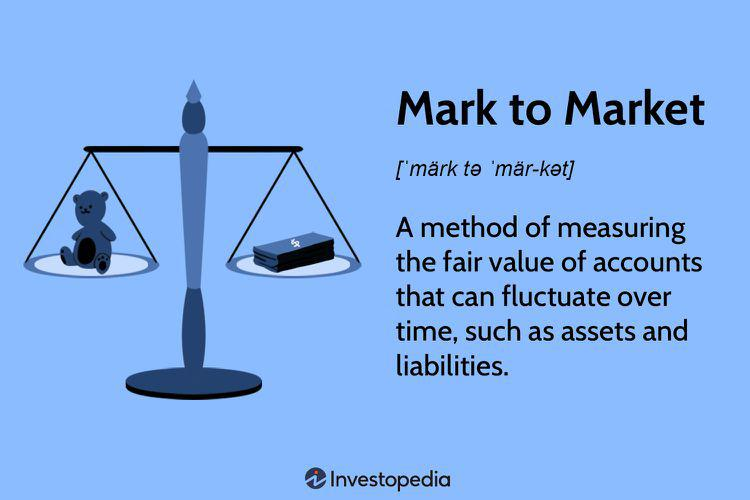

In the modern financial landscape, various accounting methods play a critical role in asset valuation, investment decisions, and financial reporting. Historical cost accounting and mark-to-market (MTM) accounting are two pivotal approaches that influence how financial data is interpreted and decisions are made. Historical cost accounting, known for its simplicity and stability over time, records assets at their original purchase price. This method offers consistency in financial reporting by avoiding the frequent fluctuations of market prices.

On the other hand, mark-to-market accounting measures assets at their current market value, presenting a real-time snapshot of financial status. This dynamic approach aligns valuations with actual market conditions, providing transparency and potentially more accurate assessments for investors and stakeholders. However, MTM accounting can introduce volatility in financial statements, especially in turbulent markets, creating challenges in financial stability.



Integration of these accounting principles with algorithmic trading highlights their impact. Algorithmic trading relies on computer algorithms to execute trades based on predefined criteria at speeds unmatched by humans. By incorporating real-time valuations through MTM accounting, algorithmic trading systems can optimize decision-making and risk management.

Understanding these accounting methods and their implications is crucial for navigating today's complex financial markets. This article explores the integration of historical cost and mark-to-market accounting in algorithmic trading, discussing their principles, advantages, challenges, and their role in shaping modern financial strategies.

## Table of Contents

## Understanding Accounting Methods

Accounting methods provide the framework for compiling, analyzing, and interpreting financial data, playing an essential role in decision-making across various finance sectors. Two primary accounting methodologies—Historical Cost and Mark-to-Market (MTM) accounting—highlight different approaches to asset valuation, each influencing financial reporting and investment strategies uniquely.

Historical Cost Accounting values assets based on their original purchase price. This method presents several advantages, chiefly its simplicity and its ability to offer a stable benchmark for financial comparisons over time. The historical cost provides a conservative estimate of an asset's value, reducing the susceptibility to market fluctuations and speculative deviations. However, this approach may lead to outdated valuations, particularly during significant market changes, as it does not consider current price levels.

In contrast, Mark-to-Market Accounting assesses an asset’s value based on its current market price. This approach aims to provide a realistic and timely snapshot of an asset’s worth, which is particularly beneficial in volatile markets where prices fluctuate significantly. By reflecting true market conditions, mark-to-market enhances the relevance and timeliness of financial statements. Nonetheless, the method introduces [volatility](/wiki/volatility-trading-strategies) into asset valuations, as it responds directly to market changes, which can lead to fluctuating earnings reports and balance sheet perceptions.

Both methods significantly influence financial reporting and asset valuation, thereby shaping strategic investment decisions and assessments of an entity's financial status. Understanding these methodologies' principles and implications is pivotal for financial analysts and investors aiming to accurately evaluate assets and align their financial strategies with regulatory standards and market conditions.

## Historical Cost vs. Mark-to-Market Accounting

Historical cost accounting and mark-to-market (MTM) accounting are two fundamental methods for asset valuation, each with distinct characteristics that influence their application in financial reporting and decision-making.

Historical cost accounting values assets based on their original purchase price, providing a consistent method for valuing assets. This approach is appreciated for its simplicity and the stability it offers over time, enabling stakeholders to trace back the financial history of an asset without the interference of market fluctuations. However, the primary drawback of historical cost accounting is that it can lead to outdated valuations, especially in dynamic market environments. Since asset prices can fluctuate due to economic changes, inflation, or advancements in technology, the historical cost may not reflect the true current value of an asset.

In contrast, mark-to-market accounting, also known as fair value accounting, measures assets at their current market value. This approach aligns asset valuations with prevailing market conditions, providing a realistic snapshot of a company's financial situation. MTM accounting is particularly relevant in volatile markets where asset prices can change rapidly. By reflecting real-time valuations, MTM allows for more informed financial reporting and decision-making. However, this same characteristic introduces a level of volatility into financial statements, as valuations can swing significantly with market trends, impacting earnings and balance sheets unpredictably.

These two accounting methods come with unique advantages and limitations. Historical cost accounting offers stability and objectivity but may result in undervaluation in appreciating markets and overvaluation in depreciating markets. Mark-to-market accounting provides transparency and relevance, aligning book values more closely with actual market prices; however, it can exacerbate earnings volatility and complicate financial analysis during unstable market periods.

Selecting between these methods depends on the financial context and the specific needs of stakeholders. Historical cost is generally preferred for assets held over long periods, where stability and straightforwardness are paramount. Conversely, MTM is favored for investment portfolios and trading activities where current valuation is crucial for strategy and risk assessment.

Understanding these differences is vital for accurate financial reporting and decision-making, ensuring that stakeholders can choose the most appropriate method based on their strategic objectives and the economic environment.

## Impacts of Mark-to-Market on Financial Stability

Mark-to-market (MTM) accounting stands as a crucial tool in financial reporting for aligning asset values with prevailing market conditions, thus enhancing transparency in financial statements. This approach diverges from historical cost accounting by valuing assets and liabilities based on their current market prices rather than their original cost. Consequently, MTM provides stakeholders with real-time insights into an organization's financial status, encompassing assets' actual worth at a specific time.

However, this approach is not without its challenges. MTM can introduce fluctuations in earnings and valuations, particularly in volatile market environments. A significant rise or fall in market prices can lead to dramatic changes in reported asset values, which in turn affect an organization’s financial statements. For instance, during periods of economic turbulence, MTM can lead to substantial write-downs of assets, impacting reported earnings unpredictably. This volatility can be illustrated with Python code to simulate asset price changes and their effects on financial statements:

```python
import numpy as np

# Simulate asset price changes
np.random.seed(42)
initial_asset_value = 1000000  # Initial value of assets
market_changes = np.random.normal(0, 0.05, 100)  # Simulate 100 random market changes
asset_values = initial_asset_value * (1 + market_changes).cumprod()

# Calculate changes in asset values
asset_value_changes = np.diff(asset_values)
print('Asset value changes:', asset_value_changes)
```

Critics of MTM argue that its reflective nature may exacerbate financial crises. During downturns, falling market prices could lead to a spiral of asset devaluation, where decreasing valuations necessitate further markdowns, creating a feedback loop that deepens the crisis. Historical examples, such as the financial crisis of 2007-2008, highlight potential pitfalls where asset-backed securities saw dramatic revaluations, contributing to wider economic instability.

Organizations must navigate these complexities by balancing the advantages of MTM's real-time insights with potential adverse outcomes. One strategy is implementing valuation buffers to manage volatility, where firms retain a conservative portion of valuations to cushion against market fluctuations. Additionally, incorporating risk management frameworks that anticipate and mitigate the impact of such volatility is essential.

In summary, while MTM accounting offers significant improvements in transparency and accuracy, its implications for financial stability cannot be overlooked. The application of this method requires careful consideration of market conditions and the potential for unintended consequences during periods of instability.

## Algorithmic Trading: Speed and Precision

Algorithmic trading employs computer algorithms to execute trading decisions based on quantitative data, significantly enhancing market efficiency. These algorithms are designed to analyze large volumes of market data swiftly, identify profitable opportunities, and execute trades at speeds unattainable for human traders. This rapid processing capability allows [algorithmic trading](/wiki/algorithmic-trading) systems to capitalize on fleeting market opportunities that may arise from price discrepancies or news events.

The integration of mark-to-market (MTM) accounting into algorithmic trading strategies ensures that trades are based on the most current asset valuations available. MTM accounting reflects an asset's current market value, allowing algorithms to adjust portfolios in real time according to prevailing market conditions. This real-time valuation aligns trading actions with market realities, providing a robust framework for maintaining realistic assessments of financial positions.

This real-time alignment of asset values and trading strategies is crucial for effective risk management. By utilizing MTM accounting, algorithmic trading systems can establish and adjust positions that accurately reflect the current market environment. This capability is particularly important for mitigating risks that arise during periods of market volatility, where rapid changes in asset prices can dramatically impact portfolio performance.

In optimizing trading strategies, algorithmic systems can continuously adjust parameters and strategies based on market data. For instance, quantitative models can use predictive analytics to anticipate market shifts and adjust trading rules accordingly. The flexible nature of these algorithms allows for continual refinement and optimization of trading strategies, thereby increasing the likelihood of sustained profitability. Automated rebalancing is one example, where quantitative algorithms adjust portfolio weights dynamically as market conditions evolve.

Overall, the combination of speed, precision, and real-time market valuation afforded by algorithmic trading represents a powerful tool for financial market participants. By leveraging the detailed market data inputs from MTM accounting, algorithmic traders gain an edge in decision-making and risk management, ultimately driving more efficient and effective trading operations.

## Integrating Accounting Methods with Algorithmic Trading

Combining mark-to-market (MTM) accounting with algorithmic trading systems ensures real-time asset valuation, allowing for more informed and precise trading decisions. This integration leverages real-time data to update asset prices based on current market conditions, providing algorithmic systems with the most accurate and relevant information for executing trades.

The accuracy and efficacy of algo trading strategies improve significantly with this integration. By constantly reflecting up-to-date asset valuations, trading algorithms can swiftly adjust to volatile market dynamics, optimizing strategies for buying or selling assets and enhancing risk management protocols. This real-time adjustment capability is crucial not just for maximizing returns but also for minimizing potential losses in the face of market fluctuations.

Looking ahead, the integration of [artificial intelligence](/wiki/ai-artificial-intelligence) (AI) and [machine learning](/wiki/machine-learning) with MTM accounting in algorithmic trading systems is a promising future trend. These advanced technologies enable the development of sophisticated trading models that can identify patterns and predict market movements with greater precision. Machine learning algorithms, for instance, can be trained on historical and real-time market data to develop predictive analytics that enhance decision-making processes.

Moreover, AI-driven systems can incorporate a wide range of market indicators and external factors, such as economic indicators or geopolitical events, improving the robustness of the trading strategy. The financial industry is beginning to harness these technologies to develop self-learning models that can adapt to new information without human intervention.

One example of this technological convergence is the use of [reinforcement learning](/wiki/reinforcement-learning), a type of machine learning where algorithms iteratively learn the best actions to take in certain situations by maximizing cumulative rewards. In a trading context, reinforcement learning could be used to optimize trading strategies based on direct feedback from market performance.

Here’s a simple Python example of how reinforcement learning might be applied to adjust a portfolio of assets in response to MTM valuation data:

```python
import numpy as np 

# Assume we have some function get_market_data() and mark_to_market()
def get_market_data():
    # Simulates fetching current market data for assets
    return np.random.rand(10)  # Random data for simplicity

def mark_to_market(assets):
    # Simulate MTM valuation adjustment
    market_data = get_market_data()
    return assets * market_data  # Adjust values by market data

# Example of reinforcement learning logic applied to portfolio adjustment
def update_portfolio(assets, learning_rate=0.01):
    # Simulate portfolio adjustment based on MTM values
    mtm_values = mark_to_market(assets)
    adjustment = learning_rate * (mtm_values - assets)
    return assets + adjustment  # Update portfolio with MTM adjustments

assets = np.array([100, 150, 200, 250, 300, 350, 400, 450, 500, 550])
for day in range(10):  # Simulate 10 trading days
    assets = update_portfolio(assets)
    print(f"Day {day+1}: {assets}")
```

This code illustrates a simplified approach where assets are regularly adjusted based on MTM data, demonstrating how AI and algorithmic mechanisms could dynamically respond to real-time market conditions.

The convergence of MTM accounting with AI and machine learning in algorithmic trading promises to revolutionize financial markets. This integration offers unprecedented accuracy and efficiency in trading decisions, paving the way for more adaptive and intelligent financial systems. As this technology continues to evolve, it is expected to reshape asset management and trading, offering new opportunities for innovation and growth in financial sectors.

## Conclusion

In modern finance, the synergy between historical cost accounting, mark-to-market (MTM) accounting, and algorithmic trading underpins strategic decision-making and resource allocation. Historical cost accounting offers stability by recording assets at their initial purchase price, which is vital for long-term strategic planning and resource allocation due to its predictable and consistent nature. However, it can sometimes fail to reflect real-time financial conditions, which is where MTM accounting becomes invaluable. MTM accounting adjusts asset values based on current market conditions, providing transparency and a realistic assessment of an organization’s financial health, crucial for responsive strategic planning and dynamic resource management.

Algorithmic trading, with its ability to process vast amounts of data rapidly and execute trades with precision, further enhances financial strategies by incorporating current valuation data obtained from MTM accounting. This integration ensures that trading strategies are based on the most accurate market conditions, optimizing market participation. As algorithmic trading evolves, incorporating advanced technologies like artificial intelligence and machine learning, the interaction with MTM accounting can significantly enhance forecasting accuracy and risk management in trading strategies.

Staying informed about these accounting methods and their role alongside advancements in algorithmic trading is essential for financial professionals aiming to retain a competitive edge. The continued development and integration of these disciplines promise to revolutionize financial trading and asset management. This convergence not only increases operational efficiency but also enhances the precision of financial strategies, ensuring that they are both current and robust in an ever-shifting market landscape. As these technologies advance, they are likely to further refine and transform financial methodologies, paving the way for a more integrated and efficient financial ecosystem.

## References & Further Reading

- Bergstra et al.'s work on 'Algorithms for Hyper-Parameter Optimization' in the Advances in Neural Information Processing Systems explores various techniques for optimizing the performance of machine learning models. It provides insights into the use of algorithms like grid search, random search, and Bayesian optimization, essential for improving the accuracy and speed of computational algorithms in financial modeling.

- 'Advances in Financial Machine Learning' by Lopez de Prado offers a comprehensive guide on applying machine learning techniques to financial datasets. The book covers topics such as feature selection, model validation, and the design of robust trading algorithms. Its focus on practical applications makes it a valuable resource for those looking to enhance algorithmic trading strategies using machine learning.

- Aronson's 'Evidence-Based Technical Analysis: Applying the Scientific Method and Statistical Inference to Trading Signals' critiques traditional technical analysis by integrating scientific methods into trading signal evaluation. By promoting a systematic approach to trading, it challenges traders to employ statistical tests and validation techniques to improve trading decisions.

- In 'Machine Learning for Algorithmic Trading,' Jansen discusses how machine learning can be utilized to develop more effective trading systems. The book includes examples and case studies, demonstrating how traders can leverage data-driven insights for making informed trading decisions. It also provides Python code snippets for easy implementation, bridging the gap between theory and practice.

- Chan's 'Quantitative Trading: How to Build Your Own Algorithmic Trading Business' is a practical guide that helps readers understand the key components of developing and running a quantitative trading business. The book covers essential topics such as market microstructure, algorithm backtesting, and risk management, with practical advice on setting up trading strategies using modern technology.

These references offer in-depth analyses and practical tools for integrating financial theories with advanced computing techniques, paving the way for innovations in trading and asset management.