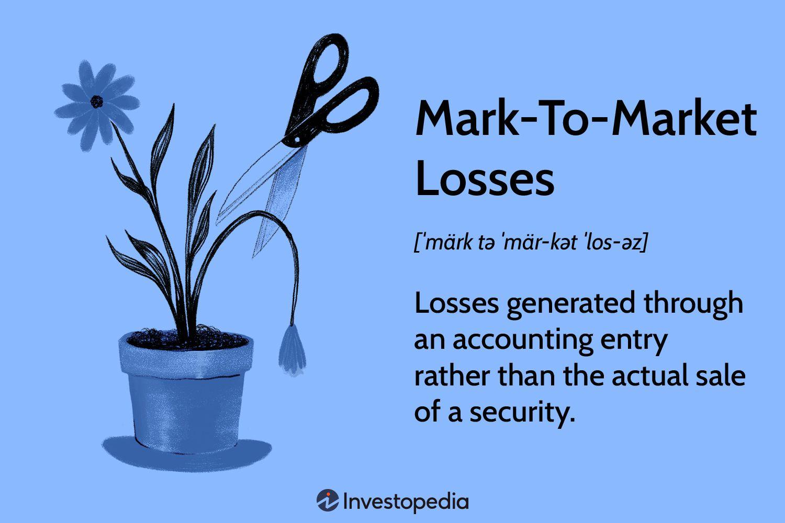

Investment losses are a fundamental aspect of financial accounting, reflecting the decrease in the value of assets or investments. These losses occur when the returns on investments are lower than their original cost, highlighting the inherent risks and uncertainties in the financial markets. Financial accounting plays a crucial role in systematically recording, analyzing, and reporting these losses to provide a transparent view of an entity's financial condition. The accurate accounting of investment losses is essential for stakeholders, including investors and regulators, to assess the financial health of companies.

One critical aspect of financial reporting is the mark-to-market accounting method, wherein assets are valued based on current market prices. This approach ensures that the financial statements reflect the true economic value of an entity's holdings. Mark-to-market losses arise when the market value of an asset falls below its purchase price, necessitating an adjustment in the financial records. Although this method offers transparency, it introduces volatility to financial statements, influencing investors' perceptions and decision-making processes. Accurately accounting for these fluctuations is vital for maintaining the integrity and reliability of financial reports.

Algorithmic trading has transformed modern financial markets, emphasizing the importance of speed and precision in transactions. This form of trading relies on advanced algorithms to execute orders at speeds beyond human capability, greatly increasing market efficiency. However, the prevalence of algorithmic trading has also amplified market volatility, affecting mark-to-market valuations and contributing to investment losses. Understanding the implications of algorithmic trading is essential for investors and financial institutions aiming to navigate the complexities of contemporary markets.

This article aims to explore how investment losses, mark-to-market accounting, and algorithmic trading intersect and impact financial stakeholders. The following sections will provide an in-depth analysis and practical insights into managing and mitigating investment losses, understanding mark-to-market dynamics, and the role of algorithmic trading in modern finance. By dissecting these interconnected elements, the article seeks to equip readers with the knowledge to make informed financial decisions and optimize investment outcomes.

## Table of Contents

## Understanding Investment Losses in Financial Accounting

Investment losses in financial accounting occur when the value of an investment falls below its purchase price or carrying value, resulting in a financial loss when the asset is sold or its value is reassessed. These losses are crucial for financial accounting as they reflect the financial health of an entity and provide transparency to investors and stakeholders about the risks and performance of investments.

### Types of Investment Losses

Investment losses can be categorized into several types, each with distinct implications for financial accounting:

1. **Realized Losses**: These occur when an asset is sold for less than its carrying amount. Realized losses are directly recognized in the financial statements and impact the entity's profitability.

2. **Unrealized Losses**: These arise when the market value of an investment declines but the asset has not yet been sold. Unrealized losses can affect the financial position of a company based on accounting policies that recognize these changes in value.

3. **Impairment Losses**: An impairment loss is recognized when an asset's carrying amount exceeds the recoverable amount, indicating that the asset's value is not expected to recover to its original level.

### Recording and Reporting Investment Losses

Investment losses are reflected in financial statements primarily through income statements and balance sheets:

- **Income Statement**: Realized losses are recorded as deductions from revenue, affecting net income. Unrealized losses may also be included if fair value accounting principles are applied.

- **Balance Sheet**: Investments are presented at their fair value or carrying amount, adjusted for any losses. Impairment and unrealized losses can reduce the asset's listed value.

### Role of Guidelines and Standards

Financial reporting standards, such as the Generally Accepted Accounting Principles (GAAP) and International Financial Reporting Standards (IFRS), govern how investment losses are identified, measured, and disclosed. These standards ensure consistency, reliability, and comparability across entities:

- **GAAP**: Under GAAP, investment losses can be recorded using historical cost, amortized cost, or fair value, depending on the nature of the investment. Impairment is recognized when declines in value are not temporary.

- **IFRS**: IFRS emphasizes fair value measurement, requiring entities to recognize impairment losses and remeasure investment values as market conditions change.

### Real-World Examples

One notable example of significant investment losses is the case of Lehman Brothers during the 2008 financial crisis. The firm's heavy investment in mortgage-backed securities—whose values deteriorated rapidly—resulted in substantial realized and unrealized losses, leading to Lehman Brothers' bankruptcy. This case underscores the importance of effective investment loss reporting and robust risk management practices.

Another example is General Electric's 2017 announcement of a $6.2 billion charge associated with insurance portfolio reevaluations. This case highlights how unrealized investment losses can culminate in substantial impairment charges impacting a company's financial statements.

In conclusion, understanding and managing investment losses are vital for maintaining transparency and trust in financial reporting. Adhering to established accounting standards ensures that investment losses are accurately recorded and disclosed, enabling informed decision-making by investors and stakeholders. The strategic importance of these practices becomes evident through historical examples that demonstrate the potential consequences of mismanagement.

## The Concept of Mark-to-Market Losses

Mark-to-market accounting, also referred to as fair value accounting, is a financial reporting method where assets and liabilities are valued and recorded at their current market prices. This approach contrasts with historical cost accounting, which values assets based on their original purchase price. The primary aim of mark-to-market accounting is to provide a more accurate and dynamic picture of a company's financial status by incorporating real-time market conditions.

Mark-to-market losses occur when the market value of an asset decreases below its purchase price or its value as previously recorded on the [books](/wiki/algo-trading-books). Such losses are recognized in financial statements and can lead to substantial fluctuations in reported earnings. For example, if a company holds a portfolio of securities and the market value of these securities declines significantly, the company must report this decrease as a loss. This recognition directly affects the income statement and shareholders' equity, often introducing increased [volatility](/wiki/volatility-trading-strategies) to financial reporting.

Market conditions and fluctuations have a profound impact on mark-to-market valuations. Economic downturns, [interest rate](/wiki/interest-rate-trading-strategies) changes, political events, and global financial crises can all lead to rapid changes in asset prices. As a result, companies may experience significant swings in asset values, affecting their reported financial health. For instance, during the 2008 financial crisis, many financial institutions reported substantial mark-to-market losses due to the plummeting values of mortgage-backed securities.

The use of mark-to-market accounting has both benefits and drawbacks from an investor's perspective. On the one hand, it offers greater transparency and allows investors to see a company's financial standing in real-time, facilitating more informed decision-making. On the other hand, the volatility associated with mark-to-market can create uncertainty, as it can exaggerate the impact of short-term market movements on long-term asset values.

Notable examples of mark-to-market losses in corporate history include the collapse of Lehman Brothers during the 2008 financial crisis. Lehman Brothers held large portfolios of mortgage-backed securities and derivatives, which significantly lost value as housing markets crashed. The resulting mark-to-market losses of these securities played a crucial role in the firm's insolvency. Another example is the energy company Enron, which manipulated mark-to-market accounting to overstate its earnings, eventually leading to its bankruptcy when the true value of its assets was revealed.

In conclusion, while mark-to-market accounting provides valuable insights into the real-time financial health of an organization, it also introduces potential volatility and risk due to market fluctuations. Investors and stakeholders must weigh the benefits of transparency and accuracy against the challenges of variability and potential manipulation when utilizing this accounting method.

## Algorithmic Trading and its Influence on Investment Losses

Algorithmic trading, also known as algo trading, involves using computer algorithms to execute financial market orders at high speeds and frequencies that are beyond the capability of human traders. It employs mathematical models and quantitative analysis to make trading decisions, often within milliseconds. This approach has revolutionized financial markets by increasing efficiency and [volume](/wiki/volume-trading-strategy), and it now accounts for a substantial portion of equity market trading worldwide.

Algorithmic trading strategies can both contribute to and mitigate investment losses. Algorithms are designed to identify short-term trading opportunities that can generate profits even in volatile or declining markets. For example, market-making strategies provide [liquidity](/wiki/liquidity-risk-premium) by continuously offering to buy and sell securities, [earning](/wiki/earning-announcement) a profit margin on the spread between bid and ask prices. On the other hand, [momentum](/wiki/momentum)-based strategies capitalize on short-term trends by buying securities that are rising and selling those that are falling. While these strategies can be profitable, they also [carry](/wiki/carry-trading) significant risks, especially in volatile markets, where algorithmic decisions are made based on rapid changes in market data, but lack the intuition that human traders might deploy.

Algorithmic trading can increase market volatility, a phenomenon evidenced during events such as the 2010 Flash Crash. During this crisis, the U.S. stock market plummeted nearly 1,000 points within minutes, largely driven by high-frequency trading algorithms. This incident highlighted how [algorithmic trading](/wiki/algorithmic-trading) can amplify market movements and distort asset pricing, consequently affecting mark-to-market valuations. Mark-to-market accounting requires assets to be valued at their current market price, and in periods of high volatility, these valuations can fluctuate significantly, impacting financial statements and potentially leading to forced asset sales at unfavorable prices.

Several significant financial events have demonstrated the impact of algorithmic trading on investment losses. The Knight Capital disaster in 2012 is a notable case, where a rogue algorithm executed a series of erroneous trades, leading to a loss of $440 million in under 45 minutes. Such events underscore the importance of robust risk management practices and the potential pitfalls of insufficient oversight or testing of algorithmic models.

Regulatory bodies have been increasingly scrutinizing algorithmic trading to mitigate its potential negative effects. In the United States, the Securities and Exchange Commission (SEC) and the Commodity Futures Trading Commission (CFTC) have established guidelines to enhance transparency and stability in the markets. These include requirements for circuit breakers that halt trading if prices move too rapidly, thus dampening the feedback loops that can lead to runaway price changes. Additionally, risk management practices such as stress testing, the implementation of kill switches, and rigorous pre-trade compliance checks are necessary to prevent unintended consequences when algorithms malfunction or encounter unforeseen market conditions.

In conclusion, while algorithmic trading offers significant advantages in terms of speed and efficiency, it also presents challenges that can lead to investment losses, particularly in volatile market environments. Effective regulatory frameworks and risk management strategies are essential to safeguard investment portfolios from the risks associated with algorithmic trading. As technology continues to evolve, traders and financial institutions must remain vigilant in their use of algorithmic strategies, ensuring that these tools are used in a manner that mitigates risks and enhances market stability.

## Managing and Mitigating Investment Losses

Effective management and mitigation of investment losses are crucial for investors seeking to protect and grow their portfolios amidst market volatility. One of the primary strategies is diversification, a technique that involves spreading investments across a range of asset classes, industries, or geographical regions. By not putting all eggs in one basket, investors can reduce the impact of a loss in any single investment on their overall portfolio. The principle behind diversification is the reduction of unsystematic risk, which is specific to individual investments or sectors.

Financial instruments and derivatives, such as options, futures, and swaps, play a pivotal role in hedging against potential losses. Options give investors the right, but not the obligation, to buy or sell an asset at a predetermined price, providing a mechanism to limit losses while participating in potential gains. Futures contracts obligate the purchase or sale of an asset at a set price on a future date, which can protect against price fluctuations. Swaps involve exchanging cash flows or other financial instruments, often used to mitigate interest rate or currency risks.

Technology and data analytics have become indispensable in predicting and managing risks, notably for investments subject to mark-to-market accounting and algorithmic trading influences. Advanced algorithms can analyze vast datasets to identify emerging risks and opportunities. Machine learning models can forecast price movements, enabling proactive adjustment of strategies to limit losses. For example, Python libraries such as pandas and scikit-learn can be utilized to process financial data and develop predictive models.

Continuous monitoring and adaptive strategies are essential in coping with the fast-changing market dynamics. Investors should regularly review their portfolios to ensure alignment with their risk profiles and investment goals. Techniques such as stop-loss orders can automatically sell securities when their prices fall to a certain level, minimizing potential losses. Adaptive strategies require an agile approach to investment management, allowing for the quick reallocation of assets in response to market changes.

In conclusion, managing investment losses requires a comprehensive approach that combines diversification, the use of financial instruments and derivatives, technology and data analytics, and adaptive strategies. By employing these methods, investors can better navigate the complexities of modern financial markets and safeguard their portfolios against potential downturns.

## Conclusion

Investment losses, mark-to-market accounting, and algorithmic trading each play significant roles in modern financial markets, and their interplay has profound implications for both investors and financial professionals. Investment losses can arise due to market fluctuations or poor investment decisions. They are an inevitable part of investing but can be managed and mitigated through strategic planning and risk management. Mark-to-market accounting introduces a level of transparency and real-time valuation to investment portfolios, which, while beneficial, can also lead to increased volatility and potential losses when market conditions shift rapidly.

Algorithmic trading, with its capability to execute high-speed and complex trading strategies, has transformed market dynamics, further influencing investment outcomes. While it offers the benefit of improved efficiency and potential gains, it can also exacerbate volatility and contribute to significant losses during market dislocations. The interconnectedness of these concepts highlights the need for investors and financial institutions to embrace proactive management and informed decision-making.

In navigating the complexities of modern financial markets, it is essential for investors to stay informed and harness technology effectively. This includes leveraging data analytics and algorithmic tools not only to optimize investment outcomes but also to develop adaptive strategies that cater to evolving market conditions. Continuous monitoring of portfolios, combined with diversification and hedging strategies, can help mitigate risks associated with both mark-to-market accounting and algorithmic trading.

To further enhance understanding and optimization of investment strategies, readers are encouraged to explore additional resources or consult financial experts for tailored advice. Engaging with knowledgeable professionals and accessing up-to-date information can empower investors to make educated decisions, ultimately leading to more resilient and successful investment portfolios.

## References & Further Reading

[1]: Barth, M. E. (2004). "Fair Values and Financial Statement Volatility." The International Journal of Accounting, 39(3), 173-204.

[2]: ["Advances in Financial Machine Learning"](https://www.amazon.com/Advances-Financial-Machine-Learning-Marcos/dp/1119482089) by Marcos Lopez de Prado

[3]: Brunnermeier, M. K. (2009). "Deciphering the Liquidity and Credit Crunch 2007-2008." Journal of Economic Perspectives, 23(1), 77-100.

[4]: ["Algorithmic Trading: Winning Strategies and Their Rationale"](https://www.wiley.com/en-us/Algorithmic+Trading%3A+Winning+Strategies+and+Their+Rationale-p-9781118460146) by Ernie Chan

[5]: Fama, E. F. (1970). "Efficient Capital Markets: A Review of Theory and Empirical Work." Journal of Finance, 25(2), 383-417.

[6]: ["The Black Swan: The Impact of the Highly Improbable"](https://www.jstor.org/stable/23045073) by Nassim Nicholas Taleb

[7]: Hull, J. C. (2018). "Options, Futures, and Other Derivatives." 10th Edition.

[8]: ["In Pursuit of the Perfect Portfolio: The Stories, Voices, and Key Insights of the Pioneers Who Shaped the Way We Invest"](https://www.jstor.org/stable/j.ctv1gm03hj) by Andrew W. Lo and Stephen R. Foerster