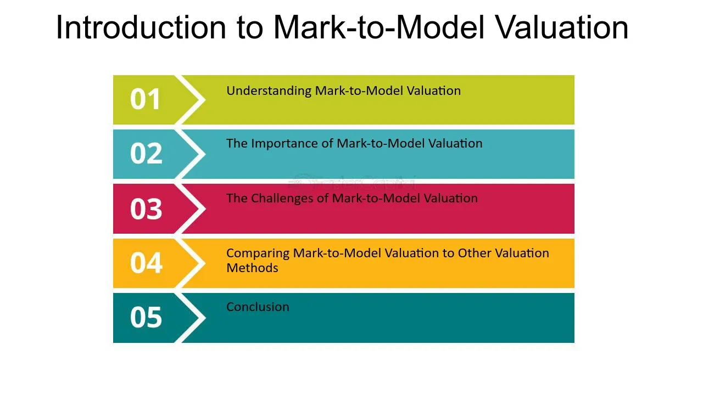

## Table of Contents

## What is mark-to-model valuation?

Mark-to-model valuation is a way to figure out how much something is worth when you can't easily sell it or there's no clear market price. Instead of looking at what similar items are selling for, you use a mathematical model. This model takes into account different factors like how much risk is involved, how long you'll hold onto the item, and other guesses about the future. It's often used for things like complex financial products where there's no easy way to know their value just by looking at recent sales.

This method can be helpful because it gives you a way to estimate value when there's no clear market data. But it also has its downsides. Since it relies on guesses and assumptions, the value you come up with might not be very accurate. If the guesses in the model are wrong, the valuation can be way off. That's why it's important to be careful and understand the risks when using mark-to-model valuation.

## How does mark-to-model valuation differ from mark-to-market valuation?

Mark-to-model valuation and mark-to-market valuation are two different ways to figure out how much something is worth. Mark-to-market valuation looks at what similar items are selling for right now in the market. If you have a stock, for example, you'd check its current price on the stock exchange. This method is straightforward because it uses real, up-to-date prices from the market.

On the other hand, mark-to-model valuation is used when you can't easily find a market price for something. Instead of looking at recent sales, you use a mathematical model to estimate the value. This model takes into account things like risk, how long you'll keep the item, and other guesses about the future. Because it relies on these assumptions, the value you get might not be as accurate as a mark-to-market valuation.

Both methods have their place, but they come with different risks. Mark-to-market is more reliable when there's a clear market, but it can be hard to use for complex or unique items. Mark-to-model gives you a way to value things when there's no market data, but it depends a lot on the guesses you put into the model. So, it's important to understand these differences and use the right method for the situation.

## In what situations is mark-to-model valuation typically used?

Mark-to-model valuation is often used when it's hard to find a clear market price for something. This can happen with complex financial products like certain types of bonds, derivatives, or mortgage-backed securities. These items might not be traded often, so there's no easy way to know what they're worth just by looking at recent sales. Instead, people use a mathematical model to guess the value based on things like how risky the item is, how long they plan to hold onto it, and other predictions about the future.

This method is also used for assets that are unique or hard to sell quickly. For example, a company might own a special piece of equipment or a building that's not like anything else on the market. Since there's no similar item being sold right now, they can't use mark-to-market valuation. Instead, they use a model to estimate the value based on what they think someone might pay for it in the future. This helps them figure out how much the asset is worth even when there's no clear market price.

## What are the key components of a financial model used in mark-to-model valuation?

A financial model used in mark-to-model valuation includes several key parts that help figure out how much something is worth. One important part is the assumptions about the future, like how much risk is involved and how long you'll hold onto the item. These guesses are really important because they affect the final value a lot. Another part is the data you use, like interest rates, how much the item might grow in value, and other numbers that go into the model. This data helps make the model more accurate, but it's still based on what you think will happen.

The model also uses math formulas to turn all these guesses and data into a final value. These formulas can be pretty complex and might include things like discount rates to figure out what future money is worth today. The model might also have different scenarios to see how the value could change if things turn out differently than expected. All these parts work together to give you an estimate of the item's value, but because it's based on guesses, the number you get might not be perfect.

## Can you explain the process of creating a model for mark-to-model valuation?

Creating a model for mark-to-model valuation starts with figuring out what you need to know about the item you're valuing. You think about things like how risky it is, how long you'll hold onto it, and what might happen in the future. These guesses are really important because they'll affect the final value a lot. Next, you gather data that you'll use in your model. This can include things like interest rates, how much the item might grow in value, and other numbers that help make your model more accurate. It's like putting together a puzzle where each piece of data helps build a clearer picture of the item's worth.

Once you have your assumptions and data, you start building the model using math formulas. These formulas help turn all your guesses and numbers into a final value. They can be pretty complex and might include things like discount rates to figure out what future money is worth today. You might also set up different scenarios to see how the value could change if things turn out differently than expected. This helps you understand the range of possible values and the risks involved. The whole process takes careful thought and planning, but in the end, you get an estimate of the item's value that you can use even when there's no clear market price.

## What are the advantages of using mark-to-model valuation?

Mark-to-model valuation is helpful when you can't easily find a price for something in the market. It lets you guess the value of things like complex financial products or unique assets that don't trade often. By using a math model, you can take into account things like risk and future predictions to come up with a value. This is really useful when there's no other way to figure out how much something is worth.

Another advantage is that mark-to-model valuation can give you a range of possible values. By setting up different scenarios in the model, you can see how the value might change if things turn out differently than expected. This helps you understand the risks better and make more informed decisions. Even though the final number might not be perfect because it's based on guesses, it still gives you a good idea of what the item might be worth.

## What are the potential risks and limitations of mark-to-model valuation?

One big risk with mark-to-model valuation is that it depends a lot on guesses and assumptions. If those guesses are wrong, the value you come up with can be way off. For example, if you think interest rates will stay the same but they go up instead, the value you calculated might not be right anymore. This makes it hard to trust the numbers, especially if the guesses are about things that are hard to predict.

Another limitation is that mark-to-model valuation can be complex and hard to understand. The math formulas used in the model can be confusing, and it's easy to make mistakes when setting up the model or entering data. This means that even if you do everything right, someone else might not agree with your valuation because they don't understand how you got to that number. Plus, because the model is based on so many guesses, it's tough to explain why the value is what it is.

Overall, while mark-to-model valuation can be useful when there's no clear market price, it comes with risks. The value you get might not be very accurate, and it can be hard to explain or defend your valuation to others. So, it's important to be careful and understand these risks when using this method.

## How do regulatory bodies view mark-to-model valuation practices?

Regulatory bodies have mixed feelings about mark-to-model valuation. They see that it can be useful when there's no clear market price for something. It helps companies figure out how much their complex financial products or unique assets are worth. But, they also worry because this method relies a lot on guesses and assumptions. If those guesses are wrong, the value can be way off, which can cause problems.

Because of these worries, regulatory bodies often set rules to make sure companies use mark-to-model valuation carefully. They might ask companies to explain how they came up with their guesses and show that their models are based on good data. They also want companies to be open about the risks and to check their models often to make sure they're still accurate. This helps make sure that the values companies come up with are as reliable as possible, even if they're not perfect.

## What are some common industries or asset types where mark-to-model valuation is applied?

Mark-to-model valuation is often used in the financial industry, especially for valuing complex financial products like derivatives, mortgage-backed securities, and certain types of bonds. These products can be hard to value because they don't trade often, so there's no clear market price. Instead, companies use a model to guess their worth based on things like risk and future predictions. This helps them figure out how much these products are worth even when there's no easy way to know.

Another area where mark-to-model valuation is common is in real estate, especially for unique properties or buildings that are not like anything else on the market. Since these properties don't have similar sales to compare to, a model is used to estimate their value based on factors like location, potential future use, and other guesses about what someone might pay for them. This method helps real estate companies and investors figure out how much these special properties are worth.

Mark-to-model valuation is also used in industries like energy and infrastructure for valuing assets like power plants or special equipment. These assets can be hard to sell quickly, and there might not be recent sales to look at. So, companies use a model to estimate their value based on things like how long they'll keep the asset, how much it might cost to maintain, and other predictions about the future. This helps them understand how much these important assets are worth.

## How can biases be minimized in mark-to-model valuation?

To minimize biases in mark-to-model valuation, it's important to use good data and be careful with the guesses you make. Start by gathering data from reliable sources and checking it often to make sure it's still accurate. When you make guesses about things like risk or future events, try to be as realistic as possible and think about different scenarios. It can also help to get input from other people who know about the item you're valuing. They might see things you missed and help you make better guesses.

Another way to reduce biases is to keep your model simple and easy to understand. Complex models can hide mistakes or biases, so try to use clear and straightforward math formulas. It's also a good idea to test your model with different sets of data to see if it gives you similar results. This can help you spot any biases and fix them. Finally, be open about how you came up with your valuation and be ready to explain it to others. This helps make sure your valuation is as fair and accurate as possible.

## What advanced techniques can enhance the accuracy of mark-to-model valuations?

One way to make mark-to-model valuations more accurate is by using something called Monte Carlo simulations. This technique runs the model many times with different guesses each time. By doing this, you can see how the value might change if things turn out differently than expected. It helps you understand the range of possible values and the risks involved. This can make your valuation more reliable because it takes into account a lot of different scenarios.

Another advanced technique is to use [machine learning](/wiki/machine-learning). This can help by finding patterns in the data that you might miss. Machine learning can look at a lot of information and learn from it to make better guesses about the future. This can make your model more accurate because it's based on more data and smarter predictions. Both Monte Carlo simulations and machine learning can help make your mark-to-model valuations better, but they need careful use and understanding to work well.

## How do you validate and back-test a mark-to-model valuation approach?

To validate and back-test a mark-to-model valuation approach, you start by comparing the model's results with real-world outcomes. You look at past data to see how well the model would have predicted values if you had used it back then. This helps you see if the model's guesses and assumptions were good or if they need to be changed. By checking the model against what actually happened, you can find out where it might be wrong and fix those parts to make it more accurate.

Back-testing also involves running the model with different sets of data to see if it gives you similar results. This is important because it shows if the model is reliable or if it's too sensitive to small changes in the data. If the model gives you very different values each time you change the data a little, it might be too biased or not well-built. By testing the model in different ways, you can make sure it's as accurate and trustworthy as possible for future valuations.

## What is Understanding Financial Modeling?

Financial modeling is the structured process of creating a detailed synthesis of a financial entity's operations, encompassing various scenarios and potential outcomes. It is an essential tool employed to anticipate the impact of future events and decisions on a company's portfolio, risk profile, and overall financial health.

Models are devised by analyzing historical data, financial statements, market trends, and other relevant data sets, allowing analysts to simulate different scenarios and assess their implications. These models often utilize equations representing relationships between variables, such as revenue, expenses, capital expenditures, and financing activities. For instance, a basic revenue model may express revenue as a function of unit price and quantity sold:

$$
\text{Revenue} = \text{Price} \times \text{Quantity}
$$

Advanced financial models incorporate a plethora of variables and assumptions to offer a more comprehensive analysis of potential financial outcomes. This often involves elements like [interest rate](/wiki/interest-rate-trading-strategies) changes, market volatilities, currency fluctuations, and economic indicators, which can significantly affect an organization's financial situation.

The true value of financial modeling lies in its ability to facilitate informed investment decisions and strategic planning. By examining various potential outcomes and stress-testing financial assumptions, organizations can better prepare for uncertainties and craft strategies that optimize performance and growth.

Accuracy in financial modeling is paramount because flawed assumptions or errors can precipitate severe financial missteps. A conservative approach, thorough validation, regular updates, and scenario analysis are vital to maintaining the integrity of financial models. Moreover, the assumptions underpinning these models should be well-documented and transparent, allowing for continual reassessment and refinement.

In summary, financial modeling serves as a cornerstone of financial analysis, enabling stakeholders to navigate complex financial landscapes, assess risks, and identify opportunities. The reliability and effectiveness of these models are contingent upon rigorous construction, accurate input data, and adaptable frameworks that reflect changing market conditions.

## References & Further Reading

[1]: Mueller, J. & Massaron, L. (2020). ["Machine Learning For Dummies."](https://books.google.com/books/about/Machine_Learning_For_Dummies.html?id=JLEyDAAAQBAJ) Wiley.

[2]: Lopez de Prado, M. (2018). ["Advances in Financial Machine Learning."](https://www.amazon.com/Advances-Financial-Machine-Learning-Marcos/dp/1119482089) Wiley.

[3]: Chan, E. P. (2009). ["Quantitative Trading: How to Build Your Own Algorithmic Trading Business."](https://github.com/ftvision/quant_trading_echan_book) John Wiley & Sons.

[4]: Hull, J. C. (2018). ["Options, Futures, and Other Derivatives."](https://www.semanticscholar.org/paper/Options%2C-Futures%2C-and-Other-Derivatives-Hull/89bdee500c8623864fc9eb7a471546aa713acc44) Pearson.

[5]: Scotto di Porfirio, S., Lecamwasam, S., & Giacomo, M. (2019). ["Algorithmic and High-Frequency Trading."](https://pubmed.ncbi.nlm.nih.gov/31140882/) Cambridge University Press.