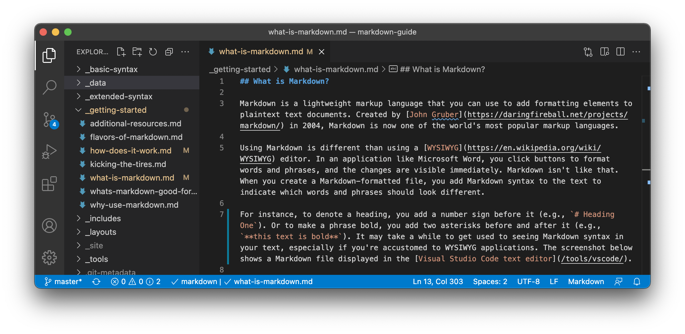

## Table of Contents

## What is Markdown and why was it created?

Markdown is a simple way to format text on the internet. It was created by John Gruber and Aaron Swartz in 2004. With Markdown, you can make your text look nice without needing to know complicated coding. You use special symbols like asterisks and hashtags to make things bold, create lists, or add headings.

Markdown was created because people wanted an easier way to write for the web. Before Markdown, writing for the internet often meant using HTML, which can be hard to learn and use. John Gruber wanted to make writing simpler, so he came up with Markdown. It's now used on many websites and apps, like GitHub and Reddit, because it's easy and works well.

## How do you format text using Markdown?

Markdown uses simple symbols to format text. For example, if you want to make a word bold, you put two asterisks before and after the word, like **this**. To make a word italic, you use one asterisk or an underscore, like *this* or _this_. If you want to make a heading, you use hashtags. One hashtag makes a big heading, like # Heading 1, and two hashtags make a smaller heading, like ## Heading 2.

You can also create lists and links with Markdown. To make a list, you start each item with a dash or a number followed by a period. For example, - Item 1 or 1. Item 1. To add a link, you put the text you want to show in square brackets, followed by the URL in parentheses, like [Google](https://www.google.com). This makes it easy to write and read on the web without needing to know a lot about coding.

## What are the basic syntax elements in Markdown?

Markdown has several basic elements that help you format text easily. To make text bold, you use two asterisks before and after the text, like **this**. For italic text, you use one asterisk or an underscore, like *this* or _this_. Headings are created with hashtags; one hashtag for the biggest heading, like # Heading 1, and more hashtags for smaller headings, like ## Heading 2. You can also use a single backtick for inline code, like `code`, and triple backticks for code blocks, like ```code block```.

Lists are another important element in Markdown. To make a bulleted list, you start each item with a dash or an asterisk, like - Item 1. For numbered lists, you use numbers followed by a period, like 1. Item 1. Links are created by putting the link text in square brackets followed by the URL in parentheses, like [Google](https://www.google.com). You can also add images by using an exclamation mark, followed by alt text in square brackets and the image URL in parentheses, like . These simple symbols make it easy to format text for the web.

## How can Markdown be used for creating lists and tables?

To create lists in Markdown, you use simple symbols. For a bulleted list, start each item with a dash or an asterisk. For a numbered list, start each item with a number followed by a period. This makes it easy to organize information into lists that are easy to read. You can also use indentation to create sub-items within your list, making your lists more detailed and structured.

For tables, Markdown uses vertical bars and hyphens. Start a table with a row of headers separated by vertical bars. Underneath the headers, use a row of hyphens to separate the headers from the content. Then, add your data rows below, again using vertical bars to separate the columns. This lets you create neat, organized tables without needing to know complex coding.

## What are the differences between Markdown and HTML?

Markdown and HTML are both ways to format text on the web, but they work differently. Markdown is a simpler way to write. It uses easy symbols like asterisks and hashtags to make text bold, italic, or to create headings. This makes it quick and easy to use, especially for people who don't know much about coding. Markdown was created to make writing for the web easier and more readable. It's often used on websites like GitHub and Reddit for comments, documentation, and other text.

HTML, on the other hand, is a more complex language used to build web pages. It uses tags to format text and create the structure of a page. HTML can do more than Markdown, like adding images, forms, and different styles of text. But it's harder to learn and use because it requires more knowledge of coding. While Markdown can be converted to HTML, HTML cannot be easily converted to Markdown because it's more detailed and complex. So, Markdown is great for simple formatting, while HTML is better for building complete web pages.

## How do you include images and links in Markdown documents?

To add an image in a Markdown document, you use an exclamation mark followed by the alt text in square brackets, and then the image URL or file path in parentheses. For example, if you want to add a picture of a cat, you would write ``. The alt text helps people who can't see the image understand what it is. You can also add a title to the image by putting it in quotes after the URL, like ``.

To include a link in Markdown, you put the text you want to show in square brackets, followed by the URL in parentheses. For example, if you want to link to Google, you would write `[Google](https://www.google.com)`. This makes the word "Google" clickable, taking you to the Google website when clicked. You can also add a title to the link by putting it in quotes after the URL, like `[Google](https://www.google.com "Search engine")`.

## What are some common Markdown extensions and their uses?

Markdown extensions add more features to the basic Markdown language. Some common extensions include tables, which let you make organized rows and columns. Footnotes let you add extra notes at the bottom of the page. And syntax highlighting helps show code in different colors, making it easier to read. These extensions make Markdown more useful for writing long documents, technical guides, and other detailed content.

Another useful extension is task lists, which let you make checklists with boxes you can tick off. This is great for to-do lists and project management. There are also extensions for adding emojis and special characters, which can make your text more fun and interesting. By using these extensions, you can do more with Markdown and make your documents better and more helpful.

## How can Markdown be integrated into various platforms and tools?

Markdown can be easily added to many different platforms and tools. It works well with websites like GitHub, where you can write and share code and documents. GitHub uses Markdown for README files, comments, and other places where people need to write text. This makes it simple for everyone to format their writing without needing to learn a lot about coding. Many blogging platforms, like WordPress and Ghost, also support Markdown. This means you can write your blog posts using Markdown's easy symbols instead of more complex HTML.

Other tools like note-taking apps, such as Evernote and Notion, let you use Markdown to make your notes look neat. In these apps, you can write your notes with Markdown's simple formatting and they will look good right away. Even some email apps and messaging platforms, like Slack, let you use Markdown to make your messages stand out. By adding Markdown to these platforms and tools, it becomes easier for people to write and share information in a clear and organized way.

## What are the best practices for writing clean and readable Markdown?

When writing in Markdown, keep things simple and clear. Use headings to break up your text and make it easier to read. Stick to one or two levels of headings, like # for main headings and ## for subheadings. This helps people see the structure of your document. Also, leave blank lines between paragraphs and sections to make your text look neat. Try not to use too many different styles, like bold and italics, all at once. This can make your text hard to read. Stick to one style at a time to keep things clear.

Another good practice is to keep your lines short, around 80 characters. This makes your text easier to read on different screens and devices. Use spaces to indent your lists and code blocks, not tabs, because spaces work better across different platforms. When adding links and images, make sure your alt text is clear and helpful. This helps people who can't see the images understand what they are about. By following these simple tips, your Markdown documents will be clean, readable, and easy for everyone to understand.

## How do you handle complex document structures in Markdown?

To handle complex document structures in Markdown, you can use headings to break your document into clear sections. Start with a main heading using one hashtag, like # Introduction, and use subheadings with two or more hashtags, like ## Background and ### Details, to organize your content into smaller parts. This helps readers understand the flow of your document and find information easily. You can also use horizontal lines, made with three or more dashes (---), to separate major sections and make the structure even clearer.

For even more complex structures, you can use Markdown extensions like tables and footnotes. Tables help you organize data neatly, which is useful for reports or technical documents. Footnotes let you add extra information without cluttering the main text, keeping your document clean and focused. By combining these elements, you can create detailed and well-organized documents that are still easy to read and understand.

## What are the limitations of Markdown and how can they be overcome?

Markdown is great for simple writing, but it has some limits. One big limit is that it can't do all the fancy things HTML can do. For example, Markdown can't easily make forms or add special effects to your text. Also, different places might use Markdown a bit differently, so what works in one place might not work in another. This can be confusing if you're writing for different websites or apps.

To get around these limits, you can use Markdown extensions. These add more features, like tables and footnotes, that help with more complex writing. If you need to do more than what Markdown can do, you can also mix in some HTML. Markdown lets you use HTML tags when you need them, so you can add things like forms or special styles without leaving Markdown completely. This way, you can still use Markdown's simple way of writing while also getting the extra power of HTML when you need it.

## How can Markdown be used in professional and collaborative environments?

Markdown is really helpful in professional and team settings because it's easy to use and works well with many tools. People in teams can use Markdown to write clear notes, reports, and project plans. It's great for sharing ideas and keeping everyone on the same page. For example, on platforms like GitHub, teams can use Markdown to write and update project documentation together. This makes it simple for everyone to add their thoughts and see changes as they happen.

Markdown also helps with working together because it's easy to read and write. You don't need to know a lot about coding to use it, so everyone on the team can join in. It's used in tools like Slack for quick messages and in apps like Notion for organizing work. By using Markdown, teams can keep their work neat and easy to understand, which helps them work better together and get more done.

## References & Further Reading

[1]: ["Markdown: Syntax"](https://www.markdownguide.org/basic-syntax/) by John Gruber

[2]: ["Advances in Financial Machine Learning"](https://www.amazon.com/Advances-Financial-Machine-Learning-Marcos/dp/1119482089) by Marcos Lopez de Prado

[3]: ["Quantitative Trading: How to Build Your Own Algorithmic Trading Business"](https://www.amazon.com/Quantitative-Trading-Build-Algorithmic-Business/dp/1119800064) by Ernest P. Chan

[4]: ["Version Control with Git: Powerful tools and techniques for collaborative software development"](https://www.amazon.com/Version-Control-Git-collaborative-development/dp/1449316387) by Jon Loeliger and Matthew McCullough

[5]: Swartz, A., & Gruber, J. (2004). ["Markdown: The science of easy writing"](http://www.aaronsw.com/weblog/001189)

[6]: Vaswani, A., et al. (2017). ["Attention is All You Need"](https://arxiv.org/abs/1706.03762) arXiv:1706.03762