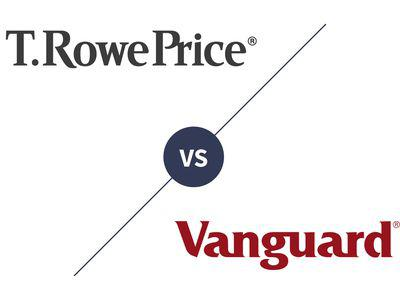

In the world of algorithmic trading, effective documentation is essential for success. With the complexity inherent in trading algorithms and the need for precise execution, maintaining clear and structured documentation becomes vital. It not only aids in understanding and reproducing trading strategies but also facilitates communication among team members and supports strategic decision-making.

Markdown, a lightweight markup language, offers an ideal solution for creating well-formatted documentation. Its simplicity and flexibility make it a favored choice among developers and traders alike. Originating from the need to produce easily readable and writable documents, Markdown provides a powerful way to structure content without the complexity of full-fledged documentation languages. It supports various formatting features such as headers, lists, emphasis, links, and code blocks, making it suitable for documenting intricate trading algorithms and strategies.



This article explores how Markdown can intersect with algorithmic trading documentation to enhance its readability and functionality. By leveraging Markdown, traders and developers can create documentation that is both comprehensive and accessible, ensuring that all elements of their trading operations are well captured and easily understandable. We will touch upon best practices in documenting trading workflows and the tools that can be employed to streamline the documentation process. Through these insights, algorithmic trading professionals can harness the full potential of Markdown to maintain high-quality documentation, leading to better communication, collaboration, and strategy execution. Readers are encouraged to explore these practices and integrate Markdown into their documentation processes for improved clarity and efficiency.

## Table of Contents

## Understanding Markdown

Markdown is a lightweight and easy-to-use syntax created in 2004 by John Gruber, with substantial contributions from Aaron Swartz. Its primary goal is to offer a straightforward method for writing and formatting text, making it both simple to read in its raw form and capable of being transformed into richly formatted documents.

One of the core principles of Markdown is its simplicity, which is evident in its syntax. The language uses plain text, allowing users to incorporate formatting using easy-to-remember symbols. Here are some key features of Markdown:

1. **Headers**: Headers are defined with the use of hash symbols (`#`). For instance, a single `#` denotes a top-level header, while increasing the number of hash symbols (`##`, `###`, etc.) creates lower-level headers. This hierarchy is crucial for structuring documents clearly.

2. **Lists**: Markdown offers both ordered and unordered lists. Unordered lists use asterisks (`*`), plus signs (`+`), or hyphens (`-`), while ordered lists are created simply by numbering followed by a period.

3. **Emphasis**: Text emphasis can be achieved using asterisks or underscores. A single asterisk or underscore creates italic text (`*italic*` or `_italic_`), while double symbols make the text bold (`**bold**` or `__bold__`).

4. **Links**: Creating hyperlinks in Markdown is straightforward. The syntax involves placing the link text in square brackets followed by the URL in parentheses, for example, `[example](https://example.com)`.

5. **Code Blocks**: For displaying code, inline code can be denoted with backticks (`). For larger code blocks, triple backticks (\```) or indentation are used to encapsulate the code, supporting syntax highlighting in many cases.

Markdown’s adoption has become widespread, particularly in technical environments, because it efficiently bridges the gap between plain text files and more complex document formats. It is compatible with numerous tools and platforms, including GitHub, Jupyter Notebooks, and many content management systems, enabling seamless integration into different workflows and collaborative environments.

By offering a method to present documentation that is both human-readable and easily convertible into HTML and other formats, Markdown has secured a vital role in technical documentation processes. Understanding and utilizing Markdown can greatly enhance the readability and management of documents, especially in areas requiring detailed technical communication such as [algorithmic trading](/wiki/algorithmic-trading), software development, and data science.

## Importance of Documentation in Algo Trading

Algorithmic trading involves the use of automated systems that execute trading orders based on predefined criteria and strategies. Given the complexity of these systems, thorough documentation is indispensable for ensuring clarity and serving as a reference for users. Documentation in algorithmic trading serves multiple critical functions.

Firstly, proper documentation enhances collaboration among team members. This includes coders, quantitative analysts, and traders who must work in unison to develop, maintain, and optimize trading algorithms. By meticulously documenting each component of the trading strategy, team members can better understand the workflow, logic, and methodology employed. For example, documenting the assumptions underlying a trading model allows team members to quickly assess its applicability to different market conditions.

Secondly, comprehensive documentation plays a pivotal role in onboarding new team members. A well-documented trading system can significantly shorten the learning curve for newcomers, enabling them to contribute more effectively from the outset. Detailed records of past strategies, decisions, and even mistakes can provide valuable learning material for new hires, offering them context and insight into the trading operation’s evolution.

Moreover, maintaining and scaling trading algorithms efficiently requires robust documentation. As trading strategies grow more complex, the need for detailed documentation becomes apparent. For example, understanding the intricacies of a Python-based trading strategy and its modules can be simplified by using structured documentation. Consider the following Python snippet that logs the configuration of a trading strategy:

```python
def log_strategy_config(config):
    """
    Logs the current trading strategy configuration for future reference.

    Args:
    config (dict): A dictionary containing strategy parameters and settings.

    Returns:
    None
    """
    with open('strategy_log.txt', 'a') as log_file:
        log_file.write(f"Strategy Config: {config}\n")
```

This function can be documented to assist team members in quickly understanding how the strategy configuration is stored and manipulated. By outlining which parameters influence trading decisions, team members can seamlessly modify and adapt the strategy for new market conditions.

Optimizing the workflow of algo trading teams hinges upon effective documentation practices. Challenges such as keeping documentation up-to-date and ensuring it accurately reflects algorithm modifications must be addressed. Employing solutions such as version control systems (e.g., Git) helps manage changes to both code and documentation. Version control allows teams to track the evolution of both their trading algorithms and accompanying documentation, ensuring consistency and reliability.

In conclusion, the importance of documentation in algorithmic trading cannot be overstated. Thoughtful documentation not only facilitates collaboration and onboarding but also supports the maintenance and scalability of trading algorithms. By overcoming documentation challenges through strategic solutions, trading teams can maximize efficiency and agility in dynamic market environments.

## Markdown in Algo Trading Documentation

Markdown provides a structured format that is easy to follow and understand, which is crucial when documenting complex trading strategies in algorithmic trading. By using Markdown, traders and developers can create clear and structured documentation for trading logic, strategy explanations, and code snippets. This capability is supported by Markdown’s syntax, which allows for headers, lists, code blocks, and more. 

Headers in Markdown enable the organization of documentation into a hierarchical structure, making it easier to navigate through different sections. For instance, a typical strategy document can begin with an overview, include sections on data sources, algorithmic logic, and finally detail [backtesting](/wiki/backtesting) results. Lists and bullet points can succinctly present steps in a strategy execution or enumerate various parameters and settings, enhancing clarity.

Markdown also supports embedding code snippets directly within the text, which is particularly useful for capturing trading logic. This is achieved through the use of backticks to denote inline code or triple backticks (```) for larger code blocks. Here is an example Python snippet that might be included to demonstrate simple trading logic:

```python
def moving_average_strategy(data, short_window, long_window):
    data['short_mavg'] = data['close'].rolling(window=short_window).mean()
    data['long_mavg'] = data['close'].rolling(window=long_window).mean()

    # Generate trading signals: 1 for buy, -1 for sell
    data['signal'] = 0
    data['signal'][short_window:] = np.where(data['short_mavg'][short_window:] 
                                             > data['long_mavg'][short_window:], 1, -1)
    return data
```

Tables in Markdown are used for organizing and presenting trading results or parameter settings in a clear, tabular format. Moreover, images and plots can be inserted using links, which help in visualizing trading data and results effectively. For example, backtesting results over different time frames can be documented in a tabular format, allowing for quick comparison and analysis.

The organization and management of Markdown files in algorithmic trading projects is another essential practice. Version control systems, like Git, are often used to manage these documents alongside code. This integration ensures documentation stays up-to-date with code changes, maintaining consistency across teams. An effective practice is to maintain a README.md file at the root of trading strategy repositories, which provides an overview and links to more detailed documentation files.

In terms of best practices, maintaining a consistent style guide for Markdown usage within teams is beneficial. This includes conventions for file naming, document structure, and the use of Markdown features. Naming conventions could include prefixes that denote the type of document, such as 'STRAT_' for strategies or 'DATA_' for data source descriptions, improving file discoverability.

In summary, Markdown proves to be a valuable tool in documenting algorithmic trading systems due to its simplicity, readability, and compatibility with development tools. By leveraging its features, traders and developers can produce structured, clear, and maintainable documentation, which is vital for the successful execution and evolution of trading strategies.

## Tools and Platforms for Markdown Documentation

Several tools and platforms support Markdown, making it convenient for algorithmic traders to create and manage documentation efficiently. These tools are essential for ensuring that documentation is easily accessible, well-organized, and integrated with existing trading systems and workflows.

### Jupyter Notebooks
Jupyter Notebooks are widely used in the algorithmic trading community due to their ability to combine Markdown with executable code. This allows traders to document their strategies while simultaneously conducting exploratory data analysis and backtesting. The integration of Python code with Markdown makes it easier to create interactive reports that include data visualizations and real-time calculations. The notebooks can be exported to various formats, such as HTML and PDF, providing flexibility in sharing documentation.

### ReadTheDocs
ReadTheDocs offers a robust platform for hosting and automatically generating documentation from Markdown files. Its integration with version control systems like GitHub ensures that documentation is always up-to-date with the latest code changes. Traders can benefit from ReadTheDocs' search functionality, making it easier to find specific sections within extensive documentation. The platform also supports versioning, which is crucial for maintaining historical records of trading strategies and changes over time.

### GitHub
GitHub is not only a repository for code but also allows for comprehensive documentation management via Markdown. The platform's built-in Markdown rendering capabilities enable traders to include README files, strategy explanations, and code snippets directly within their repositories. GitHub's collaborative features, such as pull requests and issue tracking, facilitate effective team communication and documentation review processes.

### MkDocs
MkDocs is a static site generator that is specifically designed for project documentation. It takes Markdown files and renders them into a static website, which can be hosted on various platforms, including GitHub Pages. MkDocs supports a range of themes and plugins that enhance the visual presentation of documentation. Its configuration files, written in YAML, allow for easy customization to fit specific project needs.

### Integration and Version Control
The integration of these tools with trading platforms and version control systems is paramount for seamless workflow. Jupyter Notebooks can integrate with platforms like QuantConnect or Quantopian for real-time data processing and backtesting. GitHub’s Continuous Integration (CI) tools can be used to automate documentation updates whenever there are changes in the codebase, ensuring that the documentation remains consistent with the trading algorithms.

### Benefits and Limitations
Each tool has its strengths and weaknesses. Jupyter Notebooks offer interactivity, but may not be ideal for long-form documentation. ReadTheDocs excels in automation and searchability, though it may require an understanding of Sphinx and reStructuredText for advanced features. GitHub provides collaborative features but may necessitate additional permissions for managing private repositories. MkDocs delivers aesthetic and structural control but requires setup and hosting considerations.

### Selecting the Right Toolset
Choosing the right set of tools depends on the specific needs of the algo trading team. Teams focused on collaborative development may prioritize GitHub’s integration capabilities. Those requiring interactive analyses may find Jupyter Notebooks most beneficial. For comprehensive and easily navigable documentation, ReadTheDocs or MkDocs might be the best choices. Ultimately, the decision should be based on the team's workflow, the complexity of the documentation, and the level of integration required with other systems.

## Advanced Markdown Techniques for Algo Trading

Advanced Markdown techniques offer a significant advantage in documenting algorithmic trading systems by improving the readability and interactivity of content. Markdown extensions and plugins can be employed to incorporate task lists, footnotes, and mathematical formulas, thereby enhancing the functionality of documentation. For instance, task lists can assist in tracking development tasks or highlighting pending items in a trading strategy rollout, while footnotes serve as a powerful tool for adding supplementary explanations or references without disrupting the document's flow.

Mathematical notations are fundamental to algorithmic trading, often requiring support for complex equations. With plugins like MathJax, Markdown can render LaTeX equations, allowing for clear documentation of mathematical models. An example of a simple LaTeX formula for compound interest, $A = P(1 + \frac{r}{n})^{nt}$, can be seamlessly integrated into Markdown for traders to easily interpret financial computations.

Interactive elements substantially elevate the user experience by allowing dynamic content within static documentation. Using libraries such as Plotly, one can embed interactive charts that visualize trading data patterns or backtesting results. For example, a Markdown file can include a Plotly chart to show the performance of a trading strategy across different periods, enabling team members to interact with data points directly within the document.

Customization of Markdown styling is crucial to maintaining consistency with organizational standards. By using custom CSS styles or Markdown themes, traders can align the documentation appearance with their brand image, ensuring that documentation meets corporate aesthetic guidelines. This can involve customizing header styles, modifying font properties, or embedding company logos across documents.

To illustrate successful deployment of these techniques, consider a case study of a trading firm that integrated advanced Markdown in their workflow. By employing Jupyter Notebooks, they could document Python code, visualize results interactively with Plotly charts, and explain calculations using embedded LaTeX equations. This approach not only centralized the documentation of trading strategies but also fostered collaborative code reviews and strategy evaluations.

These advanced Markdown techniques, supported by proper tooling, can significantly enhance the quality and usability of algorithmic trading documentation, providing a robust framework that supports both technical and non-technical stakeholders in understanding and managing trading systems effectively.

## Conclusion

Effective documentation is a pivotal element in ensuring success within algorithmic trading operations. In this context, Markdown stands out as a versatile and powerful tool that simplifies and enhances the production and upkeep of trading documentation. The adoption of Markdown in assembling clear, structured, and accessible documents can significantly bolster communication across team members, thus fostering improved collaboration. As a result, this leads to more efficient strategy development and execution.

Markdown's lightweight syntax and ability to integrate seamlessly with various platforms provide a robust framework for traders and developers to document complex strategies and trading algorithms. By embracing the practices outlined in previous sections, algorithmic trading professionals can establish a comprehensive documentation system that not only preserves institutional knowledge but also aids in the onboarding of new team members and the scaling of trading operations.

As the rapid pace of technological advancements continuously reshapes financial markets, maintaining up-to-date and precise documentation becomes increasingly critical. Markdown offers a methodical approach to meet these evolving needs. Therefore, readers are encouraged to integrate Markdown into their documentation workflows, harnessing its potential to enhance clarity and efficiency in their algorithmic trading practices.

## References & Further Reading

[1]: ["Markdown: Syntax"](https://www.markdownguide.org/basic-syntax/) by John Gruber

[2]: ["Advances in Financial Machine Learning"](https://www.amazon.com/Advances-Financial-Machine-Learning-Marcos/dp/1119482089) by Marcos Lopez de Prado

[3]: ["Quantitative Trading: How to Build Your Own Algorithmic Trading Business"](https://www.amazon.com/Quantitative-Trading-Build-Algorithmic-Business/dp/1119800064) by Ernest P. Chan

[4]: ["Version Control with Git: Powerful tools and techniques for collaborative software development"](https://www.amazon.com/Version-Control-Git-collaborative-development/dp/1449316387) by Jon Loeliger and Matthew McCullough

[5]: Swartz, A., & Gruber, J. (2004). ["Markdown: The science of easy writing"](http://www.aaronsw.com/weblog/001189)

[6]: Vaswani, A., et al. (2017). ["Attention is All You Need"](https://arxiv.org/abs/1706.03762) arXiv:1706.03762