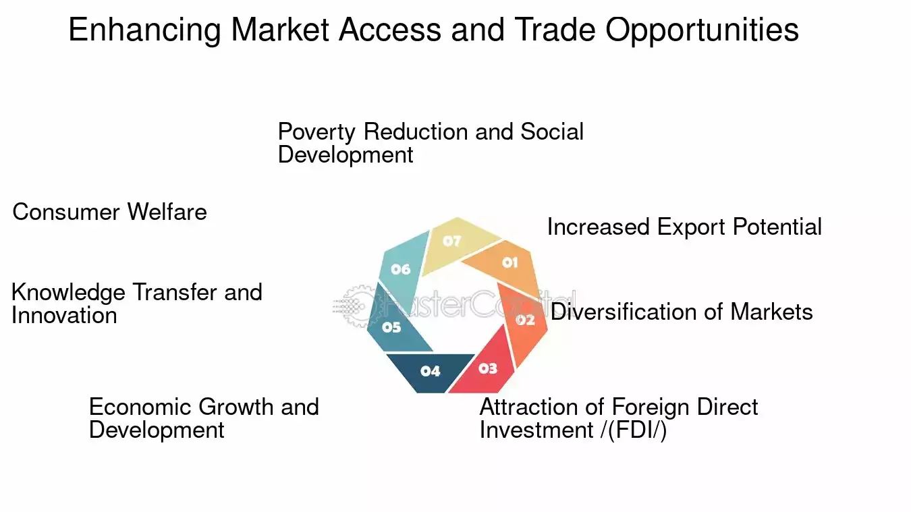

## Table of Contents

## What is market access in the context of international trade?

Market access in international trade means how easy it is for a country to sell its goods and services in another country. It involves removing or lowering trade barriers like tariffs, which are taxes on imports, and non-tariff barriers, which are rules and regulations that can make it hard to sell products in another country. Good market access helps countries trade more freely and can lead to more economic growth and jobs.

Countries often negotiate market access through trade agreements. These agreements can be between two countries or among many countries. They aim to make trade easier by setting rules that everyone follows. For example, countries might agree to lower tariffs on certain products or to accept each other's safety standards. This helps businesses know what to expect when they want to sell their products in foreign markets.

## Why is market access important for businesses expanding internationally?

Market access is really important for businesses that want to grow and sell their products in other countries. When a business can easily sell its products abroad, it can reach more customers and make more money. Without good market access, businesses might face high taxes or strict rules that make it hard to sell their products in other countries. This can stop them from growing and competing with other companies that have better access to those markets.

Having good market access also helps businesses save money. If there are fewer taxes and easier rules, it costs less to sell products in other countries. This means businesses can offer their products at lower prices or make more profit. It also makes it easier for businesses to plan and know what to expect when they enter new markets. Overall, good market access helps businesses grow, compete, and succeed internationally.

## What are the common barriers to market access in international trade?

Common barriers to market access in international trade include tariffs and non-tariff barriers. Tariffs are taxes that countries put on imported goods. These taxes make the products more expensive, which can make it hard for businesses to sell their products in other countries. For example, if a country puts a high tariff on cars, it might be too expensive for a car company to sell their cars there.

Non-tariff barriers are also a big problem. These include things like quotas, which limit how much of a product can be imported, and strict rules about product safety or quality. Sometimes, countries have different standards for things like food safety or environmental protection, and it can be hard for businesses to meet all these different rules. Other non-tariff barriers include complicated customs procedures and licensing requirements, which can slow down the process of getting products into a new market.

These barriers can make it tough for businesses to expand internationally. They raise costs and create uncertainty, which can discourage companies from trying to sell their products in other countries. Overcoming these barriers often requires negotiations between countries to lower tariffs and harmonize standards, making it easier for businesses to access new markets.

## How do tariffs affect market access for exporters?

Tariffs are like taxes that countries put on goods coming from other places. When a country has high tariffs, it makes things more expensive for exporters who want to sell their products there. For example, if a country puts a big tariff on shoes, then a shoe company from another country will have to charge more for their shoes to make up for the extra cost. This can make it hard for the shoe company to compete with local shoe makers who don't have to pay the tariff.

High tariffs can also make exporters think twice about selling in that country. If the tariffs are too high, it might not be worth it for the exporter to try to sell there because they won't make enough money. This means that exporters might choose to focus on other countries with lower tariffs instead. So, tariffs can limit where exporters can sell their products and make it harder for them to grow their business in new markets.

## What role do trade agreements play in improving market access?

Trade agreements are like deals between countries that help businesses sell their products more easily in other countries. These agreements can lower or get rid of tariffs, which are taxes on imports. When tariffs are lower, it's cheaper for businesses to sell their products abroad. This means they can offer their products at better prices and reach more customers. Trade agreements also help set common rules and standards, so businesses know what they need to do to sell in other countries. This makes it easier for businesses to plan and grow their business in new markets.

Trade agreements can also help with non-tariff barriers, like strict rules about product safety or quality. By working together, countries can agree on common standards that make it easier for businesses to sell their products in many different places without having to meet a lot of different rules. This can save businesses time and money. Overall, trade agreements play a big role in making it easier for businesses to sell their products around the world, which helps them grow and create more jobs.

## How can non-tariff barriers impact market access?

Non-tariff barriers can make it hard for businesses to sell their products in other countries. These barriers include things like quotas, which limit how much of a product can be imported, and strict rules about product safety or quality. For example, if a country has very strict rules about what can be in food, it might be hard for a food company from another country to sell there. They might need to change their products or go through a lot of testing, which can be expensive and take a long time.

These barriers also include complicated customs procedures and licensing requirements. When businesses have to deal with a lot of paperwork and long waits at the border, it can slow down their ability to sell products in new markets. This can make it harder for businesses to plan and can discourage them from trying to expand internationally. Overall, non-tariff barriers can raise costs and create uncertainty, making it tougher for businesses to access new markets and grow their business.

## What strategies can businesses use to overcome market access challenges?

Businesses can overcome market access challenges by first understanding the specific barriers they face in each country. This means researching the tariffs, quotas, and regulations that might affect their products. Once they know what the barriers are, they can plan how to deal with them. For example, they might work with local partners who understand the market and can help navigate the rules. They could also look into ways to change their products to meet local standards, which might make it easier to sell in that country.

Another strategy is to take advantage of trade agreements. These agreements between countries can lower tariffs and simplify rules, making it easier for businesses to sell their products abroad. Businesses should keep track of these agreements and use them to their benefit. For example, if a trade agreement lowers tariffs on a certain product, a business might focus on selling more of that product in the countries covered by the agreement. By staying informed and using these agreements, businesses can find new opportunities to grow.

Finally, businesses can also lobby for better market access. This means working with their own government or joining business groups to push for lower tariffs and fewer barriers in other countries. By being part of these efforts, businesses can help create a better environment for trade. This can take time, but it can lead to long-term benefits, making it easier for them to sell their products around the world.

## How does the World Trade Organization (WTO) influence market access?

The World Trade Organization (WTO) helps make it easier for countries to trade with each other. It does this by setting rules that all member countries have to follow. These rules help lower tariffs, which are taxes on imported goods, and reduce other barriers that can make it hard for businesses to sell their products in other countries. By having these rules, the WTO helps create a more predictable and fair environment for trade. This means businesses can plan better and feel more confident about selling their products abroad.

The WTO also helps countries negotiate trade agreements. These agreements can lower tariffs even more and set common standards for things like product safety. When countries agree on these standards, it's easier for businesses to sell their products in many different places without having to meet a lot of different rules. The WTO also has a system to settle disputes between countries. If one country thinks another is not following the rules, they can go to the WTO to solve the problem. This helps keep trade fair and open, which is good for businesses trying to expand into new markets.

## What are the differences between market access and market entry?

Market access and market entry are related but different concepts in international trade. Market access refers to how easy it is for a business to sell its products in another country. It includes things like tariffs, which are taxes on imports, and other rules that can make it hard or easy to sell in a foreign market. Good market access means lower tariffs and fewer barriers, so businesses can sell their products more easily and at a lower cost.

Market entry, on the other hand, is about the strategies and steps a business takes to actually start selling its products in a new country. This can include setting up a local office, finding distributors, or figuring out how to meet local rules and standards. Market entry is more about the practical actions a business takes to get into a new market, while market access is about the overall environment and rules that affect how easy it is to sell there. Both are important for a business that wants to grow internationally, but they focus on different parts of the process.

## How do regional trade blocs affect market access strategies?

Regional trade blocs are groups of countries that work together to make trade easier among themselves. They do this by lowering tariffs and other trade barriers between member countries. This means businesses in these countries can sell their products more easily to other countries in the same bloc. For example, if a company in one country wants to sell to another country in the same trade bloc, they might not have to pay as much in taxes or deal with as many rules. This can make it a good strategy for businesses to focus on selling within the trade bloc first, because it's easier and often cheaper.

However, regional trade blocs can also create challenges for market access strategies. Sometimes, these blocs set up higher barriers for countries that are not part of the group. This can make it harder for businesses outside the bloc to sell their products inside it. So, businesses need to think carefully about their market access strategies. They might need to find ways to work with partners inside the bloc or look for other markets where it's easier to sell. Understanding how regional trade blocs work can help businesses plan better and find the best places to grow their business.

## What advanced tools and data analytics can be used to assess market access potential?

Advanced tools and data analytics can help businesses figure out how easy it will be to sell their products in other countries. One useful tool is market intelligence software, which collects and analyzes data about different markets. This software can show businesses things like how much people in a country buy certain products, what tariffs and rules they need to follow, and how their products compare to others already in the market. By using this data, businesses can see which countries might be good places to sell their products and plan their market access strategies better.

Another important tool is predictive analytics, which uses data to make guesses about the future. For example, it can help businesses predict how tariffs might change or how new trade agreements might affect their ability to sell in a country. This can be really helpful for planning because it lets businesses think about different possibilities and prepare for them. By using predictive analytics, businesses can make smarter decisions about where to focus their efforts and how to overcome market access challenges.

## How can companies leverage digital platforms to enhance market access in international trade?

Companies can use digital platforms to make it easier to sell their products in other countries. These platforms, like online marketplaces and social media, help businesses reach customers all over the world without having to set up physical stores in each country. For example, a company can sell its products on websites like Amazon or eBay, which are used by people in many different countries. This way, the company can reach more customers and sell more products without worrying about high tariffs or complicated rules in each country. Digital platforms also help businesses learn about what customers in different countries want, so they can change their products to fit those needs better.

Digital platforms also make it easier for companies to talk to their customers and partners in other countries. Using tools like video calls and messaging apps, businesses can work with local partners who understand the market and can help them sell their products. These platforms can also help companies deal with non-tariff barriers, like strict rules about product safety or quality. By using digital tools to share information and work together, businesses can make sure their products meet the rules in different countries. Overall, digital platforms help companies overcome market access challenges and grow their business internationally.

## What are the Market Access Challenges and Trade Barriers?

Trade barriers represent significant obstacles to market access and are categorized into tariff and non-tariff barriers. These barriers can hinder the free flow of goods across borders, impacting international trade dynamics.

**Tariff Barriers:**

Tariffs are taxes imposed on imported goods and are a common form of trade barrier. They function as protective measures for domestic industries by increasing the cost of foreign products, thereby affecting their competitiveness in the local market. The formula for calculating the tariff cost added to an imported product is:

$$
\text{Tariff Cost} = \text{Import Price} \times \text{Tariff Rate}
$$

where:
- $\text{Import Price}$ is the initial price of the imported goods, and
- $\text{Tariff Rate}$ is the percentage imposed as a tariff.

This cost increment can deter consumers from opting for imported goods, benefiting domestic producers but at the risk of escalating trade tensions.

**Non-Tariff Barriers:**

Non-tariff barriers (NTBs) can be more diverse and complex than tariffs. They include measures such as quotas, import licenses, standards, and regulations that limit the [volume](/wiki/volume-trading-strategy) or modify the regulation of trade in goods. Such measures can be less transparent and harder to quantify than tariffs. For example:

- **Quotas** directly restrict the quantity of a certain type of goods that can be imported.
- **Import Licenses** require businesses to obtain permission before importing certain goods, potentially limiting the amount or selecting the entities allowed to import.
- **Technical standards and regulations** mandate certain criteria that products must meet to be allowed into a market.

Navigating these barriers requires businesses to understand and comply with varied and often intricate international regulations. Failure to adhere to these requirements can result in delayed entry, increased costs, or outright exclusion from the market.

**Trade Negotiations:**

Efforts to reduce trade barriers are pivotal in liberalizing trade and enhancing market access. Negotiations, often undertaken through bilateral agreements or within the frameworks of organizations such as the World Trade Organization (WTO), aim to reduce tariffs and streamline non-tariff measures. Effective negotiation can lead to trade facilitation by simplifying customs procedures or mutual recognition of standards, thus promoting easier and increased trade flow.

**Regulatory Compliance:**

For businesses aiming for successful market entry, understanding and complying with the various regulatory environments is crucial. Conducting thorough market research, engaging with local trade representatives, and employing compliance specialists are strategies businesses utilize to overcome these barriers. Mastery of local regulatory landscapes can not only minimize entry delays but also prevent legal penalties and enhance competitive positioning.

In summary, while trade barriers complicate market access, navigating them effectively through strategic planning, compliance, and advocacy can lead to successful international market penetration and expansion.

## References & Further Reading

[1]: Baldwin, R. (2016). ["The Great Convergence: Information Technology and the New Globalization."](https://www.jstor.org/stable/j.ctv24w655w) Harvard University Press.

[2]: Bhagwati, J., & Panagariya, A. (2014). ["Why Growth Matters: How Economic Growth in India Reduced Poverty and the Lessons for Other Developing Countries."](https://archive.org/details/whygrowthmatters0000bhag_e0p7) PublicAffairs.

[3]: James, H. (2001). ["The End of Globalization: Lessons from the Great Depression."](https://www.jstor.org/stable/j.ctvjz8161) Harvard University Press.

[4]: Tirole, J. (1988). ["The Theory of Industrial Organization."](https://mitpress.mit.edu/9780262200714/the-theory-of-industrial-organization/) The MIT Press.

[5]: World Trade Organization. (2012). ["Understanding the WTO: The Agreements."](https://www.wto-ilibrary.org/content/books/9789287044662c001) WTO Publications.