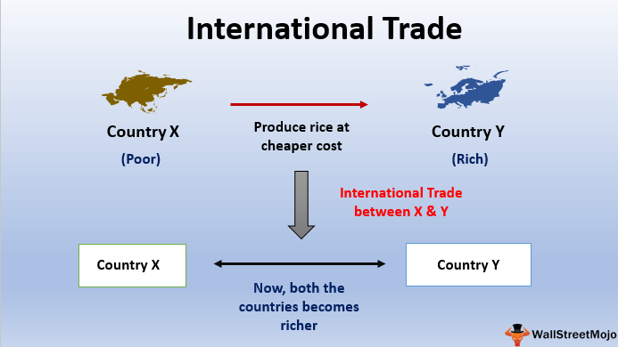

In the rapidly evolving global economy, trade policy, market access, and international trade play pivotal roles in shaping the economic landscape. These elements are crucial in determining how countries and businesses engage in the exchange of goods and services across borders. Trade policy, encompassing regulations, tariffs, and agreements, influences the ease and cost of international trade. Market access, on the other hand, refers to the ability of a country or business to enter and compete in a foreign market, often determined by the aforementioned trade policies.

Algorithmic trading, or algo trading, is revolutionizing the way trade transactions are conducted. By leveraging advanced algorithms, businesses can automate trading processes, reducing human error and increasing efficiency. This technological innovation allows traders to capitalize on market opportunities with unprecedented speed and precision, particularly in volatile markets.

Exploring these topics uncovers the implications of trade policies on market dynamics and the transformative impact of algo trading on international commerce. Understanding these concepts enables businesses and policymakers to navigate the complexities of international trade, fostering a more efficient and competitive trading environment. As the global economy continues to evolve, staying informed and adaptable is essential for stakeholders aiming to thrive in the interconnected world of international trade.

## Table of Contents

## Understanding Trade Policy and Market Access

Trade policy is a fundamental aspect of international economics, encompassing the regulations and agreements that dictate the terms and conditions of trade between nations. Key components of trade policy include tariffs, duties, and trade agreements, each of which plays a crucial role in shaping the trade landscape.

**Market Access** is defined as the capacity of a company or a country to sell goods and services across international borders, a privilege that is largely influenced by trade policy. Market access implies the presence of trade barriers, such as tariffs, which are taxes levied on imports, whereas free trade seeks to eliminate these barriers to facilitate uninhibited commerce.

There is an essential distinction between market access and free trade, with market access entailing a regulated entry of goods and services subject to certain barriers. In contrast, free trade focuses on the removal of such barriers to promote seamless trading interactions.

**Trade Agreements** are strategic instruments designed to enhance market access. By negotiating terms that lower trade barriers, these agreements serve to facilitate trade by easing the exchange of goods and services between participating countries. These agreements can take various forms, including bilateral and multilateral agreements, each with its own implications for market access.

**Geopolitical Factors** and domestic interests heavily influence the crafting and priorities of trade policies. Nations may impose tariffs and quotas based on geopolitical considerations, such as protecting domestic industries or retaliating against unfair trading practices. Similarly, domestic political and economic interests often steer the direction of trade policy, determining which sectors receive protection or preferential treatment.

Overall, understanding trade policy and market access is pivotal for businesses and governments to successfully engage in international trade. These elements not only determine the ease and cost of trade but also influence broader economic relationships and geopolitical dynamics between countries.

## The Importance of Market Access in International Trade

Market access is a fundamental driver of economic growth, providing businesses with opportunities to explore new revenue streams and customer bases beyond their domestic borders. By entering diverse markets, companies can mitigate risks associated with economic fluctuations in their home countries, thus ensuring a more resilient operational strategy.

Diversification of markets is not only a method of risk management but also a catalyst for revenue growth. As companies engage in international markets, they gain exposure to different consumer preferences and demand patterns. This allows businesses to tailor their products and services to meet varied needs, potentially increasing their market share and profitability.

For countries, enhanced market access is linked directly to economic development. By facilitating increased trade activities, nations can enjoy greater employment opportunities as industries expand to meet international demand. This economic dynamism can lead to improved living standards and stimulate sectors crucial for development, such as technology and infrastructure.

A significant advantage of market access is the realization of economies of scale. As companies produce more goods to meet international demand, they can reduce their per-unit cost of production. This cost efficiency boosts a company's competitive advantage, making its products more attractive in global markets.

Moreover, international trade fosters cultural exchange, which can have profound economic and social benefits. Exposure to diverse cultures spurs innovation by integrating different ideas, practices, and technologies. Such exchange encourages global understanding and cooperation, as countries become more interconnected through trade relationships.

In summary, market access is indispensable for businesses and countries aiming to achieve sustained growth and development. By capitalizing on the opportunities presented by international markets, stakeholders can enhance their economic prospects and contribute to a more interconnected global economy.

## Market Access Challenges and Trade Barriers

Trade barriers represent significant obstacles to market access and are categorized into tariff and non-tariff barriers. These barriers can hinder the free flow of goods across borders, impacting international trade dynamics.

**Tariff Barriers:**

Tariffs are taxes imposed on imported goods and are a common form of trade barrier. They function as protective measures for domestic industries by increasing the cost of foreign products, thereby affecting their competitiveness in the local market. The formula for calculating the tariff cost added to an imported product is:

$$
\text{Tariff Cost} = \text{Import Price} \times \text{Tariff Rate}
$$

where:
- $\text{Import Price}$ is the initial price of the imported goods, and
- $\text{Tariff Rate}$ is the percentage imposed as a tariff.

This cost increment can deter consumers from opting for imported goods, benefiting domestic producers but at the risk of escalating trade tensions.

**Non-Tariff Barriers:**

Non-tariff barriers (NTBs) can be more diverse and complex than tariffs. They include measures such as quotas, import licenses, standards, and regulations that limit the [volume](/wiki/volume-trading-strategy) or modify the regulation of trade in goods. Such measures can be less transparent and harder to quantify than tariffs. For example:

- **Quotas** directly restrict the quantity of a certain type of goods that can be imported.
- **Import Licenses** require businesses to obtain permission before importing certain goods, potentially limiting the amount or selecting the entities allowed to import.
- **Technical standards and regulations** mandate certain criteria that products must meet to be allowed into a market.

Navigating these barriers requires businesses to understand and comply with varied and often intricate international regulations. Failure to adhere to these requirements can result in delayed entry, increased costs, or outright exclusion from the market.

**Trade Negotiations:**

Efforts to reduce trade barriers are pivotal in liberalizing trade and enhancing market access. Negotiations, often undertaken through bilateral agreements or within the frameworks of organizations such as the World Trade Organization (WTO), aim to reduce tariffs and streamline non-tariff measures. Effective negotiation can lead to trade facilitation by simplifying customs procedures or mutual recognition of standards, thus promoting easier and increased trade flow.

**Regulatory Compliance:**

For businesses aiming for successful market entry, understanding and complying with the various regulatory environments is crucial. Conducting thorough market research, engaging with local trade representatives, and employing compliance specialists are strategies businesses utilize to overcome these barriers. Mastery of local regulatory landscapes can not only minimize entry delays but also prevent legal penalties and enhance competitive positioning.

In summary, while trade barriers complicate market access, navigating them effectively through strategic planning, compliance, and advocacy can lead to successful international market penetration and expansion.

## Algo Trading in International Trade

Algorithmic trading, commonly referred to as algo trading, employs sophisticated computer programs to execute trade transactions based on pre-defined algorithms. This technology-driven approach has revolutionized the financial sector, including its applications in international trade. By automating many processes traditionally carried out by human traders, algo trading enhances both the speed and accuracy of transactions, significantly reducing human error. 

In volatile markets, where conditions can change in milliseconds, the ability to quickly respond to market movements offers a distinct competitive advantage. Algorithmic trading systems can monitor multiple markets simultaneously, analyze data, and execute trades almost instantaneously. For instance, when a trading algorithm identifies [arbitrage](/wiki/arbitrage) opportunities arising from price discrepancies across different markets, it can act swiftly to exploit these differences before they are corrected.

In terms of infrastructure, algo trading demands robust computational power and sophisticated trading platforms. These systems are designed to process vast amounts of data at high speeds, implementing algorithms that can range from simple rules to complex mathematical models. As such, [algorithmic trading](/wiki/algorithmic-trading) is primarily the domain of major financial institutions and large market players who possess the necessary technical and financial resources. The infrastructure includes high-performance hardware, low-latency networks, and access to vast amounts of market data, often in real-time.

A key aspect of algo trading is the role of technology in shaping future trading practices. With advances in [artificial intelligence](/wiki/ai-artificial-intelligence) and [machine learning](/wiki/machine-learning), algorithms are becoming increasingly intelligent, able to not only execute trades but also learn and adapt from market data patterns. This evolution presents new opportunities and challenges for the regulation and implementation of trade policies. For example, as algorithms become more autonomous, establishing ethical guidelines and ensuring compliance with trading regulations will become increasingly important.

Additionally, algo trading systems benefit from high-frequency trading ([HFT](/wiki/high-frequency-trading-strategies)), a subset of algorithmic trading characterized by executing a large number of orders at extremely fast speeds. HFT can achieve profits through strategies involving [market making](/wiki/market-making), arbitrage, and short-term [trend following](/wiki/trend-following), relying heavily on the ability to process and act on data faster than humanly possible.

In conclusion, algorithmic trading represents a significant advancement in the conduct of international trade. Its ability to process information and execute trades rapidly and accurately empowers traders to operate more efficiently across global markets. As technology continues to evolve, the influence of algo trading on global trade practices and policies is likely to grow, underscoring the need for ongoing adaptation and innovation within the trading community.

## Conclusion

Trade policy, market access, and algorithmic trading (algo trading) are integral components of the global trade ecosystem. Each plays a crucial role in determining how goods and services are exchanged across international borders, shaping the dynamics of the global economy.

Effective trade policies and improved market access are fundamental drivers of economic growth and development on a global scale. By establishing clear regulations and lowering barriers, countries can facilitate smoother trade flows, create new economic opportunities, and stimulate job creation. Increased market access enables companies to diversify their markets and reduce dependency on their domestic economy, which in turn mitigates exposure to local economic fluctuations.

The advancement of algo trading highlights the necessity for businesses to adapt to technological innovations. By automating trading processes and minimizing human error, algo trading increases trading efficiency, speed, and precision. This technological evolution demands that stakeholders stay informed and continuously adapt to maintain a competitive edge in an ever-evolving trade environment.

As international trade continues to evolve, staying informed and agile becomes imperative for companies and policymakers alike. The interplay of these elements requires a proactive approach to navigating regulations, leveraging technology, and anticipating market trends. Understanding and leveraging these components can position businesses and policymakers to excel in an increasingly interconnected world, fostering sustainable growth and competitive advantage. By embracing these facets, stakeholders can thrive in the dynamic landscape of global commerce, securing their place in the future of international trade.

## FAQs

### What is the difference between market access and free trade?

Market access and free trade are related concepts in international commerce, but they possess distinct characteristics. Market access refers to the ability of a company or country to sell goods and services across borders. It is often governed by trade policies, which include tariffs and quotas that can either facilitate or hinder this access. In contrast, free trade represents a more idealistic approach, aiming to minimize or eliminate these barriers altogether, thereby promoting unrestricted exchange. Free trade agreements (FTAs) are structured to reduce or remove these trade barriers, essentially making the principles of free trade closer to reality by enhancing market access without obstructions.

### How do trade agreements facilitate market access?

Trade agreements play a crucial role in facilitating market access. They are formal arrangements between countries that outline the rules for trade between them, typically focusing on reducing trade barriers such as tariffs, quotas, and import restrictions. By doing so, these agreements create a more predictable and transparent trading environment. For instance, the North American Free Trade Agreement (NAFTA) and the European Union's single market have significantly eased restrictions, thereby enhancing market access. Additionally, they often include provisions for intellectual property rights, dispute resolution, and regulatory cooperation, further ensuring smooth and efficient cross-border trade.

### What are the benefits of market access for exporting countries?

Market access provides numerous advantages to exporting countries:

1. **Revenue Expansion**: By enabling companies to sell beyond their domestic market, countries can increase their revenue streams significantly.
2. **Economic Diversification**: Access to multiple markets reduces reliance on a single economy, mitigating the risks associated with domestic market fluctuations.
3. **Employment Generation**: Increased export activities can lead to job creation, contributing to a lower unemployment rate.
4. **Competitiveness**: Exposure to international markets encourages innovation and improvements in quality, enhancing a country’s competitive edge globally.
5. **Scaling Economies**: As companies expand their market base, they can achieve economies of scale, lowering production costs and boosting profitability.

### How do technical regulations and standards influence market access?

Technical regulations and standards can either facilitate or impede market access. These regulations, often intended to ensure product safety, quality, and environmental protection, require exporting companies to comply with specific criteria to enter a market. While they can present barriers if excessively stringent or incompatible with exporting countries' standards, they can also enhance market access by:

- **Harmonization**: Aligning domestic standards with international norms can make it easier for products to be accepted in foreign markets.
- **Consumer Trust**: Consistent standards can increase consumer confidence and willingness to purchase foreign products.
- **Level Playing Field**: By enforcing common standards, markets can ensure fair competition and discourage the sale of substandard products.

### What impact does algo trading have on international trade processes?

Algorithmic trading (algo trading) significantly impacts international trade processes through the following:

1. **Efficiency**: By automating transactions, algo trading reduces human error and enhances the speed of trade execution, making transactions more efficient.
2. **Market Opportunities**: Algorithms can quickly analyze vast amounts of data to identify lucrative trading opportunities, allowing traders to capitalize on them promptly.
3. **Volatility Management**: In volatile markets, algo trading can help manage risks by executing trades that maintain a balanced portfolio.
4. **Cost Reduction**: Automation decreases the need for human intervention, reducing overhead costs associated with manual trading.
5. **Limitations**: Despite its benefits, algo trading tends to be accessible mainly to large financial institutions due to the sophisticated infrastructure and significant investments required.

By streamlining trade processes, algo trading enhances the overall competitiveness and dynamism of global markets.

## References & Further Reading

[1]: Baldwin, R. (2016). ["The Great Convergence: Information Technology and the New Globalization."](https://www.jstor.org/stable/j.ctv24w655w) Harvard University Press.

[2]: Bhagwati, J., & Panagariya, A. (2014). ["Why Growth Matters: How Economic Growth in India Reduced Poverty and the Lessons for Other Developing Countries."](https://archive.org/details/whygrowthmatters0000bhag_e0p7) PublicAffairs.

[3]: James, H. (2001). ["The End of Globalization: Lessons from the Great Depression."](https://www.jstor.org/stable/j.ctvjz8161) Harvard University Press.

[4]: Tirole, J. (1988). ["The Theory of Industrial Organization."](https://mitpress.mit.edu/9780262200714/the-theory-of-industrial-organization/) The MIT Press.

[5]: World Trade Organization. (2012). ["Understanding the WTO: The Agreements."](https://www.wto-ilibrary.org/content/books/9789287044662c001) WTO Publications.