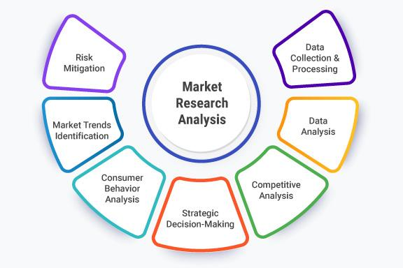

## Table of Contents

## What is market analysis and why is it important?

Market analysis is when businesses look at information about their market to understand it better. This includes studying customers, competitors, and overall market trends. It helps businesses figure out what people want to buy, how much they are willing to pay, and who else is selling similar things.

Doing a market analysis is important because it helps businesses make smart choices. By understanding the market, a business can decide what products to make, how to price them, and how to reach customers effectively. This can lead to more sales and a stronger position in the market. Without market analysis, a business might make decisions based on guesses, which can lead to mistakes and lost opportunities.

## What are the different types of market analysis?

There are several types of market analysis that businesses use to understand their market better. One type is customer analysis, where businesses study who their customers are, what they want, and how they behave. This helps businesses create products and services that meet their customers' needs. Another type is competitor analysis, where businesses look at what other companies in their market are doing. They study their competitors' products, prices, and marketing strategies to find out their strengths and weaknesses. This helps businesses figure out how to stand out and do better than their competitors.

Another important type of market analysis is market segmentation. This involves dividing the market into smaller groups of customers with similar characteristics or needs. By doing this, businesses can target their marketing efforts more effectively and create products that appeal to specific groups. Trend analysis is also a key type of market analysis. This involves looking at changes and patterns in the market over time. Businesses use trend analysis to predict future market conditions and stay ahead of changes. By understanding these different types of market analysis, businesses can make better decisions and increase their chances of success.

## How do you conduct a basic market analysis?

To conduct a basic market analysis, start by gathering information about your customers. Find out who they are, what they need, and what they like. You can do this by talking to them, sending out surveys, or looking at data from your sales. Next, learn about your competitors. See what they are selling, how much they charge, and how they market their products. You can look at their websites, read their ads, and even buy their products to understand them better.

Once you have this information, you can start analyzing it. Look for patterns and trends in what your customers want and how your competitors are doing. Think about how you can meet your customers' needs better than your competitors. You might find that your customers want something that no one else is offering, or you might see a way to offer a better price or better service. Use this analysis to make decisions about what products to sell, how to price them, and how to reach your customers.

By doing a basic market analysis, you can make smarter choices for your business. It helps you understand your market better and find ways to stand out. This can lead to more sales and a stronger position in the market. Without market analysis, you might make decisions based on guesses, which can lead to mistakes and missed opportunities.

## What tools and resources are commonly used in market analysis?

When doing market analysis, businesses often use surveys and questionnaires to learn about their customers. These can be sent out through email, posted on websites, or done in person. Another common tool is customer data analysis software, which helps businesses look at information from their sales and customer interactions. This can show patterns in what customers buy and how they behave. Businesses also use social media listening tools to see what people are saying about their products and competitors online. This helps them understand what customers like and don't like.

In addition to these tools, businesses often use market research reports from companies like Nielsen or Gartner. These reports give detailed information about market trends and competitor activities. Websites and databases like Statista and IBISWorld are also useful for finding market data and [statistics](/wiki/bayesian-statistics). For competitor analysis, businesses might use tools like SEMrush or Ahrefs to see how competitors are doing with their online marketing. By using these tools and resources, businesses can gather the information they need to make smart decisions and stay ahead in their market.

## How can market analysis help in identifying target markets?

Market analysis helps businesses find their target markets by looking at who their customers are and what they want. By doing customer analysis, businesses can learn about the age, income, and interests of their customers. They can also find out what problems customers are trying to solve and what they value in a product or service. This information helps businesses see which groups of people are most likely to buy their products. For example, if a business finds out that most of their customers are young adults who care about the environment, they can target their marketing to this group.

Another way market analysis helps identify target markets is through market segmentation. This involves dividing the market into smaller groups based on shared characteristics or needs. By doing this, businesses can see which segments are the most promising for their products. For instance, a business might find that one segment of the market is made up of busy parents who need quick and healthy meals. The business can then focus on creating products that meet the needs of this specific group. By understanding their target markets better, businesses can make their marketing more effective and increase their sales.

## What role does competitor analysis play in market analysis?

Competitor analysis is a big part of market analysis. It helps businesses learn about other companies that are selling similar things. By looking at what competitors are doing, a business can see what works well and what doesn't. This includes checking out their products, prices, and how they talk to customers. For example, if a competitor has a popular product, a business might want to make something similar but better. Or, if a competitor's prices are too high, a business might decide to offer lower prices to attract more customers.

Understanding competitors also helps a business find its own special place in the market. By seeing what others are doing, a business can figure out how to stand out. Maybe a business can offer better customer service, or maybe it can focus on a part of the market that competitors are ignoring. This can help a business make smart choices about what to sell, how to price it, and how to reach customers. Without competitor analysis, a business might miss out on important information that could help it do better in the market.

## How do you analyze market trends and what are their impacts?

Analyzing market trends involves looking at changes and patterns in the market over time. Businesses do this by collecting data from sales, customer feedback, and market research reports. They use tools like graphs and charts to see how things are changing. For example, they might notice that more people are buying eco-friendly products or that online shopping is becoming more popular. By understanding these trends, businesses can predict what will happen next and make plans for the future.

Market trends can have a big impact on businesses. If a business sees a trend towards healthier eating, it might decide to sell more healthy foods. This can help the business attract more customers and increase sales. On the other hand, if a business ignores trends, it might miss out on opportunities. For example, if a business doesn't start selling products online when more people are shopping that way, it could lose customers to competitors who do. By staying on top of market trends, businesses can make better decisions and stay successful.

## What are the key metrics to focus on during market analysis?

When doing market analysis, it's important to look at some key numbers to understand your market better. One of these numbers is market size, which tells you how big your market is and how many people might buy your product. Another important number is market growth rate, which shows if your market is getting bigger or smaller over time. You should also pay attention to market share, which tells you what part of the market your business has compared to your competitors. Customer acquisition cost is another key number, showing how much it costs to get a new customer. Lastly, customer retention rate is important because it shows how many customers keep coming back to buy from you.

These numbers help you make smart choices for your business. For example, if your market is growing fast, you might want to invest more in new products or marketing. If your market share is small, you might need to find ways to stand out from your competitors. Knowing your customer acquisition cost can help you decide if you're spending too much to get new customers. And a high customer retention rate means your customers are happy, which is good for long-term success. By focusing on these key metrics, you can understand your market better and make decisions that help your business grow.

## How can advanced data analytics enhance market analysis?

Advanced data analytics can make market analysis much better by helping businesses understand their data in new ways. With tools like [machine learning](/wiki/machine-learning) and big data, businesses can look at huge amounts of information quickly and find patterns that they might miss otherwise. For example, they can see how customers' buying habits change over time or how different groups of customers behave differently. This helps businesses make smarter decisions about what products to sell, how to price them, and how to reach their customers.

Using advanced data analytics also helps businesses predict what will happen in the future. By looking at past data, businesses can use models to guess what customers will want next or how the market might change. This can give them a big advantage over competitors who don't use these tools. For instance, if a business can predict that more people will want to buy eco-friendly products, they can start making those products before others do. This way, they can meet their customers' needs better and stay ahead in the market.

## What are the challenges faced when conducting market analysis?

Conducting market analysis can be hard because it takes a lot of time and work to gather all the information you need. You have to talk to customers, look at data, and study what your competitors are doing. This can be a big job, especially for small businesses that don't have a lot of people to help. Also, the information you find might not be completely right or up-to-date. If you use old data or guess about what customers want, you might make bad choices for your business.

Another challenge is that markets change all the time. What people want today might be different tomorrow. So, you have to keep doing market analysis over and over to stay on top of these changes. This can be hard and expensive. Plus, there's a lot of data out there, and it can be tough to figure out which information is important and which isn't. If you focus on the wrong things, you might miss out on big opportunities or make decisions that don't help your business grow.

## How does market analysis influence strategic business decisions?

Market analysis helps businesses make smart choices about what to do next. By looking at who their customers are and what they want, businesses can decide what products to make and how to sell them. They can also see what their competitors are doing and find ways to do better. For example, if a business finds out that customers want more eco-friendly products, they might start making those. Or, if they see that a competitor's prices are too high, they might decide to offer lower prices to attract more customers. This way, market analysis helps businesses plan their next steps and stay ahead in the market.

Understanding market trends is another important part of making strategic decisions. If a business sees that more people are shopping online, they might decide to focus more on their online store. Or, if they notice a trend towards healthier eating, they might start selling more healthy foods. By knowing what's happening in the market, businesses can make choices that help them grow and stay successful. Without market analysis, businesses might make decisions based on guesses, which can lead to mistakes and missed opportunities.

## What advanced techniques can be used for predictive market analysis?

Predictive market analysis can be done using fancy computer programs that look at a lot of information to guess what will happen next. One way to do this is by using machine learning. This is when computers learn from past data to find patterns and make predictions. For example, a business might use machine learning to see how people's buying habits change over time and guess what they will want in the future. Another way is by using something called regression analysis. This helps businesses see how different things, like price or advertising, affect how much people buy. By understanding these connections, businesses can make better guesses about what will happen in the market.

Another advanced technique is called time series analysis. This looks at how things change over time and uses this information to predict future trends. For example, a business might use time series analysis to see if sales go up or down at certain times of the year and plan for that. Also, businesses can use something called scenario analysis. This means they look at different possible futures and see what might happen in each one. By doing this, they can be ready for whatever comes next. These advanced techniques help businesses make smarter decisions and stay ahead of changes in the market.

## References & Further Reading

[1]: Bergstra, J., Bardenet, R., Bengio, Y., & Kégl, B. (2011). ["Algorithms for Hyper-Parameter Optimization."](https://papers.nips.cc/paper/4443-algorithms-for-hyper-parameter-optimization) Advances in Neural Information Processing Systems 24.

[2]: ["Advances in Financial Machine Learning"](https://www.amazon.com/Advances-Financial-Machine-Learning-Marcos/dp/1119482089) by Marcos Lopez de Prado

[3]: ["Evidence-Based Technical Analysis: Applying the Scientific Method and Statistical Inference to Trading Signals"](https://www.semanticscholar.org/paper/Evidence-Based-Technical-Analysis%3A-Applying-the-and-Aronson/3b33df8737f1772e9e14d66a08c9696f140a2ee1) by David Aronson

[4]: ["Machine Learning for Algorithmic Trading"](https://github.com/PacktPublishing/Machine-Learning-for-Algorithmic-Trading-Second-Edition) by Stefan Jansen

[5]: ["Quantitative Trading: How to Build Your Own Algorithmic Trading Business"](https://books.google.com/books/about/Quantitative_Trading.html?id=j70yEAAAQBAJ) by Ernest P. Chan