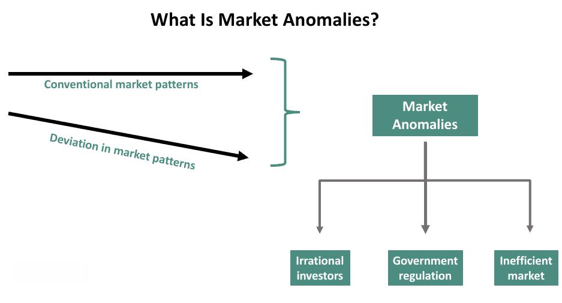

Market anomalies refer to patterns in financial markets that seem inconsistent with established asset pricing models, such as the Efficient Market Hypothesis (EMH). These anomalies suggest that there are predictable price movements or patterns that could be exploited for financial gain. Market anomalies are seen as opportunities to generate excess returns by deviating from the assumptions that markets are perfectly efficient.

Studying market anomalies is crucial in the context of algorithmic trading, where automated systems execute trades based on pre-defined criteria. Algorithmic trading strategies are designed to capitalize on slight inefficiencies or patterns that traditional, human-centric techniques might overlook. By understanding and identifying market anomalies, traders can refine their algorithms to exploit these irregularities, potentially improving performance and profitability. The rapid execution and data processing capabilities of algorithmic trading systems make them particularly suited for anomaly exploitation, as they can act on these opportunities at speeds impossible for manual methods.

This article primarily focuses on understanding the nature of market anomalies and explores how they relate to current asset pricing theories, including the Capital Asset Pricing Model (CAPM) and Fama-French models. It introduces the main categories of market anomalies, such as time-series and cross-sectional anomalies, and discusses their implications for algorithmic trading strategies. The piece also covers the challenges faced in exploiting anomalies due to factors like trading costs, illiquidity, and the evolution of market conditions. Ultimately, it highlights the importance of continual research and adaptation in trading strategies to maintain an edge in exploiting these anomalies.

## Table of Contents

## Understanding Market Anomalies

Market anomalies represent patterns or trends in financial markets that seem to contradict established asset pricing models. These deviations from expected market behavior are of particular interest because they suggest opportunities for investors to achieve abnormal returns.

**Predictability of Market Anomalies and Inconsistencies with Asset Pricing Theories**

Market anomalies challenge traditional asset pricing theories like the Capital Asset Pricing Model (CAPM) and Fama-French models. These models aim to explain the relationship between risk and expected return, suggesting that markets are generally efficient and that asset prices fully reflect all available information. However, anomalies indicate that there are inefficiencies or mispricing patterns that these models fail to account for, offering an opportunity for predicting asset price movements.

**Major Asset Pricing Models**

1. **CAPM (Capital Asset Pricing Model):** 
   The CAPM asserts that the expected return of a security is linearly related to its beta, measuring the security's risk in relation to the overall market. The formula for CAPM is:
$$
   E(R_i) = R_f + \beta_i (E(R_m) - R_f)

$$

   where $E(R_i)$ is the expected return on the security, $R_f$ is the risk-free rate, $\beta_i$ is the beta of the security, and $E(R_m)$ is the expected return of the market.

2. **Fama-French Models:**
   An extension of the CAPM, the Fama-French three-[factor](/wiki/factor-investing) model includes additional factors such as size and value to explain asset returns. The model is expressed as:
$$
   E(R_i) = R_f + \beta_i (E(R_m) - R_f) + b_i(SMB) + c_i(HML)

$$

   where $SMB$ is the size premium (small minus big) and $HML$ is the value premium (high minus low).

**Types of Anomalies**

1. **Time-Series Anomalies:**
   These anomalies occur when certain periods or market conditions repeatedly show predictable patterns. Examples include the January effect, where stocks have historically tended to perform better in January compared to other months, and [momentum](/wiki/momentum) strategies that exploit the tendency of an asset's price to continue in its current direction.

2. **Cross-Sectional Anomalies:**
   Cross-sectional anomalies refer to predictable patterns observed across different assets at a single point in time. The size anomaly, where small-cap stocks have been seen to generate higher returns than predicted by models like CAPM, is a well-known example. Similarly, the value anomaly suggests that stocks with low price-to-book ratios outperform those with high ratios.

These anomalies often reveal inconsistencies in asset pricing theories and offer avenues for investors to potentially realize higher returns. Despite their predictability, the existence of market anomalies challenges the notion of market efficiency and suggests that continuously evolving trading strategies could leverage these insights for better performance.

## Categories of Market Anomalies

Market anomalies are deviations in financial markets from expected norms or asset pricing models. These anomalies can be categorized primarily into two types: time-series anomalies and cross-sectional anomalies.

### Time-Series Anomalies

Time-series anomalies refer to patterns over time that contradict traditional market efficiency. One prominent example is the Cyclically Adjusted Price-to-Earnings (CAPE) ratio, developed by economist Robert Shiller. The CAPE ratio is used to evaluate whether markets are over- or under-valued by considering inflation-adjusted [earning](/wiki/earning-announcement)s over a 10-year period. High CAPE values indicate overvaluation and are often followed by below-average returns, while low CAPE values suggest undervaluation and potential for higher returns.

Mathematically, CAPE is expressed as:

$$
\text{CAPE} = \frac{\text{Current Price}}{\text{Average Inflation-adjusted Earnings of the past 10 years}}
$$

The predictability that CAPE provides has made it a favorite tool among investors for forecasting long-term market trends, contributing to its categorization as a time-series anomaly.

### Cross-Sectional Anomalies

Cross-sectional anomalies occur when returns can be predicted based on certain characteristics of the assets at a given time. The size anomaly is a classic example here. According to the size anomaly, smaller firms (measured by market capitalization) tend to yield higher risk-adjusted returns than larger firms. This contradicts the Capital Asset Pricing Model (CAPM), which implies that returns should be solely a function of risk as measured by beta.

The underlying rationale for the size anomaly might include factors not captured by traditional asset pricing models, such as the greater growth potential or market inefficiencies affecting smaller firms. Though this anomaly offers strategic insight, it does come with challenges like higher [volatility](/wiki/volatility-trading-strategies) and increased trading costs associated with small-cap stocks.

Understanding these categories helps investors and algorithm designers identify potential exploitable patterns in the market, despite their inherent risks and the need for continuous adjustment as market conditions evolve.

## Explanations for Anomalies

Market anomalies often stem from factors such as mispricing, unmeasured risk, and various behavioral biases, challenging the traditional efficient market hypothesis. Understanding these factors is crucial for identifying potential opportunities and understanding market dynamics.

### Mispricing and Market Anomalies
Mispricing occurs when a security's market price deviates from its intrinsic value. This can lead to market anomalies when investors notice and exploit these price discrepancies, potentially resulting in excess returns. Mispricing may be due to irrational investor behavior, information asymmetry, or market inefficiencies. For instance, if investors irrationally favor a particular asset, they might drive its price above its intrinsic value, creating a bubble that is eventually corrected by the market. As such, identifying and exploiting mispricing is a central focus for traders aiming to capitalize on market anomalies.

### Unmeasured Risk
Unmeasured risk plays a significant role in apparent anomalies. Traditional asset pricing models, like the CAPM or Fama-French models, account for several risk factors but may omit others that influence returns. Anomalies may simply reflect unaccounted risks rather than true [arbitrage](/wiki/arbitrage) opportunities. For example, political risk or unexpected regulatory changes might affect asset returns without being captured by conventional models. As a result, what appears to be an anomaly is essentially compensation for bearing these unmeasured risks.

### Limits to Arbitrage
The persistence of market anomalies can also be attributed to limits to arbitrage. In theory, arbitrage should eliminate any mispricing. However, practical limitations such as transaction costs, risk, and market impact can inhibit effective arbitrage. For example, suppose an asset is underpriced. In that case, arbitrageurs intending to buy large quantities may drive up the price before they can realize the potential gains fully, reducing the profitability of their strategy. Additionally, arbitrage opportunities often require significant capital and entail substantial risk, further limiting traders' ability to capitalize on anomalies.

### Selection Bias
Selection bias is another critical factor in the recognition and reporting of market anomalies. Studies observing anomalies often use historical data and may focus on specific timeframes or datasets that portray anomalies while ignoring other periods where no such behavior exists. This can lead to overestimation of the prevalence and magnitude of anomalies. Researchers and analysts may unintentionally spotlight anomalies that are more visible or align with their hypotheses, disregarding contrary evidence. Hence, reported anomalies might not reflect genuine market inefficiencies but rather artifacts of data selection and analysis methods.

In conclusion, while analyzing market anomalies highlights potential inefficiencies within financial markets, it is essential to critically evaluate their origins, whether through mispricing, unmeasured risks, or limits to arbitrage, and consider methodological issues like selection bias to truly understand and leverage these phenomena in trading strategies.

## Algorithmic Trading and Anomalies

Algorithmic trading has fundamentally transformed the way market anomalies are identified and exploited. These computer-driven trading strategies are essential tools for recognizing patterns and inefficiencies that human traders might overlook. The sheer [volume](/wiki/volume-trading-strategy) of data and the speed at which it can be processed allow algorithmic systems to detect market anomalies more efficiently than traditional methods.

Anomalies, by definition, offer opportunities to generate excess returns. Algorithmic trading capitalizes on these opportunities by systematically analyzing historical data and identifying anomalies that deviate from the expected performance stipulated by established financial models like the CAPM or Fama-French models. The algorithms are designed to exploit these inefficiencies by executing trades faster and more accurately than human traders. For example, if an algorithm detects a persistent pattern where a particular stock tends to rise at a specific point in time due to some seasonal effect, it can exploit this by making timely trades to benefit from this predictable movement.

Algorithmic trading strategies benefit significantly from anomalies. Intra[day trading](/wiki/day-trading-spy) strategies, momentum strategies, and [statistical arbitrage](/wiki/statistical-arbitrage) are classic examples where algorithms can leverage market anomalies for profit. Momentum strategies, for example, take advantage of the tendency of securities to continue performing in a particular trend, whereas statistical arbitrage strategies focus on identifying pricing inefficiencies between related securities. 

Moreover, [algorithmic trading](/wiki/algorithmic-trading) can play a dual role by not only exploiting but also contributing to the neutralization of anomalies. As more algorithms capitalize on a specific anomaly, the market inefficiency may reduce over time due to increased participation, leading to a phenomenon known as "arbitrage efficiency." This involves high-frequency trading and market-making strategies that enhance [liquidity](/wiki/liquidity-risk-premium) and reduce bid-ask spreads, further ironing out temporary anomalies. The continuous feedback loop created by detecting and exploiting these inefficiencies eventually leads to a more efficient market where anomalies are harder to spot.

Sophisticated techniques such as [machine learning](/wiki/machine-learning) enhance these strategies by improving the algorithms' ability to adapt to changing market conditions and uncover more complex patterns or new types of anomalies. Through iterative learning and adjustment, algorithms are constantly refined to maintain their edge in detecting fleeting opportunities. However, it is important to note that the efficacy of algorithmic models heavily depends on the quality and quantity of data available, and changes in market structure over time can affect their performance.

In summary, algorithmic trading serves as an efficient mechanism for both leveraging and counteracting market anomalies. By providing a systematic and rapid approach to identify and exploit inefficiencies, it accelerates the process of market correction, underscoring the dynamic interplay between trading technology and market behavior.

## Challenges in Utilizing Anomalies

The challenges of utilizing market anomalies in trading strategies become apparent when observing the decline in return predictability following the publication of an anomaly. Once anomalies are documented and become common knowledge, market participants quickly adapt, often leading to their diminished or nullified profitability. This phenomenon can be attributed to the efficient market hypothesis, which posits that asset prices reflect all available information. As more traders attempt to capitalize on a discovered anomaly, the anomaly tends to get arbitraged away, thus reducing potential returns.

Another critical challenge is the impact of trading costs and illiquid stocks on anomaly-based strategies. Trading costs can significantly erode the profitability of strategies that rely on exploiting anomalies, particularly when these strategies require frequent rebalancing. Even small costs per transaction can accumulate, undermining the returns predicted by theoretical models. Moreover, anomalies often involve stocks that are less liquid, meaning they are harder to buy or sell quickly without affecting their prices. This illiquidity can further increase transaction costs and introduce slippage, where the execution price deviates from the intended price, thereby affecting the profitability of trading strategies.

Additionally, defining a reliable benchmark theory against which anomalies can be measured presents its own set of difficulties. Traditional models like the Capital Asset Pricing Model (CAPM) or the Fama-French models provide a framework for expected returns; however, these models have their limitations and may not fully capture the complexities of real-world financial markets. Discrepancies between predicted and actual returns might be due to model misspecifications rather than genuine anomalies, complicating the identification and utilization of true anomalies. Thus, establishing a robust benchmark is crucial for distinguishing between anomalies that represent genuine opportunities and those that are artifacts of inadequate modeling.

Overall, these challenges underscore the necessity for continuous adaptation and refinement of trading strategies in response to the evolving market landscape and the ever-present possibility of diminishing returns related to widely recognized anomalies.

## Conclusion

Market anomalies continue to be a captivating subject within the domain of algorithmic trading, serving both as a challenge and an opportunity. These anomalies reveal the inconsistencies and imperfections in the efficient market hypothesis, offering traders a roadmap to uncover profitable opportunities that deviate from expected market behavior.

Understanding these anomalies is not a static endeavor; rather, they require continuous study as markets evolve with changing economic climates, investor behavior, and technological advancements. As such, the future outlook of deciphering market anomalies in algorithmic trading is promising but demands a dynamic approach. With the integration of [artificial intelligence](/wiki/ai-artificial-intelligence) and machine learning, traders are better equipped than ever to detect and exploit these market inconsistencies. The adaptation and refinement of algorithms, based on historical anomaly patterns, could lead to more sophisticated trading strategies capable of identifying subtle shifts and emerging patterns.

Moreover, algorithmic trading anchored on anomalies necessitates rigorous research and adaptation. Given that the publication of anomalies can diminish their profitability due to increased market attention, researchers and traders must continually investigate new anomalies or updated manifestations of existing ones. This ongoing research is vital to staying ahead in the competitive landscape of financial markets.

Trading strategies should be resilient, flexible, and based on robust historical data analysis. As anomalies can be affected by factors such as trading costs, liquidity constraints, and evolving market conditions, continuously refining algorithms to account for these variables is crucial. By doing so, traders can mitigate risks associated with diminishing anomaly returns and ensure that their strategies remain competitive.

In conclusion, an in-depth understanding of market anomalies is essential for devising effective algorithmic trading strategies. The commitment to continuous research and adaptation is paramount to exploiting these market inefficiencies effectively, ensuring the longevity and success of trading operations in an ever-evolving financial ecosystem.

## References & Further Reading

[1]: Fama, E. F., & French, K. R. (1992). ["The Cross-Section of Expected Stock Returns."](https://www.jstor.org/stable/2329112) The Journal of Finance, 47(2), 427-465.

[2]: Shiller, R. J. (1981). ["Do Stock Prices Move Too Much to be Justified by Subsequent Changes in Dividends?"](https://www.jstor.org/stable/1802789) The American Economic Review, 71(3), 421-436.

[3]: Jegadeesh, N., & Titman, S. (1993). ["Returns to Buying Winners and Selling Losers: Implications for Stock Market Efficiency."](https://www.jstor.org/stable/2328882) The Journal of Finance, 48(1), 65-91.

[4]: Poterba, J. M., & Summers, L. H. (1988). ["Mean Reversion in Stock Prices: Evidence and Implications."](https://www.sciencedirect.com/science/article/pii/0304405X88900219) Journal of Financial Economics, 22(1), 27-59.

[5]: Lakonishok, J., Shleifer, A., & Vishny, R. W. (1994). ["Contrarian Investment, Extrapolation, and Risk."](https://onlinelibrary.wiley.com/doi/full/10.1111/j.1540-6261.1994.tb04772.x) The Journal of Finance, 49(5), 1541-1578.