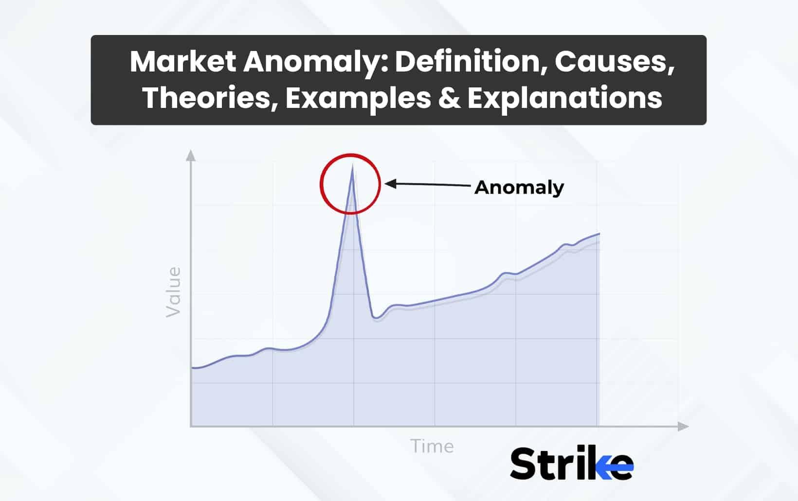

## Table of Contents

## What is a market anomaly?

A market anomaly is when something happens in the stock market that doesn't follow the usual patterns or rules. It's like a surprise that makes the market behave in a way that people didn't expect. For example, a stock might suddenly go up a lot even though there's no clear reason for it.

These surprises can be caused by many things, like unexpected news or changes in how people feel about the market. When these anomalies happen, they can give some investors a chance to make money if they can spot them early. But they can also be risky because they don't always follow the normal rules of the market.

## How do market anomalies differ from normal market behavior?

Market anomalies are like surprises in the stock market. They happen when the market does something unexpected, like a stock price suddenly jumping up or down for no clear reason. This is different from normal market behavior, where prices usually change based on things like company news, economic reports, or how investors feel about the market in general. When the market follows these expected patterns, it's behaving normally.

Normal market behavior is what you see most of the time. It's when stock prices move in ways that make sense based on the information available. For example, if a company reports good earnings, its stock price might go up because investors think the company is doing well. On the other hand, market anomalies are the exceptions. They can be caused by unexpected events, like a sudden change in government policy or a big news story that catches everyone off guard. These anomalies can create opportunities for some investors, but they also add an extra layer of risk because they don't follow the usual rules.

## What are some common types of market anomalies?

Market anomalies come in different forms, and one common type is the January effect. This is when stock prices, especially for small companies, tend to go up more in January than in other months. People think it might happen because investors sell stocks at the end of the year to save on taxes and then buy them back in January. Another type is the weekend effect, where stock prices often drop on Mondays. This might be because bad news gets released over the weekend, and people react to it when the market opens on Monday.

Another well-known market anomaly is the momentum effect. This is when stocks that have been doing well keep going up, and stocks that have been doing poorly keep going down. It's like a trend that keeps going for a while. There's also the overreaction effect, where investors might get too excited or too worried about news, causing stock prices to swing more than they should. These anomalies show that the market doesn't always behave in ways that make perfect sense, and they can create both opportunities and risks for investors.

## Can you explain the January effect as a market anomaly?

The January effect is a type of market anomaly where stock prices, especially for small companies, tend to go up more in January than in other months. It's like a special time of the year when the stock market acts a bit differently. People think this happens because investors might sell stocks at the end of the year to save on taxes. Then, in January, they buy those stocks back, which can push the prices up.

This pattern has been noticed for a long time, and it's one of the reasons why some investors pay extra attention to their portfolios at the start of the year. While the January effect can offer a chance to make money, it's not a sure thing. Sometimes it happens, and sometimes it doesn't. It's a reminder that the stock market can have its own little surprises, and understanding these can help investors make better decisions.

## How do market anomalies impact investment strategies?

Market anomalies can shake up investment strategies because they make the market behave in unexpected ways. When something like the January effect happens, investors might decide to buy more stocks in January, hoping to catch the upward trend. This can change how they plan their investments throughout the year. They might also look for other anomalies, like the momentum effect, to try and make money by following trends that don't always make sense but seem to work.

But using market anomalies in investment strategies can be risky. Since these anomalies don't happen all the time, relying on them too much can lead to losses if the market doesn't behave as expected. Smart investors often use anomalies as just one part of their overall plan. They might combine this with other strategies, like looking at a company's fundamentals or diversifying their portfolio, to balance the risks and rewards. This way, they can take advantage of market surprises without putting all their eggs in one basket.

## What role do behavioral finance theories play in explaining market anomalies?

Behavioral finance theories help explain market anomalies by showing how people's feelings and mistakes can affect the stock market. These theories say that investors don't always make perfect decisions. Sometimes, they get too excited or too worried, which can cause stock prices to move in strange ways. For example, the overreaction effect happens when investors react too strongly to news, making stock prices swing more than they should. This kind of behavior can create market anomalies because the market isn't always following the logical patterns that traditional finance theories expect.

Another way behavioral finance explains market anomalies is through things like the January effect. This anomaly might happen because investors sell stocks at the end of the year to save on taxes and then buy them back in January. Behavioral finance says this is because people are trying to avoid losses, which is a common human behavior. By understanding these patterns, investors can see how their own feelings and decisions can lead to market surprises. This helps explain why the market doesn't always behave in ways that make perfect sense, and it shows how important it is to consider human behavior when looking at the stock market.

## How can investors identify market anomalies?

Investors can spot market anomalies by keeping an eye on patterns that don't seem to make sense. For example, if they notice that a stock always goes up in January, even when there's no clear reason for it, that could be the January effect. They can also look for times when the market reacts too strongly to news, like when a stock price jumps a lot after a small piece of good news. By watching these patterns over time, investors can start to see when the market is behaving differently than usual.

Another way to find market anomalies is by using data and charts. Investors can use tools to track how stocks move and compare them to what they expect. If they see a stock or the whole market doing something unexpected, like going up when it should go down, that might be an anomaly. It's also helpful to read about what other investors and experts are saying. Sometimes, they might spot trends or patterns that aren't obvious at first. By combining these methods, investors can get better at spotting market surprises and maybe even use them to make smarter investment choices.

## What are the challenges in exploiting market anomalies for profit?

Trying to make money from market anomalies can be tricky. One big challenge is that these surprises don't happen all the time. Just because a stock went up in January last year doesn't mean it will do the same this year. So, if investors rely too much on these patterns, they might end up losing money when the market doesn't follow the expected anomaly. Another problem is that many other investors are also looking for these same patterns. If everyone tries to take advantage of an anomaly at the same time, it can make the anomaly disappear or become less profitable.

Another challenge is that market anomalies can be hard to spot. They often need a lot of data and careful watching to see the patterns. Sometimes, what looks like an anomaly might just be a coincidence. This can lead investors to make wrong guesses about where the market is going. Also, even if an investor finds a real anomaly, there's no guarantee they can make money from it. The market can be unpredictable, and other things like news or changes in how people feel about the market can mess up the best-laid plans.

## How have market anomalies been used to test market efficiency?

Market anomalies have been used to test how efficient the stock market is. If the market was perfect, prices would always make sense based on all the information out there. But when people find patterns like the January effect, it shows that the market doesn't always work that way. These surprises suggest that the market might not be as good at using all the information as we thought. By studying these anomalies, researchers can see if the market is really efficient or if there are ways to beat it.

Researchers look at these anomalies to see if they can find ways to make money that shouldn't be possible in an efficient market. For example, if stocks always go up in January, that's a sign the market isn't using all the information it should. When these patterns are found and used to make money, it shows that the market might not be as smart as it's supposed to be. This helps us understand that the market has its flaws and that human behavior can make it less efficient than we might expect.

## What is the relationship between market anomalies and arbitrage opportunities?

Market anomalies can create arbitrage opportunities. Arbitrage is when investors buy something in one place and sell it in another to make a profit because the prices are different. When the market does something unexpected, like a stock suddenly going up in January, it can create a chance for investors to make money. They might buy the stock before January, knowing it will likely go up, and then sell it when the price rises. This is a way to take advantage of the market not behaving normally.

But using market anomalies for arbitrage can be tricky. These surprises don't happen all the time, so it's hard to predict when they will show up. If too many people try to use the same anomaly, it can disappear because everyone is trying to do the same thing. Also, even if an investor spots an anomaly, other things like news or changes in how people feel about the market can mess up their plans. So, while market anomalies can create arbitrage opportunities, they also come with risks that investors need to be careful about.

## Can you discuss the impact of technological advancements on the persistence of market anomalies?

Technological advancements have made it harder for market anomalies to last long. With computers and fast internet, investors can find and use these surprises much quicker than before. For example, if someone spots a pattern like the January effect, they can quickly buy and sell stocks to take advantage of it. But when lots of people do this, it can make the anomaly go away because everyone is trying to use it at the same time. So, technology helps people find market surprises faster, but it also means those surprises don't stick around as long.

Even though technology can make market anomalies disappear faster, it also helps us find new ones. With more data and better tools, investors can spot new patterns that might not have been noticed before. This means that while old anomalies might not last, new ones can keep popping up. So, technology changes the game by making the market more efficient but also by giving investors new ways to look for and use these surprises.

## How do regulatory changes affect the occurrence and exploitation of market anomalies?

Regulatory changes can make market anomalies happen less often or be harder to use for making money. When rules change, it can stop some of the patterns that cause anomalies. For example, if the government changes tax laws, it might make the January effect go away because people won't need to sell stocks at the end of the year anymore. Also, new rules can make it harder for investors to take advantage of anomalies. If there are stricter rules about how much you can trade or what information you can use, it can limit how much you can profit from these surprises.

But regulatory changes can also create new market anomalies. When new rules come out, they can change how people behave in the market, leading to new patterns that investors might spot. For example, if a new law makes certain stocks more popular, it might cause their prices to go up in a way that doesn't make sense based on the company's performance. So, while some rules can make old anomalies disappear, others can create new ones. This means investors need to keep an eye on regulatory changes to understand how they might affect the market and find new ways to make money.

## What is Understanding Market Anomalies?

Market anomalies represent patterns or trends in financial markets that seem to contradict established asset pricing models. These deviations from expected market behavior are of particular interest because they suggest opportunities for investors to achieve abnormal returns.

**Predictability of Market Anomalies and Inconsistencies with Asset Pricing Theories**

Market anomalies challenge traditional asset pricing theories like the Capital Asset Pricing Model (CAPM) and Fama-French models. These models aim to explain the relationship between risk and expected return, suggesting that markets are generally efficient and that asset prices fully reflect all available information. However, anomalies indicate that there are inefficiencies or mispricing patterns that these models fail to account for, offering an opportunity for predicting asset price movements.

**Major Asset Pricing Models**

1. **CAPM (Capital Asset Pricing Model):** 
   The CAPM asserts that the expected return of a security is linearly related to its beta, measuring the security's risk in relation to the overall market. The formula for CAPM is:
$$
   E(R_i) = R_f + \beta_i (E(R_m) - R_f)

$$

   where $E(R_i)$ is the expected return on the security, $R_f$ is the risk-free rate, $\beta_i$ is the beta of the security, and $E(R_m)$ is the expected return of the market.

2. **Fama-French Models:**
   An extension of the CAPM, the Fama-French three-[factor](/wiki/factor-investing) model includes additional factors such as size and value to explain asset returns. The model is expressed as:
$$
   E(R_i) = R_f + \beta_i (E(R_m) - R_f) + b_i(SMB) + c_i(HML)

$$

   where $SMB$ is the size premium (small minus big) and $HML$ is the value premium (high minus low).

**Types of Anomalies**

1. **Time-Series Anomalies:**
   These anomalies occur when certain periods or market conditions repeatedly show predictable patterns. Examples include the January effect, where stocks have historically tended to perform better in January compared to other months, and [momentum](/wiki/momentum) strategies that exploit the tendency of an asset's price to continue in its current direction.

2. **Cross-Sectional Anomalies:**
   Cross-sectional anomalies refer to predictable patterns observed across different assets at a single point in time. The size anomaly, where small-cap stocks have been seen to generate higher returns than predicted by models like CAPM, is a well-known example. Similarly, the value anomaly suggests that stocks with low price-to-book ratios outperform those with high ratios.

These anomalies often reveal inconsistencies in asset pricing theories and offer avenues for investors to potentially realize higher returns. Despite their predictability, the existence of market anomalies challenges the notion of market efficiency and suggests that continuously evolving trading strategies could leverage these insights for better performance.

## What are the categories of market anomalies?

Market anomalies are deviations in financial markets from expected norms or asset pricing models. These anomalies can be categorized primarily into two types: time-series anomalies and cross-sectional anomalies.

### Time-Series Anomalies

Time-series anomalies refer to patterns over time that contradict traditional market efficiency. One prominent example is the Cyclically Adjusted Price-to-Earnings (CAPE) ratio, developed by economist Robert Shiller. The CAPE ratio is used to evaluate whether markets are over- or under-valued by considering inflation-adjusted [earning](/wiki/earning-announcement)s over a 10-year period. High CAPE values indicate overvaluation and are often followed by below-average returns, while low CAPE values suggest undervaluation and potential for higher returns.

Mathematically, CAPE is expressed as:

$$
\text{CAPE} = \frac{\text{Current Price}}{\text{Average Inflation-adjusted Earnings of the past 10 years}}
$$

The predictability that CAPE provides has made it a favorite tool among investors for forecasting long-term market trends, contributing to its categorization as a time-series anomaly.

### Cross-Sectional Anomalies

Cross-sectional anomalies occur when returns can be predicted based on certain characteristics of the assets at a given time. The size anomaly is a classic example here. According to the size anomaly, smaller firms (measured by market capitalization) tend to yield higher risk-adjusted returns than larger firms. This contradicts the Capital Asset Pricing Model (CAPM), which implies that returns should be solely a function of risk as measured by beta.

The underlying rationale for the size anomaly might include factors not captured by traditional asset pricing models, such as the greater growth potential or market inefficiencies affecting smaller firms. Though this anomaly offers strategic insight, it does come with challenges like higher [volatility](/wiki/volatility-trading-strategies) and increased trading costs associated with small-cap stocks.

Understanding these categories helps investors and algorithm designers identify potential exploitable patterns in the market, despite their inherent risks and the need for continuous adjustment as market conditions evolve.

## References & Further Reading

[1]: Fama, E. F., & French, K. R. (1992). ["The Cross-Section of Expected Stock Returns."](https://www.jstor.org/stable/2329112) The Journal of Finance, 47(2), 427-465.

[2]: Shiller, R. J. (1981). ["Do Stock Prices Move Too Much to be Justified by Subsequent Changes in Dividends?"](https://www.jstor.org/stable/1802789) The American Economic Review, 71(3), 421-436.

[3]: Jegadeesh, N., & Titman, S. (1993). ["Returns to Buying Winners and Selling Losers: Implications for Stock Market Efficiency."](https://www.jstor.org/stable/2328882) The Journal of Finance, 48(1), 65-91.

[4]: Poterba, J. M., & Summers, L. H. (1988). ["Mean Reversion in Stock Prices: Evidence and Implications."](https://www.sciencedirect.com/science/article/pii/0304405X88900219) Journal of Financial Economics, 22(1), 27-59.

[5]: Lakonishok, J., Shleifer, A., & Vishny, R. W. (1994). ["Contrarian Investment, Extrapolation, and Risk."](https://onlinelibrary.wiley.com/doi/full/10.1111/j.1540-6261.1994.tb04772.x) The Journal of Finance, 49(5), 1541-1578.