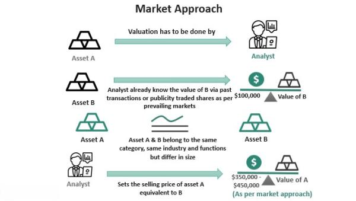

Understanding valuation methods is essential for making informed investment decisions in today's dynamic financial environment. Valuation plays a pivotal role in determining the financial worth of assets, guiding investors and analysts in optimizing their strategies. This article offers an exploration of the market approach to asset valuation, its application within algorithmic trading, and its broader impact on financial strategy formulation.

Valuation techniques can broadly be categorized into three methods: market, cost, and income approaches. The market approach is particularly significant due to its reliance on real-time market data to establish asset values. By examining recent transactions of comparable assets, the market approach offers investors a snapshot of current asset valuations driven by supply and demand dynamics.



Algorithmic trading, which utilizes automated systems to execute trades, integrates these valuation methods to improve decision-making processes. Algorithms depend heavily on quantitative models that factor in various valuation insights to make precise trading decisions. The market approach, with its real-time applicability, is particularly integrated into algorithmic trading systems that operate at high speeds and require immediate data-driven evaluations.

In this article, we will discuss various valuation techniques alongside the application of algorithmic trading. By examining the intersection of these domains, we aim to provide a comprehensive guide for financial professionals to refine their investment strategies. Understanding the synergies between different valuation methods and algorithmic tools is crucial for effectively navigating the complexities of modern financial markets and optimizing strategy formulation and execution precision. This guide is intended to empower professionals with the knowledge needed to leverage valuation insights effectively in an ever-evolving financial landscape.

## Table of Contents

## Overview of Valuation Methods

Valuation methods are fundamental tools for determining the financial worth of a company or asset. In financial markets, accurate valuation is critical for investors, analysts, and financial professionals as it guides investment decisions, capital allocation, and performance assessment. There are three primary valuation methods: the market approach, the cost approach, and the income approach. Each method varies in application, offering distinct strengths and facing specific limitations. Understanding these methods is crucial for assessing asset value comprehensively and strategically addressing diverse financial requirements.

The market approach estimates the value of an asset by examining the recent sales prices of similar assets. This approach is prevalent in industries where comparable data is readily available, such as real estate and publicly traded securities. Its main strength lies in its reflection of current market conditions, leveraging supply and demand dynamics to produce a present-day assessment of value. However, challenges arise when comparable transactions are scarce, as is often the case in unique or private market situations. Consequently, finding reliable proxies may be difficult, affecting the precision of the valuation.

The cost approach determines an asset's value based on the cost required to replace or reproduce it, minus any depreciation. This method is frequently applied to assets with little or no direct market competition, such as specialized machinery or custom-built properties. The cost approach's primary strength lies in its focus on tangible factors, providing a straightforward basis for valuation. Nevertheless, it can overlook market sentiment and external economic conditions that influence asset value. Additionally, accurately estimating depreciation can be complex, adding a layer of uncertainty to the valuation.

The income approach values an asset by calculating the present value of future income streams it is expected to generate. This method is particularly applicable to income-generating assets, such as businesses, investment properties, or patents. Its principal advantage lies in its comprehensive consideration of an asset's [earning](/wiki/earning-announcement) potential over time, using techniques like discounted cash flow (DCF) analysis. A key limitation, however, is the reliance on projections and assumptions about future performance and economic conditions. Selecting the appropriate discount rate is also critical to ensure accurate valuation outcomes.

A formula underpinning the income approach, particularly the DCF method, is the following:

$$

V = \sum_{t=1}^{n} \frac{CF_t}{(1 + r)^t} 
$$

Where:
- $V$ is the present value of the asset.
- $CF_t$ is the cash flow expected in period $t$.
- $r$ is the discount rate.
- $n$ is the number of periods.

In practice, valuation professionals often triangulate these methods to enhance accuracy, providing a more robust valuation by integrating multiple perspectives. Each method's insights complement the others, catering to various financial scenarios and decisions. An in-depth comprehension of these valuation methodologies equips financial professionals with the knowledge necessary to appraise assets effectively, insulating investment strategies from valuation pitfalls and optimizing decision-making in complex financial ecosystems.

## The Market Approach Explained

The market approach is a method of asset valuation that derives its value from the observation of recent sales transactions of similar assets. This technique is largely utilized in sectors where ample comparable data exists, such as real estate and publicly traded securities. By analyzing market transactions, it provides a valuation reflective of current market conditions, influenced heavily by supply and demand dynamics.

### Application

In real estate, the market approach functions through the comparative market analysis (CMA). This involves evaluating sales prices of properties similar in location, size, and features to estimate the value of a subject property. Similarly, in the context of publicly traded securities, the approach considers the market prices of comparable companies or assets. This can be instrumental for investors looking for fair market valuations, especially when considering mergers or acquisitions.

The market approach also enhances financial analysis by offering insights into market trends. It accounts for factors such as economic conditions, interest rates, and sector-specific shifts, which can impact asset prices. These elements help derive a valuation that captures the asset's potential under prevailing market conditions.

### Challenges

While the market approach is effective in markets rich with data, it encounters limitations in niche markets or when private transactions are involved. Scarcity of recent sales data poses significant challenges, leading to less reliable valuations. This is often the case in emerging industries or within non-liquid markets where few comparable transactions exist. Furthermore, adjustments might be necessary to account for differences between the subject asset and the comparables, introducing subjectivity into the valuation process.

Such challenges underscore the need for thorough market research and data analysis. Financial professionals must exercise caution when comparables are limited or when market conditions exhibit significant [volatility](/wiki/volatility-trading-strategies), which may distort valuations derived purely from recent transaction data.

### Conclusion

The market approach remains a cornerstone of asset valuation due to its reliance on market-derived data, providing a robust mechanism to estimate current asset worth. Its efficacy, however, depends on the availability and accuracy of comparable data. As such, it is an invaluable tool in well-established markets but requires adaptive strategies in markets where data scarcity and volatility prevail.

## Integration of Valuation Methods in Algorithmic Trading

Algorithmic trading employs automated systems that utilize quantitative models to execute trades with speed and precision, greatly benefiting from the integration of valuation methods. Valuation methods, particularly the market approach, play a pivotal role in informing buy and sell decisions within these algorithms. By leveraging a variety of valuation techniques, algorithms can process extensive data sets to identify pricing efficiencies and opportunities in the market.

The market approach focuses on the valuation of assets based on recent sales of comparable items. In [algorithmic trading](/wiki/algorithmic-trading), this approach is instrumental for evaluating the relative value of assets, especially when there is ample market data. Algorithms can automate the collection and analysis of such data, ensuring that trades are executed when an asset is perceived to be undervalued when compared to its peers. This integration allows for the rapid adjustment to market movements, which is essential in the dynamic environment of financial markets.

Both absolute and relative valuation models contribute significantly to algorithmic trading strategies. Absolute valuation models, such as discounted cash flow analysis, estimate the intrinsic value of an asset by forecasting future cash flows and discounting them back to present value using a suitable discount rate. However, for algorithmic trading, relative valuation models are often more applicable, as they involve comparing asset prices against each other or against market indices, providing real-time insights into market efficiency. An example of code to calculate the present value using a constant discount rate in Python is as follows:

```python
def discounted_cash_flow(cash_flows, discount_rate):
    present_value = sum(cf / ((1 + discount_rate) ** i) for i, cf in enumerate(cash_flows))
    return present_value

# Example usage for cash flows of $100 per year for 5 years with a 5% discount rate
cash_flows = [100, 100, 100, 100, 100]
discount_rate = 0.05
present_value = discounted_cash_flow(cash_flows, discount_rate)
print(present_value)
```

Algorithmic systems enhance decision-making by refining trade execution and timing based on sophisticated valuation insights. These systems take into account an array of quantitative data, allowing traders to spot inefficiencies and capitalize on [arbitrage](/wiki/arbitrage) opportunities. For instance, if an algorithm identifies an asset as being undervalued based on its market comparables, it can automatically initiate a buy order within milliseconds, minimizing the risk of human-based delays.

Moreover, the integration of valuation methods within these systems enhances predictability in trade outcomes. By constantly updating valuations with the latest market data, algorithmic trading platforms maintain alignment with current market conditions, thus optimizing performance. This element of adaptability is crucial, given the ever-evolving nature of financial markets.

In conclusion, the synergy between valuation methods and algorithmic trading strengthens the capacity of financial professionals to make informed and timely investment decisions. Deploying quantitative valuation techniques allows for the rapid analysis and execution necessary in modern trading landscapes, ensuring that strategies remain robust against fluctuating market dynamics.

## Challenges and Considerations

Valuation methods and algorithmic trading systems are subject to a range of challenges that impact their effectiveness and reliability. One significant challenge is data reliability. Inaccurate or incomplete data can lead to flawed asset valuations and poor trading decisions. The accuracy of valuation models is heavily dependent on the quality of input data, which encompasses historical prices, market trends, and economic indicators. These data points need to be current, consistent, and comprehensive to feed both traditional and algorithmic strategies effectively.

Market volatility is another critical consideration. Sudden market swings can distort the results of valuation models, making it harder to predict long-term trends. This volatility requires valuation methods to be resilient and adaptable, providing a robust framework that can withstand market turbulence. Algorithmic trading systems, which operate at high speeds, must be particularly adept at handling volatility without falling prey to rapid and erroneous trading decisions.

Accurate projections are indispensable for reliable valuations. This involves selecting the appropriate discount rates, which are crucial for determining present value in discounted cash flow analyses. Discount rates must consider the time value of money, risk premiums, and other factors such as market risk and company-specific risks. Errors in estimating these rates can lead to significant deviations in asset valuation.

Algorithmic systems need to account for qualitative factors like market sentiment and geopolitical influences. While quantitative models are good at processing numerical data, qualitative aspects require algorithms to incorporate natural language processing and sentiment analysis to interpret news, social media, and other non-quantitative data sources. For example, geopolitical events impacting market confidence can dramatically alter asset valuations and necessitate immediate algorithmic responses.

Regulatory and ethical considerations are also paramount in designing and implementing algorithmic trading systems. Financial markets are governed by stringent regulations to promote transparency and fairness. Algorithms must comply with these regulations, ensuring fair execution and preventing market manipulation. Ethical considerations include ensuring that trading systems do not inadvertently exploit market weaknesses or contribute to systemic risk. These issues necessitate continuous monitoring and updating of algorithms to align with evolving regulatory landscapes and ethical standards. 

Addressing these challenges requires a multifaceted approach, involving advanced data analytics, risk management practices, and continuous model refinement to maintain the integrity and efficacy of valuation and trading systems.

## Conclusion

Valuation methods and algorithmic trading are integral to modern financial strategy. A comprehensive understanding of these tools enhances investment insights, strategy formulation, and execution precision. By leveraging valuation techniques such as the market, cost, and income approaches, financial professionals gain the ability to assess asset value effectively. This understanding is crucial when integrating these methods into algorithmic trading systems, where they provide quantitative backing for decision-making processes.

Continuous adaptation and innovation in valuation and algorithmic models are essential to meet changing market conditions. As financial markets evolve with technological advancements, incorporating [machine learning](/wiki/machine-learning) and data analytics into algorithmic systems is becoming increasingly pivotal. These innovations assist in refining predictive models and improving the accuracy of asset pricing and market efficiency assessments. Financial professionals must stay abreast of these developments to ensure their strategies remain robust and relevant.

Financial professionals must be equipped with knowledge to use these methodologies effectively in navigating complex financial environments. Understanding both the quantitative and qualitative aspects of market dynamics is crucial. This includes considering factors such as macroeconomic trends, geopolitical influences, and regulatory changes, which can impact valuation and trading decisions. Armed with this expertise, professionals can optimize their investment strategies, enhance portfolio performance, and mitigate risks, ensuring success in an ever-evolving financial landscape.

## References & Further Reading

For a comprehensive understanding of valuation methods, consider exploring Damodaran, A. (2012). "Investment Valuation: Tools and Techniques for Determining the Value of Any Asset." This text provides a thorough examination of various valuation methodologies, including the market, income, and cost approaches. It offers insights into practical applications across different asset classes, making it an essential resource for financial professionals looking to accurately assess asset values.

For insights on algorithmic trading and the integration of machine learning techniques, Lopez de Prado, M. (2018). "Advances in Financial Machine Learning" is an invaluable resource. This book covers advanced concepts in financial machine learning, presenting techniques such as supervised learning algorithms, [backtesting](/wiki/backtesting) frameworks, and the implementation of algorithmic strategies. These insights aid in developing sophisticated trading algorithms that can effectively incorporate valuation data.

Further exploration of integrating valuation in trading strategies can be found in Jansen, S. (2020). "Machine Learning for Algorithmic Trading: Predictive Models to Extract Signals from Market." This text investigates into the application of machine learning models for generating trading signals and constructing algorithmic trading strategies. It demonstrates how predictive models can be used to harness market data for informed decision-making, emphasizing the relationship between valuation metrics and algorithmic trading performance.

