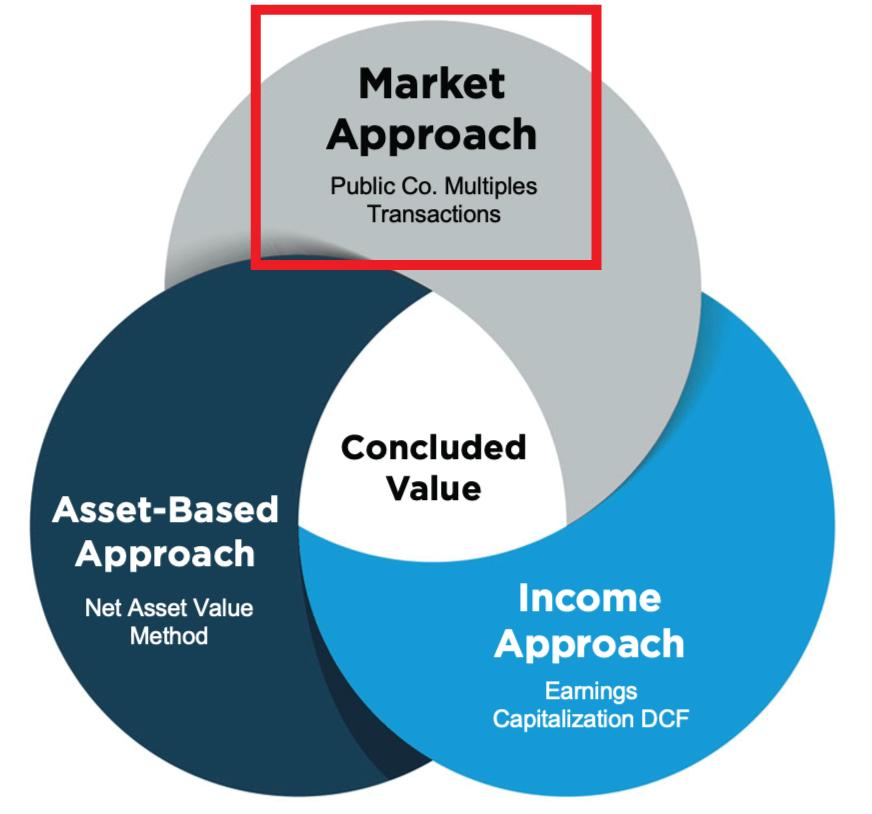

## Table of Contents

## What is the market approach to asset valuation?

The market approach to asset valuation is a way to figure out how much something is worth by looking at what similar items have sold for recently. Imagine you want to know the value of your house. You would look at the prices of other houses in your neighborhood that are similar to yours in size, condition, and features. This helps you get a good idea of what buyers might be willing to pay for your house.

This method is useful because it uses real data from actual sales, making it more reliable than just guessing. However, it can be tricky if there aren't many similar items that have been sold recently, or if the market conditions have changed a lot since those sales happened. Despite these challenges, the market approach is widely used because it gives a clear picture of what the market thinks an asset is worth at a given time.

## How does the market approach differ from other valuation methods?

The market approach to asset valuation is different from other methods because it looks at what similar items have sold for recently. This is like checking the price of houses in your neighborhood to guess how much your house might be worth. Other methods, like the cost approach, focus on how much it would cost to replace the asset or build it from scratch. For example, if you wanted to know the value of a factory, the cost approach would consider the price of the land, building materials, and labor needed to build a similar factory today.

Another method is the income approach, which looks at how much money the asset can make in the future. This is useful for things like rental properties or businesses, where you can predict future earnings. The income approach might calculate the value of a rental property by adding up the expected rent over time and then adjusting for risks and costs. In contrast, the market approach doesn't care about future earnings or replacement costs; it just uses real sales data to estimate value, making it simpler but dependent on having good, recent data.

## What types of assets are typically valued using the market approach?

The market approach is often used to value real estate, like houses and commercial buildings. When someone wants to know how much their house is worth, they look at what similar houses in the same area have sold for recently. This helps them understand what buyers might be willing to pay for their house. It's a simple way to get a good estimate because it uses real sales data, but it works best when there are lots of similar houses that have sold recently.

Another type of asset that is commonly valued using the market approach is publicly traded stocks. If you want to know the value of a company's stock, you can look at the price it's trading at on the stock market. This price is set by what other people are willing to pay for the stock right now. It's a direct way to see the market's opinion on the value of the stock, but it can change quickly based on news and other factors.

The market approach can also be used for valuing other types of assets like art, collectibles, and even some types of business equipment. For example, if you want to know the value of a rare painting, you might look at what similar paintings by the same artist have sold for at recent auctions. This gives you a good idea of what collectors might be willing to pay for your painting. The key is always having enough recent sales data to make a good comparison.

## What are the key steps involved in applying the market approach?

When you want to use the market approach to figure out how much something is worth, the first thing you do is find other things that are similar to what you're valuing. These could be houses in the same neighborhood, stocks of similar companies, or even pieces of art by the same artist. You need to make sure these other things are as close as possible to what you're looking at in terms of size, condition, and features. Once you've found these similar items, you gather information on what they sold for recently. This gives you a good idea of what the market thinks something like your item is worth.

After you have this information, the next step is to compare your item to the ones that sold. You might need to make some adjustments if your item is a bit different. For example, if your house has an extra bathroom compared to the houses you're comparing it to, you might add a bit to its value. Once you've made these adjustments, you can come up with a value for your item based on the prices of the similar items. This value is a good estimate of what someone might be willing to pay for your item, but it works best when you have lots of recent sales data to use for the comparison.

## How do you identify comparable assets for valuation purposes?

To identify comparable assets for valuation purposes, you first need to look for items that are very similar to the one you're valuing. For example, if you're valuing a house, you would look at other houses in the same neighborhood that are about the same size and have similar features, like the number of bedrooms and bathrooms. The more alike the houses are, the better the comparison will be. You can find this information by looking at recent sales data, which is often available through real estate websites, local property records, or real estate agents.

Once you have a list of similar items, you need to make sure they sold recently. The market can change quickly, so using old sales data might not give you a good idea of what your item is worth now. For example, if you're valuing a stock, you would look at the prices of similar stocks over the last few months. After you've found recent sales of comparable items, you might need to make some adjustments if your item is a bit different. For instance, if your house has a bigger yard than the ones you're comparing it to, you might add a little to its value. By doing this, you can come up with a good estimate of what your item is worth based on what similar items have sold for.

## What adjustments might be necessary when using comparable asset data?

When you're using the market approach to figure out how much something is worth, you might need to make some changes to the prices of the similar items you're looking at. These changes help make sure the comparison is fair. For example, if you're valuing a house and it has a bigger kitchen than the houses you're comparing it to, you might add a bit to its value because a bigger kitchen can make a house more valuable. Or, if your house is older and needs some repairs, you might take a bit off its value compared to newer houses that are in better shape.

These adjustments are important because they help you get a more accurate idea of what your item is worth. You need to think about things like the size, condition, and special features of your item compared to the ones you're using for the comparison. If your item is in a better location or has more modern upgrades, you might need to adjust its value upwards. On the other hand, if it's in a less desirable location or has fewer amenities, you might need to adjust its value downwards. By making these adjustments, you can come up with a fair estimate of what your item might be worth in the current market.

## How is the market approach used in real estate valuation?

In real estate valuation, the market approach is used to figure out how much a house or a building is worth by looking at what similar properties have sold for recently. Imagine you want to know the value of your house. You would look at other houses in your neighborhood that are about the same size and have similar features, like the number of bedrooms and bathrooms. By checking the prices these houses sold for, you can get a good idea of what buyers might be willing to pay for your house. This method works well because it uses real sales data, which gives you a clear picture of what the market thinks your property is worth.

Sometimes, you need to make some adjustments when using the market approach. For example, if your house has a bigger yard or a nicer kitchen than the houses you're comparing it to, you might add a bit to its value. On the other hand, if your house is older or needs repairs, you might take a bit off its value compared to newer houses in better condition. These adjustments help make sure the comparison is fair and gives you a more accurate estimate of your house's value. By using recent sales data and making these adjustments, the market approach helps you understand what your property might be worth in today's market.

## Can the market approach be applied to valuing intangible assets? If so, how?

Yes, the market approach can be used to value intangible assets like patents, trademarks, and copyrights. To do this, you look for similar intangible assets that have been sold recently. For example, if you want to know the value of a patent, you would check what other patents in the same field have sold for. This gives you an idea of what buyers might be willing to pay for your patent. The key is finding enough recent sales of similar intangible assets to make a good comparison.

However, valuing intangible assets with the market approach can be trickier than valuing things like houses or stocks. Intangible assets are often unique, and there might not be many recent sales to compare them to. If you find similar assets that sold, you might need to make adjustments. For instance, if your patent covers a more advanced technology than the ones you're comparing it to, you might add to its value. By using recent sales data and making these adjustments, you can get a good estimate of what your intangible asset might be worth in the current market.

## What are the advantages of using the market approach for asset valuation?

The market approach to asset valuation has some big advantages. One of the main ones is that it uses real data from actual sales. This makes it more reliable than just guessing or using other methods that don't look at what people have paid for similar things. When you use the market approach, you're getting a clear picture of what the market thinks your asset is worth right now. This is really helpful because it's based on what people are actually willing to pay, which can give you a good idea of what you might get if you sold your asset.

Another advantage is that the market approach is pretty straightforward. You just need to find other items that are similar to yours and see what they sold for recently. This makes it easier to understand and use compared to other methods that might need more complicated calculations or guesses about the future. Even though you might need to make some adjustments if your item is a bit different from the ones you're comparing it to, the basic idea is simple: use real sales data to figure out value. This simplicity makes the market approach a popular choice for many people trying to value their assets.

## What are the limitations or challenges one might face when using the market approach?

Using the market approach to figure out how much something is worth can be tricky if you don't have a lot of recent sales to look at. If there aren't many similar items that have sold lately, it can be hard to get a good idea of what your item might be worth. This is especially true for things like rare art or unique businesses, where there might not be many sales to compare. Also, the market can change quickly, so if the sales you're looking at are from a while ago, they might not tell you much about what people are willing to pay right now.

Another challenge is making sure the items you're comparing are really similar to yours. If your item has special features or is in a different condition than the ones you're using for comparison, you might need to make adjustments. But figuring out how much to adjust can be hard and might not always be accurate. This can make your estimate less reliable. Even though the market approach is simple and uses real sales data, these challenges can make it tough to get a perfect value for your asset.

## How can the accuracy of valuations using the market approach be improved?

To make valuations using the market approach more accurate, it's important to use the most recent sales data you can find. The market can change quickly, so looking at sales from a long time ago might not give you a good idea of what your item is worth now. Try to find sales that happened in the last few months. Also, make sure the items you're comparing are as similar as possible to yours. The more alike they are in size, condition, and features, the better your comparison will be. If you can find a lot of recent sales of very similar items, your valuation will be more accurate.

Another way to improve accuracy is by making careful adjustments when comparing your item to others. If your item has special features or is in a different condition, you need to adjust its value to make the comparison fair. For example, if your house has a bigger yard than the ones you're comparing it to, you might add a bit to its value. It's important to think about all the ways your item might be different and adjust the value accordingly. By using recent sales data, finding similar items, and making careful adjustments, you can get a more accurate estimate of what your item is worth.

## What advanced techniques can be used to enhance the market approach in complex valuation scenarios?

In complex valuation scenarios, one advanced technique to enhance the market approach is using regression analysis. This method helps you look at many different factors at once, like the size of a house, its age, and even the neighborhood it's in. By using regression analysis, you can figure out how much each of these factors affects the price of similar items. This can give you a more accurate value for your item because it takes into account all these different things, not just the overall price of similar items.

Another technique is using a weighted average of comparable sales. Instead of just looking at the average price of similar items, you can give more importance to the sales that are most like your item. For example, if your house is very similar to one that sold recently, you might give that sale more weight in your calculation. This can help make your valuation more accurate because it focuses more on the sales that are most relevant to your item. By using these advanced techniques, you can get a better idea of what your item might be worth in complex situations.

## What are the different methods used in valuation?

Valuation methods are fundamental tools for determining the financial worth of a company or asset. In financial markets, accurate valuation is critical for investors, analysts, and financial professionals as it guides investment decisions, capital allocation, and performance assessment. There are three primary valuation methods: the market approach, the cost approach, and the income approach. Each method varies in application, offering distinct strengths and facing specific limitations. Understanding these methods is crucial for assessing asset value comprehensively and strategically addressing diverse financial requirements.

The market approach estimates the value of an asset by examining the recent sales prices of similar assets. This approach is prevalent in industries where comparable data is readily available, such as real estate and publicly traded securities. Its main strength lies in its reflection of current market conditions, leveraging supply and demand dynamics to produce a present-day assessment of value. However, challenges arise when comparable transactions are scarce, as is often the case in unique or private market situations. Consequently, finding reliable proxies may be difficult, affecting the precision of the valuation.

The cost approach determines an asset's value based on the cost required to replace or reproduce it, minus any depreciation. This method is frequently applied to assets with little or no direct market competition, such as specialized machinery or custom-built properties. The cost approach's primary strength lies in its focus on tangible factors, providing a straightforward basis for valuation. Nevertheless, it can overlook market sentiment and external economic conditions that influence asset value. Additionally, accurately estimating depreciation can be complex, adding a layer of uncertainty to the valuation.

The income approach values an asset by calculating the present value of future income streams it is expected to generate. This method is particularly applicable to income-generating assets, such as businesses, investment properties, or patents. Its principal advantage lies in its comprehensive consideration of an asset's [earning](/wiki/earning-announcement) potential over time, using techniques like discounted cash flow (DCF) analysis. A key limitation, however, is the reliance on projections and assumptions about future performance and economic conditions. Selecting the appropriate discount rate is also critical to ensure accurate valuation outcomes.

A formula underpinning the income approach, particularly the DCF method, is the following:

$$

V = \sum_{t=1}^{n} \frac{CF_t}{(1 + r)^t} 
$$

Where:
- $V$ is the present value of the asset.
- $CF_t$ is the cash flow expected in period $t$.
- $r$ is the discount rate.
- $n$ is the number of periods.

In practice, valuation professionals often triangulate these methods to enhance accuracy, providing a more robust valuation by integrating multiple perspectives. Each method's insights complement the others, catering to various financial scenarios and decisions. An in-depth comprehension of these valuation methodologies equips financial professionals with the knowledge necessary to appraise assets effectively, insulating investment strategies from valuation pitfalls and optimizing decision-making in complex financial ecosystems.

## References & Further Reading

For a comprehensive understanding of valuation methods, consider exploring Damodaran, A. (2012). "Investment Valuation: Tools and Techniques for Determining the Value of Any Asset." This text provides a thorough examination of various valuation methodologies, including the market, income, and cost approaches. It offers insights into practical applications across different asset classes, making it an essential resource for financial professionals looking to accurately assess asset values.

For insights on algorithmic trading and the integration of machine learning techniques, Lopez de Prado, M. (2018). "Advances in Financial Machine Learning" is an invaluable resource. This book covers advanced concepts in financial machine learning, presenting techniques such as supervised learning algorithms, [backtesting](/wiki/backtesting) frameworks, and the implementation of algorithmic strategies. These insights aid in developing sophisticated trading algorithms that can effectively incorporate valuation data.

Further exploration of integrating valuation in trading strategies can be found in Jansen, S. (2020). "Machine Learning for Algorithmic Trading: Predictive Models to Extract Signals from Market." This text investigates into the application of machine learning models for generating trading signals and constructing algorithmic trading strategies. It demonstrates how predictive models can be used to harness market data for informed decision-making, emphasizing the relationship between valuation metrics and algorithmic trading performance.

