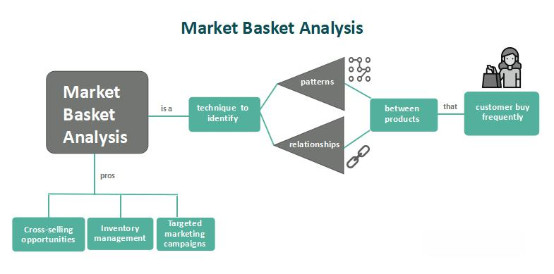

Investment strategies have undergone considerable transformation, influenced by technological advancements and shifts in market dynamics. Historically, investment practices were dominated by traditional approaches such as buying and holding stocks and bonds. However, with the rise of technology, particularly in computing and data analytics, new methodologies have emerged that allow for more sophisticated and responsive investment strategies. These innovations enable investors to better navigate complex financial landscapes, optimize returns, and mitigate risks.

Central to these modern investment strategies are concepts like the market basket and algorithmic trading. A market basket refers to a collection of assets or goods that collectively approximate the overall market or a specific segment therein. It serves a fundamental role in constructing financial products such as index funds, which aim to replicate the performance of a specific segment of the financial market. By spreading investment across multiple assets, market baskets provide a valuable mechanism for diversification, thereby helping investors manage risk more effectively. 



Algorithmic trading, on the other hand, leverages computer programs to execute trades based on predefined criteria. This strategy has revolutionized trading by significantly increasing the speed and precision of trades, minimizing human error, and making it possible to capitalize on fleeting market opportunities. Algorithms can range from simple rules-based systems to complex predictive models, incorporating various financial metrics and signals to make informed decisions.

In exploring these key components, we illuminate how investors today can achieve stronger investment outcomes. By integrating market baskets and algorithmic trading, investors can construct portfolios that align with their risk tolerance and financial objectives, while effectively managing market-related risks. This blend of traditional and innovative strategies underscores the importance of adaptive and informed investment practices in pursuit of sustainable financial growth.

## Table of Contents

## Understanding Investment Strategies

Investment strategies function as essential frameworks guiding investors towards their financial objectives by detailing methods to optimize returns while managing risk. These strategies range from traditional methods such as stock and bond investments to more advanced systems incorporating complex algorithms and diversified market baskets.

Traditional investment strategies typically involve the direct acquisition of stocks and bonds. Stocks represent ownership in a company, giving investors a claim to part of its assets and earnings. Bonds, on the other hand, are fixed-income securities that represent a loan made by an investor to a borrower, often a corporation or government. These conventional methods are grounded in established financial principles and provide investors a relatively straightforward approach to growth and income generation. However, they are not without risk. Stock investments are subject to market volatility and can result in significant fluctuations in value. Bonds, while generally considered more stable, are influenced by [interest rate](/wiki/interest-rate-trading-strategies) movements and credit risks of the issuer.

As markets have evolved, so too have the strategies employed by investors. The rise of technology and data analytics has given birth to more intricate techniques such as [algorithmic trading](/wiki/algorithmic-trading) and the use of market baskets. Algorithmic trading involves the use of computer algorithms to execute trades based on predetermined criteria, enabling rapid and precise trade execution often beyond human capabilities. This strategy can leverage high-frequency trading to exploit minute market trends, thus potentially increasing profitability but also introducing unique challenges such as the need for robust risk management systems.

Market baskets, alternatively, offer an approach centered around diversification. A market basket is essentially a weighted collection of securities representing a segment of the market. By investing in a market basket, investors can spread out risk across multiple assets, thereby reducing exposure to the [volatility](/wiki/volatility-trading-strategies) of a single investment. This strategy is especially beneficial for those seeking a conservative yet effective method to participate in the market.

Each investment strategy carries a distinct risk-return profile. Understanding these profiles is crucial for investors as they strive to align their choices with their financial goals, risk tolerance, and investment horizon. For instance, high-risk strategies might promise substantial returns, but they can also result in significant losses. Conversely, low-risk strategies typically offer modest returns but with greater stability. Mastery of these nuances allows investors to make informed decisions, adapt to changing market conditions, and optimize their portfolios for desired outcomes.

In conclusion, the complexity and variety of modern investment strategies necessitate a profound understanding of their mechanisms and potential implications. Whether leveraging traditional stock and bond methods, engaging in sophisticated algorithmic trading, or diversifying with market baskets, each approach offers unique advantages and challenges. As financial markets continue to evolve, continuous education and strategic adaptability remain vital for investors aiming to achieve their financial aspirations.

## Market Basket Concept in Investing

A market basket in investing is a comprehensive array of financial instruments and goods selected to represent a particular segment of the market. This concept plays a critical role in financial analysis and strategy formulation, particularly in the construction of index funds. Market baskets typically include a diverse range of assets such as equities, bonds, commodities, and derivatives, all chosen to reflect the health or performance of a segment of the market.

The utility of market baskets extends to tracking the performance of financial markets. By aggregating a group of representative securities, investors and analysts can derive insights into market trends and behaviors. This grouping is crucial for statistical measures like the Consumer Price Index (CPI), which uses a market basket of consumer goods and services to gauge price level changes over time. Similarly, in constructing stock market indices like the S&P 500 or Dow Jones Industrial Average, a market basket of stocks is employed to mirror the overall performance of the stock market or specific industries.

Moreover, market baskets provide a robust mechanism for diversification, enabling investors to manage and mitigate risk effectively. By spreading investment capital across a variety of securities, investors can reduce exposure to the failure of any single asset. This diversification is underpinned by the core investment principle that different asset classes or securities may respond differently to the same economic event, thus balancing out potential losses with gains in other parts of the portfolio.

Market baskets also serve as foundational elements in the development of index funds and exchange-traded funds (ETFs). These investment products replicate the performance of a market index by holding a basket of securities that mirrors the index’s composition. This approach offers investors a low-cost, passive investment strategy aligned with market movements, as opposed to actively managed funds that attempt to outperform the market.

In practice, market baskets facilitate more informed investment decisions, allowing for strategic asset allocation. Investors can customize these baskets by selecting assets that meet specific criteria such as risk tolerance, investment horizon, or return objectives. Technologies such as algorithmic trading further enhance the utility of market baskets by enabling automated adjustments to the asset mix in response to market fluctuations, ensuring alignment with investment strategies.

To illustrate the concept programmatically, consider the following Python example, which simulates the construction of a market basket and the calculation of its average performance:

```python
import numpy as np

# Example set of returns for a basket of assets
asset_returns = np.array([
    [0.05, 0.02, 0.01],    # Returns for Asset A
    [0.02, 0.03, 0.04],    # Returns for Asset B
    [0.07, 0.06, 0.05]     # Returns for Asset C
])

# Assign equal weights to each asset
weights = np.array([1/3, 1/3, 1/3])

# Calculate portfolio returns as weighted sum of individual asset returns
portfolio_returns = np.dot(asset_returns, weights)

# Calculate average return of the market basket
average_return = np.mean(portfolio_returns)
print(f"Average Market Basket Return: {average_return:.2%}")
```

This code snippet underscores the principle of diversification within a market basket, highlighting how spread investments can generate an average return reflective of aggregated asset performance.

In summary, the market basket concept remains integral to contemporary investment strategies, offering pathways to track market performance, diversify portfolios, and construct passive investment vehicles. Its emphasis on risk management and consistent market representation makes it a staple in the toolkit of both individual and institutional investors.

## Algorithmic Trading and Its Impact

Algorithmic trading, often referred to as "algo trading," employs sophisticated computer algorithms to execute trades at speeds and accuracies beyond human capability. These algorithms follow defined instructions to make trading decisions, which can encompass a variety of strategies aimed at different market conditions.

One major advantage of algorithmic trading is its ability to execute large orders with minimal market impact. By breaking down orders into smaller parts, it reduces the likelihood of price fluctuations caused by significant single trades. Additionally, the automation inherent in algorithmic strategies substantially diminishes the risk of human error, ensuring consistency in trade execution. 

Speed is another critical attribute. Algorithmic trading enables trades to be executed in fractions of a second, capitalizing on fleeting market opportunities that are typically inaccessible to manual traders. The programmable nature of algorithms allows for trades to occur instantaneously when market conditions align with predefined criteria.

Several key algorithmic strategies include [trend following](/wiki/trend-following), [arbitrage](/wiki/arbitrage), and mean reversion. Trend following strategies capitalize on the [momentum](/wiki/momentum) of asset prices, making purchase or sale decisions based on moving averages or price breakouts. For example, a moving average crossover (when a short-term average crosses a long-term average) could signal a buy or sell order. This strategy assumes that assets trending in a direction will continue in that path.

Arbitrage strategies exploit price discrepancies in different markets or forms. For instance, if a stock is trading at different prices on two exchanges, an algorithm can automatically buy at the lower price and sell at the higher, thus locking in a profit with minimal risk. 

Mean reversion strategies operate on the principle that asset prices will revert to a historical mean or average over time. Thus, algorithms are programmed to identify assets that are overbought or oversold, executing trades that assume a correction to the mean.

The impacts of algorithmic trading are profound, reshaping market dynamics and providing functional efficiencies. It enables more strategic trading approaches that accommodate a vast range of market conditions and trader preferences. However, the precision and speed of algorithmic trading also raise concerns about market stability, as rapid trading can amplify price fluctuations and potentially trigger "flash crashes" if not adequately managed. Despite these concerns, the overall impact of algorithmic trading on modern financial markets remains substantial, promoting advanced risk management and optimized trading operations.

## Risk Management with Algorithmic Strategies

Algorithmic trading offers a robust framework for enhancing risk management through precise control over trade execution and timing. By employing computer algorithms, investors can automate trading strategies to act swiftly upon market conditions, thereby reducing the latency associated with human intervention. This precision enables the management of risks correlated with timing and execution, allowing traders to capitalize on short-lived market opportunities.

One of the core aspects of risk management in algorithmic trading is [backtesting](/wiki/backtesting). By running algorithms on historical market data, traders can evaluate how strategies might perform under various scenarios. This process aids in the optimization of strategies prior to deployment in live markets, minimizing real-time risks and maximizing potential returns. For instance, by simulating trades over a historical dataset, traders can determine the expected return and drawdown performance, paving the way for data-driven decision-making.

Here is a simplistic example of a backtesting process using Python:

```python
import pandas as pd
import numpy as np

# Load historical market data
data = pd.read_csv("historical_data.csv")
data['returns'] = data['close'].pct_change()

# Define a simple moving average strategy
short_window = 40
long_window = 100

signals = pd.DataFrame(index=data.index)
signals['signal'] = 0.0
signals['short_mavg'] = data['close'].rolling(window=short_window, min_periods=1).mean()
signals['long_mavg'] = data['close'].rolling(window=long_window, min_periods=1).mean()

# Generate buy/sell signals
signals['signal'][short_window:] = np.where(signals['short_mavg'][short_window:] > signals['long_mavg'][short_window:], 1.0, 0.0)
signals['positions'] = signals['signal'].diff()

# Compute strategy performance
portfolio = pd.DataFrame(index=signals.index)
portfolio['returns'] = signals['positions'].shift(1) * data['returns']
cumulative_returns = (1 + portfolio['returns']).cumprod()

# Evaluate performance
print(f"Cumulative Return: {cumulative_returns[-1]:.2f}")
```

Despite these advancements, algorithmic trading is not immune to risks. Technology failures, such as software bugs or server downtimes, can disrupt trading strategies and lead to substantial financial losses. Furthermore, the inherent unpredictability of financial markets poses challenges; unforeseen market events can cause strategies to deviate significantly from expected outcomes. For this reason, vigilant oversight and continuous adjustment are imperative. Investors should maintain a robust risk management protocol that includes regular reviews of algorithm performance and contingency planning for system failures.

Moreover, while backtesting provides a foundation for strategy validation, overfitting to historical data remains a risk. A strategy that performs exceptionally well on past data might not necessarily succeed in the future due to changes in market conditions or structural shifts. Therefore, ongoing assessment and adaptation of strategies are critical, ensuring they remain aligned with the investor's risk appetite and market developments.

## Integrating Market Baskets in Algo Trading

Market baskets are an essential component in algorithmic trading strategies for enhancing diversification and aligning investment portfolios with market indices. By incorporating a variety of securities, market baskets provide a representative cross-section of a specific market segment, thereby spreading risk and reducing the impact of volatility associated with individual assets. 

Integrating market baskets into algorithmic trading strategies involves leveraging algorithmic systems to manage and execute trades for these baskets automatically. Algorithmic trading can apply various strategies such as mean-variance optimization, which aims to balance expected return against risk by adjusting the weights of assets in a basket. This approach aligns with Markowitz’s Modern Portfolio Theory, aiming to construct an "efficient frontier" of optimal portfolios offering the maximum possible return for a given level of risk, expressed as:

$$

\min \sigma^2_p = w^T \Sigma w 
$$

Subject to: 

$$

w^T \mu = \mu_p 
$$

$$

w^T \mathbf{1} = 1 
$$

where $w$ is the vector of weights for each asset, $\Sigma$ is the covariance matrix of asset returns, $\mu$ is the vector of expected returns, $\mu_p$ is the target portfolio return, and $\mathbf{1}$ is a vector of ones.

Investors can customize market baskets through algorithmic trading systems by employing different weighting criteria such as equal weighting, market-cap weighting, or the fundamental weighting of assets. While equal weighting assigns the same weight to each security in a basket, market-cap weighting adjusts weights based on the size of the companies, thereby aligning more closely with market indices. Fundamental weighting considers financial metrics like earnings or revenue.

These strategies enhance portfolio diversification by reducing concentration risk, as the inclusion of various asset classes or sectors can blanket an investor against poor performance by any single entity. Moreover, through algorithmic trading, real-time market data can be utilized to continuously rebalance these baskets, ensuring consistent alignment with the desired investment objectives and indices.

The integration of market baskets in algo trading not only improves portfolio diversification but also facilitates better risk management by providing a systematic approach to adjust and align investments with evolving market conditions. This capability is valuable for investors seeking to mitigate specific asset risks while maintaining a dynamic and responsive trading strategy, ensuring objectives are met in line with market dynamics.

## Benefits and Challenges of Modern Trading Strategies

Algorithmic and basket trading have revolutionized contemporary investment strategies, offering significant benefits such as efficiency, diversification, and cost savings. These modern trading strategies capitalize on technological advancements and mathematical models to make informed investment decisions that enhance the potential for returns while mitigating risks.

One of the primary advantages of algorithmic trading is its ability to execute trades with remarkable speed and accuracy. By utilizing pre-programmed trading instructions, investors can reduce human error and capitalize on fleeting market opportunities. This instantaneous execution enables traders to respond to market changes in real-time, enhancing their ability to capture favorable pricing.

Additionally, algorithmic trading allows for substantial diversification within investment portfolios. By leveraging market baskets, which constitute a collection of assets representing specific market sectors, investors can distribute their investments across a broad spectrum of financial instruments. This diversification aids in managing risk by reducing the impact of any single asset's poor performance on the overall portfolio.

Cost savings also represent a significant benefit of these modern strategies. Automated trading reduces transaction costs by minimizing the need for manual intervention and lowering labor expenses associated with trading operations. Efficient trade execution often results in better pricing, while economies of scale can further amplify cost benefits.

Despite these advantages, challenges still exist in the development and execution of modern trading strategies. Crafting effective algorithms and maintaining their relevance in rapidly changing markets requires significant expertise and resources. Complex mathematical models demand constant refinement and adaptation to align with evolving market conditions and ensure optimal outcomes.

Unforeseen market events pose another critical challenge for algorithmic and basket trading. Market volatility can lead to unpredictable price swings, affecting the performance of even well-crafted algorithms. Sudden changes in economic indicators, geopolitical events, or regulatory shifts can disrupt trading strategies, leading to potential losses.

To address these challenges, continuous monitoring of trading systems is imperative. Algorithms and portfolios need regular assessment and rebalancing to maintain alignment with investment objectives and respond to market dynamics efficiently. Investors must remain vigilant and adaptable, employing robust risk management techniques to navigate the complexities of modern trading landscapes.

In conclusion, while algorithmic and basket trading offer extensive benefits that can enhance investment efficiency and returns, they also present unique challenges related to strategy development and market unpredictability. Successful implementation requires a nuanced understanding of financial markets, continuous oversight, and a commitment to refining strategies in response to emerging trends and risks.

## Conclusion

Investing in today's financial markets necessitates the application of both traditional and modern strategies to maximize returns while managing risks. In this evolving landscape, a blend of conventional investing methods and innovative approaches like market baskets and algorithmic trading proves to be indispensable. 

Market baskets offer investors a structured way to diversify their portfolios by encompassing a broad selection of assets that mirror specific market segments or indices. This diversification minimizes individual asset risk and provides a more stable return profile, which is crucial in maintaining a balanced portfolio.

On the other hand, algorithmic trading introduces unparalleled speed, precision, and efficiency. By employing pre-defined criteria and computer algorithms, investors can execute trades almost instantaneously, thus capitalizing on fleeting market opportunities that are often missed when relying solely on human intervention. This automated trading reduces the risk of human error and can significantly enhance the timing of trade executions.

The true potential of these strategies is realized when they are integrated. Incorporating market baskets into algorithmic trading strategies can further enhance diversification and alignment with broader market movements, allowing investors to hedge against specific risks efficiently. For instance, investors might create algorithms that dynamically adjust the weighting of different assets within a basket based on real-time market data, thereby optimizing the portfolio's risk-return characteristics.

Staying informed and adaptable is vital to exploiting these strategies effectively. As markets continue to evolve, so do the technologies and methodologies available to investors. Continuous education and adaptation allow investors to refine their strategies in response to new challenges and opportunities, ensuring sustainable financial growth over the long term. Leveraging these advanced tools with informed oversight can lead to significant competitive advantages and robust investment outcomes.

## References & Further Reading

[1]: Bergstra, J., Bardenet, R., Bengio, Y., & Kégl, B. (2011). ["Algorithms for Hyper-Parameter Optimization."](https://papers.nips.cc/paper/4443-algorithms-for-hyper-parameter-optimization) Advances in Neural Information Processing Systems 24.

[2]: ["Advances in Financial Machine Learning"](https://www.amazon.com/Advances-Financial-Machine-Learning-Marcos/dp/1119482089) by Marcos Lopez de Prado

[3]: ["Evidence-Based Technical Analysis: Applying the Scientific Method and Statistical Inference to Trading Signals"](https://books.google.com/books/about/Evidence_Based_Technical_Analysis.html?id=MeoJAQAAMAAJ) by David Aronson

[4]: ["Machine Learning for Algorithmic Trading"](https://github.com/stefan-jansen/machine-learning-for-trading) by Stefan Jansen

[5]: ["Quantitative Trading: How to Build Your Own Algorithmic Trading Business"](https://www.amazon.com/Quantitative-Trading-Build-Algorithmic-Business/dp/1119800064) by Ernest P. Chan