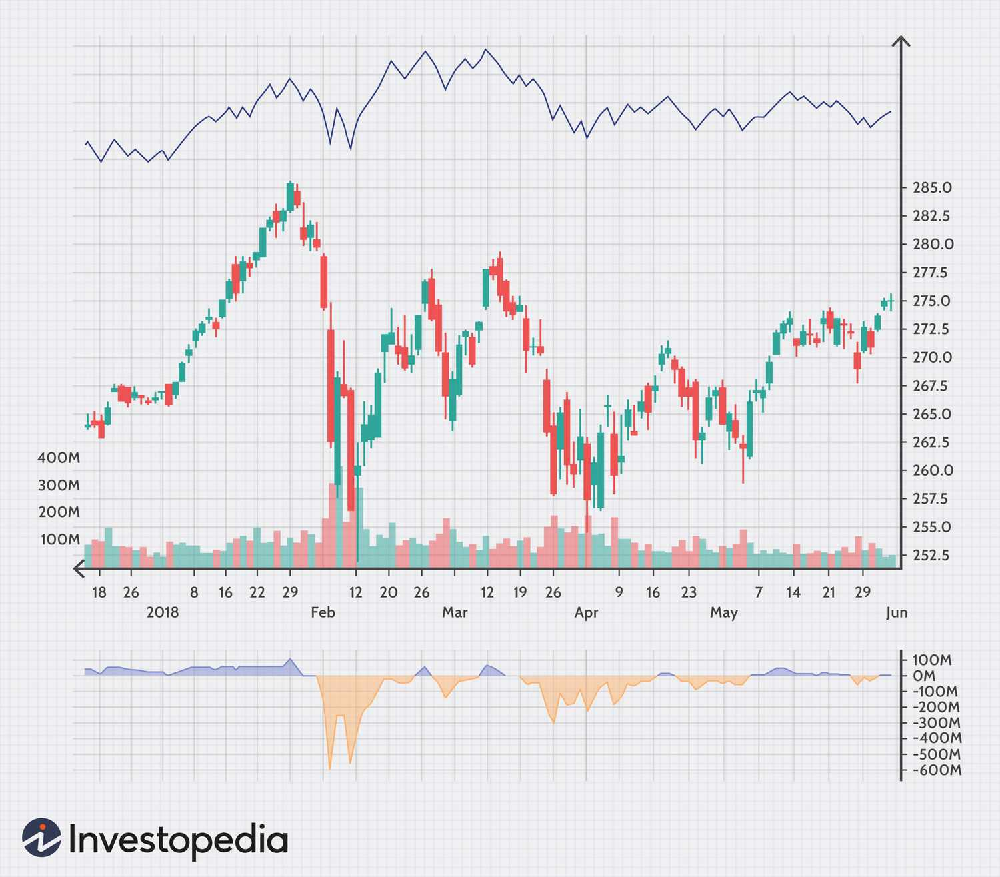

## Table of Contents

## What is market breadth and why is it important for investors?

Market breadth is a way to measure how many stocks are participating in a market move. It looks at the number of stocks that are going up or down, not just the overall market index like the S&P 500. For example, if the market index is going up, but only a few stocks are responsible for that increase, the market breadth might be considered weak. On the other hand, if many stocks are going up together, the market breadth is strong.

Market breadth is important for investors because it gives them a better idea of how healthy the market is. If the market is going up, but the breadth is weak, it might mean that the market's rise is not very stable and could be led by just a few big companies. This can be a warning sign for investors. On the other hand, if the market is going up and the breadth is strong, it suggests that the market's rise is more widespread and likely to be more sustainable. This can give investors more confidence in the market's direction.

## How can market breadth help in understanding market trends?

Market breadth helps us see if a market trend is strong or weak. When many stocks are moving in the same direction as the overall market, it shows that the trend is strong and lots of people believe in it. For example, if the stock market is going up and most stocks are also going up, this tells us that the upward trend is supported by many investors, making it more likely to continue.

On the other hand, if the market is going up but only a few stocks are responsible for this rise, the trend might not be as strong. This can happen when big companies pull the market up, but smaller companies don't follow. It suggests that the upward trend might not last long because it's not supported by a broad group of stocks. By looking at market breadth, investors can get a better idea of whether to trust the current market trend or be cautious.

## What are the basic indicators of market breadth?

There are a few basic indicators that help us understand market breadth. One common indicator is the advance-decline line. This measures the number of stocks that go up (advance) versus the number that go down (decline) on a given day. If more stocks are going up than down, it means the market breadth is strong. Another indicator is the number of stocks hitting new highs or new lows. If many stocks are reaching new highs, it suggests that the market's upward trend is strong and widespread.

Another useful indicator is the up volume and down volume. This looks at the total trading volume of stocks that go up compared to those that go down. If the up volume is much higher than the down volume, it shows strong buying interest across many stocks, indicating good market breadth. By keeping an eye on these indicators, investors can get a clearer picture of whether the market's movement is supported by many stocks or just a few.

## How does the Advance-Decline Line work as a market breadth indicator?

The Advance-Decline Line is a simple way to see how many stocks are going up or down in the market. Every day, you count how many stocks increased in price (advanced) and how many decreased (declined). If you subtract the number of declining stocks from the number of advancing stocks, you get a number. You add this number to the previous day's total to make the Advance-Decline Line. If this line is going up over time, it means more stocks are going up than down, which shows the market is strong.

This indicator helps investors understand if the market's movement is supported by many stocks or just a few. For example, if the stock market index like the S&P 500 is going up, but the Advance-Decline Line is going down, it means only a few big stocks are pulling the market up while many others are not doing well. This can be a warning sign that the market's upward trend might not last. On the other hand, if both the market index and the Advance-Decline Line are going up, it's a good sign that the market's strength is widespread and more likely to continue.

## What is the McClellan Oscillator and how is it calculated?

The McClellan Oscillator is another way to look at market breadth. It helps us see if the market's movement is strong or weak by using the difference between the number of stocks that go up and the number that go down. This tool was created by Sherman and Marian McClellan. It's a bit more complicated than the Advance-Decline Line because it uses something called exponential moving averages, which are ways to smooth out data over time.

To calculate the McClellan Oscillator, you first need the daily advance-decline data. Then, you find the 19-day and 39-day exponential moving averages of this data. The McClellan Oscillator is the difference between these two averages. If the result is positive, it means the shorter-term average is higher than the longer-term average, suggesting that the market is getting stronger. If it's negative, it means the market might be getting weaker. This tool helps investors see if the market's trend is likely to keep going or if it might change soon.

## How can the Arms Index (TRIN) be used to gauge market sentiment?

The Arms Index, also known as TRIN, helps investors understand how people feel about the market. It does this by comparing how many stocks are going up or down with how much money is being spent on them. If the TRIN number is low, it means more people are buying stocks than selling them, which shows that people feel good about the market. On the other hand, if the TRIN number is high, it means more people are selling than buying, which can show that people are worried or not sure about the market.

By looking at the TRIN, investors can get a quick idea of whether the market's mood is positive or negative. If the TRIN stays low for a while, it might mean that the market will keep going up because people are happy to buy stocks. But if the TRIN stays high, it might be a sign that the market could go down because people are selling more than they're buying. This can help investors decide if they should buy or sell their stocks.

## What role does the High-Low Index play in assessing market breadth?

The High-Low Index helps us see how many stocks are doing really well or really badly in the market. It looks at the number of stocks that reach new highs and the number that hit new lows over a certain time, like 52 weeks. If the High-Low Index is high, it means lots of stocks are reaching new highs, which shows that the market is strong and many companies are doing well. If the index is low, it means more stocks are hitting new lows, which can be a sign that the market is weak.

This index is useful because it gives us a quick way to check if the market's movement is supported by many stocks or just a few. For example, if the stock market index like the S&P 500 is going up, but the High-Low Index is low, it might mean that only a few big stocks are pulling the market up while many others are not doing well. This can warn investors that the market's upward trend might not last. On the other hand, if both the market index and the High-Low Index are going up, it's a good sign that the market's strength is widespread and more likely to continue.

## How do volume-based indicators like On-Balance Volume (OBV) contribute to market breadth analysis?

Volume-based indicators like On-Balance Volume (OBV) help us understand market breadth by looking at how much money is being spent on stocks. OBV adds up the volume of a stock on days when its price goes up and subtracts the volume on days when the price goes down. If the OBV is going up, it means more money is being spent on buying stocks than selling them, which shows that people believe in the market's upward trend. This can be a sign that the market's strength is real and supported by many investors.

When we look at OBV for the whole market, it helps us see if the market's movement is backed by strong buying or selling. If the market index is going up and the OBV is also going up, it means the market's rise is supported by many stocks and a lot of buying. This makes the trend more likely to last. But if the market is going up and the OBV is not, it might mean that only a few big stocks are pulling the market up, which can be a warning sign that the trend might not continue. By using OBV, investors can get a better idea of whether the market's direction is trustworthy or not.

## Can you explain the use of Breadth Thrust as an indicator of market momentum?

Breadth Thrust is a way to see if the market is getting a lot of energy quickly. It looks at how many stocks are going up compared to how many are going down over a short time. If a lot more stocks start going up suddenly, it's called a Breadth Thrust. This can mean that the market is about to start a big move up because many people are buying stocks at the same time.

When investors see a Breadth Thrust, it can be a sign that the market is getting stronger and might keep going up. It's like a signal that tells us the market's mood is changing from unsure to excited. By watching for these moments, investors can decide if it's a good time to buy stocks because the market might be starting a new trend.

## How do sector-specific breadth indicators help in diversifying investment strategies?

Sector-specific breadth indicators help investors understand how different parts of the market are doing. Each sector, like technology, healthcare, or energy, can have its own advance-decline line or other breadth measures. By looking at these, investors can see which sectors are strong and which ones are weak. This helps them spread their investments across different sectors, so they don't put all their money in one place. If one sector is not doing well, but another is doing great, investors can move their money to the better-performing sector.

Using sector-specific breadth indicators can make an investment strategy safer and potentially more profitable. For example, if the technology sector is showing a strong advance-decline line, it might be a good time to invest more in tech stocks. On the other hand, if the energy sector's breadth indicators are weak, it might be wise to reduce investments there. By paying attention to these indicators, investors can adjust their portfolios to take advantage of strong sectors and avoid weak ones, leading to a more balanced and diversified investment approach.

## What advanced techniques can be used to combine multiple market breadth indicators for better predictive power?

Combining multiple market breadth indicators can help investors get a better idea of what the market might do next. One way to do this is by using a method called "divergence analysis." This means looking at different indicators like the Advance-Decline Line, the McClellan Oscillator, and the Arms Index (TRIN) at the same time. If these indicators are all moving in the same direction, it can make the market's trend seem stronger and more likely to continue. But if some indicators are going up while others are going down, it might mean the market is not as strong as it looks, and a change could be coming soon.

Another way to use multiple indicators is by creating a "composite index." This means taking the data from different breadth indicators and putting them together into one number. For example, you could add up the values of the High-Low Index, On-Balance Volume (OBV), and Breadth Thrust to make a new index. If this composite index is going up, it can show that the market is getting stronger from many different angles. By using a composite index, investors can see a clearer picture of the market's health and make better decisions about buying or selling stocks.

## How have market breadth indicators evolved with the advent of algorithmic trading and big data?

Market breadth indicators have changed a lot because of [algorithmic trading](/wiki/algorithmic-trading) and big data. Now, computers can look at huge amounts of data really fast, which means they can use more and different kinds of information to make these indicators better. For example, algorithms can look at lots of different stocks at the same time and see patterns that people might miss. This helps make the indicators more accurate and useful for predicting what the market might do next.

Also, big data has made it possible to use more types of information in market breadth indicators. Before, people mostly looked at things like how many stocks went up or down and how much they were traded. But now, they can use things like news stories, social media posts, and even weather reports to see how the market might move. This makes the indicators more complete and gives investors a better idea of the market's mood and direction.

## What are the key aspects of understanding investment indicators?

Investment indicators are essential tools in analyzing the performance and forecasting the potential direction of financial markets. These tools assist investors in making informed decisions by providing quantitative and qualitative insights into market dynamics.

One of the primary metrics used is the moving average, which smooths out price data over a specified period and helps identify trends. The formula for a simple moving average (SMA) is:

$$
\text{SMA} = \frac{P_1 + P_2 + \ldots + P_n}{n}
$$

where $P_1, P_2, \ldots, P_n$ are the closing prices over $n$ time periods.

Volume, another critical indicator, reflects the amount of trading activity and [liquidity](/wiki/liquidity-risk-premium) in the market. It is a powerful measure when combined with price movements, indicating the strength or weakness of a price trend. High [volume](/wiki/volume-trading-strategy) on price increases may suggest strong market interest and possible trend continuation, while decreasing volume might indicate a waning trend.

Momentum indicators, such as the Relative Strength Index (RSI) and Moving Average Convergence Divergence (MACD), help assess the speed and change of price movements. RSI, for example, measures the magnitude of recent price changes to evaluate overbought or oversold conditions. Its formula is:

$$
\text{RSI} = 100 - \frac{100}{1 + \frac{\text{Average Gain}}{\text{Average Loss}}}
$$

These investment indicators, when used collectively, offer comprehensive insights into market health. They allow investors to pinpoint potential opportunities and risks, facilitating the creation of robust investment strategies. Tailoring these strategies to specific market conditions can significantly enhance performance and mitigate risks, ensuring more informed and strategic investment decisions.

## What is the Role of Financial Analysis?

Financial analysis encompasses the evaluation of businesses, projects, budgets, and financial markets to determine their past performance and forecast future prospects. This analysis plays a pivotal role in decision-making processes within financial markets, offering two primary approaches: fundamental and technical analysis, each providing distinct insights.

**Fundamental Analysis**

Fundamental analysis aims to establish a company's intrinsic value by examining a multitude of economic and financial factors. This approach involves a thorough analysis of financial statements, including balance sheets, income statements, and cash flow statements, to understand a company's underlying value. Key components under evaluation include revenue, earnings, future growth, return on equity, profit margins, and other data to assess an organization's financial health and earnings potential.

One popular method in [fundamental analysis](/wiki/fundamental-analysis) is the Discounted Cash Flow (DCF) model, which calculates a company's value by forecasting its free cash flows and discounting them back to their present value. The formula for DCF is:

$$
\text{DCF} = \sum \frac{CF_t}{(1+r)^t}
$$

where $CF_t$ is the cash flow in year $t$, and $r$ is the discount rate. This approach provides a detailed view of the company's potential to generate future cash flow, aiding investors in determining whether the stock is undervalued or overvalued compared to its market price.

**Technical Analysis**

In contrast, technical analysis focuses on statistical trends derived from historical market data, primarily price and volume, to predict future price actions. This form of analysis does not seek to measure a security's intrinsic value, but rather uses charts and other tools to identify patterns and trading signals.

Technical analysts employ numerous indicators, such as moving averages, relative strength index (RSI), and Bollinger Bands, to make trading decisions. For instance, moving averages help smooth out price data to identify the direction of the trend, while RSI is used to identify overbought or oversold conditions in a market.

A simple moving average (SMA) calculation, which is commonly used in technical analysis, is represented as:

$$
\text{SMA} = \frac{P_1 + P_2 + \cdots + P_n}{n}
$$

where $P$ represents the price points over $n$ time periods.

Both fundamental and technical analyses are crucial for investors aiming to construct a comprehensive picture of potential investment opportunities. While fundamental analysis provides a deep dive into the company's real value and economic standing, technical analysis offers insights into market sentiment and timing of investments, enabling investors to strategize effectively in a diverse and dynamic marketplace.

## References & Further Reading

[1]: Menkhoff, L. (2010). ["The Use of Technical Analysis by Fund Managers: International Evidence."](https://www.sciencedirect.com/science/article/pii/S0378426610001755) Journal of Banking & Finance.

[2]: Murphy, J. J. (1999). ["Technical Analysis of the Financial Markets."](https://drive.google.com/file/d/1OcDrGakDhaejT7J7xGEE3HHKy7xmrafy/preview) New York Institute of Finance.

[3]: Lo, A. W., & Hasanhodzic, J. (2010). ["The Heretics of Finance: Conversations with Leading Practitioners of Technical Analysis."](https://archive.org/details/hereticsoffinanc0000loan) Bloomberg Press.

[4]: Chan, E. (2013). ["Algorithmic Trading: Winning Strategies and Their Rationale."](https://github.com/ftvision/quant_trading_echan_book) Wiley Trading Series.

[5]: Martin, J. D., & Basu, S. K. (2018). ["Quantitative Analysis, Derivatives Modeling, and Trading Strategies."](https://worldscientific.com/worldscibooks/10.1142/4228) Wiley.