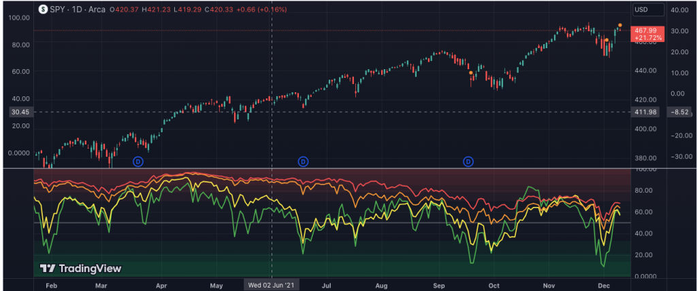

Market breadth indicators serve as essential tools for traders and investors, providing key insights into the overall health and dynamics of the financial market. These indicators analyze the ratio of advancing stocks to declining stocks, thereby assessing market momentum and investor sentiment. The core idea is to measure the breadth of market participation in price movements, offering a more nuanced view beyond mere price changes of major indices. For example, a market index might be rising, but if only a few large-cap stocks are pushing the index higher while a majority of stocks are declining, it suggests a weaker market condition than the index would imply.

In recent years, these indicators have been integrated into algorithmic trading strategies, where they contribute to optimizing decision-making processes. Algorithmic trading relies heavily on quantitative data and statistical methods to execute trading strategies automatically. By incorporating market breadth indicators, algorithms can more accurately gauge the prevailing market conditions and adjust strategies accordingly to manage risks and capitalize on opportunities. Common market breadth indicators include the Advance-Decline Line (A/D Line), which tracks the cumulative sum of advancing versus declining stocks, and the New Highs-Lows Index, which compares the number of stocks reaching new highs to those hitting new lows.



Algorithmic systems utilize these indicators along with other technical and fundamental data to refine the execution of strategies, ultimately enhancing the precision and effectiveness of trades. The ability of algorithms to process vast amounts of market data rapidly enables them to respond to market trends with speed and accuracy, reducing human intervention and emotional biases in trading decisions. Consequently, market breadth indicators represent not only a traditional tool for market analysis but also a critical component in the advancement of automated trading systems.

## Table of Contents

## Understanding Market Breadth Indicators

Market breadth indicators are essential analytical tools used by traders and investors to gauge the overall health and dynamics of the stock market. By tracking the number of advancing versus declining stocks, these indicators provide a clear picture of the market's internal strength and potential future movements.

A key function of market breadth indicators is their ability to identify prevailing trends. When a significant number of stocks are advancing, it typically signals a bullish trend; conversely, a predominance of declining stocks suggests bearish conditions. This capability to confirm market movements is particularly advantageous in validating the signals from other technical analysis tools. Additionally, breadth indicators are adept at detecting potential reversals, which are crucial for optimizing entry and exit points in trading strategies.

Among the most common types of market breadth indicators are the Advance-Decline (A/D) Line, the New Highs-Lows Index, and the TRIN (Arms Index). 

The Advance-Decline Line is one of the simplest and most widely used indicators. It is calculated as the cumulative sum of the difference between the number of advancing and declining stocks in the market. Mathematically, it can be expressed as:

$$
\text{A/D Line} = \sum (\text{Advancing Stocks} - \text{Declining Stocks})
$$

The New Highs-Lows Index provides an additional layer of market analysis by measuring the difference between stocks reaching new 52-week highs and those hitting new lows. This indicator is instrumental in highlighting the underlying [momentum](/wiki/momentum) and potential turning points within the market.

The TRIN (Arms Index) is slightly more complex; it compares the number of advancing/declining stocks with the advancing/declining [volume](/wiki/volume-trading-strategy). The formula for TRIN is:

$$
\text{TRIN} = \left( \frac{\text{Advancing Issues}}{\text{Declining Issues}} \right) \div \left( \frac{\text{Advancing Volume}}{\text{Declining Volume}} \right)
$$

Values below 1.0 are considered bullish, indicating strong buying pressure, while values above 1.0 suggest bearish conditions.

Overall, market breadth indicators serve as pivotal components of technical analysis, enhancing the trader's ability to forecast market conditions accurately. These tools are particularly useful when combined with other analytical methods, providing a comprehensive view of market trends and potential reversals.

## Types of Market Breadth Indicators

Market breadth indicators are essential tools in financial analysis, offering a clear view of the market's overall direction by evaluating the behavior of stocks. Among these, the Advance-Decline (A/D) Line, the Zweig Breadth Thrust Indicator, and the McClellan Oscillator are prominent.

The **Advance-Decline (A/D) Line** is one of the simplest yet effective market breadth indicators. It is calculated by taking the difference between the number of advancing stocks (stocks closing higher than their previous close) and declining stocks (stocks closing lower than their previous close) each day. This net difference is then added to a cumulative total. The formula for the daily calculation is as follows:

$$
\text{A/D Line} = (\text{Advancing Stocks} - \text{Declining Stocks}) + \text{Previous A/D Line}
$$

This indicator provides insights into the underlying market strength. A rising A/D Line suggests that more stocks are participating in the upward movement, implying a robust market, while a declining A/D Line indicates a potential weakness.

The **Zweig Breadth Thrust Indicator** is designed to identify bullish market conditions. It calculates a ratio of the number of advancing stocks to the total number of stocks and involves a rapid momentum shift. The indicator signals a bullish market when this ratio moves from below 0.40 to above 0.615 within ten trading days. This quick shift suggests a significant change in market sentiment, often marking the beginning of a considerable market rally. 

Finally, the **McClellan Oscillator** is a momentum indicator derived from the difference between two exponential moving averages (EMAs) of the advance-decline data. It is typically calculated using the 19-day and 39-day EMAs. The formula is given by:

$$
\text{McClellan Oscillator} = \text{EMA}_{19}(\text{A-D}) - \text{EMA}_{39}(\text{A-D})
$$

Where $\text{EMA}_{19}$ and $\text{EMA}_{39}$ are the 19-day and 39-day exponential moving averages of the daily advance-decline data, respectively. The McClellan Oscillator is an effective tool for evaluating whether the market is in an overbought or oversold condition. Positive values suggest an upward momentum, whereas negative values imply downward momentum.

Incorporating these indicators enables traders and algorithmic systems to assess market dynamics, aiding them in making informed decisions. The Advance-Decline Line depicts overall market trends, the Zweig Breadth Thrust highlights sudden bullish shifts, and the McClellan Oscillator provides insights into market momentum and potential reversal points.

## Calculating Market Breadth Indicators

Market breadth indicators are essential tools in analyzing market dynamics, offering insights into market engagement and potential shifts in trends. Their calculations, though straightforward, provide valuable metrics for traders and investors.

### Advance-Decline Line (A/D Line)

The Advance-Decline Line is a fundamental market breadth indicator. It is calculated by determining the net difference between advancing and declining stocks each trading day. The formula is:

$$
\text{A/D Line} = \sum (\text{Advancing Stocks} - \text{Declining Stocks})
$$

In practical terms, if more stocks are advancing than declining, the A/D line will trend upward, indicating potential bullish sentiment. Conversely, if declining stocks outpace advancing ones, a downward trend in the A/D line may suggest bearish sentiment.

### New Highs-Lows Index

The New Highs-Lows Index compares stocks reaching new 52-week highs to those hitting new 52-week lows. This index offers insights into the general health of the market by focusing on extremes. The calculation is expressed as:

$$
\text{New Highs-Lows Index} = \frac{(\text{Number of New Highs}) - (\text{Number of New Lows})}{\text{Total Stocks}}
$$

A higher value indicates a greater number of stocks hitting new highs compared to lows, often interpreted as a positive market sentiment. Conversely, a negative value may highlight potential underlying market weaknesses.

### Application and Interpretation

Understanding these indicators requires recognizing the context in which they are applied. While straightforward in calculation, the implications of these trends must be interpreted in conjunction with other market data and indicators. For instance, a consistently rising A/D line may suggest a robust market, but external economic factors and market news should also be considered.

Incorporating these indicators into [algorithmic trading](/wiki/algorithmic-trading) can significantly enhance the decision-making process. By leveraging historical data and real-time analysis, algorithms can execute trades with greater precision, adjusting for shifts in market breadth as they occur.

## Using Market Breadth Indicators in Trading

Market breadth indicators are instrumental in confirming signals derived from technical analysis. They help identify potential market transitions by providing insights into the general market direction and the strength behind price movements. These indicators enable traders to ascertain whether market trends are gaining or losing momentum and to evaluate the health of the broader market.

A common practice among traders is to combine market breadth indicators with other technical indicators, such as moving averages, to develop more robust trading strategies. For example, a trader might use an Advance-Decline Line (A/D Line) in conjunction with a moving average crossover strategy. When the A/D Line confirms an upward crossover of moving averages, it can signal a stronger bullish trend, providing greater confidence in the buy signal.

In algorithmic trading, these indicators are integrated into trading algorithms to enhance strategy execution and risk management. Algorithms can analyze large data sets in real-time, allowing them to execute trades with precision and speed, which is critical for capitalizing on short-lived market opportunities. By utilizing market breadth indicators, algorithms can refine entry and [exit](/wiki/exit-strategy) points, ensuring trades are executed under optimal conditions.

These indicators also help in assessing portfolio risk. By understanding market sentiment and breadth, algorithms can adjust position sizes and manage exposure to different market segments. For instance, a broad market decline indicated by negative breadth readings might prompt an algorithm to reduce overall exposure or shift towards defensive assets.

Incorporating breadth indicators into algorithmic systems not only aids in accurate trend detection but also reduces human intervention. This minimizes the impact of emotional biases, leading to more calculated and systematic trading decisions. As a result, traders can develop adaptable strategies that respond to evolving market conditions effectively.

## Market Breadth Indicators in Algorithmic Trading

Incorporating market breadth indicators into algorithmic trading strategies greatly enhances data-driven decision-making processes. Algorithms are capable of processing vast volumes of market data rapidly, a critical feature given the fast-paced nature of financial markets. This capability allows them to identify subtle yet significant trends in the market with greater speed and precision than human traders.

Market breadth indicators, like the Advance-Decline Line or the McClellan Oscillator, serve as reliable metrics within these algorithms. By providing real-time data on the number of advancing versus declining stocks, these indicators offer insights into the overall market sentiment. When coupled with algorithms, they improve the accuracy of entry and exit points in trading strategies. This optimizes trades by strategically scheduling buy or sell orders to maximize profitability.

Moreover, using algorithms reduces human intervention in trading, which consequently minimizes emotional bias. Emotional decisions, often driven by fear or greed, can lead to suboptimal trading choices. By integrating market breadth indicators into algorithmic platforms, traders can adopt a more systematic approach that emphasizes objective data analysis over subjective decision-making. This is particularly useful in high-frequency trading, where decisions need to be made in milliseconds.

In practical terms, the implementation of such an algorithm might involve setting thresholds based on the calculated values of these indicators. For instance, a Python-based algorithm might utilize the pandas and numpy libraries to process financial data efficiently. Here’s an illustrative example:

```python
import pandas as pd
import numpy as np

# Sample market data
data = pd.DataFrame({
    'advancing': [1200, 1100, 1300, 1250, 1330],
    'declining': [800, 900, 700, 750, 670]
})

# Calculate the Advance-Decline Line
data['A/D Line'] = data['advancing'] - data['declining']
data['Cumulative A/D Line'] = data['A/D Line'].cumsum()

# Set trading signals based on A/D Line
data['Signal'] = np.where(data['Cumulative A/D Line'] > 0, 'Buy', 'Sell')

print(data)
```

In this code snippet, the algorithm calculates the Advance-Decline Line and uses it to set buy or sell signals based on the cumulative A/D Line. Such applications underscore the potential of using market breadth indicators to augment algorithmic trading strategies. As technology advances, the integration of more sophisticated analytics, including [machine learning](/wiki/machine-learning), will further amplify the effectiveness and adaptability of these approaches in financial markets.

## Challenges and Considerations

Relying solely on market breadth indicators in trading strategies can lead to potential misinterpretations, as these indicators primarily reflect price movements without accounting for broader market contexts. The information derived from market breadth indicators, such as the ratio of advancing to declining stocks, may not always provide a complete picture, especially during periods of market irregularities or anomalies. Therefore, it is crucial to consider other data sets and contextual factors, including economic indicators, geopolitical events, and sector-specific developments, which can significantly influence market dynamics. 

Moreover, understanding the broader economic landscape is vital in ensuring that market breadth indicators are applied effectively. Economic indicators such as GDP growth rates, inflation levels, and employment [statistics](/wiki/bayesian-statistics) provide a macroeconomic backdrop that can shed light on market conditions, enabling traders to utilize market breadth indicators more judiciously. For instance, a bullish signal from a breadth indicator might require reevaluation if the economic environment suggests contraction or heightened [volatility](/wiki/volatility-trading-strategies).

Integrating machine learning models can enhance the predictive capabilities of market breadth indicators. By employing algorithms that can identify patterns in historical data, traders can better anticipate future market movements. Machine learning allows for the processing of vast amounts of information, offering deeper insights that are not readily apparent through traditional analysis. For example, a machine-learning-based algorithm can discern subtle trends and correlations within market data, providing signals that can augment those from market breadth indicators.

Consider an example with Python where a simple machine learning model is used to predict market trends by enhancing the analysis of a market breadth indicator:

```python
import numpy as np
from sklearn.model_selection import train_test_split
from sklearn.ensemble import RandomForestClassifier
from sklearn.metrics import accuracy_score

# Sample dataset: combining market breadth indicator values with economic factors
data = np.array([[0.1, 5, 'up'], [0.2, 7, 'up'], [-0.1, -2, 'down'], [-0.3, -5, 'down']])
X = data[:, :2].astype(float)  # Features: market breadth change and GDP growth
y = data[:, 2]  # Labels: 'up' or 'down' market movement

# Split the dataset into training and test sets
X_train, X_test, y_train, y_test = train_test_split(X, y, test_size=0.2, random_state=42)

# Initialize and train a random forest classifier
model = RandomForestClassifier(n_estimators=100)
model.fit(X_train, y_train)

# Make predictions and evaluate the model
predictions = model.predict(X_test)
print("Accuracy:", accuracy_score(y_test, predictions))
```

This integration of additional datasets and machine learning models helps in creating a more comprehensive trading strategy that leverages the strengths of market breadth indicators while accounting for their limitations. As technology continues to evolve, the sophisticated application of these tools will further improve the reliability and effectiveness of trading decisions.

## Conclusion

Market breadth indicators provide essential insights into the overall market conditions, enabling traders and investors to make more informed decisions. By analyzing the ratio of advancing to declining stocks, these indicators help assess market momentum and sentiment, allowing for a deeper understanding of market dynamics.

Integrating market breadth indicators into algorithmic trading strategies enhances both the effectiveness and adaptability of these strategies. Algorithms can efficiently manage and analyze large datasets, providing quick recognition of trends and transitions, which assists in optimizing entry and exit points. This capability is crucial for improving trading performance and ensuring that decisions are not merely guided by heuristic assumptions.

As technology advances, the integration of sophisticated data analytics and machine learning techniques promises to further amplify the utility of market breadth indicators. These innovations enhance the predictive accuracy of models by allowing for more nuanced interpretation of data. For instance, machine learning can be employed to identify complex patterns and relationships within market data that conventional analysis might overlook. Such enhancements lead to strategies that adapt in real-time to evolving market conditions, reducing the need for human intervention and mitigating emotional biases.

In conclusion, while market breadth indicators are an invaluable tool for trading, their integration with cutting-edge technologies represents a significant leap toward more streamlined and effective trading strategies. This synthesis of traditional market analysis with technological advancements continues to shape the future of algorithmic trading, offering a robust framework for navigating complex financial markets.

## FAQ

**What are common market breadth indicators used in algo trading?**

Common market breadth indicators employed in algorithmic trading include the Advance-Decline (A/D) Line, the McClellan Oscillator, and the TRIN (Arms Index). The A/D Line provides insights into market sentiment by measuring the cumulative difference between the number of advancing and declining stocks. The McClellan Oscillator quantifies the rate of change in market breadth to identify overbought or oversold conditions. The TRIN Index, by comparing the ratio of advancing and declining issues to the volume in each, helps to gauge market trends.

**How do market breadth indicators signal potential market trends?**

Market breadth indicators signal potential trends by analyzing the collective movement of stock prices within a given index or market. For example, a rising A/D Line typically indicates a bullish market, as more stocks are advancing than declining. Conversely, a downward trend may suggest bearish conditions. The Zweig Breadth Thrust Indicator identifies sudden shifts in market sentiment indicating bullish trends, when a rapid increase in the breadth ratio suggests strong market momentum.

**Can market breadth indicators be used alone for trading decisions?**

While market breadth indicators provide valuable insights into market dynamics, relying solely on them for trading decisions is not advisable. They should be used in conjunction with other analytical tools and indicators, such as moving averages or relative strength index (RSI), to achieve a well-rounded assessment. Contextual factors, including broader economic indicators, should also be considered to prevent potential misinterpretation of isolated signals.

**What role do these indicators play in automated trading strategies?**

Market breadth indicators play a significant role in automated trading strategies by providing data-driven insights into market trends and sentiment. Algorithms can efficiently process these indicators to optimize entry and exit points, refine strategy execution, and manage associated risks. By integrating market breadth indicators, automated trading systems reduce human error and emotional bias, which can enhance the overall effectiveness and adaptability of the trading strategy.

## References & Further Reading

[1]: Bergstra, J., Bardenet, R., Bengio, Y., & Kégl, B. (2011). ["Algorithms for Hyper-Parameter Optimization."](https://papers.nips.cc/paper/4443-algorithms-for-hyper-parameter-optimization) Advances in Neural Information Processing Systems 24.

[2]: ["Advances in Financial Machine Learning"](https://www.amazon.com/Advances-Financial-Machine-Learning-Marcos/dp/1119482089) by Marcos Lopez de Prado

[3]: ["Evidence-Based Technical Analysis: Applying the Scientific Method and Statistical Inference to Trading Signals"](https://www.amazon.com/Evidence-Based-Technical-Analysis-Scientific-Statistical/dp/0470008741) by David Aronson

[4]: ["Machine Learning for Algorithmic Trading"](https://github.com/stefan-jansen/machine-learning-for-trading) by Stefan Jansen

[5]: ["Quantitative Trading: How to Build Your Own Algorithmic Trading Business"](https://www.amazon.com/Quantitative-Trading-Build-Algorithmic-Business/dp/1119800064) by Ernest P. Chan