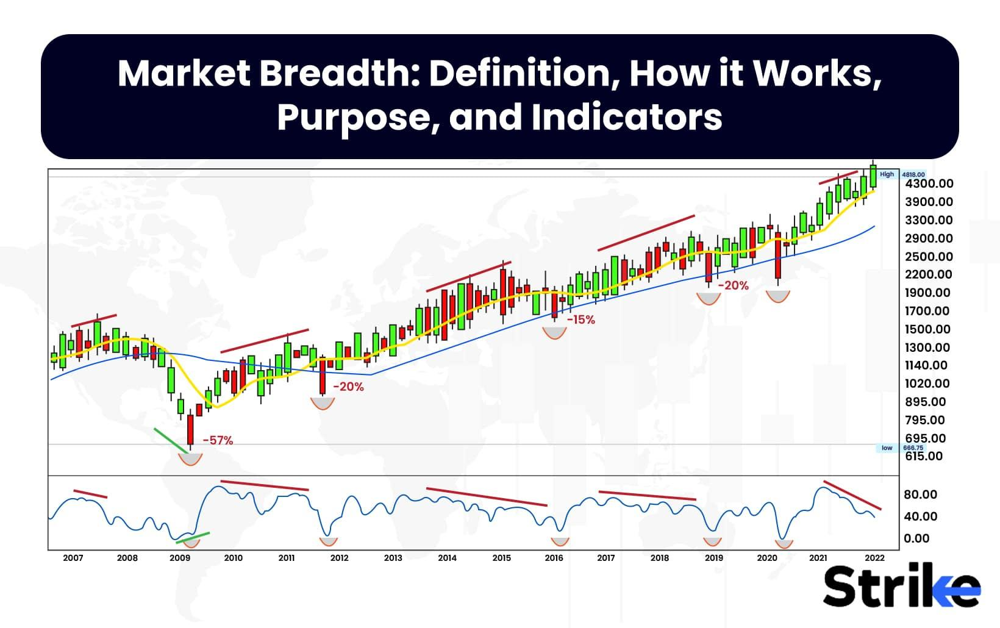

## Table of Contents

## What is market breadth and why is it important?

Market breadth is a way to measure how many stocks are going up or down in a market. It helps us understand if the market's movement is strong or if it's just a few big companies making the market look good or bad. For example, if the stock market index goes up, but only a few stocks are going up while many others are going down, the market breadth is weak. This can be a sign that the market might not keep going up.

Market breadth is important because it gives us a better picture of what's really happening in the market. If the market breadth is strong, it means that many stocks are moving in the same direction, which can make the market's movement more reliable. Investors and traders use market breadth to make better decisions about buying or selling stocks. It helps them see if the market's trend is likely to continue or if it might change soon.

## How can market breadth be measured?

Market breadth can be measured in a few different ways. One common way is by looking at the advance-decline line. This is just a count of how many stocks are going up (advancing) compared to how many are going down (declining) on a given day. If more stocks are going up than down, the advance-decline line goes up, showing strong market breadth. If more stocks are going down, it goes down, showing weak market breadth.

Another way to measure market breadth is by using the breadth thrust indicator. This looks at the ratio of advancing stocks to the total number of stocks traded. If this ratio gets really high over a short period, it can show that the market is getting a lot of buying interest and might keep going up. It's like a signal that the market is strong and many people are buying stocks.

A third way to measure market breadth is the new highs-new lows indicator. This counts how many stocks are hitting their highest price in a year (new highs) compared to how many are hitting their lowest price in a year (new lows). If more stocks are at new highs than new lows, it suggests the market is doing well and has strong breadth. If more stocks are at new lows, it can mean the market is weak.

## What are the common indicators used to assess market breadth?

One common indicator to assess market breadth is the advance-decline line. This is a simple way to see if more stocks are going up or down. If more stocks are going up, the line goes up, showing strong market breadth. If more stocks are going down, the line goes down, showing weak market breadth. It's like taking a quick look at how many people are happy or sad in a room to see if the mood is good or bad.

Another indicator is the breadth thrust indicator. This looks at how many stocks are going up compared to all the stocks being traded. When this number gets really high quickly, it can mean that the market is getting a lot of buying interest. It's like seeing a lot of people suddenly start buying things in a store, which can show that the market might keep going up.

The new highs-new lows indicator is also used to assess market breadth. It counts how many stocks are reaching their highest price in a year compared to how many are reaching their lowest price in a year. If more stocks are at new highs, it suggests the market is doing well and has strong breadth. If more stocks are at new lows, it can mean the market is weak. It's like checking if more people are setting personal bests or having their worst days to see how the market is doing overall.

## Can you explain the difference between advance-decline line and the McClellan Oscillator?

The advance-decline line is a simple way to see if more stocks are going up or down in the market. It's just a count of how many stocks are going up (advancing) minus how many are going down (declining) on any given day. If more stocks are going up, the line goes up, showing strong market breadth. If more stocks are going down, the line goes down, showing weak market breadth. It's like checking if more people are happy or sad in a room to see if the mood is good or bad.

The McClellan Oscillator is a bit more complicated. It uses the same advance-decline data but turns it into a smoother, more detailed picture of market breadth. It does this by using something called exponential moving averages (EMAs) to look at the short-term and long-term trends of the advance-decline data. The difference between these two EMAs is what makes up the McClellan Oscillator. If the oscillator is positive, it means the market is doing well and has strong breadth. If it's negative, it means the market might be weak. It's like using a special tool to get a clearer, more detailed look at how people are feeling in the room, not just a simple count.

## How does market breadth help in understanding market trends?

Market breadth helps us understand market trends by showing how many stocks are moving up or down, not just the big ones. When the market goes up, but only a few big stocks are going up while many others are going down, the market breadth is weak. This can mean the market might not keep going up for long. But if lots of stocks are going up together, the market breadth is strong, and it's more likely the market will keep going up. It's like checking if a party is fun by seeing if just a few people are dancing or if everyone is having a good time.

By looking at market breadth, we can see if the market's trend is strong or if it might change soon. For example, if the advance-decline line is going up, it means more stocks are going up than down, which can make us feel more confident about the market's upward trend. On the other hand, if the new highs-new lows indicator shows more stocks at new lows, it might be a sign that the market could start going down. Market breadth gives us a fuller picture of what's happening in the market, helping us make better decisions about buying or selling stocks.

## What role does market breadth play in technical analysis?

Market breadth is a key part of technical analysis because it helps us see if the market's trend is strong or weak. Technical analysis is all about looking at charts and numbers to guess where the market might go next. Market breadth tells us if lots of stocks are moving in the same direction or if it's just a few big ones. If many stocks are going up together, it's a sign that the market's upward trend is strong and might keep going. But if only a few stocks are going up while many others are going down, the market might not be as strong as it looks.

In technical analysis, people use things like the advance-decline line, the breadth thrust indicator, and the new highs-new lows indicator to measure market breadth. These tools help us get a better feel for the market's health. For example, if the advance-decline line is going up, it means more stocks are going up than down, which can make us feel more confident about the market's upward trend. On the other hand, if the new highs-new lows indicator shows more stocks at new lows, it might be a sign that the market could start going down. By looking at market breadth, technical analysts can make smarter guesses about where the market is headed.

## How can investors use market breadth to make investment decisions?

Investors can use market breadth to make better choices about buying or selling stocks. Market breadth tells us if a lot of stocks are moving up or down together. If many stocks are going up, it's a sign that the market's trend is strong and might keep going. This can make investors feel more confident about buying stocks. But if only a few stocks are going up while many others are going down, the market might not be as strong as it looks. This can be a warning sign for investors to be careful or maybe even sell some stocks.

By looking at things like the advance-decline line, investors can see if more stocks are going up or down each day. If the line is going up, it's a good sign that the market is healthy. The breadth thrust indicator can also help. If it shows a big jump in stocks going up, it might be a good time to buy. And the new highs-new lows indicator can show if more stocks are hitting their highest prices or their lowest prices. If more stocks are at new highs, it's a good sign for the market. By using these tools, investors can get a better feel for the market's health and make smarter choices about their investments.

## What are the limitations of using market breadth as an indicator?

Market breadth can be a helpful tool, but it has some limitations. One big problem is that it doesn't always tell us about the future. Just because a lot of stocks are going up today doesn't mean they will keep going up tomorrow. Market breadth can give us a good picture of what's happening right now, but it can't predict what will happen next. Also, market breadth looks at all stocks the same way, but not all stocks are equally important. Big companies can have a bigger effect on the market than small ones, so market breadth might miss important changes in big stocks.

Another limitation is that market breadth can be affected by what's called sector rotation. This means that money moves from one part of the market to another. For example, if investors start buying more tech stocks and selling more energy stocks, the market breadth might look weak even if the market is still doing well overall. This can make it hard to understand what the market breadth is really telling us. Also, market breadth can be noisy. It can change a lot from day to day, which can make it hard to see the bigger trend. So, while market breadth is useful, it's important to use it along with other tools to get a full picture of the market.

## How does market breadth differ across various market sectors?

Market breadth can be different across various market sectors because each sector can have its own trends and movements. For example, if the technology sector is doing well, with many tech stocks going up, the market breadth for that sector would be strong. But at the same time, the energy sector might be doing poorly, with many energy stocks going down, showing weak market breadth. This means that even if the overall market looks good, some sectors might not be doing as well, and vice versa.

Looking at market breadth in different sectors helps investors understand where the market's strength or weakness is coming from. If the market breadth is strong in sectors like healthcare and consumer goods, it might mean that those areas are driving the market's upward trend. On the other hand, if sectors like finance and industrials have weak market breadth, it could be a sign that those areas are struggling. By paying attention to market breadth in different sectors, investors can make better decisions about which stocks to buy or sell based on where the market's strength is concentrated.

## Can market breadth predict market reversals or confirm trends?

Market breadth can help us see if the market might be about to change direction or if it's likely to keep going the way it's going. If the market is going up, but the market breadth is weak, it means only a few stocks are going up while many others are going down. This can be a warning sign that the market might not keep going up and could be about to reverse. On the other hand, if the market is going down, but the market breadth is strong, it might mean that the market is about to start going up again.

Market breadth can also confirm if a trend is strong. If the market is going up and the market breadth is strong, it means lots of stocks are going up together. This makes us feel more sure that the market will keep going up. If the market is going down and the market breadth is weak, it confirms that the market is likely to keep going down. By looking at market breadth, we can get a better idea of whether the market's trend is strong or if it might change soon.

## What advanced techniques can be used to analyze market breadth more deeply?

One advanced technique to analyze market breadth more deeply is to use the McClellan Summation Index. This is like a more detailed version of the McClellan Oscillator. It adds up the daily values of the McClellan Oscillator to give us a longer-term view of market breadth. If the Summation Index is going up, it means the market's trend is strong and might keep going. If it's going down, it can be a sign that the market might change direction soon. This helps us see the bigger picture of market breadth over time, not just what's happening day to day.

Another technique is to use the Arms Index, also known as the TRIN (Short-Term TRading INdex). This looks at the ratio of advancing stocks to declining stocks and compares it to the ratio of the volume of advancing stocks to the volume of declining stocks. If the Arms Index is low, it means more stocks are going up with more volume, which can show strong market breadth. If it's high, it means more stocks are going down with more volume, showing weak market breadth. This helps us understand not just how many stocks are moving but also how much money is behind those moves, giving us a deeper look at market strength or weakness.

A third technique is to use sector-specific market breadth indicators. Instead of looking at the whole market, we can focus on different sectors like technology, healthcare, or energy. By looking at the advance-decline line or new highs-new lows for each sector, we can see where the market's strength or weakness is coming from. This helps us understand if the market's trend is driven by just a few sectors or if it's more widespread. By using these advanced techniques, we can get a more detailed and nuanced view of market breadth, helping us make better investment decisions.

## How has the interpretation of market breadth evolved with the advent of algorithmic trading?

The way we look at market breadth has changed a lot because of algorithmic trading. These are computer programs that buy and sell stocks really fast, often without people directly making the decisions. Before, market breadth was mostly about counting how many stocks were going up or down to see if the market was strong or weak. But now, with so many trades happening so quickly, market breadth can change a lot in a short time. This means we need to look at it more often and in different ways to understand what's really going on in the market.

Because of algorithmic trading, we also pay more attention to things like the volume of trades and how fast stocks are moving. These computers can make the market move in ways that are hard to predict just by looking at simple counts of up and down stocks. So, we use more advanced tools like the McClellan Summation Index and the Arms Index to get a better picture of market breadth. These tools help us see not just how many stocks are moving but also how much money is behind those moves and how the market might change in the future.

## What are Market Breadth Indicators and how can they be understood?

Market breadth indicators are essential analytical tools used by traders and investors to gauge the overall health and dynamics of the stock market. By tracking the number of advancing versus declining stocks, these indicators provide a clear picture of the market's internal strength and potential future movements.

A key function of market breadth indicators is their ability to identify prevailing trends. When a significant number of stocks are advancing, it typically signals a bullish trend; conversely, a predominance of declining stocks suggests bearish conditions. This capability to confirm market movements is particularly advantageous in validating the signals from other technical analysis tools. Additionally, breadth indicators are adept at detecting potential reversals, which are crucial for optimizing entry and exit points in trading strategies.

Among the most common types of market breadth indicators are the Advance-Decline (A/D) Line, the New Highs-Lows Index, and the TRIN (Arms Index). 

The Advance-Decline Line is one of the simplest and most widely used indicators. It is calculated as the cumulative sum of the difference between the number of advancing and declining stocks in the market. Mathematically, it can be expressed as:

$$
\text{A/D Line} = \sum (\text{Advancing Stocks} - \text{Declining Stocks})
$$

The New Highs-Lows Index provides an additional layer of market analysis by measuring the difference between stocks reaching new 52-week highs and those hitting new lows. This indicator is instrumental in highlighting the underlying [momentum](/wiki/momentum) and potential turning points within the market.

The TRIN (Arms Index) is slightly more complex; it compares the number of advancing/declining stocks with the advancing/declining [volume](/wiki/volume-trading-strategy). The formula for TRIN is:

$$
\text{TRIN} = \left( \frac{\text{Advancing Issues}}{\text{Declining Issues}} \right) \div \left( \frac{\text{Advancing Volume}}{\text{Declining Volume}} \right)
$$

Values below 1.0 are considered bullish, indicating strong buying pressure, while values above 1.0 suggest bearish conditions.

Overall, market breadth indicators serve as pivotal components of technical analysis, enhancing the trader's ability to forecast market conditions accurately. These tools are particularly useful when combined with other analytical methods, providing a comprehensive view of market trends and potential reversals.

## What are the types of market breadth indicators?

Market breadth indicators are essential tools in financial analysis, offering a clear view of the market's overall direction by evaluating the behavior of stocks. Among these, the Advance-Decline (A/D) Line, the Zweig Breadth Thrust Indicator, and the McClellan Oscillator are prominent.

The **Advance-Decline (A/D) Line** is one of the simplest yet effective market breadth indicators. It is calculated by taking the difference between the number of advancing stocks (stocks closing higher than their previous close) and declining stocks (stocks closing lower than their previous close) each day. This net difference is then added to a cumulative total. The formula for the daily calculation is as follows:

$$
\text{A/D Line} = (\text{Advancing Stocks} - \text{Declining Stocks}) + \text{Previous A/D Line}
$$

This indicator provides insights into the underlying market strength. A rising A/D Line suggests that more stocks are participating in the upward movement, implying a robust market, while a declining A/D Line indicates a potential weakness.

The **Zweig Breadth Thrust Indicator** is designed to identify bullish market conditions. It calculates a ratio of the number of advancing stocks to the total number of stocks and involves a rapid momentum shift. The indicator signals a bullish market when this ratio moves from below 0.40 to above 0.615 within ten trading days. This quick shift suggests a significant change in market sentiment, often marking the beginning of a considerable market rally. 

Finally, the **McClellan Oscillator** is a momentum indicator derived from the difference between two exponential moving averages (EMAs) of the advance-decline data. It is typically calculated using the 19-day and 39-day EMAs. The formula is given by:

$$
\text{McClellan Oscillator} = \text{EMA}_{19}(\text{A-D}) - \text{EMA}_{39}(\text{A-D})
$$

Where $\text{EMA}_{19}$ and $\text{EMA}_{39}$ are the 19-day and 39-day exponential moving averages of the daily advance-decline data, respectively. The McClellan Oscillator is an effective tool for evaluating whether the market is in an overbought or oversold condition. Positive values suggest an upward momentum, whereas negative values imply downward momentum.

Incorporating these indicators enables traders and algorithmic systems to assess market dynamics, aiding them in making informed decisions. The Advance-Decline Line depicts overall market trends, the Zweig Breadth Thrust highlights sudden bullish shifts, and the McClellan Oscillator provides insights into market momentum and potential reversal points.

## How do you calculate market breadth indicators?

Market breadth indicators are essential tools in analyzing market dynamics, offering insights into market engagement and potential shifts in trends. Their calculations, though straightforward, provide valuable metrics for traders and investors.

### Advance-Decline Line (A/D Line)

The Advance-Decline Line is a fundamental market breadth indicator. It is calculated by determining the net difference between advancing and declining stocks each trading day. The formula is:

$$
\text{A/D Line} = \sum (\text{Advancing Stocks} - \text{Declining Stocks})
$$

In practical terms, if more stocks are advancing than declining, the A/D line will trend upward, indicating potential bullish sentiment. Conversely, if declining stocks outpace advancing ones, a downward trend in the A/D line may suggest bearish sentiment.

### New Highs-Lows Index

The New Highs-Lows Index compares stocks reaching new 52-week highs to those hitting new 52-week lows. This index offers insights into the general health of the market by focusing on extremes. The calculation is expressed as:

$$
\text{New Highs-Lows Index} = \frac{(\text{Number of New Highs}) - (\text{Number of New Lows})}{\text{Total Stocks}}
$$

A higher value indicates a greater number of stocks hitting new highs compared to lows, often interpreted as a positive market sentiment. Conversely, a negative value may highlight potential underlying market weaknesses.

### Application and Interpretation

Understanding these indicators requires recognizing the context in which they are applied. While straightforward in calculation, the implications of these trends must be interpreted in conjunction with other market data and indicators. For instance, a consistently rising A/D line may suggest a robust market, but external economic factors and market news should also be considered.

Incorporating these indicators into [algorithmic trading](/wiki/algorithmic-trading) can significantly enhance the decision-making process. By leveraging historical data and real-time analysis, algorithms can execute trades with greater precision, adjusting for shifts in market breadth as they occur.

## References & Further Reading

[1]: Bergstra, J., Bardenet, R., Bengio, Y., & Kégl, B. (2011). ["Algorithms for Hyper-Parameter Optimization."](https://papers.nips.cc/paper/4443-algorithms-for-hyper-parameter-optimization) Advances in Neural Information Processing Systems 24.

[2]: ["Advances in Financial Machine Learning"](https://www.amazon.com/Advances-Financial-Machine-Learning-Marcos/dp/1119482089) by Marcos Lopez de Prado

[3]: ["Evidence-Based Technical Analysis: Applying the Scientific Method and Statistical Inference to Trading Signals"](https://www.amazon.com/Evidence-Based-Technical-Analysis-Scientific-Statistical/dp/0470008741) by David Aronson

[4]: ["Machine Learning for Algorithmic Trading"](https://github.com/stefan-jansen/machine-learning-for-trading) by Stefan Jansen

[5]: ["Quantitative Trading: How to Build Your Own Algorithmic Trading Business"](https://www.amazon.com/Quantitative-Trading-Build-Algorithmic-Business/dp/1119800064) by Ernest P. Chan