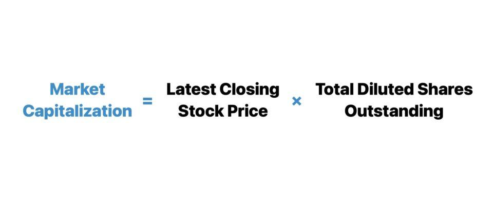

## Table of Contents

## What is market capitalization?

Market capitalization, often called market cap, is the total value of all the shares of a company. It is calculated by multiplying the current stock price by the total number of shares that the company has issued. This number gives investors an idea of the size of a company and how it compares to other companies. For example, if a company has 1 million shares and each share is worth $50, the market cap would be $50 million.

Market cap is important because it helps investors understand a company's value in the market. It can also show how stable a company might be. Generally, companies with a larger market cap are considered more stable and less risky than smaller ones. However, market cap can change daily as stock prices go up and down. So, it's a good idea to keep an eye on it if you're thinking about investing in a company.

## How is market capitalization calculated?

Market capitalization, or market cap, is figured out by taking the current price of a company's stock and multiplying it by the total number of shares the company has out there. For example, if a company's stock is selling for $10 per share and they have 1 million shares, the market cap would be $10 million.

This number can change every day because stock prices go up and down. If the stock price goes up, the market cap goes up too. If the stock price goes down, the market cap goes down. It's a simple way to see how much a company is worth in the market at any given time.

## Why is market capitalization important for investors?

Market capitalization is important for investors because it gives them an idea of how big a company is and how it compares to other companies. When you know a company's market cap, you can see if it's a small, medium, or big company. This helps investors decide if they want to put their money into a company that's just starting out or one that's already well-known and established.

It also helps investors understand how risky an investment might be. Usually, companies with a bigger market cap are seen as more stable and less risky. On the other hand, smaller companies might have more room to grow but can also be riskier. By looking at market cap, investors can make smarter choices about where to invest their money based on how much risk they're willing to take.

## What does market capitalization tell us about a company?

Market capitalization tells us how much a company is worth in the eyes of the stock market. It's like a big number that shows the total value of all the shares that a company has. If you want to find out a company's market cap, you just take the price of one share and multiply it by the total number of shares out there. This number can change every day because stock prices go up and down.

Market cap also gives us a quick way to see how big or small a company is compared to others. A company with a big market cap is usually seen as more stable and less risky. That's because bigger companies often have more money and resources. On the other hand, smaller companies might be riskier but could also grow a lot more. So, market cap helps investors decide if they want to put their money in a big, stable company or a smaller one that might have more room to grow.

## How does market capitalization differ from a company's book value?

Market capitalization and book value are two different ways to measure a company's worth, but they look at it from different angles. Market capitalization, or market cap, is all about what the stock market thinks a company is worth right now. It's calculated by taking the current stock price and multiplying it by the total number of shares out there. This number can change every day because stock prices go up and down. Market cap gives investors a quick way to see how big or small a company is and how it compares to others.

Book value, on the other hand, is more about what's left if a company were to sell everything it owns and pay off all its debts. It's like looking at the company's balance sheet and figuring out its net worth. To find the book value, you take the total assets and subtract the total liabilities. This number doesn't change as quickly as market cap because it's based on the company's financial statements, which are updated less often. Book value can help investors see if a company's stock is priced fairly compared to what it's actually worth on paper.

## Can market capitalization change, and if so, why?

Yes, market capitalization can change, and it does so all the time. The main reason for this is that the price of a company's stock goes up and down every day. When the stock price goes up, the market cap goes up too because it's calculated by multiplying the stock price by the total number of shares. If the stock price drops, the market cap will drop as well. So, anything that affects the stock price, like how well the company is doing, news about the company, or even what's happening in the economy, can make the market cap change.

Another reason market cap can change is if a company decides to issue more shares or buy back some of its shares. When a company issues more shares, the total number of shares goes up, which can increase the market cap if the stock price stays the same. On the other hand, if a company buys back its shares, the total number of shares goes down, which can decrease the market cap if the stock price stays the same. So, market cap is a number that's always moving because it's tied to both the stock price and the number of shares a company has.

## What are the different categories of market capitalization (e.g., large-cap, mid-cap, small-cap)?

Market capitalization, or market cap, is split into different categories like large-cap, mid-cap, and small-cap. These categories help investors understand how big a company is and how risky it might be to invest in it. Large-cap companies are the biggest, with market caps usually over $10 billion. They are often well-known companies that have been around for a long time. Investing in large-cap companies is usually seen as less risky because they are more stable and have more resources.

Mid-cap companies are smaller than large-caps but still pretty big. Their market caps are usually between $2 billion and $10 billion. These companies are often growing and can offer more room for growth than large-caps, but they can also be riskier. Small-cap companies are the smallest, with market caps usually under $2 billion. They are often newer or less established companies. Investing in small-caps can be riskier but can also lead to bigger rewards if the company does well.

There's also a category called micro-cap, which includes companies with market caps usually under $300 million. These are even smaller and riskier than small-caps. Understanding these categories helps investors make better choices about where to put their money, based on how much risk they're willing to take and what kind of growth they're looking for.

## How does market capitalization affect stock liquidity?

Market capitalization can affect how easy or hard it is to buy or sell a company's stock, which is called liquidity. Stocks from companies with a big market cap, like large-cap companies, are usually more liquid. This means it's easier to buy or sell these stocks because there are a lot of people trading them. Think of it like a busy street market where there are always people buying and selling. Because so many people are interested in these stocks, you can usually find someone to trade with quickly.

On the other hand, stocks from companies with smaller market caps, like small-cap or micro-cap companies, might be less liquid. It can be harder to find someone to buy or sell these stocks because fewer people are trading them. It's like a quiet country store where you might have to wait a while to find someone to trade with. This can make it harder to get in or out of these stocks quickly, which can be important if you need to sell your shares in a hurry.

## What role does market capitalization play in stock indices?

Market capitalization is really important for stock indices. A stock index is like a big list of stocks that shows how well a group of companies is doing. When people make these lists, they often use market cap to decide which companies to include and how much each company should count toward the total. For example, the S&P 500 is a famous index that includes 500 of the biggest companies in the U.S., based on their market cap. The bigger a company's market cap, the more it affects the index's overall value. This makes sense because bigger companies have a bigger impact on the economy.

Some indices, like the NASDAQ Composite, also use market cap to weigh the stocks. This means that companies with a bigger market cap have a bigger say in how the index moves. If a big company's stock price goes up or down a lot, it can make the whole index move in that direction. This way, market cap helps make sure that the index shows what's really happening in the market, giving a good picture of how well the group of companies is doing overall.

## How can market capitalization be used to compare companies within the same industry?

Market capitalization is a helpful tool for comparing companies within the same industry. It gives you a quick way to see how big each company is in terms of total value. For example, if you're looking at two car companies, you can compare their market caps to see which one is bigger and might have more resources. This can help you understand which company is leading the industry and which one might be smaller but growing fast. By looking at market cap, you can also see how the companies stack up against each other and make better decisions about where to invest your money.

Market cap also shows how investors feel about a company compared to others in the same industry. If one company has a much higher market cap than another, it might mean that investors think it has better growth potential or is more stable. This can be useful information if you're trying to decide which company to invest in. For example, if you're choosing between two tech companies, the one with a higher market cap might be seen as a safer bet, while the one with a lower market cap might offer more growth opportunities but also more risk. So, market cap helps you compare companies and understand their relative positions in the industry.

## What are the limitations of using market capitalization as a measure of a company's value?

Market capitalization can be a quick and easy way to see how much a company is worth, but it has some problems. One big problem is that market cap only looks at what the stock market thinks a company is worth right now. It doesn't tell you anything about the company's debts or how much money it's making. So, a company might have a big market cap, but if it has a lot of debt, it might not be as valuable as it seems.

Another issue is that market cap can change a lot from day to day because stock prices go up and down. This means that the value of a company can seem to change a lot, even if the company itself isn't doing anything different. Also, market cap doesn't tell you if a company's stock is a good deal or not. Just because a company has a high market cap doesn't mean its stock is priced fairly. You need to look at other things like the company's earnings and how much it's growing to really understand its value.

## How do global economic factors influence market capitalization?

Global economic factors can have a big impact on a company's market capitalization. When the world economy is doing well, people feel more confident about spending money and investing in stocks. This can make stock prices go up, which means market caps go up too. For example, if countries around the world are growing and there's a lot of trade happening, companies that sell things in those countries might see their stock prices rise because more people are buying their products. On the other hand, if there's a global economic downturn, like a recession, people might be more worried about money and less likely to invest. This can make stock prices drop, and so market caps can go down too.

Another way global economic factors can affect market capitalization is through changes in interest rates and currency values. If interest rates go up in one country, it can make borrowing money more expensive for companies, which might hurt their profits and cause their stock prices to fall. Also, if a country's currency gets weaker compared to others, it can make that country's companies less valuable to foreign investors. This is because when the currency is weak, the value of the company's stock goes down when it's converted to another currency. So, things like interest rates and currency values can have a big effect on how much a company is worth in the stock market.

## What is Understanding Market Capitalization?

Market capitalization, often abbreviated as 'market cap,' represents the total market value of a company's outstanding shares of stock. It is a pivotal financial metric used by investors and analysts to assess the relative size and value of a company compared to others in the industry or market. The market cap is calculated using the following formula:

$$
\text{Market Capitalization} = \text{Share Price} \times \text{Shares Outstanding}
$$

For example, if a company has 1 million shares outstanding and each share is valued at $50, the market capitalization of that company would be:

$$
\text{Market Capitalization} = \$50 \times 1,000,000 = \$50,000,000
$$

This calculation provides a straightforward means of determining the total value that the stock market places on the company, reflecting all its outstanding shares priced at the current market rate.

Market capitalization is a crucial indicator of a company's size, stability, and potential growth prospects. Larger companies with higher market caps are generally viewed as more stable investments, often yielding lower risk but steady growth. Conversely, smaller companies might present higher growth potential but typically with increased [volatility](/wiki/volatility-trading-strategies) and risk.

Investors use market cap as a quick measure to compare companies. It helps in determining investment risk levels and in constructing diversified portfolios. By knowing the market cap, investors can categorize companies into segments such as large-cap, mid-cap, and small-cap; each category carrying different investment characteristics and expectations. 

The interpretation of market capitalization involves understanding that while it indicates the value of a company's equity, it does not equate to the company's actual intrinsic value. Numerous factors, like market trends and investor sentiment, can influence the share price, thereby affecting the market capitalization. Nevertheless, it remains an essential tool for assessing a company's public market valuation.

## What is the Market Capitalization Calculation Formula?

The market capitalization of a company, a key metric for investors, is determined by the formula: 

$$
\text{Market Capitalization} = \text{Current Stock Price} \times \text{Total Number of Outstanding Shares}
$$

This formula provides a snapshot of a company's size and its potential stability in the market. For instance, if a company has 10 million shares, and each share is valued at $50, the market capitalization would be calculated as:

$$
\text{Market Capitalization} = 10,000,000 \times 50 = 500,000,000
$$

In this example, the company would have a market cap of $500 million. This calculation is crucial for investors as it allows for quick comparisons between companies of different sizes and sectors, helping gauge their relative scale and assess potential investment stability.

Market capitalization categorizes companies into different segments, such as large-cap, mid-cap, and small-cap, each presenting distinct investment characteristics and risk profiles. A higher market cap often indicates a more established company, potentially offering greater stability, whereas a lower market cap may suggest higher growth potential but greater volatility and risk. Thus, understanding market cap calculation is fundamental to making informed investment decisions and constructing diversified portfolios that align with one's risk tolerance and financial goals.

## References & Further Reading

[1]: Bergstra, J., Bardenet, R., Bengio, Y., & Kégl, B. (2011). ["Algorithms for Hyper-Parameter Optimization."](https://papers.nips.cc/paper/4443-algorithms-for-hyper-parameter-optimization) Advances in Neural Information Processing Systems 24.

[2]: ["Advances in Financial Machine Learning"](https://www.amazon.com/Advances-Financial-Machine-Learning-Marcos/dp/1119482089) by Marcos Lopez de Prado

[3]: ["Evidence-Based Technical Analysis: Applying the Scientific Method and Statistical Inference to Trading Signals"](https://www.amazon.com/Evidence-Based-Technical-Analysis-Scientific-Statistical/dp/0470008741) by David Aronson

[4]: ["Machine Learning for Algorithmic Trading"](https://github.com/stefan-jansen/machine-learning-for-trading) by Stefan Jansen

[5]: ["Quantitative Trading: How to Build Your Own Algorithmic Trading Business"](https://www.amazon.com/Quantitative-Trading-Build-Algorithmic-Business/dp/1119800064) by Ernest P. Chan