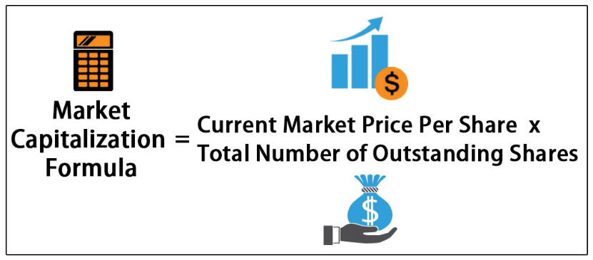

Market capitalization, abbreviated as 'market cap', is a fundamental concept in the financial world, essential for investors and financial professionals seeking to understand a company's value and potential. It measures the total market value of a company's outstanding shares, providing insights into its size, stability, and growth prospects. By calculating the market cap, investors can determine the scale of a business, which paves the way for informed investment decisions and strategic financial planning.

This article offers a comprehensive overview of market capitalization by examining its calculation, significance, and integration in algorithmic trading systems. We will address how understanding and analyzing market cap plays a critical role in shaping investment choices and trading strategies. In the current financial landscape, decisions are increasingly driven by data and analytics; hence, exploring the impact of market cap on these areas is crucial. Key topics include the segmentation of companies into various market cap categories, the implications for portfolio diversification, and the utilization of market cap in optimizing trading algorithms. Whether you are an investor seeking to make judicious choices or a financial professional crafting strategies, mastering the concept of market capitalization is pivotal for success in today’s markets.



## Table of Contents

## Understanding Market Capitalization

Market capitalization, often abbreviated as 'market cap,' represents the total market value of a company's outstanding shares of stock. It is a pivotal financial metric used by investors and analysts to assess the relative size and value of a company compared to others in the industry or market. The market cap is calculated using the following formula:

$$
\text{Market Capitalization} = \text{Share Price} \times \text{Shares Outstanding}
$$

For example, if a company has 1 million shares outstanding and each share is valued at $50, the market capitalization of that company would be:

$$
\text{Market Capitalization} = \$50 \times 1,000,000 = \$50,000,000
$$

This calculation provides a straightforward means of determining the total value that the stock market places on the company, reflecting all its outstanding shares priced at the current market rate.

Market capitalization is a crucial indicator of a company's size, stability, and potential growth prospects. Larger companies with higher market caps are generally viewed as more stable investments, often yielding lower risk but steady growth. Conversely, smaller companies might present higher growth potential but typically with increased [volatility](/wiki/volatility-trading-strategies) and risk.

Investors use market cap as a quick measure to compare companies. It helps in determining investment risk levels and in constructing diversified portfolios. By knowing the market cap, investors can categorize companies into segments such as large-cap, mid-cap, and small-cap; each category carrying different investment characteristics and expectations. 

The interpretation of market capitalization involves understanding that while it indicates the value of a company's equity, it does not equate to the company's actual intrinsic value. Numerous factors, like market trends and investor sentiment, can influence the share price, thereby affecting the market capitalization. Nevertheless, it remains an essential tool for assessing a company's public market valuation.

## Categories of Market Capitalization

Companies are categorized into different market capitalization segments based on the total market value of their outstanding shares. Understanding these categories provides investors with insights about the risk and return characteristics associated with various sizes of companies.

- **Large-cap Companies**: These are firms with a market capitalization typically exceeding $10 billion. Large-cap companies are often established industry leaders with stable revenue streams and solid reputations. As a result, they offer lower volatility compared to smaller companies. The stability of large-cap stocks makes them attractive for risk-averse investors seeking steady growth and reliable dividends. Examples include multinational corporations such as Apple, Microsoft, and Johnson & Johnson.

- **Mid-cap Companies**: Mid-cap firms have market capitalizations ranging from $2 billion to $10 billion. They are generally in the expansion phase but still offer a balance between growth potential and risk. Mid-cap companies can provide greater growth opportunities than large-cap firms due to their size, which allows for rapid development and market adaptation. However, they may not be as financially stable as large-cap firms, presenting a moderate level of risk. Investors looking for a balance between growth and risk might consider mid-cap stocks.

- **Small-cap and Micro-cap Companies**: Small-cap companies possess market capitalizations ranging from $300 million to $2 billion, while micro-cap firms have market caps below $300 million. These companies are often in the early stages of development, with significant room for growth. Although small-cap and micro-cap stocks can deliver high returns, they come with higher risks due to their vulnerability to market volatility and lesser financial stability. These companies may struggle with limited resources and operating histories, making investments more speculative. Consequently, they may appeal to investors willing to accept higher uncertainty for the possibility of substantial rewards.

## Importance of Market Capitalization Analysis

Market capitalization is a pivotal metric for evaluating a company's investment risk profile. It provides insights into the company's size and potential volatility. Larger companies, often with higher market capitalizations, typically present lower investment risk due to their established market presence and diversified operations. Conversely, smaller companies with lower market capitalizations may offer higher growth potential but come with increased risks due to market fluctuations.

Investors leverage market capitalization to diversify their portfolios and effectively manage risk. By allocating investments across companies with varying market cap sizes—namely large-cap, mid-cap, and small-cap—they can balance potential returns with associated risks. This diversification is a strategic approach to mitigating exposure to downturns in any single market segment.

Moreover, market capitalization is instrumental in benchmarking and constructing stock market indices. Indices like the S&P 500 utilize market capitalization to determine the weighting of included companies. This process involves calculating each component's market cap and determining its proportion relative to the total market cap of all index constituents. This methodology ensures that larger companies exert more influence on the index's movement, thereby providing a more accurate reflection of overall market trends.

Understanding a company's market capitalization also aids investors in making more informed decisions by comparing it against peers in the same industry. This comparative analysis offers a clearer picture of the company's position within the market landscape, enabling strategic investment choices.

## Market Capitalization Calculation Formula

The market capitalization of a company, a key metric for investors, is determined by the formula: 

$$
\text{Market Capitalization} = \text{Current Stock Price} \times \text{Total Number of Outstanding Shares}
$$

This formula provides a snapshot of a company's size and its potential stability in the market. For instance, if a company has 10 million shares, and each share is valued at $50, the market capitalization would be calculated as:

$$
\text{Market Capitalization} = 10,000,000 \times 50 = 500,000,000
$$

In this example, the company would have a market cap of $500 million. This calculation is crucial for investors as it allows for quick comparisons between companies of different sizes and sectors, helping gauge their relative scale and assess potential investment stability.

Market capitalization categorizes companies into different segments, such as large-cap, mid-cap, and small-cap, each presenting distinct investment characteristics and risk profiles. A higher market cap often indicates a more established company, potentially offering greater stability, whereas a lower market cap may suggest higher growth potential but greater volatility and risk. Thus, understanding market cap calculation is fundamental to making informed investment decisions and constructing diversified portfolios that align with one's risk tolerance and financial goals.

## Algorithmic Trading and Market Capitalization

Algorithmic trading leverages market capitalization data to craft sophisticated trading strategies and effectively manage risks associated with market fluctuations. The market capitalization of a company is a fundamental metric used by trading algorithms to assess a company's size and segment the market into distinct categories such as large-cap, mid-cap, and small-cap stocks. Each category presents unique characteristics and opportunities that algorithms can exploit.

Algorithms often target large-cap stocks due to their inherent stability and [liquidity](/wiki/liquidity-risk-premium). These stocks typically represent well-established companies with a substantial market presence, leading to lower volatility and more predictable price movements. As a result, large-cap stocks are conducive to strategies that prioritize consistency and risk aversion.

In contrast, algorithms focused on small-cap stocks are designed to capitalize on higher growth potential. Small-cap stocks generally exhibit higher volatility, offering significant price appreciation prospects albeit with increased risk. Traders employing algorithms to engage in this segment often seek opportunities from emerging companies with room for rapid expansion, implementing strategies that accommodate greater price fluctuations.

Market capitalization is also instrumental in optimizing portfolios and constructing diversified investment strategies. Algorithms utilize market cap data to ensure a balanced composition of assets across different cap segments, which aids in risk management and enhances potential returns. Portfolio optimization might involve adjusting the weights of large-cap and small-cap stocks to align with specific risk tolerance and investment objectives.

Incorporating market cap data into [algorithmic trading](/wiki/algorithmic-trading) models can enhance decision-making processes through precise calculations and simulations. A simple Python example of calculating market capitalization and assessing investment opportunities using hypothetical data might look like this:

```python
# Calculating Market Capitalization in Python
def calculate_market_cap(share_price, shares_outstanding):
    return share_price * shares_outstanding

# Example Data
companies = {
    'LargeCapCo': {'share_price': 150, 'shares_outstanding': 20_000_000},
    'SmallCapCo': {'share_price': 25, 'shares_outstanding': 1_000_000},
}

# Calculate and print market capitalization
for company_name, data in companies.items():
    market_cap = calculate_market_cap(data['share_price'], data['shares_outstanding'])
    print(f'Market Cap of {company_name}: {market_cap}')
```

Using algorithms with market cap data, traders can refine their strategies, aiming for optimal performance across various market conditions. Ultimately, the integration of market capitalization within algorithmic trading not only aids in constructing well-rounded portfolios but also empowers traders to make more informed decisions, balancing growth potential with financial security.

## Conclusion

Market capitalization is a key metric for assessing a company's value and potential investment viability. As a quantifiable measure of a company's total market value, derived from the product of its current stock price and the total number of outstanding shares, it offers a straightforward way to determine a firm's economic stature within the industry. This metric is crucial for investors and traders as it enables strategic decision-making across various financial dimensions, particularly in algorithmic trading, where it's used to tailor strategies according to different cap segments—whether it's the stability associated with large-cap firms or the growth potential of small-cap entities.

Through integrating market capitalization into investment analyses, stakeholders can gain insights that refine portfolio diversification, optimize returns, and manage risks more effectively. Investors can employ the market cap to benchmark against other firms or indices, allowing for a more comprehensive assessment of performance and potential. Additionally, algorithmic systems can leverage this information to fine-tune trading strategies, enhancing decision-making processes with data-driven insights. 

In conclusion, understanding and utilizing market capitalization facilitates more informed investment strategies, equipping traders and investors with the knowledge necessary to navigate complex financial landscapes. This approach helps in aligning investment decisions with individual risk tolerance, performance expectations, and long-term financial goals, ultimately contributing to more robust financial planning and analysis.

## References & Further Reading

[1]: Bergstra, J., Bardenet, R., Bengio, Y., & Kégl, B. (2011). ["Algorithms for Hyper-Parameter Optimization."](https://papers.nips.cc/paper/4443-algorithms-for-hyper-parameter-optimization) Advances in Neural Information Processing Systems 24.

[2]: ["Advances in Financial Machine Learning"](https://www.amazon.com/Advances-Financial-Machine-Learning-Marcos/dp/1119482089) by Marcos Lopez de Prado

[3]: ["Evidence-Based Technical Analysis: Applying the Scientific Method and Statistical Inference to Trading Signals"](https://www.amazon.com/Evidence-Based-Technical-Analysis-Scientific-Statistical/dp/0470008741) by David Aronson

[4]: ["Machine Learning for Algorithmic Trading"](https://github.com/stefan-jansen/machine-learning-for-trading) by Stefan Jansen

[5]: ["Quantitative Trading: How to Build Your Own Algorithmic Trading Business"](https://www.amazon.com/Quantitative-Trading-Build-Algorithmic-Business/dp/1119800064) by Ernest P. Chan