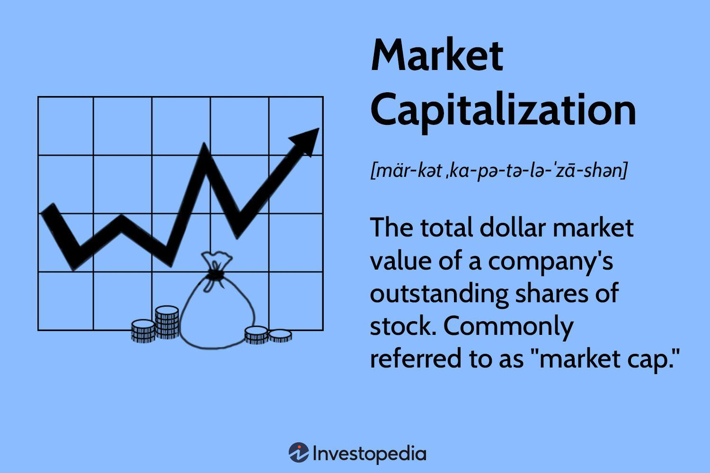

## Table of Contents

## What is market capitalization?

Market capitalization, often called market cap, is the total value of all the shares of a company. It is calculated by multiplying the current stock price by the total number of shares outstanding. This number gives investors an idea of the company's size and its overall worth in the market. For example, if a company has 1 million shares and each share is worth $50, the market cap would be $50 million.

Market cap is useful for comparing companies within the same industry or across different sectors. It helps investors understand which companies are larger and potentially more stable. Companies are often categorized by their market cap into groups like small-cap, mid-cap, and large-cap. Small-cap companies usually have a market cap of less than $2 billion, mid-cap companies range from $2 billion to $10 billion, and large-cap companies are above $10 billion. This classification can guide investment decisions based on risk and growth potential.

## How is market capitalization calculated?

Market capitalization is calculated by multiplying the current price of a company's stock by the total number of shares that the company has. For example, if a company's stock price is $10 and it has 1 million shares, you multiply $10 by 1 million to get a market capitalization of $10 million.

This calculation gives you the total value of the company based on what investors are willing to pay for its shares at that moment. It's a simple way to see how big a company is in the stock market. Market capitalization can change every day because stock prices go up and down.

## What are the different categories of market capitalization?

Companies are often grouped into different categories based on their market capitalization. These categories help investors understand the size and potential risk of a company. The main categories are small-cap, mid-cap, and large-cap. Small-cap companies have a market capitalization of less than $2 billion. These companies are usually smaller and can grow quickly, but they can also be riskier. Mid-cap companies have a market capitalization between $2 billion and $10 billion. They are bigger than small-cap companies but still have room to grow and might be less risky.

Large-cap companies have a market capitalization of more than $10 billion. These are big, well-known companies that are usually more stable and less risky than smaller companies. Sometimes, there are even bigger categories like mega-cap, which includes companies with a market capitalization over $200 billion. Understanding these categories can help investors make better choices about where to put their money based on how much risk they want to take and how much growth they expect.

## Why is market capitalization important for investors?

Market capitalization is important for investors because it tells them how big a company is. When you know a company's size, you can compare it with other companies. This helps you see which companies are bigger and might be safer to invest in. Big companies, or large-cap companies, are often more stable and less risky. Smaller companies, or small-cap companies, might grow a lot but can also be riskier.

Investors also use market capitalization to decide where to put their money. If you want to take more risk for a chance at bigger growth, you might choose small-cap or mid-cap companies. If you want to be safer and invest in well-known, stable companies, you would look at large-cap companies. Knowing the market cap helps you match your investments with your goals and how much risk you are willing to take.

## How does market capitalization affect stock volatility?

Market capitalization can affect how much a stock's price moves up and down, which is called volatility. Smaller companies, or small-cap companies, often have more volatility. This is because they are less stable and can be more affected by changes in the market or their business. If something good or bad happens, their stock price can change a lot.

On the other hand, larger companies, or large-cap companies, usually have less volatility. These companies are bigger and more stable, so their stock prices don't move as much. Investors see them as safer, so their stock prices don't jump around as much when the market changes. Knowing this can help investors decide which stocks might be more or less risky.

## What role does market capitalization play in portfolio diversification?

Market capitalization plays a big role in helping investors spread their money around in different ways. This is called portfolio diversification. When you have stocks from companies of different sizes, like small-cap, mid-cap, and large-cap, you are not putting all your money in one kind of company. This can help lower your risk. If small companies do badly, but big companies do well, your portfolio might still be okay because it has a mix of different sizes of companies.

Choosing stocks from different market cap categories can also help you balance growth and safety. Small-cap stocks might grow a lot but can be risky. Large-cap stocks might not grow as fast, but they are usually safer. By having some of each, you can aim for growth while also keeping some safety in your investments. This way, you can work towards your financial goals without taking too much risk all at once.

## How can market capitalization influence investment strategies?

Market capitalization can shape how people decide to invest their money. When you know how big a company is, you can pick the right kind of stocks for your goals. If you want to grow your money fast and are okay with taking more risk, you might choose small-cap stocks. These are smaller companies that can grow a lot but can also lose value quickly. On the other hand, if you want to be safer and keep your money steady, you might go for large-cap stocks. These are big companies that don't change as much and are seen as more stable.

Using market capitalization in your investment strategy also helps you spread out your money. This is called diversification. By having some small-cap, some mid-cap, and some large-cap stocks, you can balance the risk and reward in your investments. If one type of stock does badly, the others might do well and help keep your overall investment safe. This way, you can aim to grow your money while also protecting it from big losses.

## What are the advantages of investing in large-cap versus small-cap companies?

Investing in large-cap companies has some big advantages. These companies are big and well-known, so they are usually more stable. This means their stock prices don't jump around as much. When you put your money in large-cap stocks, you are often taking less risk. They are good if you want to keep your money safe and grow it slowly over time. Also, large-cap companies often pay dividends, which is like getting a little extra money just for owning their stock.

On the other hand, small-cap companies can offer different benefits. These smaller companies can grow a lot faster than big ones. If you are okay with taking more risk, small-cap stocks might be a good choice. They can make your money grow quickly, but they can also lose value fast. Small-cap companies are good if you want to try to make a lot of money in a shorter time, but you have to be ready for the ups and downs.

## How does market capitalization impact a company's access to capital?

Market capitalization can affect how easily a company can get money to grow or run its business. Big companies with a high market cap, like large-cap companies, usually find it easier to borrow money or sell new shares. Banks and investors see them as safer bets because they are well-known and stable. This means these big companies can often get loans with lower interest rates or sell new shares without making their stock price drop a lot.

Smaller companies with a lower market cap, like small-cap companies, might have a harder time getting money. They are seen as riskier because they are not as well-known or stable. Banks might charge them higher interest rates on loans, and if they try to sell new shares, it could make their stock price go down. This makes it tougher for small companies to get the money they need to grow or even keep running their business.

## What are the limitations of using market capitalization as an investment metric?

Market capitalization is a good way to see how big a company is, but it has some limits. One big problem is that it only looks at the price of the stock and how many shares there are. It doesn't tell you if the company is making money or if it has a lot of debt. So, a company might have a high market cap but not be doing well in other ways. This can make it hard for investors to know if the company is really a good investment.

Another limit is that market cap can change a lot because stock prices go up and down every day. This means the market cap can make a company look bigger or smaller than it really is. Also, market cap doesn't show you things like how the company is run or if it has good ideas for the future. Investors need to look at other things along with market cap to get a full picture of a company and decide if it's a smart place to put their money.

## How does market capitalization correlate with other financial metrics like P/E ratio?

Market capitalization and the price-to-earnings (P/E) ratio are both important numbers for investors, but they tell different stories about a company. Market cap shows how big a company is by multiplying its stock price by the number of shares. The P/E ratio, on the other hand, shows how much investors are willing to pay for each dollar of the company's earnings. It is calculated by dividing the stock price by the earnings per share. So, while market cap gives you the overall size, the P/E ratio tells you about the price relative to the company's profits.

These two metrics can work together to give a fuller picture of a company's value. A company with a high market cap and a high P/E ratio might be seen as expensive because investors are paying a lot for its earnings. On the other hand, a company with a low market cap and a low P/E ratio might be seen as a bargain. But it's important to remember that a high P/E ratio could also mean investors expect the company to grow a lot in the future. So, while market cap and P/E ratio are linked because they both use the stock price, they help investors in different ways when deciding where to put their money.

## What historical trends can we observe in market capitalization and their impact on investor behavior?

Over time, we can see that market capitalization has a big effect on how people invest their money. When the market cap of a company grows a lot, more people want to buy its stock. This often happens when the economy is doing well and people feel good about investing. For example, during the tech boom in the late 1990s, many tech companies saw their market caps go way up because everyone wanted to invest in technology. But when the market cap goes down, like during a recession, people get scared and might sell their stocks, causing the market to go down even more.

Another trend we can see is that big changes in market cap can lead to changes in what investors do. When a company's market cap gets really big, it might be seen as a safe place to put money, and more people will invest in it. But if a lot of companies in one industry, like tech or energy, have their market caps go up a lot, people might start to worry that the market is too focused on one thing. This can make them move their money to other kinds of investments to spread out their risk. So, market cap not only shows how big a company is but also influences where people decide to invest their money.

## What is Understanding Market Capitalization?

Market capitalization, often referred to as market cap, is a critical financial metric used to determine the market value of a company. It is calculated by multiplying the current share price by the total number of outstanding shares of the company. Mathematically, it is expressed as:

$$
\text{Market Capitalization} = \text{Share Price} \times \text{Total Outstanding Shares}
$$

This valuation serves as an essential indicator for investors, acting as a proxy for understanding a company's size and gauging potential investment risk. 

Market capitalization is instrumental in categorizing companies into different segments based on their size: large-cap, mid-cap, and small-cap. Each category carries distinct growth prospects and risk profiles. Large-cap companies, generally valued at $10 billion or more, are typically well-established enterprises with a history of stable earnings and lower [volatility](/wiki/volatility-trading-strategies). Mid-cap companies, with market capitalizations ranging from $2 billion to $10 billion, often strike a balance between growth potential and stability, making them appealing to investors looking for moderate risk exposure. Small-cap companies, valued at less than $2 billion, usually offer higher growth opportunities but come with increased volatility and risk.

Understanding these categories is crucial for investors as it enables them to align their investment portfolios with their risk tolerance and financial objectives. Investors seeking stability and consistent returns may prefer large-cap stocks, whereas those aiming for higher growth might consider mid-cap or small-cap stocks.

By recognizing the implications of market capitalization, investors can make informed decisions that reflect their preferences for risk and growth, ultimately aiding in the construction of a diversified and strategically aligned investment portfolio.

## How do you calculate market cap?

Market capitalization, commonly referred to as market cap, is a straightforward yet powerful metric used to gauge a company's market value. It is calculated using a simple formula:

$$
\text{Market Capitalization} = \text{Current Share Price} \times \text{Total Number of Outstanding Shares}
$$

To illustrate, consider a hypothetical company with 10 million shares that are each trading at $50. By plugging these values into the formula, the market cap of the company is:

$$
\text{Market Capitalization} = 10,000,000 \, \text{shares} \times \$50/\text{share} = \$500,000,000
$$

A company's market capitalization offers investors a snapshot of its market value at any given time. However, this value is not static and is subject to fluctuations. The market cap can change due to variations in the share price, which may rise or fall in response to market dynamics, financial performance, or broader economic factors.

Moreover, the total number of outstanding shares can also impact market capitalization. Companies may issue additional shares through secondary offerings or buy back shares, affecting the total share count. Such actions can either dilute or concentrate the ownership stake of existing shareholders, thereby influencing the market cap.

Understanding how to calculate and interpret market capitalization helps investors assess a company's size, investment potential, and associated risks within the market. By integrating this metric into their investment strategies, investors can make informed decisions aligned with their financial goals and risk tolerance.

## References & Further Reading

[1]: "Advances in Financial Machine Learning" by Marcos Lopez de Prado. Available at: [https://www.amazon.com/Advances-Financial-Machine-Learning-Marcos/dp/1119482089](https://www.amazon.com/Advances-Financial-Machine-Learning-Marcos/dp/1119482089)

[2]: "Evidence-Based Technical Analysis: Applying the Scientific Method and Statistical Inference to Trading Signals" by David Aronson. Available at: [https://www.wiley.com/en-gb/Evidence+Based+Technical+Analysis:+Applying+the+Scientific+Method+and+Statistical+Inference+to+Trading+Signals-p-9780470008744](https://www.wiley.com/en-us/Evidence+Based+Technical+Analysis%3A+Applying+the+Scientific+Method+and+Statistical+Inference+to+Trading+Signals-p-9780470008744)

[3]: "Machine Learning for Algorithmic Trading" by Stefan Jansen. Available at: [https://www.amazon.com/Machine-Learning-Algorithmic-Trading-intelligence/dp/9918608013](https://www.amazon.com/Machine-Learning-Algorithmic-Trading-alternative/dp/1839217715)

[4]: "Quantitative Trading: How to Build Your Own Algorithmic Trading Business" by Ernest P. Chan. Available at: [https://www.amazon.com/Quantitative-Trading-Build-Algorithmic-Business/dp/0470284889](https://www.amazon.com/Quantitative-Trading-Build-Algorithmic-Business/dp/0470284889)

[5]: Bergstra, J., Bardenet, R., Bengio, Y., & Kégl, B. (2011). "Algorithms for Hyper-Parameter Optimization." Advances in Neural Information Processing Systems 24. Available at: [https://papers.nips.cc/paper_files/paper/2011/hash/86e8f7ab32cfd12577bc2619bc635690-Abstract.html](https://dl.acm.org/doi/10.5555/2986459.2986743)