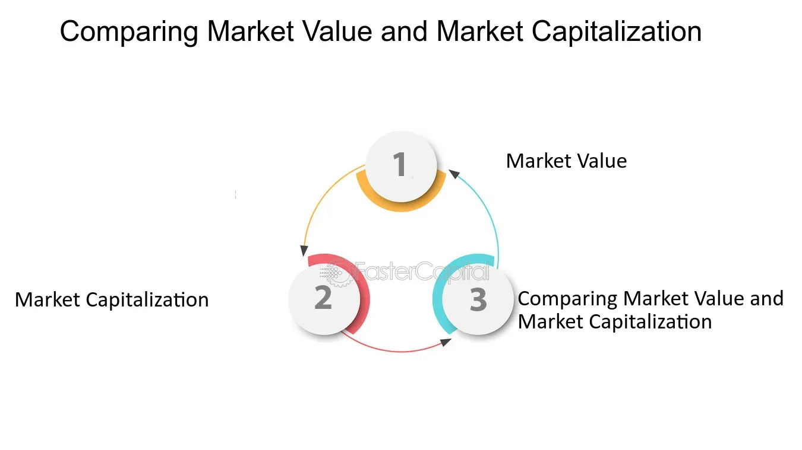

## Table of Contents

## What is market capitalization?

Market capitalization, often called market cap, is the total value of all the shares of a company. It is calculated by multiplying the current stock price by the total number of shares outstanding. This number gives investors an idea of the company's size and its overall value in the stock market. For example, if a company has 1 million shares and each share is worth $50, the market cap would be $50 million.

Market cap is useful for comparing companies within the same industry or across different sectors. It helps investors understand which companies are bigger and potentially more stable. Companies are often categorized by their market cap into groups like large-cap, mid-cap, and small-cap. Large-cap companies are usually well-established and stable, while small-cap companies might be newer and riskier but with more potential for growth.

## What is market value?

Market value is the price that someone is willing to pay for something at a certain time. It's like how much money you can get if you sell your bike or your house today. For things like stocks, market value is the current price of one share. If you want to know the market value of a whole company, you look at its market capitalization, which is the total value of all its shares.

Market value can change a lot. It depends on what people think the thing is worth and how much they want it. For example, if a lot of people want to buy a certain stock, its market value might go up. But if something bad happens to the company, like a big loss, the market value might go down. So, market value is always moving and it's important to keep an eye on it if you're thinking about buying or selling.

## How is market capitalization calculated?

Market capitalization is figured out by taking the current price of one share of a company and multiplying it by the total number of shares that the company has. Imagine you have a company with 1 million shares, and each share is selling for $50. You would multiply 1 million by $50 to get a market capitalization of $50 million.

This number is important because it shows how big a company is in the eyes of the stock market. It helps people compare different companies easily. If one company has a bigger market cap than another, it might mean it's larger or more valuable. But remember, market cap can change every day because stock prices go up and down all the time.

## How is market value determined?

Market value is what someone is willing to pay for something right now. It's like the price tag on an item in a store, but it can change based on what people think it's worth. For things like houses or cars, market value can be influenced by how much similar items have sold for recently, the condition of the item, and how much people want it. If a lot of people want to buy something, its market value might go up because they're willing to pay more for it.

For stocks, market value is the current price of one share. This price changes all the time because it's based on what people are willing to pay at that moment. Things like how well the company is doing, news about the company, and what's happening in the economy can all affect the stock's market value. If people think the company will do well in the future, they might be willing to pay more for its stock, which raises the market value.

## What are the key differences between market capitalization and market value?

Market capitalization and market value are two important concepts in finance, but they mean different things. Market capitalization, or market cap, is the total value of all the shares of a company. You find it by multiplying the current stock price by the total number of shares. It tells you how big the company is in the eyes of the stock market. For example, if a company has 1 million shares and each share is worth $50, its market cap would be $50 million.

Market value, on the other hand, is the price that someone is willing to pay for something at a certain time. It's like how much you could sell your bike for today. For stocks, market value is the current price of one share. It can change a lot because it depends on what people think the stock is worth at that moment. If a lot of people want to buy the stock, its market value might go up. So, while market cap gives you a big picture of a company's total value, market value is about what one share is worth right now.

Both market cap and market value are important for investors. Market cap helps you compare the size of different companies, while market value tells you what you might pay for a single share. They both move around a lot because they're based on what people think things are worth, and that can change quickly.

## Can market capitalization be used to assess a company's value?

Yes, market capitalization can be used to assess a company's value. It gives you an idea of how big the company is in the eyes of the stock market. You find it by multiplying the current price of one share by the total number of shares. This number can tell you if a company is small, medium, or large compared to others. For example, a company with a high market cap might be seen as more stable and well-established than one with a low market cap.

However, market capitalization is just one piece of the puzzle. It doesn't tell you everything about a company's value. Other things like earnings, debts, and what the company owns can also affect its true worth. So while market cap is a good starting point to compare companies, it's important to look at other factors too to get a full picture of a company's value.

## How does market value differ from book value?

Market value is what someone is willing to pay for something right now. It's like the price you see on a store tag, but it can change based on what people think it's worth. For stocks, market value is the current price of one share. This price can go up or down depending on how well the company is doing, news about the company, and what's happening in the economy. If a lot of people want to buy the stock, its market value might go up because they're willing to pay more for it.

Book value, on the other hand, is what a company is worth on paper. It's calculated by taking everything the company owns (its assets) and subtracting everything it owes (its liabilities). This number gives you an idea of what would be left if the company sold all its stuff and paid off all its debts. Book value is more about the company's financial health and doesn't change as quickly as market value. While market value is about what people think the company is worth right now, book value is more about the company's actual worth based on its books.

## What role do investors play in determining market capitalization and market value?

Investors play a big role in deciding both market capitalization and market value. Market value is the price of one share of a company, and it changes based on what investors are willing to pay for it. If a lot of investors want to buy the stock, they might be ready to pay more, which makes the market value go up. On the other hand, if investors are not so sure about the company or think it's not doing well, they might not want to pay as much, and the market value could go down. So, what investors think and do directly affects the market value of a stock.

Market capitalization, or market cap, is the total value of all the shares of a company. It's found by multiplying the market value of one share by the total number of shares. Since investors decide the market value of each share, they also end up deciding the market cap of the company. If investors are excited about a company and push the market value of its shares up, the market cap will go up too. If they're not so excited and the market value goes down, the market cap will go down as well. So, investors' actions and feelings about a company shape both its market value and its market capitalization.

## How do market capitalization and market value impact investment decisions?

Market capitalization and market value are important for people who want to invest in companies. Market cap tells you how big a company is in the eyes of the stock market. It's like a scoreboard that shows if a company is small, medium, or large. When you're thinking about investing, knowing the market cap can help you decide if you want to put your money into a big, stable company or a smaller one that might grow a lot. If you like safe bets, you might pick a company with a big market cap. But if you're okay with more risk and want a chance for big rewards, you might go for a smaller company.

Market value is the price of one share of a company right now. It can change a lot because it depends on what people think the stock is worth at that moment. When you're making an investment decision, the market value helps you figure out how much you'll have to pay for a share. If you think the market value is low and the company will do well in the future, you might decide to buy the stock. But if you think the market value is too high compared to what the company is really worth, you might decide to wait or look at other options. So, both market cap and market value help you make smarter choices about where to put your money.

## What are the limitations of using market capitalization as a measure of company size?

Market capitalization is a popular way to measure how big a company is, but it has some limits. It only looks at the total value of a company's shares, which can change a lot every day. This means market cap can make a company look bigger or smaller than it really is, depending on what's happening in the stock market. Also, market cap doesn't tell you anything about a company's debts or how much money it's making. So, a company with a big market cap might actually be in a lot of debt or not making much profit.

Another problem with using market cap alone is that it doesn't show you what the company owns or how it's doing overall. For example, a company might have a lot of valuable stuff like buildings or machines, but if its stock price is low, its market cap won't show that. Also, market cap can be affected by things that don't have much to do with the company itself, like what's happening in the economy or news that makes people feel good or bad about the stock market. So, while market cap is a good starting point, it's important to look at other things too to really understand a company's size and health.

## How do changes in market conditions affect market capitalization and market value?

Changes in market conditions can really shake up a company's market capitalization and market value. Market value is what someone is willing to pay for one share of a company right now. If the economy is doing well and people feel good about investing, they might be ready to pay more for stocks, which makes the market value go up. But if there's bad news, like a recession or a big problem in the world, people might get scared and not want to pay as much, so the market value could drop. Since market cap is just the total value of all the shares, it goes up or down with the market value of each share.

Market conditions can also affect market cap and market value in other ways. For example, if interest rates go up, borrowing money becomes more expensive, and that can make companies' profits go down. When profits drop, people might not want to pay as much for the company's stock, so both market value and market cap could fall. On the other hand, if there's a new technology or a big change in an industry that makes people excited, the market value of companies in that industry might go up because investors think they'll do better in the future. So, market conditions are always moving and can have a big impact on how much a company is worth in the eyes of the stock market.

## What advanced metrics can be used alongside market capitalization and market value for a more comprehensive analysis?

When you want to understand a company better than just looking at its market capitalization and market value, you can use other advanced metrics. One useful metric is the Price-to-Earnings (P/E) ratio, which shows how much investors are willing to pay for each dollar of the company's earnings. A high P/E ratio might mean people think the company will grow a lot in the future, while a low P/E ratio might mean the opposite. Another important metric is the Debt-to-Equity (D/E) ratio, which tells you how much the company is borrowing compared to what the owners have put in. A high D/E ratio can be risky because it means the company has a lot of debt, but a low one might show the company is more stable.

You can also look at the Return on Equity (ROE), which shows how well the company is using the money the owners have invested to make a profit. A high ROE is usually a good sign because it means the company is doing well with the money it has. Another helpful metric is the Earnings Before Interest, Taxes, Depreciation, and Amortization (EBITDA), which gives you an idea of the company's operating performance without some of the accounting and financial stuff getting in the way. By using these metrics along with market cap and market value, you get a fuller picture of how the company is doing and what its real value might be.

## What is the difference between Market Capitalization and Market Value?

Market capitalization, commonly referred to as market cap, is a fundamental metric in finance used to evaluate a company's size and overall market value. It is calculated using the formula:

$$
\text{Market Capitalization} = \text{Number of Shares Outstanding} \times \text{Current Price per Share}
$$

This straightforward calculation provides a clear picture of a company's size, serving as a useful indicator for investors to classify companies into categories such as large-cap, mid-cap, and small-cap. Large-cap companies tend to present lower risk and higher stability, while small-cap companies may offer higher growth potential but can be accompanied by increased [volatility](/wiki/volatility-trading-strategies).

On the other hand, market value is a more intricate concept, reflecting the total worth of a company as perceived by investors and influenced by several factors. While market cap is an objective figure derived from share price and [volume](/wiki/volume-trading-strategy), market value accounts for the subjective and dynamic nature of the market. It encompasses various elements such as investor perceptions, economic conditions, and the company's potential for growth and profitability.

Market value is not merely a product of arithmetic computation but is informed by qualitative factors like corporate governance, competitive advantage, and overall economic climate. This metric considers how well a company is positioned within its industry, its strategic initiatives, and the broader market sentiment surrounding its future prospects.

Therefore, while market cap offers an expedient snapshot of a company’s size, market value provides a deeper, more nuanced understanding of its potential as an investment. Recognizing the nuances between these two metrics is vital for investors seeking to form comprehensive analyses and informed decision-making.

Investors can utilize these metrics by comparing companies within the same industry or across sectors, assisting them in determining the best opportunities based on their risk tolerance and growth expectations. Understanding the differences and applications of market capitalization and market value enables investors to navigate financial landscapes effectively, combining quantitative and qualitative assessments to gauge a company’s true position and potential.

## What is the comparison between Market Capitalization and Market Value?

Market capitalization (market cap) is a straightforward metric used to determine the size of a company within the financial markets. It is calculated by multiplying the total number of outstanding shares by the current stock price per share. Mathematically, it is expressed as:

$$
\text{Market Capitalization} = \text{Current Stock Price} \times \text{Number of Outstanding Shares}
$$

This formula provides a clear picture of a company’s size in the market, reflecting its market value at a given point in time. However, market capitalization does not fully capture the broader context of a company’s worth, leading investors to consider market value for a more comprehensive understanding.

Market value is a more dynamic and encompassing measure that considers various factors beyond the stock price and shares. These factors include earnings, economic conditions, and overall market sentiment. Unlike market cap, market value accounts for the company's potential growth, profitability, and perceived value by investors. For instance, in situations where investor sentiment is exceptionally positive, a company's market value might exceed its market capitalization, indicating the market’s optimistic outlook on the company's future performance.

While market cap and market value are sometimes used interchangeably, they represent distinct dimensions of financial evaluation. Market cap is static and provides a snapshot based on current stock price and share count, whereas market value involves deeper analysis, including intangible factors that could affect a company's future profitability and growth potential.

Investors aiming for a thorough understanding of a company's financial health and market position must take into account both market capitalization and market value. By doing so, they can gauge a holistic view of the company’s financial standing, allowing for informed decision-making that considers not only a company's current size but also its future prospects and market perceptions. Understanding the balance and distinction between these metrics is crucial for investors looking to navigate the complexities of financial valuation effectively.

## How can we evaluate algorithmic trading strategies?

Effective algorithmic trading necessitates robust strategies that expertly integrate risk management and thorough performance evaluation. To assess the success of a trading strategy, investors commonly rely on several key metrics that provide insights into risk-adjusted returns, potential losses, profitability, and win frequency. Among these, the Sharpe Ratio is a prominent tool used to measure risk-adjusted return by calculating the average return earned in excess of the risk-free rate per unit of volatility or total risk. Mathematically, it is expressed as:

$$
\text{Sharpe Ratio} = \frac{E[R_p - R_f]}{\sigma_p}
$$

where $E[R_p - R_f]$ represents the expected return of the portfolio minus the risk-free rate, and $\sigma_p$ denotes the standard deviation of the portfolio returns.

Another important metric is the Maximum Drawdown, which measures the largest peak-to-trough decline in portfolio value. It is crucial for evaluating the potential risk of loss and for understanding the resilience of a trading strategy during market downturns.

The Win Rate is pivotal for examining the frequency of successful trades relative to total trades executed. It provides a basic measure of the probability of positive returns but does not account for the magnitude of profits relative to losses.

Profit Factor, defined as the ratio of gross profits to gross losses, gives a consolidated measure of a strategy's profitability, highlighting the balance between winning and losing trades.

To enhance trading efficiencies, advanced algorithmic strategies increasingly leverage machine learning techniques. These strategies dynamically adjust to varying market conditions by processing large datasets and uncovering patterns that may not be visible through traditional analysis. Machine learning models can optimize decision-making by predicting market trends, consequently improving profitability and reducing exposure to adverse market movements.

Investors are encouraged to prioritize the evaluation of their strategies rigorously to ensure sustained profitability and effective risk mitigation. Through comprehensive analysis, using the aforementioned metrics, alongside cutting-edge technologies, investors can fine-tune their trading algorithms to better navigate the complexities of algorithmic trading within financial markets. This ongoing evaluation is crucial as it allows adaptation to evolving market trends, ensuring that strategies remain relevant and effective in delivering desired financial outcomes.

## References & Further Reading

[1]: ["Algorithmic Trading: Winning Strategies and Their Rationale"](https://www.wiley.com/en-us/Algorithmic+Trading%3A+Winning+Strategies+and+Their+Rationale-p-9781118460146) by Ernie Chan

[2]: Lopez de Prado, M. (2018). ["Advances in Financial Machine Learning."](https://www.amazon.com/Advances-Financial-Machine-Learning-Marcos/dp/1119482089) Wiley.

[3]: ["Flash Boys: A Wall Street Revolt"](https://en.wikipedia.org/wiki/Flash_Boys) by Michael Lewis

[4]: Pardo, R. (2008). ["The Evaluation and Optimization of Trading Strategies."](https://onlinelibrary.wiley.com/doi/book/10.1002/9781119196969) Wiley.

[5]: Deprado, M. (2016). ["Building Diversified Portfolios: Theory and Techniques."](https://papers.ssrn.com/sol3/papers.cfm?abstract_id=2708678) 

[6]: Aldridge, I. (2013). ["High-Frequency Trading: A Practical Guide to Algorithmic Strategies and Trading Systems."](https://www.ahmetbeyefendi.com/wp-content/uploads/2020/07/High-Frequency-Trading-Irene-Aldridge.pdf) Wiley.

[7]: Narang, R. (2009). ["Inside the Black Box: The Simple Truth About Quantitative Trading."](https://onlinelibrary.wiley.com/doi/book/10.1002/9781118267738) Wiley.

[8]: Kwak, M., & Lee, J. (2020). ["Algorithmic Trading: Opportunities and Challenges."](https://scholar.google.com/citations?user=7Dy1PBkAAAAJ) Available at SSRN 3671180.

[9]: Budish, E., Cramton, P., & Shim, J. (2015). ["The High-Frequency Trading Arms Race: Frequent Batch Auctions as a Market Design Response."](https://academic.oup.com/qje/article/130/4/1547/1916146) The Quarterly Journal of Economics, 130(4), 1547-1621.