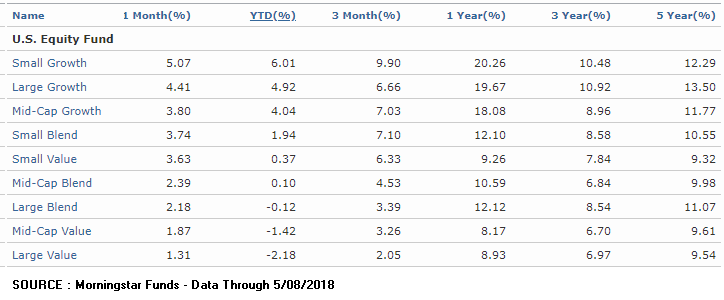

## Table of Contents

## What is market capitalization?

Market capitalization, often called market cap, is the total value of all the shares of a company. You can find it by multiplying the number of shares a company has by the price of one share. It shows how big a company is in the eyes of investors. A higher market cap means the company is seen as more valuable.

Market cap is useful for comparing companies. For example, it helps investors see which companies are bigger or smaller in the market. It's also used to group companies into categories like large-cap, mid-cap, and small-cap. These categories help investors choose where to put their money based on their goals and how much risk they want to take.

## What are mutual funds?

Mutual funds are a way for many people to pool their money together to invest in a variety of stocks, bonds, or other assets. When you buy into a mutual fund, you're buying a small piece of a big collection of investments. This makes it easier for you to have a diverse set of investments without having to buy each one separately. A professional manager usually runs the mutual fund, deciding which investments to buy and sell.

Mutual funds can be a good choice if you want to invest but don't have a lot of money or time to manage your investments yourself. They come in different types, like those that focus on growth, income, or a mix of both. You can also find mutual funds that invest in certain areas, like technology or healthcare. By spreading your money across many different investments, mutual funds can help reduce the risk that comes with investing in just one or two things.

## How do market capitalization mutual funds work?

Market capitalization mutual funds, often called cap-based funds, focus on companies of a certain size. They group companies into categories like large-cap, mid-cap, and small-cap based on their market capitalization. Large-cap funds invest in big, well-known companies that usually have a market cap of over $10 billion. These companies are often seen as more stable and less risky. Mid-cap funds look at companies with a market cap between $2 billion and $10 billion. These companies are growing and might offer more growth potential but come with more risk. Small-cap funds invest in smaller companies, usually with a market cap under $2 billion. These can be riskier but might offer the chance for big returns.

When you invest in a market capitalization mutual fund, you're buying into a collection of stocks that fit into one of these size categories. The fund manager picks the stocks and manages the portfolio to match the fund's goals. For example, if you invest in a large-cap fund, your money will be spread across many big companies. This can help lower your risk because your investment isn't tied to just one company. If you choose a small-cap fund, your money will go into smaller, potentially faster-growing companies, but with more risk. By choosing the right cap-based fund, you can match your investment to your comfort with risk and your financial goals.

## What are the different categories of market capitalization mutual funds?

Market capitalization mutual funds are split into three main groups: large-cap, mid-cap, and small-cap funds. Large-cap funds invest in big companies that have a market value of over $10 billion. These companies are usually well-known and seen as stable. They might not grow as fast as smaller companies, but they are often safer to invest in. Mid-cap funds focus on companies that are in the middle, with a market value between $2 billion and $10 billion. These companies are growing and might offer more growth potential, but they can also be riskier than large-cap companies.

Small-cap funds invest in the smallest companies, usually those with a market value under $2 billion. These companies can be riskier because they are less established, but they also have the potential for big growth. By choosing a market capitalization mutual fund, you can decide how much risk you want to take. If you want something safer, you might go for a large-cap fund. If you're okay with more risk for the chance of bigger returns, you might choose a small-cap fund.

## What are the benefits of investing in market capitalization mutual funds?

Investing in market capitalization mutual funds can help you spread your money across different sizes of companies. When you put your money into a large-cap fund, you're investing in big, stable companies that are less likely to lose a lot of value quickly. This can be good if you want to keep your money safe. On the other hand, if you choose a mid-cap or small-cap fund, you're investing in companies that might grow a lot. These can be riskier, but they also offer the chance to make more money. By picking the right type of fund, you can match your investment to how much risk you're okay with and what you want to achieve.

Another benefit is that market capitalization mutual funds are managed by professionals. They do the work of picking which companies to invest in, so you don't have to spend time doing that yourself. This can be really helpful if you're new to investing or if you just don't have the time to manage your investments. Also, these funds can be a good way to diversify your portfolio. Instead of putting all your money into one or two companies, you're spreading it across many. This can help reduce the risk that comes with investing because if one company does badly, it won't hurt your whole investment as much.

## What are the risks associated with market capitalization mutual funds?

Investing in market capitalization mutual funds comes with some risks. One big risk is that the value of your investment can go up and down a lot. This is especially true for small-cap and mid-cap funds. These funds invest in smaller companies that might not be as stable as big companies. If the economy does badly or if something goes wrong with one of the companies in the fund, the value of your investment could drop a lot. Large-cap funds are usually safer, but even they can lose value if the market goes down.

Another risk is that you might not get the returns you're hoping for. Even if you pick a fund that's done well in the past, there's no guarantee it will do well in the future. The people who manage the fund might make bad choices about which companies to invest in, or the market might change in a way that hurts the fund's performance. Also, all mutual funds have fees, and these can eat into your returns. The higher the fees, the less money you might make from your investment.

It's also important to think about how long you plan to keep your money in the fund. If you need your money back soon, market cap mutual funds might not be the best choice. These funds are usually better for long-term investing because they can be more volatile in the short term. If you take your money out when the market is down, you might lose money. So, it's good to be ready to leave your money in the fund for a while to give it a chance to grow.

## How do you choose the right market capitalization mutual fund for your portfolio?

Choosing the right market capitalization mutual fund for your portfolio starts with understanding your own investment goals and how much risk you're comfortable with. If you want to play it safe and protect your money, a large-cap fund might be the best choice. These funds invest in big, well-known companies that are usually more stable. But if you're okay with taking more risk for the chance to make more money, you might want to look at mid-cap or small-cap funds. These invest in smaller companies that could grow a lot, but they can also lose value more easily.

Once you know what kind of risk you're willing to take, you should look at the fund's past performance and fees. While past performance doesn't guarantee future results, it can give you an idea of how the fund has done over time. Also, pay attention to the fees because they can eat into your returns. Lower fees mean more of your money stays in your pocket. Finally, think about how long you plan to keep your money in the fund. Market cap mutual funds are usually better for long-term investing, so make sure you're ready to leave your money in for a while to give it a chance to grow.

## What is the performance history of market capitalization mutual funds?

The performance history of market capitalization mutual funds can vary a lot depending on which type of fund you look at. Large-cap funds, which invest in big companies, usually do better when the economy is doing well but might not grow as fast as smaller companies. Over the long term, they tend to be more stable and less risky. For example, if you look at the last 10 years, large-cap funds might have had steady growth without big ups and downs. But, if the economy goes through a rough patch, even large-cap funds can lose value.

Mid-cap and small-cap funds, on the other hand, can be more up and down. These funds invest in smaller companies that might grow a lot but can also lose value quickly. Over the last 10 years, you might see that mid-cap and small-cap funds had times when they did really well, but also times when they didn't do so great. They can be riskier, but if you're okay with that risk, they might give you a chance to make more money. It's important to remember that past performance doesn't tell you what will happen in the future, but it can give you an idea of how these funds have done over time.

## How do market capitalization mutual funds compare to other types of mutual funds?

Market capitalization mutual funds focus on the size of companies they invest in, like large-cap, mid-cap, and small-cap funds. Other types of mutual funds might focus on different things, like the kind of industry they invest in, like tech or healthcare, or they might aim for certain goals, like growth or income. For example, sector funds invest in companies from one specific industry, while growth funds look for companies that are expected to grow a lot. Market cap funds are different because they group companies by their size, not by what they do or what they're trying to achieve.

When you compare market cap funds to other types of mutual funds, you see that they each have their own way of spreading risk and aiming for returns. Market cap funds can help you spread your money across different sizes of companies, which can be good if you want to balance risk and growth. Large-cap funds are usually safer but might not grow as fast, while small-cap funds can be riskier but might offer bigger returns. On the other hand, sector funds might be riskier because they focus on one industry, but they can also do really well if that industry does well. Growth funds might be good if you want your money to grow a lot, but they can also lose value if the companies they invest in don't do well. So, choosing between market cap funds and other types of funds depends on what you want to achieve with your investments and how much risk you're okay with.

## What are the tax implications of investing in market capitalization mutual funds?

When you invest in market capitalization mutual funds, you need to think about taxes. If the fund makes money from the stocks it holds, it might have to pay taxes on those gains. These gains are called capital gains, and they can be short-term or long-term. Short-term gains happen if the fund sells a stock it held for less than a year, and these are taxed at your regular income tax rate. Long-term gains come from stocks held for more than a year, and they are usually taxed at a lower rate. When the fund pays out these gains to you, you have to pay taxes on them, too.

Another thing to think about is dividends. If the companies in the fund pay dividends, the fund might pass those dividends on to you. Dividends can be qualified or non-qualified. Qualified dividends are taxed at the same lower rate as long-term capital gains, while non-qualified dividends are taxed at your regular income tax rate. Also, if you sell your shares in the mutual fund and make a profit, you'll have to pay capital gains tax on that profit. So, it's good to keep in mind that the taxes on market cap mutual funds can affect how much money you actually keep from your investment.

## How do market capitalization mutual funds fit into a diversified investment strategy?

Market capitalization mutual funds can help you spread your money across different sizes of companies, which is a key part of having a diversified investment strategy. When you invest in a mix of large-cap, mid-cap, and small-cap funds, you're not putting all your eggs in one basket. Large-cap funds give you a piece of big, stable companies that might not grow as fast but are less likely to lose a lot of value quickly. Mid-cap funds let you invest in companies that are growing and might offer more growth potential, but they can be riskier. Small-cap funds focus on smaller companies that could grow a lot, but they also have more risk. By having a mix of these funds, you can balance out the risks and rewards in your portfolio.

Having market capitalization mutual funds in your investment strategy can also help you match your investments to your goals and how much risk you're okay with. If you want to play it safe, you might put more money into large-cap funds. If you're looking for more growth and are okay with taking more risk, you might choose to invest more in mid-cap or small-cap funds. This way, you can build a portfolio that fits what you want to achieve and how long you plan to keep your money invested. Diversifying with market cap funds can help you feel more confident about your investments because it spreads out the risk and gives you a chance to benefit from different parts of the market.

## What advanced strategies can be used when investing in market capitalization mutual funds?

When investing in market capitalization mutual funds, one advanced strategy is to use dollar-cost averaging. This means you put a set amount of money into the fund at regular times, like every month. By doing this, you buy more shares when the price is low and fewer shares when the price is high. Over time, this can help you pay less on average for your shares and reduce the risk of putting all your money in at the wrong time. Another strategy is to rebalance your portfolio. This means you check your investments now and then and adjust them to keep the mix of large-cap, mid-cap, and small-cap funds the way you want it. If one type of fund grows a lot more than the others, you might sell some of it and buy more of the others to keep your investments balanced.

Another advanced strategy is to use tactical asset allocation. This means you change how much money you have in different types of market cap funds based on what's happening in the market. If you think small-cap stocks are going to do well soon, you might put more money into small-cap funds. If you think the market is going to be risky, you might move more money into large-cap funds. This can help you take advantage of market trends, but it needs a lot of research and can be riskier because you're trying to guess what will happen next. Finally, consider using tax-efficient strategies. For example, you might put funds that generate a lot of capital gains into tax-advantaged accounts like an IRA or 401(k). This can help you keep more of your money by reducing the taxes you have to pay on your investments.

## What are the investment strategies for market cap funds?

Market cap funds, an essential component of diversified investment strategies, categorize investments based on the market capitalization of companies. Market capitalization, or market cap, is calculated as the total market value of a company’s outstanding shares: 

$$
\text{Market Cap} = \text{Stock Price} \times \text{Total Number of Outstanding Shares}
$$

Market cap classes—small-cap, mid-cap, and large-cap—help investors target companies at different stages of growth and stability, each presenting unique risk-return profiles.

**Small-Cap Funds**

Small-cap funds focus on companies with a market capitalization typically under $2 billion. These companies are generally in the early stages of growth, offering substantial growth potential due to their ability to innovate and adapt swiftly. However, this potential is coupled with increased volatility and higher risk, as smaller companies may be less established and more susceptible to economic fluctuations and competitive pressures. Investors with a higher risk tolerance and a longer investment horizon often choose small-cap funds to capitalize on their growth prospects.

**Mid-Cap Funds**

Mid-cap funds invest in companies with a market capitalization between $2 billion and $10 billion. These companies often represent businesses that have already achieved a degree of stability and are in a growth phase, offering a balanced blend of risk and return. Mid-cap companies tend to have more robust infrastructure and market presence than small-cap firms, which can translate to greater resilience in economic downturns, making mid-cap funds a suitable option for investors seeking a moderate risk-reward investment.

**Large-Cap Funds**

Large-cap funds target well-established companies with a market capitalization exceeding $10 billion. Known for their financial stability, these companies generally have a significant market share and abundant resources, providing steadier returns and lower risk relative to smaller-cap stocks. Large-cap investments are favored by risk-averse investors or those seeking more predictable returns, particularly during uncertain economic conditions. They are often considered a core component of conservative portfolios.

**Strategic Considerations**

Aligning market cap fund choices with an investor’s risk tolerance and investment objectives is crucial for optimizing returns. Investors should assess their willingness to bear short-term market fluctuations (risk tolerance) and their long-term financial goals (investment objectives) when selecting market cap funds. A diversified portfolio, incorporating different market cap funds, can offer a balance across varying levels of risk and potential reward, catering to both growth-oriented and stability-focused investment goals.

In conclusion, understanding the distinctive characteristics and investment opportunities afforded by small-cap, mid-cap, and large-cap funds enables investors to strategically construct a portfolio aligned with their financial aspirations and risk tolerance.

## References & Further Reading

[1]: Bergstra, J., Bardenet, R., Bengio, Y., & Kégl, B. (2011). ["Algorithms for Hyper-Parameter Optimization."](https://dl.acm.org/doi/10.5555/2986459.2986743) Advances in Neural Information Processing Systems 24.

[2]: ["Advances in Financial Machine Learning"](https://www.amazon.com/Advances-Financial-Machine-Learning-Marcos/dp/1119482089) by Marcos Lopez de Prado

[3]: ["Evidence-Based Technical Analysis: Applying the Scientific Method and Statistical Inference to Trading Signals"](https://www.amazon.com/Evidence-Based-Technical-Analysis-Scientific-Statistical/dp/0470008741) by David Aronson

[4]: ["Machine Learning for Algorithmic Trading"](https://github.com/stefan-jansen/machine-learning-for-trading) by Stefan Jansen

[5]: ["Quantitative Trading: How to Build Your Own Algorithmic Trading Business"](https://www.amazon.com/Quantitative-Trading-Build-Algorithmic-Business/dp/1119800064) by Ernest P. Chan