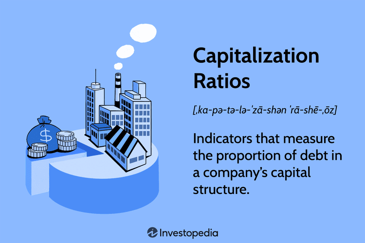

## Table of Contents

## What is market capitalization?

Market capitalization, often called market cap, is the total value of all the shares of a company. It is calculated by multiplying the current stock price by the total number of shares outstanding. This number gives investors an idea of the company's size and its overall value in the market. For example, if a company has 1 million shares and each share is worth $50, the market cap would be $50 million.

Market cap is important because it helps investors compare companies of different sizes. It can also show how the market views a company's future growth and potential. Companies are often categorized by their market cap into groups like small-cap, mid-cap, and large-cap. Small-cap companies usually have a market cap between $300 million and $2 billion, mid-cap companies range from $2 billion to $10 billion, and large-cap companies are valued at $10 billion or more. Understanding these categories can help investors make better decisions about where to put their money.

## How is market capitalization calculated?

Market capitalization is calculated by taking the current price of a company's stock and multiplying it by the total number of shares that the company has. For example, if a company's stock is trading at $20 per share and there are 1 million shares, the market capitalization would be $20 million.

This calculation gives you the total value of the company based on what people are willing to pay for its stock at that moment. It's like figuring out how much the whole company is worth in the eyes of the market. Market capitalization can change every day because stock prices go up and down.

## Why is market capitalization important for investors?

Market capitalization is important for investors because it helps them understand how big a company is. By knowing the market cap, investors can compare companies and see which ones are small, medium, or large. This helps them decide where to put their money. For example, some investors like to invest in big companies because they think they are safer, while others might want to take a chance on smaller companies that could grow a lot.

Market cap also shows what the market thinks about a company's future. If a company's market cap is high, it means people believe in its future growth and are willing to pay more for its stock. On the other hand, a low market cap might mean people are not as confident in the company. By looking at market cap, investors can get a quick idea of how the market feels about a company's potential, which can guide their investment choices.

## What are the different categories of market capitalization?

Companies are often put into different groups based on their market capitalization. These groups are called small-cap, mid-cap, and large-cap. Small-cap companies have a market cap between $300 million and $2 billion. These are usually smaller businesses that might be growing fast. Mid-cap companies have a market cap between $2 billion and $10 billion. They are bigger than small-cap companies but not as big as large-cap companies. Large-cap companies have a market cap of $10 billion or more. These are big, well-known companies that are often seen as more stable.

Understanding these categories can help investors make better choices. If someone wants to invest in a company that could grow a lot, they might look at small-cap companies. But if they want something safer, they might choose a large-cap company. Each category has its own risks and rewards, so knowing the market cap helps investors match their investments with their goals.

## How does market capitalization affect a company's stock price?

Market capitalization does not directly affect a company's stock price, but it is closely related. Market cap is the total value of a company, calculated by multiplying the stock price by the number of shares. If the stock price goes up, the market cap goes up too, and if the stock price goes down, the market cap goes down. So, changes in the stock price will change the market cap.

But market cap can also influence how people see a company. If a company has a high market cap, it might make people think the company is doing well and has a good future. This can make more people want to buy the stock, which can push the stock price up. On the other hand, if a company's market cap is low, people might think it's not doing well, and they might sell the stock, which can make the stock price go down. So, market cap can affect how people feel about a company, which can then affect the stock price.

## What is the market capitalization rule?

The market capitalization rule is a way to group companies by their size. It helps investors understand how big a company is and where it fits in the market. The rule divides companies into three main groups: small-cap, mid-cap, and large-cap. Small-cap companies have a market cap between $300 million and $2 billion. These are usually smaller businesses that might be growing fast. Mid-cap companies have a market cap between $2 billion and $10 billion. They are bigger than small-cap companies but not as big as large-cap companies. Large-cap companies have a market cap of $10 billion or more. These are big, well-known companies that are often seen as more stable.

Knowing these groups can help investors make better choices. If someone wants to invest in a company that could grow a lot, they might look at small-cap companies. But if they want something safer, they might choose a large-cap company. Each group has its own risks and rewards, so understanding the market cap rule helps investors match their investments with their goals.

## How does the market capitalization rule function in financial markets?

The market capitalization rule helps people in the financial markets understand how big a company is. It groups companies into small-cap, mid-cap, and large-cap based on their total value. Small-cap companies are worth between $300 million and $2 billion. These are usually smaller businesses that might grow fast. Mid-cap companies are worth between $2 billion and $10 billion. They are bigger than small-cap companies but not as big as large-cap companies. Large-cap companies are worth $10 billion or more. These are big, well-known companies that people often see as safer to invest in.

This rule is important because it helps investors make choices about where to put their money. If someone wants to invest in a company that could grow a lot, they might look at small-cap companies. But if they want something safer, they might choose a large-cap company. Each group has its own risks and rewards. By knowing the market cap rule, investors can match their investments with what they want to achieve.

## What are the implications of the market capitalization rule for portfolio management?

The market capitalization rule helps people who manage their investments, or portfolios, by giving them a way to sort companies into groups based on their size. This is useful because it helps investors decide how to spread their money around. If someone wants to take more risks and maybe get bigger rewards, they might put more of their money into small-cap companies. These are smaller businesses that could grow a lot. But if someone wants to be safer and keep their money more secure, they might choose to invest more in large-cap companies. These are bigger and often more stable companies.

Understanding the market capitalization rule also helps people balance their portfolios. If someone has too much money in one group, like all in large-cap companies, they might miss out on the growth that small-cap companies could offer. On the other hand, if they put all their money into small-cap companies, their portfolio could be too risky. By using the market capitalization rule, investors can mix different sizes of companies in their portfolio to match their goals and how much risk they are willing to take. This way, they can aim for a good balance between growth and safety.

## How does the market capitalization rule influence investment strategies?

The market capitalization rule helps people decide how to invest their money. It sorts companies into small-cap, mid-cap, and large-cap groups based on their size. If someone wants to grow their money quickly and is okay with taking more risks, they might choose to invest in small-cap companies. These are smaller businesses that could grow a lot. But if someone wants to be safer and keep their money secure, they might pick large-cap companies. These are bigger and usually more stable businesses.

Using the market capitalization rule can also help people make their investment plans. If someone only invests in large-cap companies, they might miss out on the big growth that small-cap companies can offer. But if they put all their money into small-cap companies, their investments could be too risky. By understanding the market cap rule, people can mix different sizes of companies in their portfolio. This helps them find a good balance between growing their money and keeping it safe, based on what they want to achieve and how much risk they're willing to take.

## What are the criticisms of the market capitalization rule?

Some people think the market capitalization rule has problems. One big issue is that it can make investors focus too much on a company's size and not enough on other important things, like how well the company is doing or if it's a good value. For example, a large-cap company might not be doing well even though it's big, and a small-cap company might be doing great but get ignored because it's small.

Another criticism is that the market cap rule doesn't tell the whole story about a company. It's just one way to look at a company's value, but it doesn't show everything, like how much debt the company has or how it's making money. Investors who only look at market cap might miss out on important details that could help them make better choices.

## How has the market capitalization rule evolved over time?

The market capitalization rule has changed a bit over time. When it first started, people used it to group companies into small, medium, and big ones. Back then, the sizes of these groups were different from what they are now. For example, a large-cap company used to be one that was worth $1 billion or more, but now it's usually $10 billion or more. As the economy grew and companies got bigger, the numbers for each group had to change to keep up.

Over the years, people have also started to look at other ways to understand a company's value, not just its market cap. They realized that market cap alone doesn't tell the whole story. So, they began using other measures like enterprise value, which looks at a company's total value including its debt. This has made the market capitalization rule less important for some investors, but it's still a useful way to quickly see how big a company is and where it fits in the market.

## What are the future trends and potential changes to the market capitalization rule?

In the future, the market capitalization rule might change to fit new ways of looking at companies. As technology and the economy keep growing, the sizes of small-cap, mid-cap, and large-cap companies might need to be adjusted again. For example, if companies keep getting bigger, what we call a large-cap company today might be seen as a mid-cap company in the future. Also, with more data and new ways to measure a company's value, investors might start using other tools along with market cap to make better choices. This could mean the market cap rule becomes less important, but it will still be a quick way to see how big a company is.

Another trend could be that investors start to care more about things like a company's environmental impact or how it treats its workers, not just its size. This could lead to new ways of grouping companies that take these factors into account. The market cap rule might stay important for understanding how big a company is, but it might be used with other rules that look at different parts of a company's value. As the world changes, the way we think about and use the market cap rule will likely change too, to keep up with what investors want and need.

## What is Market Capitalization and How Can We Understand It?

Market capitalization, often referred to as market cap, is a crucial metric used to assess the size and valuation of publicly traded companies. It is calculated by multiplying a company's current share price by its total number of outstanding shares. The formula for market capitalization is as follows:

$$
\text{Market Capitalization} = \text{Share Price} \times \text{Total Number of Outstanding Shares}
$$

This metric provides a straightforward estimate of a company's worth in the market and serves as a key indicator for investors and analysts.

Market capitalization plays a crucial role in categorizing companies into different segments based on their size. These categories include large-cap, mid-cap, and small-cap stocks. 

1. **Large-Cap Stocks**: These are companies with a market capitalization typically over $10 billion. They are often well-established firms with a history of stable earnings and dividend payments, such as Apple Inc. and Microsoft Corporation. Large-cap stocks are generally considered to be more stable and less volatile than smaller companies, making them a popular choice for conservative investors seeking steady growth.

2. **Mid-Cap Stocks**: Mid-cap stocks represent companies with a market capitalization ranging from $2 billion to $10 billion. These companies offer a balance between growth potential and stability. They are often in the growth phase, providing opportunities for substantial gains but with slightly higher risk compared to large-cap stocks.

3. **Small-Cap Stocks**: These stocks are associated with companies having a market capitalization between $300 million and $2 billion. Small-cap companies are usually newer, with significant potential for growth. However, they also come with higher risk and volatility. They are attractive to investors willing to accept greater risk in exchange for the potential of higher returns.

Market capitalization is significantly influential in investment decision-making and portfolio diversification. For investors, understanding a company's market cap is crucial in assessing risk and potential returns. Large-cap stocks are often included in portfolios for their stability and ability to provide consistent dividends. On the other hand, small-cap stocks offer the opportunity for higher returns, which can be appealing during specific market conditions or to investors with a higher risk tolerance.

Diversification is achieved by combining stocks of different market caps to balance the risk-reward ratio. A diversified portfolio leverages the stability of large-cap stocks, the growth potential of mid-cap stocks, and the high-risk, high-reward nature of small-cap stocks. By doing so, investors can mitigate the risks associated with market [volatility](/wiki/volatility-trading-strategies) while capitalizing on opportunities across different market segments.

Overall, market capitalization is a vital tool for assessing company size, understanding investment categories, and aiding strategic investment decisions.

## What are the Financial Rules Governing Investment Strategies?

Financial rules fundamentally shape investment strategies by establishing guidelines and boundaries within which investors operate. One of the pivotal concepts in this context is the market capitalization rule, a key indicator of a company's size and an essential component in investment decision-making.

Market capitalization, or market cap, is calculated by multiplying a company's shares outstanding by the current market price of one share: 

$$
\text{Market Capitalization} = \text{Shares Outstanding} \times \text{Market Price per Share}
$$

This metric is significant because it helps classify companies into distinct categories such as large-cap, mid-cap, and small-cap stocks. These classifications aid investors in aligning their portfolios with their strategic preferences, such as prioritizing stability or pursuing aggressive growth.

The market capitalization rule gains prominence as stock exchanges often employ it to uphold listing standards. Exchanges set specific capitalization thresholds that companies must meet to be listed or remain listed, reflecting a company's financial health and market presence. For instance, larger exchanges like the New York Stock Exchange (NYSE) might require higher capitalization minima compared to smaller exchanges.

Adapting to economic fluctuations, financial rules and regulations are periodically reviewed and revised to reflect prevailing market conditions. For example, during economic downturns, exchanges might temporarily relax capitalization requirements or adjust fee structures to support companies facing [liquidity](/wiki/liquidity-risk-premium) challenges. Conversely, in bullish markets, stricter enforcement of these rules ensures market integrity and investor confidence.

In conclusion, understanding the interplay between financial rules, such as the market capitalization rule, and investment strategies is crucial for investors. These rules not only guide investment decisions but also reflect broader economic conditions, influencing both individual and institutional participants in the financial markets.

## References & Further Reading

1. **Bodie, Z., Kane, A., & Marcus, A. J. (2019). "Investments."** This book offers comprehensive insights into fundamental investment concepts and modern portfolio theory, making it a valuable resource for understanding market capitalization and strategic investment planning. [Link to more information](https://www.mheducation.com/highered/product/investments-bodie-kane/M9781260013832.html).

2. **"Market Capitalization", Investopedia.** A detailed explanation of market capitalization, including how it is calculated and its role in assessing company size and investment decisions. [Read more](https://www.investopedia.com/terms/m/marketcapitalization.asp).

3. **Hasbrouck, J. (2003). "Intraday Price Formation in U.S. Equity Markets." Journal of Finance.** This academic paper explores the impact of algorithmic trading on market dynamics, focusing on liquidity and price formation. [Access the paper](https://www.jstor.org/stable/3647989).

4. **"Strategies for Algorithmic Trading," QuantInsti.** An educational article detailing various algorithmic trading strategies, including examples and use cases in different asset classes. [Learn more](https://blog.quantinsti.com/algorithmic-trading-strategies-book/).

5. **López de Prado, M. (2018). "Advances in Financial Machine Learning."** This book discusses technological advancements in algorithmic trading, providing readers with an understanding of how machine learning can be applied to financial markets. [Link to purchase](https://www.wiley.com/en-us/Advances+in+Financial+Machine+Learning-p-9781119482086).

6. **Dixon, M., Polson, N. G., & Sokolov, V. (2020). "Algorithmic Trading and Quantitative Strategies."** This comprehensive guide presents the components of algorithmic trading systems and various trading strategies, offering readers a foundation in quantitative finance. [More information](https://www.cambridge.org/us/universitypress/subjects/statistics-probability/statistics-biology-medicine-and-health/algorithmic-trading-and-quantitative-strategies).

7. **"Understanding Financial Market Regulations," U.S. Securities and Exchange Commission (SEC).** An informative resource that discusses the financial rules governing market capitalization and regulations that affect investment strategies. [Visit the SEC site](https://www.sec.gov/).

8. **Narang, R. K. (2015). "Inside the Black Box: A Simple Guide to Quantitative and High Frequency Trading."** This resource provides insight into the strategies and technologies behind algorithmic trading and its implementation in financial markets. [Find it here](https://www.amazon.com/Inside-Black-Box-Quantitative-Frequency/dp/1118362412).

9. **"Economic Shifts and Investment Rules," Federal Reserve Bank Publications.** This series of publications examines how financial rules adapt to changing economic conditions and their implications on investment strategies. [Explore publications](https://www.federalreserve.gov/publications.htm).

These resources provide a deeper understanding of strategic investment planning, market capitalization, financial rules, and [algorithmic trading](/wiki/algorithmic-trading), supporting the concepts covered in this article.

