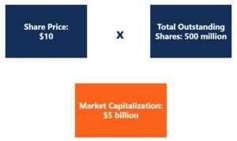

## Table of Contents

## What is market capitalization?

Market capitalization, often called market cap, is the total value of all the shares of a company. It's calculated by taking the current stock price and multiplying it by the total number of shares that the company has issued. This number gives investors an idea of the company's size and how it compares to other companies.

Market cap is important because it helps investors understand a company's value in the market. Companies are often grouped into categories like small-cap, mid-cap, and large-cap based on their market capitalization. Small-cap companies are usually smaller and riskier, while large-cap companies are bigger and often seen as more stable. By looking at market cap, investors can make better decisions about where to put their money.

## What are shares outstanding?

Shares outstanding are the total number of a company's shares that are currently owned by investors, including both the public and company insiders. This number is important because it's used to calculate the market capitalization of a company. If you know the current stock price and the number of shares outstanding, you can figure out the total value of the company by multiplying these two numbers together.

Sometimes, the number of shares outstanding can change. This can happen if a company decides to issue more shares, which is called a stock offering, or if it buys back some of its own shares, known as a share repurchase. These actions can affect the total number of shares and, as a result, can change the market capitalization of the company. Keeping track of shares outstanding helps investors understand how the company's value might change over time.

## How is market capitalization calculated?

Market capitalization, or market cap, is how we figure out the total value of a company's shares. You calculate it by taking the current price of one share of the company's stock and multiplying it by the total number of shares that are out there, which we call shares outstanding. So, if a company's stock is selling for $50 per share and there are 1 million shares outstanding, the market cap would be $50 million.

This number is really useful because it helps investors see how big a company is compared to others. Companies are often put into groups like small-cap, mid-cap, and large-cap based on their market cap. Small-cap companies are usually smaller and might be riskier, while large-cap companies are bigger and often seen as more stable. By knowing a company's market cap, investors can make smarter choices about where to invest their money.

## How are shares outstanding determined?

Shares outstanding are the total number of a company's shares that people own. This includes shares owned by the public and also by people inside the company, like the managers or the founders. To find out how many shares are outstanding, you look at the company's financial reports. These reports show how many shares the company has given out to people who want to invest in it.

The number of shares outstanding can change over time. If a company wants to raise more money, it might decide to issue more shares. This means they sell new shares to people who want to buy them, and this increases the number of shares outstanding. On the other hand, a company might buy back some of its own shares. This is called a share repurchase, and it makes the number of shares outstanding go down. Keeping track of these changes helps investors understand how the company's value might change.

## Why is market capitalization important for investors?

Market capitalization is important for investors because it tells them how big a company is. It's like looking at the total value of all the pieces of a puzzle. When investors know a company's market cap, they can compare it with other companies to see which ones are bigger or smaller. This helps them decide where to put their money. For example, if they want to invest in a big, stable company, they might look at large-cap companies, which have a high market cap.

Market cap also helps investors understand the risk involved with a company. Small-cap companies, which have a lower market cap, can be riskier because they are smaller and might not have as much money or resources. On the other hand, large-cap companies are usually more stable and less risky. By looking at market cap, investors can figure out if they want to take a big risk for a possible big reward or if they want to play it safe with a more established company.

## What role do shares outstanding play in stock valuation?

Shares outstanding are really important when it comes to figuring out how much a company is worth. They are the total number of shares that people own, including the public and people inside the company. When you want to find out the market capitalization of a company, you take the price of one share and multiply it by the number of shares outstanding. So, if a company's stock is worth $10 and there are 1 million shares outstanding, the market cap would be $10 million. This helps investors see the big picture of the company's value.

The number of shares outstanding can change, and this can affect the stock's valuation. If a company decides to issue more shares, it's like making the pie bigger but with more slices. This can make the price of each share go down because there are more shares to go around. On the other hand, if a company buys back some of its shares, it's like making the pie smaller but with fewer slices. This can make the price of each share go up because there are fewer shares to go around. Keeping an eye on shares outstanding helps investors understand how the company's value might change over time.

## How do changes in market capitalization affect a company's stock price?

Changes in market capitalization can affect a company's stock price in a few ways. When a company's market cap goes up, it usually means that the stock price has gone up too. This can happen if more people want to buy the stock because they think the company is doing well. It can also happen if the company makes more money or if it does something that makes people think it will be worth more in the future. When the market cap goes up, it can make the stock price go up because the total value of the company is seen as higher.

On the other hand, if a company's market cap goes down, it usually means that the stock price has gone down too. This can happen if fewer people want to buy the stock, maybe because they think the company is not doing so well. It can also happen if the company loses money or if something happens that makes people think it will be worth less in the future. When the market cap goes down, it can make the stock price go down because the total value of the company is seen as lower. So, changes in market cap are closely tied to changes in the stock price.

## Can shares outstanding change, and if so, how?

Yes, shares outstanding can change. A company can increase the number of shares outstanding by issuing new shares. This can happen if the company wants to raise more money. They might sell these new shares to the public or to big investors. When more shares are issued, the total number of shares outstanding goes up. This is called a stock offering.

A company can also decrease the number of shares outstanding by buying back its own shares. This is called a share repurchase or a buyback. When a company buys back its shares, it takes them out of the market, so the total number of shares outstanding goes down. This can happen if the company has extra money and wants to give some of it back to its shareholders. Both issuing new shares and buying back shares can change the number of shares outstanding, which can affect the company's value and the price of its stock.

## What is the relationship between market capitalization and shares outstanding?

Market capitalization and shares outstanding are closely connected. Market capitalization, or market cap, is the total value of a company's shares. You find it by taking the price of one share and multiplying it by the total number of shares outstanding. Shares outstanding are all the shares that people own, including both the public and company insiders. So, if a company's stock is worth $20 and there are 5 million shares outstanding, the market cap would be $100 million.

When the number of shares outstanding changes, it can affect the market capitalization. If a company issues more shares, the total number of shares outstanding goes up. This can make the market cap go up if the stock price stays the same, but it can also make the price of each share go down because there are more shares to go around. On the other hand, if a company buys back some of its shares, the number of shares outstanding goes down. This can make the market cap go down if the stock price stays the same, but it can also make the price of each share go up because there are fewer shares to go around. So, changes in shares outstanding can have a big impact on a company's market cap.

## How do market capitalization and shares outstanding influence a company's market position?

Market capitalization and shares outstanding play a big role in how a company is seen in the market. Market cap is like the total value of a company's puzzle pieces. It shows how much the whole company is worth by multiplying the price of one share by the total number of shares people own. When investors look at market cap, they can see if a company is big or small compared to others. A big market cap usually means the company is well-known and stable, while a small market cap might mean it's newer or riskier. This helps investors decide where to put their money, based on how safe or risky they want their investment to be.

Shares outstanding also matter because they can change the market cap and the price of each share. If a company decides to issue more shares, it's like making the pie bigger but with more slices. This can make the price of each share go down because there are more shares to go around. On the other hand, if a company buys back some of its shares, it's like making the pie smaller but with fewer slices. This can make the price of each share go up because there are fewer shares to go around. By keeping an eye on shares outstanding, investors can see how the company's value might change over time and adjust their investment strategies accordingly.

## What advanced metrics can be derived from market capitalization and shares outstanding?

From market capitalization and shares outstanding, we can figure out something called the price-to-earnings ratio, or P/E ratio. This is a way to see how much investors are willing to pay for each dollar of the company's earnings. You find the P/E ratio by taking the market cap and dividing it by the company's total earnings. If the P/E ratio is high, it means people think the company will do well in the future and are willing to pay more for its stock. If it's low, it might mean the company is not expected to grow as much, or it could be a good deal if the company is doing better than people think.

Another useful metric is the enterprise value, which gives a fuller picture of a company's worth. Enterprise value is like market cap but also includes the company's debt and subtracts its cash. You find it by taking the market cap, adding the company's total debt, and then subtracting its cash and cash equivalents. This number helps investors see what it would really cost to buy the whole company, not just its stock. It's especially helpful when comparing companies that have different amounts of debt and cash.

## How do market capitalization and shares outstanding impact corporate decisions such as mergers and acquisitions?

Market capitalization and shares outstanding are important when companies think about mergers and acquisitions. Market cap is like the total value of a company's puzzle pieces. It shows how much the whole company is worth by multiplying the price of one share by the total number of shares people own. When a company wants to buy another company, it looks at the market cap to see how much it might cost. If the target company has a high market cap, it might be more expensive to buy. Shares outstanding also matter because if the target company has a lot of shares, the buyer might need to offer more money or shares to buy them all.

When a company decides to merge with or buy another company, it also thinks about how the deal will change its own market cap and shares outstanding. If the buying company issues new shares to pay for the acquisition, the total number of shares outstanding will go up. This can make the price of each share go down because there are more shares to go around. But if the merger or acquisition makes the company bigger and more valuable, the market cap might go up, which could make the stock price go up too. So, understanding market cap and shares outstanding helps companies make smart choices about mergers and acquisitions.

## What is Understanding Market Capitalization?

Market capitalization, often abbreviated as market cap, is a critical financial metric used to assess the total value of a publicly traded company. It is determined by multiplying the current market price per share by the total number of outstanding shares, as denoted by the formula:

$$
\text{Market Capitalization} = \text{Current Share Price} \times \text{Total Outstanding Shares}
$$

This measure serves as an indicator of a company's size, providing a quantifiable estimate of its market value based on the public perception and trading activity reflected in the stock market. Market capitalization plays a pivotal role in categorizing companies into different classes, such as small-cap, mid-cap, and large-cap firms. Each category is associated with distinct risk and growth characteristics, influencing investment strategies.

- **Small-cap companies** typically have a market cap of less than $2 billion. They are often young companies with significant growth potential but also come with higher risks due to their volatility and limited resources.

- **Mid-cap companies**, with market caps between $2 billion and $10 billion, strike a balance between growth potential and risk. These companies are generally more established than small-caps but offer more growth opportunities compared to large-caps.

- **Large-cap companies** possess a market cap exceeding $10 billion. These firms are usually well-established and financially sound, with a stable track record. They tend to offer lower volatility and steady returns, making them appealing to risk-averse investors.

The classification based on market cap assists investors in tailoring their portfolios according to their risk tolerance and investment objectives, helping them to gauge the risk factors and growth opportunities that different stocks present. Understanding market capitalization is therefore essential for investors looking to optimize their stock market strategies and achieve a balanced investment portfolio.

## What is the Role of Shares Outstanding?

Shares outstanding refer to the total number of a company’s shares that are currently owned by all its shareholders, including shares held by institutional investors and restricted shares held by the company's officers and insiders. These shares play a pivotal role in determining the company’s market capitalization, calculated as:

$$
\text{Market Capitalization} = \text{Shares Outstanding} \times \text{Share Price}
$$

This measure helps investors gauge the size and investment potential of a company. Furthermore, shares outstanding are essential for calculating financial metrics such as earnings per share (EPS), which is defined by:

$$
\text{EPS} = \frac{\text{Net Income}}{\text{Shares Outstanding}}
$$

EPS provides insight into a company’s profitability on a per-share basis and is a crucial aspect of evaluating a company's financial health.

Investors keep a close eye on shares outstanding due to their influence on stock value and potential for share dilution. Dilution occurs when a company issues additional shares, thus reducing the ownership percentage of existing shareholders. This can result in a lower EPS and overall stock value, which might concern investors who prioritize earnings and stock performance. Dilution risk is particularly pertinent during secondary offerings, stock-based acquisitions, or when stock options are exercised.

Monitoring shares outstanding also helps investors predict potential stock value changes. A change in the number of shares can impact the stock’s supply and demand dynamics, affecting its [volatility](/wiki/volatility-trading-strategies) and price. As a result, understanding shares outstanding is critical for investors aiming to make informed decisions related to a company's stock and its future trajectory in the market.

## How do market capitalization and shares outstanding affect algorithmic trading?

Algorithmic trading, a process that utilizes computer algorithms to manage trading activities, frequently takes market capitalization and shares outstanding into account when assessing liquidity and volatility. These factors are crucial for algorithmic traders to determine transaction strategies and potential profitability.

Market capitalization (market cap) plays a substantial role in algorithmic trading as it influences liquidity, which is a key determinant of trading ease and cost. Companies with a large market cap are generally characterized by high liquidity, facilitating smoother transactions with minimal price impact. The formula for market capitalization is:

$$

\text{Market Capitalization} = \text{Share Price} \times \text{Shares Outstanding} 
$$

A high market cap usually suggests that a stock can be bought or sold in large quantities without significant price fluctuations, thereby reducing volatility and transaction costs. This stability attracts algorithmic traders who rely on executing large volumes of trades efficiently.

In contrast, shares outstanding, referring to all shares currently held by shareholders, also inform algorithmic trading decisions. A high number of shares outstanding typically implies increased liquidity, contributing to reduced volatility. This is particularly beneficial for algorithms that exploit small price movements for high-frequency trading (HFT), as they require stable markets to operate effectively.

On the other hand, small-cap stocks, representing firms with relatively low market capitalization, often exhibit higher volatility due to lower liquidity. This volatility can present both challenges and opportunities for algorithmic traders. While the risk of significant price swings can complicate trade execution, it can also provide unique opportunities to profit from rapid price changes, beneficial for trading strategies that thrive on volatility.

Algorithmic traders often employ mathematical models and algorithms to analyze these metrics continuously. Here is a simple Python example of how an algorithm might adjust trade volumes based on volatility and liquidity:

```python
def calculate_trade_volume(market_cap, shares_outstanding, target_volatility, current_volatility):
    liquidity_factor = market_cap / shares_outstanding
    volatility_ratio = target_volatility / current_volatility

    if liquidity_factor > 1 and volatility_ratio < 1:
        return "Increase Trade Volume"
    elif liquidity_factor < 1 and volatility_ratio > 1:
        return "Decrease Trade Volume"
    else:
        return "Maintain Current Volume"
```

In summary, market capitalization and shares outstanding are vital considerations for algorithmic trading due to their influence on liquidity and volatility. Understanding these components enables algorithmic traders to refine their strategies, whether aiming for stability and efficiency in large-cap stocks or exploiting volatility in small-cap stocks.

## References & Further Reading

[1]: ["Market Capitalization: A Key Financial Metric."](https://www.investopedia.com/terms/m/marketcapitalization.asp) Investopedia.

[2]: ["Understanding Shares Outstanding."](https://www.investopedia.com/articles/basics/03/030703.asp) Investopedia.

[3]: ["Algorithmic Trading: An Overview."](https://en.wikipedia.org/wiki/Algorithmic_trading) Investopedia.

[4]: Chan, E. P. (2009). ["Quantitative Trading: How to Build Your Own Algorithmic Trading Business."](https://github.com/egorpe/EPChan-QuantitativeTrading/blob/master/example7_6.m) Wiley Finance.

[5]: Lopez de Prado, M. (2018). ["Advances in Financial Machine Learning."](https://www.amazon.com/Advances-Financial-Machine-Learning-Marcos/dp/1119482089) Wiley.

[6]: Jansen, S. (2020). ["Machine Learning for Algorithmic Trading."](https://github.com/stefan-jansen/machine-learning-for-trading) Packt Publishing.

[7]: Aronson, D. R. (2006). ["Evidence-Based Technical Analysis: Applying the Scientific Method and Statistical Inference to Trading Signals."](https://www.amazon.com/Evidence-Based-Technical-Analysis-Scientific-Statistical/dp/0470008741) Wiley.

[8]: Bergstra, J., Bardenet, R., Bengio, Y., & Kégl, B. (2011). ["Algorithms for Hyper-Parameter Optimization."](https://dl.acm.org/doi/10.5555/2986459.2986743) Advances in Neural Information Processing Systems 24.