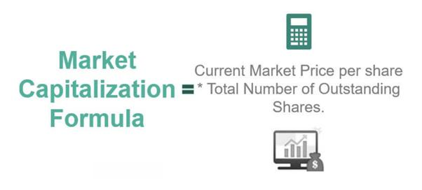

In the world of finance, understanding key terminology is crucial for making informed investment decisions. This article focuses on essential financial terms such as market capitalization, shares outstanding, and algorithmic trading. Mastery of these concepts is vital for investors aiming to navigate financial markets effectively and optimize their investment strategies. We will explore the meanings of these terms and their significance in today's fast-paced financial environment.

Market capitalization, commonly referred to as market cap, represents a company's total market value based on its share price and the number of shares outstanding. This metric provides investors with a snapshot of a company's size and helps in risk assessment and investment classification. Shares outstanding are the total shares of a company held by all its shareholders, which are crucial for calculating metrics like market cap and earnings per share (EPS). Understanding these terms is fundamental for evaluating a company's financial health and growth potential.



Algorithmic trading, a modern financial approach, employs computer algorithms to execute trades based on predefined criteria. This methodology enhances efficiency and precision and dominates trading activities in contemporary markets. Algorithmic trading facilitates high-frequency trading and allows investors to capitalize on minor price fluctuations over short timeframes.

By grasping these financial terms, investors can make more informed decisions and potentially achieve better portfolio performance in the dynamic world of finance.

## Table of Contents

## Understanding Market Capitalization

Market capitalization, often abbreviated as market cap, is a critical financial metric used to assess the total value of a publicly traded company. It is determined by multiplying the current market price per share by the total number of outstanding shares, as denoted by the formula:

$$
\text{Market Capitalization} = \text{Current Share Price} \times \text{Total Outstanding Shares}
$$

This measure serves as an indicator of a company's size, providing a quantifiable estimate of its market value based on the public perception and trading activity reflected in the stock market. Market capitalization plays a pivotal role in categorizing companies into different classes, such as small-cap, mid-cap, and large-cap firms. Each category is associated with distinct risk and growth characteristics, influencing investment strategies.

- **Small-cap companies** typically have a market cap of less than $2 billion. They are often young companies with significant growth potential but also come with higher risks due to their volatility and limited resources.

- **Mid-cap companies**, with market caps between $2 billion and $10 billion, strike a balance between growth potential and risk. These companies are generally more established than small-caps but offer more growth opportunities compared to large-caps.

- **Large-cap companies** possess a market cap exceeding $10 billion. These firms are usually well-established and financially sound, with a stable track record. They tend to offer lower volatility and steady returns, making them appealing to risk-averse investors.

The classification based on market cap assists investors in tailoring their portfolios according to their risk tolerance and investment objectives, helping them to gauge the risk factors and growth opportunities that different stocks present. Understanding market capitalization is therefore essential for investors looking to optimize their stock market strategies and achieve a balanced investment portfolio.

## The Role of Shares Outstanding

Shares outstanding refer to the total number of a company’s shares that are currently owned by all its shareholders, including shares held by institutional investors and restricted shares held by the company's officers and insiders. These shares play a pivotal role in determining the company’s market capitalization, calculated as:

$$
\text{Market Capitalization} = \text{Shares Outstanding} \times \text{Share Price}
$$

This measure helps investors gauge the size and investment potential of a company. Furthermore, shares outstanding are essential for calculating financial metrics such as earnings per share (EPS), which is defined by:

$$
\text{EPS} = \frac{\text{Net Income}}{\text{Shares Outstanding}}
$$

EPS provides insight into a company’s profitability on a per-share basis and is a crucial aspect of evaluating a company's financial health.

Investors keep a close eye on shares outstanding due to their influence on stock value and potential for share dilution. Dilution occurs when a company issues additional shares, thus reducing the ownership percentage of existing shareholders. This can result in a lower EPS and overall stock value, which might concern investors who prioritize earnings and stock performance. Dilution risk is particularly pertinent during secondary offerings, stock-based acquisitions, or when stock options are exercised.

Monitoring shares outstanding also helps investors predict potential stock value changes. A change in the number of shares can impact the stock’s supply and demand dynamics, affecting its [volatility](/wiki/volatility-trading-strategies) and price. As a result, understanding shares outstanding is critical for investors aiming to make informed decisions related to a company's stock and its future trajectory in the market.

## Algorithmic Trading: A Modern Approach

Algorithmic trading employs sophisticated computer algorithms to automate the process of placing trades in financial markets. These algorithms follow a set of predetermined criteria that incorporate variables such as timing, price, and [volume](/wiki/volume-trading-strategy), among others. This technological advancement facilitates high-frequency trading ([HFT](/wiki/high-frequency-trading-strategies)), which involves executing a large number of orders at extremely high speeds, often in fractions of a second.

The precision and speed of [algorithmic trading](/wiki/algorithmic-trading) offer significant advantages over traditional trading methods. By automating the trading process, algorithms can operate continuously without the limitations of human error or fatigue, enhancing both the efficiency and accuracy of trades. This capability is particularly beneficial in capturing small price discrepancies in the market, often referred to as [arbitrage](/wiki/arbitrage) opportunities.

Algorithmic trading has transformed the landscape of financial markets. It provides traders with the ability to process large volumes of trading data quickly and execute orders at optimal prices. This is crucial in today’s fast-paced trading environments where prices can fluctuate rapidly. For example, algorithms commonly use strategies like [trend following](/wiki/trend-following), mean reversion, and [statistical arbitrage](/wiki/statistical-arbitrage) to make informed trading decisions.

Here's a basic example of what an algorithmic trading strategy might look like in Python:

```python
import pandas as pd

def moving_average_crossover(data, short_window=40, long_window=100):
    signals = pd.DataFrame(index=data.index)
    signals['price'] = data['Close']

    signals['short_mavg'] = data['Close'].rolling(window=short_window, min_periods=1, center=False).mean()
    signals['long_mavg'] = data['Close'].rolling(window=long_window, min_periods=1, center=False).mean()

    signals['signal'] = 0.0
    signals['signal'][short_window:] = np.where(signals['short_mavg'][short_window:] 
                                                  > signals['long_mavg'][short_window:], 1.0, 0.0)   

    signals['positions'] = signals['signal'].diff()

    return signals
```

This script generates a basic signal for a moving average crossover strategy, an elementary yet popular strategy in algorithmic trading. The core premise is to monitor short-term and long-term moving averages and generate buy or sell signals based on their crossover points.

Algorithmic trading also plays a pivotal role in ensuring market [liquidity](/wiki/liquidity-risk-premium) and stability. However, it has raised concerns regarding fairness and transparency, largely due to its potential to create market manipulation scenarios. Despite these concerns, its growing influence reflects its significant contributions to modern finance. As technology continues to evolve, algorithmic trading is poised to further enhance its role in financial markets, driving innovations in trading strategies and market analysis.

## How Market Capitalization and Shares Outstanding Affect Algorithmic Trading

Algorithmic trading, a process that utilizes computer algorithms to manage trading activities, frequently takes market capitalization and shares outstanding into account when assessing liquidity and volatility. These factors are crucial for algorithmic traders to determine transaction strategies and potential profitability.

Market capitalization (market cap) plays a substantial role in algorithmic trading as it influences liquidity, which is a key determinant of trading ease and cost. Companies with a large market cap are generally characterized by high liquidity, facilitating smoother transactions with minimal price impact. The formula for market capitalization is:

$$

\text{Market Capitalization} = \text{Share Price} \times \text{Shares Outstanding} 
$$

A high market cap usually suggests that a stock can be bought or sold in large quantities without significant price fluctuations, thereby reducing volatility and transaction costs. This stability attracts algorithmic traders who rely on executing large volumes of trades efficiently.

In contrast, shares outstanding, referring to all shares currently held by shareholders, also inform algorithmic trading decisions. A high number of shares outstanding typically implies increased liquidity, contributing to reduced volatility. This is particularly beneficial for algorithms that exploit small price movements for high-frequency trading (HFT), as they require stable markets to operate effectively.

On the other hand, small-cap stocks, representing firms with relatively low market capitalization, often exhibit higher volatility due to lower liquidity. This volatility can present both challenges and opportunities for algorithmic traders. While the risk of significant price swings can complicate trade execution, it can also provide unique opportunities to profit from rapid price changes, beneficial for trading strategies that thrive on volatility.

Algorithmic traders often employ mathematical models and algorithms to analyze these metrics continuously. Here is a simple Python example of how an algorithm might adjust trade volumes based on volatility and liquidity:

```python
def calculate_trade_volume(market_cap, shares_outstanding, target_volatility, current_volatility):
    liquidity_factor = market_cap / shares_outstanding
    volatility_ratio = target_volatility / current_volatility

    if liquidity_factor > 1 and volatility_ratio < 1:
        return "Increase Trade Volume"
    elif liquidity_factor < 1 and volatility_ratio > 1:
        return "Decrease Trade Volume"
    else:
        return "Maintain Current Volume"
```

In summary, market capitalization and shares outstanding are vital considerations for algorithmic trading due to their influence on liquidity and volatility. Understanding these components enables algorithmic traders to refine their strategies, whether aiming for stability and efficiency in large-cap stocks or exploiting volatility in small-cap stocks.

## Conclusion

Understanding financial terminology such as market capitalization, shares outstanding, and algorithmic trading is essential for anyone participating in the stock market. These terms provide crucial insights into a company's financial health, aiding investors in evaluating the size, value, and potential growth prospects of various companies. Market capitalization, calculated as the product of current share price and the total number of outstanding shares, serves as a key indicator of a company's market value compared to others. It guides investors in assessing risks and classifying stocks into categories like small-cap, mid-cap, and large-cap, each presenting unique investment opportunities and risk levels. 

Shares outstanding hold significant importance as they form the basis for calculating per-share metrics such as earnings per share (EPS). Monitoring shares outstanding helps investors understand potential stock dilution, influencing stock valuation and investor decisions. Additionally, algorithmic trading introduces a modern approach to executing trades with precision based on set criteria. By leveraging high-frequency trading, algorithmic strategies can maximize gains from price fluctuations, thus highlighting the importance of understanding these terminologies.

By grasping these fundamental concepts, investors can make more informed decisions, possibly enhancing their portfolio performance. These insights allow investors to navigate the complex financial markets more effectively, identifying opportunities and managing risks in a dynamic financial environment. Understanding these key aspects ensures participants are well-equipped to engage strategically in the stock market, optimizing their investment outcomes.

## References & Further Reading

[1]: ["Market Capitalization: A Key Financial Metric."](https://www.investopedia.com/terms/m/marketcapitalization.asp) Investopedia.

[2]: ["Understanding Shares Outstanding."](https://www.investopedia.com/articles/basics/03/030703.asp) Investopedia.

[3]: ["Algorithmic Trading: An Overview."](https://en.wikipedia.org/wiki/Algorithmic_trading) Investopedia.

[4]: Chan, E. P. (2009). ["Quantitative Trading: How to Build Your Own Algorithmic Trading Business."](https://github.com/egorpe/EPChan-QuantitativeTrading/blob/master/example7_6.m) Wiley Finance.

[5]: Lopez de Prado, M. (2018). ["Advances in Financial Machine Learning."](https://www.amazon.com/Advances-Financial-Machine-Learning-Marcos/dp/1119482089) Wiley.

[6]: Jansen, S. (2020). ["Machine Learning for Algorithmic Trading."](https://github.com/stefan-jansen/machine-learning-for-trading) Packt Publishing.

[7]: Aronson, D. R. (2006). ["Evidence-Based Technical Analysis: Applying the Scientific Method and Statistical Inference to Trading Signals."](https://www.amazon.com/Evidence-Based-Technical-Analysis-Scientific-Statistical/dp/0470008741) Wiley.

[8]: Bergstra, J., Bardenet, R., Bengio, Y., & Kégl, B. (2011). ["Algorithms for Hyper-Parameter Optimization."](https://dl.acm.org/doi/10.5555/2986459.2986743) Advances in Neural Information Processing Systems 24.