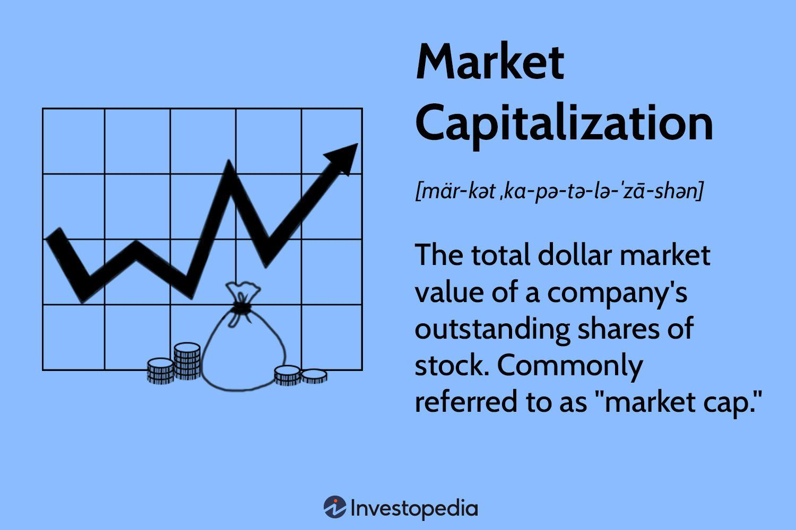

## Table of Contents

## What is market capitalization?

Market capitalization, often called market cap, is the total value of all the shares of a company. It's calculated by multiplying the current stock price by the total number of shares that the company has issued. This number gives investors an idea of the company's size and its value in the market. For example, if a company has 1 million shares and each share is worth $50, the market cap would be $50 million.

Market cap is useful because it helps investors compare companies of different sizes. It's easier to see which companies are bigger or smaller in the market. Companies are often grouped into categories like small-cap, mid-cap, and large-cap based on their market capitalization. Small-cap companies usually have a market cap of less than $2 billion, mid-cap companies are between $2 billion and $10 billion, and large-cap companies are above $10 billion. This helps investors make decisions about where to put their money based on the size and potential growth of a company.

## How is market capitalization calculated?

Market capitalization is calculated by taking the current price of one share of a company and multiplying it by the total number of shares that the company has. For example, if a company's stock price is $10 and there are 1 million shares, the market capitalization would be $10 million.

This calculation gives you the total value of the company in the stock market. It's a simple way to see how big a company is compared to others. Investors use this number to decide if they want to buy or sell shares in a company.

## Why is market capitalization important in stock evaluation?

Market capitalization is important in stock evaluation because it shows how big a company is in the market. It's like a snapshot of the company's total value at any given time. When investors look at market cap, they can see if a company is small, medium, or large. This helps them decide if they want to invest in a company that's growing fast or one that's already big and stable.

Market cap also helps investors compare companies easily. For example, if you're choosing between two companies, knowing their market caps can show you which one is bigger and might be safer to invest in. It's also useful for understanding how a company fits into the overall market. Investors use market cap to see trends and make smarter choices about where to put their money.

## What are the different categories of market capitalization?

Companies are often grouped into different categories based on their market capitalization. These categories help investors understand the size of a company and how it might grow or change. The main categories are small-cap, mid-cap, and large-cap. Small-cap companies have a market cap of less than $2 billion. They are usually newer or smaller businesses that can grow a lot but are also riskier. Mid-cap companies have a market cap between $2 billion and $10 billion. They are often in the middle of their growth and can offer a good balance between risk and reward.

Large-cap companies have a market cap of more than $10 billion. These are big, well-known companies that are usually more stable but might not grow as fast as smaller companies. Sometimes, you might also hear about mega-cap companies, which are the biggest of the large-cap companies, with a market cap over $200 billion. Knowing these categories helps investors pick the right stocks for their goals, whether they want to take more risk for potential big gains or prefer safer, more stable investments.

## How does market capitalization affect a company's stock price?

Market capitalization doesn't directly control a company's stock price, but it can show how the market feels about the company. If a company's market cap is high, it means investors think the company is worth a lot. This can make the stock price go up because more people want to buy the stock. On the other hand, if the market cap is low, it might mean investors are not so sure about the company, and the stock price could go down because fewer people want to buy it.

Changes in market cap can also tell us about big news or events. For example, if a company does really well and makes more money than expected, the market cap might go up because more people want to buy the stock. This can push the stock price higher. But if something bad happens, like a company losing money, the market cap might drop, and the stock price could go down as people sell their shares. So, while market cap doesn't set the stock price, it's a good sign of what might happen to the price.

## Can market capitalization change over time? If so, how?

Yes, market capitalization can change over time. It changes because the stock price and the number of shares can both go up or down. If the stock price goes up, the market cap goes up too. This can happen if the company does well, like making more money or coming up with new products that people want. Also, if the company decides to issue more shares, the market cap can go up because there are more shares to multiply by the stock price.

But market cap can also go down. If the stock price drops, maybe because the company is not doing well or people are worried about the economy, the market cap will go down. If the company buys back some of its shares, there are fewer shares, and this can also make the market cap smaller. So, market cap is always changing as the stock price and number of shares change.

## What are the limitations of using market capitalization for stock evaluation?

Market capitalization is a good way to see how big a company is, but it has some problems. One big problem is that it doesn't tell you everything about a company. Just because a company has a big market cap doesn't mean it's a good investment. It doesn't show if the company is making money or if it has a lot of debt. So, if you only look at market cap, you might miss important details that could affect your decision to buy or sell the stock.

Another problem is that market cap can change a lot because of things that have nothing to do with the company itself. For example, if the whole stock market goes down, the market cap of a good company can still drop. This can make it hard to know if the company is really worth less or if it's just because of what's happening in the market. So, while market cap is useful, it's important to look at other things too, like how much money the company is making and how much it owes, to get a full picture of whether it's a good investment.

## How does market capitalization compare to other financial metrics like P/E ratio?

Market capitalization and the P/E ratio are both important numbers that help investors understand a company, but they tell different stories. Market cap shows how big a company is in the stock market. It's just the total value of all the company's shares. This helps investors see if a company is small, medium, or large, which can be useful when comparing companies of different sizes. But market cap doesn't tell you about the company's profits or how much it's worth compared to those profits.

The P/E ratio, or price-to-earnings ratio, tells you how much you're paying for each dollar of the company's earnings. It's calculated by dividing the stock price by the earnings per share. A high P/E ratio might mean people think the company will grow a lot in the future, but it could also mean the stock is too expensive. A low P/E ratio might show that the stock is a good deal, or it might mean the company isn't doing well. So, while market cap gives you the size of the company, the P/E ratio helps you see if the stock price is a good value based on the company's earnings.

## What role does market capitalization play in investment strategies?

Market capitalization helps investors pick the right stocks for their goals. If you want to take more risks for bigger rewards, you might look at small-cap stocks. These companies are smaller and can grow a lot, but they can also lose value quickly. On the other hand, if you want safer investments, you might choose large-cap stocks. These are big companies that are usually more stable but might not grow as fast. By knowing a company's market cap, investors can decide which type of stock fits their plan.

Market cap also helps investors compare different companies easily. For example, if you're choosing between two companies, looking at their market caps can show you which one is bigger and might be safer to invest in. It's also useful for understanding how a company fits into the overall market. Investors use market cap to see trends and make smarter choices about where to put their money. But remember, market cap is just one part of the story. It's important to look at other things like how much money the company makes and how much it owes to get a full picture.

## How do investors use market capitalization to diversify their portfolios?

Investors use market capitalization to diversify their portfolios by spreading their money across companies of different sizes. If you only invest in big companies with large market caps, your portfolio might miss out on the fast growth that smaller companies can offer. So, some investors choose to put some of their money into small-cap and mid-cap stocks. This way, they can balance the safety of big companies with the potential for big gains from smaller ones.

Diversifying with market cap also helps manage risk. If one part of the market, like small-cap stocks, goes down, the other parts, like large-cap stocks, might stay steady or even go up. This can protect your overall investment from big losses. By looking at market cap, investors can make sure they have a mix of different sizes of companies in their portfolio, which can help them reach their financial goals while keeping their investments safe.

## What are the global trends in market capitalization and how do they impact investment decisions?

Global trends in market capitalization show that big companies, or large-cap companies, are getting even bigger. This is because more people around the world are investing in well-known companies that they trust. For example, technology companies like Apple and Microsoft have huge market caps because people believe they will keep growing and making money. But it's not just about big companies. In some countries, smaller companies are also growing fast, especially in places like China and India, where new businesses are starting up all the time.

These trends can impact investment decisions in a few ways. If you see that large-cap companies are doing well, you might want to put more of your money into them because they seem safer and more likely to keep growing. But if you notice that smaller companies in certain countries are growing quickly, you might want to take a chance on them for bigger potential gains. It's important to keep an eye on these trends because they can help you decide where to invest your money to reach your financial goals.

## How can advanced statistical models enhance the use of market capitalization in stock evaluation?

Advanced statistical models can help investors understand market capitalization better by looking at more than just the total value of a company's shares. These models can take in a lot of different information, like how the company is doing, what's happening in the economy, and even what people are saying about the company on social media. By using all this data, the models can predict how the company's market cap might change in the future. This can help investors see if a company's market cap is a good sign of its real value or if it's being affected by other things that might not last.

For example, if a company's market cap goes up because of good news, a statistical model can help figure out if that news will really help the company in the long run or if it's just a short-term thing. The model can look at past data to see how similar news affected other companies. This way, investors can make smarter choices about whether to buy or sell the company's stock. By using these models, investors can get a clearer picture of what's really going on with a company's market cap and make better decisions about where to put their money.

## What is the process of decoding market capitalization?

Market capitalization is a financial metric that measures a company's total market value as derived from the stock market. It is calculated by multiplying the current share price of the company's stock by the total number of outstanding shares:

$$

\text{Market Capitalization} = \text{Share Price} \times \text{Outstanding Shares} 
$$

This figure is crucial for investors as it provides a quick snapshot of a company's size and market value, aiding in the assessment of a stock's potential relative to others.

Market capitalization is typically categorized into three primary segments: small-cap, mid-cap, and large-cap. Each category is defined by a company's market value range, which can offer different investment opportunities and risks:

1. **Small-Cap**: These are companies with a market capitalization typically ranging from $300 million to $2 billion. They are often characterized by higher growth potential but come with greater risk and volatility compared to larger firms. Small-cap stocks are more likely to be young companies or serve niche markets. While they offer the potential for significant returns, they are also more sensitive to economic fluctuations and market changes.

2. **Mid-Cap**: Companies within the $2 billion to $10 billion range fall into this category. Mid-cap stocks often represent firms that are well-established and experiencing growth. They tend to offer a balanced mix of growth potential and stability, making them appealing for investors seeking moderate risk and return. These companies might be expanding their market or product offerings, which can enhance their competitive positioning.

3. **Large-Cap**: This category encompasses companies with a market capitalization exceeding $10 billion. Large-cap stocks typically include established, mature companies with stable revenues and profits. They are perceived as less risky compared to smaller firms and are often industry leaders. While growth potential might be slower, they offer stability and often pay dividends, making them attractive for conservative investors.

Investing across these market capitalization categories presents various benefits and risks. To begin with, diversification by market cap can mitigate overall portfolio risk. For example, while small-cap stocks might outperform during market rallies, large-cap stocks often provide a cushion during market downturns due to their stability and dividend returns. However, an investor must also consider risks such as market [volatility](/wiki/volatility-trading-strategies) and [liquidity](/wiki/liquidity-risk-premium) issues, particularly prevalent with smaller capitalized companies.

Market capitalization is also a critical tool in portfolio diversification. By incorporating stocks from different market cap categories, investors can balance potential risks and rewards. Diversified portfolios can capitalize on the growth potential of small-cap companies while relying on the stability of large-cap entities to preserve capital. This balance helps in managing the inherent risks associated with stock market investments and stabilizes a portfolio's performance through different market cycles.

In summary, understanding market capitalization categories is fundamental for investors aiming to formulate robust and balanced investment strategies that align with their risk tolerance and financial goals.

## References & Further Reading

[1]: Bergstra, J., Bardenet, R., Bengio, Y., & Kégl, B. (2011). ["Algorithms for Hyper-Parameter Optimization."](https://proceedings.neurips.cc/paper/2011/file/86e8f7ab32cfd12577bc2619bc635690-Paper.pdf) Advances in Neural Information Processing Systems 24.

[2]: ["Advances in Financial Machine Learning"](https://www.amazon.com/Advances-Financial-Machine-Learning-Marcos/dp/1119482089) by Marcos Lopez de Prado

[3]: ["Evidence-Based Technical Analysis: Applying the Scientific Method and Statistical Inference to Trading Signals"](https://www.amazon.com/Evidence-Based-Technical-Analysis-Scientific-Statistical/dp/0470008741) by David Aronson

[4]: ["Machine Learning for Algorithmic Trading"](https://github.com/stefan-jansen/machine-learning-for-trading) by Stefan Jansen

[5]: ["Quantitative Trading: How to Build Your Own Algorithmic Trading Business"](https://www.amazon.com/Quantitative-Trading-Build-Algorithmic-Business/dp/1119800064) by Ernest P. Chan