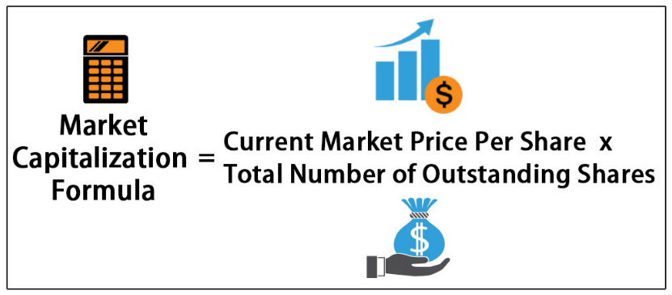

Investment strategies in modern finance revolve around the art of making decisions that optimize returns while managing risks. As financial markets become increasingly sophisticated, the necessity for robust investment strategies has never been more crucial. Central to these strategies is the practice of stock evaluation, which plays a vital role in making informed investment decisions. Stock evaluation allows investors to analyze a company's financial health and its growth prospects, providing a structured approach to determining the intrinsic value of a stock and its potential for future profitability.

Market capitalization is another fundamental concept integral to evaluating stocks. Defined as the total market value of a company's outstanding shares, market capitalization is calculated by multiplying the current share price by the total number of outstanding shares. It serves as a key indicator of a company's size, financial stability, and growth potential. Investors often classify stocks into categories such as small-cap, mid-cap, and large-cap, each offering distinct opportunities and risks. These classifications help investors assess the potential volatility and returns associated with different stocks, contributing to a diversified investment portfolio.



The evolution of technology has brought about significant advancements in financial markets, one of the most notable being the rise of algorithmic trading. This method utilizes computer algorithms to execute trades based on predetermined criteria. The algorithms assess vast amounts of data at speeds incomparable to human capability, enabling swift and efficient trading decisions. Algorithmic trading has revolutionized stock markets by enhancing liquidity, reducing transaction costs, and fostering more efficient price discovery. However, it also introduces complexities and challenges, including increased market volatility and the potential for flash crashes.

This article aims to explore various aspects of modern investment strategies, focusing on stock evaluation, market capitalization, and algorithmic trading. The sections that follow will delve into these topics, uncovering traditional and modern strategies investors use to maximize returns, the intricacies of stock evaluation methodologies, the significance of market capitalization, and the transformative impact of algorithmic trading in today’s financial markets. Through this comprehensive analysis, readers will gain valuable insights into constructing effective investment strategies amidst evolving market dynamics.

## Table of Contents

## Understanding Investment Strategies

Investment strategies are crucial for investors aiming to optimize returns while managing risk. Broadly, these strategies can be categorized into traditional and modern approaches, with each offering different pathways and philosophies for investment success.

### Traditional versus Modern Investment Strategies

Traditional investment strategies include both passive and active investing. 

**Passive Investing:** This strategy involves buying and holding a diversified portfolio over a long period. Investors typically use index funds or exchange-traded funds (ETFs) that track market indices. The aim is to mirror the market performance, minimizing transaction costs and capitalizing on the markets' long-term upward trend. The appeal of passive investing lies in its lower fees and reduced effort, as it does not involve frequent trading. 

**Active Investing:** In contrast, active investing requires a hands-on approach, where investors aim to outperform the market through strategic buying and selling. This strategy relies heavily on individual stock selection, market timing, and exploiting short-term price fluctuations. While active investing has the potential for higher returns, it also involves higher risks and fees due to frequent trading.

Modern investment strategies have emerged with the advent of technology and data analytics.

**Quantitative Investing:** This approach uses mathematical models and algorithms to make investment decisions. It relies on data mining, statistical analysis, and computational power to identify trading opportunities. Quantitative investing can be implemented through algorithmic trading, providing a high degree of precision and speed.

**Ethical and Socially Responsible Investing (SRI):** Modern strategies also reflect changing investor values, focusing on environmental, social, and governance (ESG) criteria. SRI allows investors to align their portfolios with their social and ethical values while seeking financial returns.

### The Significance of Risk Management

Risk management is a cornerstone of investment strategy development, aiming to protect against financial loss and ensure portfolio stability. Effective risk management involves diversification, asset allocation, and the use of hedging instruments. Diversification reduces risk by spreading investments across various assets, thereby minimizing the impact of poor performance in any single asset. Asset allocation tailors the investment mix to an individual's risk tolerance and financial goals. Hedging instruments like options and futures contracts can offset potential losses, providing a safety net in volatile markets.

### Examples of Successful Investment Strategies

Several successful investment strategies highlight the intersection of traditional and modern approaches. 

**Value Investing:** Popularized by Warren Buffett, this strategy involves selecting undervalued stocks with strong fundamentals. It requires thorough analysis of financial statements and market conditions, emphasizing intrinsic value over market sentiments.

**Growth Investing:** This focuses on companies expected to grow at an above-average rate compared to their industry or the overall market. Investors prioritize future potential over current valuations, often investing in tech companies or startups.

**Momentum Investing:** This strategy capitalizes on existing market trends by buying securities that have shown an upward trend and selling those with downward trajectories. The logic is that securities that have performed well recently will continue to do so in the near future.

**Use of Algorithms in Investment:** With the rise of technology, algorithmic trading has become a significant component of modern strategies. Algorithms can process vast amounts of data rapidly to execute trades more efficiently than human traders.

Incorporating these strategies requires understanding market conditions, investor goals, and risk tolerance. Ultimately, the ability to adapt and combine elements from both traditional and modern strategies can lead to a robust investment portfolio capable of maximizing returns while managing risk effectively.

## The Importance of Stock Evaluation

Stock evaluation is a critical aspect of investment that involves analyzing a company's financial and operational performance to determine the intrinsic value of its stock. This assessment is crucial for making informed investment decisions, as it helps investors identify undervalued or overvalued stocks, thereby guiding effective buying and selling strategies.

Two primary methods are employed in stock evaluation: [fundamental analysis](/wiki/fundamental-analysis) and technical analysis. Fundamental analysis involves examining a company's financial statements, management, competitive advantages, and market conditions to ascertain its intrinsic value. This method focuses on long-term value investing by evaluating key financial metrics such as the price-to-earnings (P/E) ratio, dividend yield, and earnings growth. For instance, the P/E ratio, calculated by dividing the company's market value per share by its earnings per share, provides insights into how the market values the company's earnings relative to its price. A low P/E ratio might indicate an undervalued stock, while a high P/E ratio may suggest overvaluation.

Dividend yield, another important metric, is the ratio of a company's annual dividends per share to its current share price. It measures the return an investor can expect to receive from dividends alone. Higher dividend yields are attractive to income-focused investors, whereas lower yields might indicate growth potential if profits are reinvested into the business. Earnings growth, which tracks how a company's profits increase over time, is a strong indicator of its future profitability and potential share price increase.

Technical analysis, on the other hand, involves studying historical price data and trends through charts and other tools to forecast future price movements. This method primarily suits short-term trading strategies, focusing on patterns such as moving averages, support and resistance levels, and [volume](/wiki/volume-trading-strategy) trends.

The impact of stock evaluation on investor returns is illustrated through various case studies. For example, during the early 2000s, Apple Inc. was considered undervalued by several analysts using fundamental analysis, who recognized its potential despite its then-small market cap and lower P/E ratio compared to industry peers. Investors who relied on this evaluation to purchase Apple stock realized significant returns as the company's innovations and market position grew over the next two decades.

In contrast, during the dot-com bubble, many internet companies with high P/E ratios and negligible earnings growth were overvalued based on speculative investor behavior rather than sound fundamentals. The subsequent market correction led to substantial losses for investors who did not employ rigorous stock evaluation.

Incorporating thorough stock evaluation into investment strategies enhances the potential for achieving superior returns by enabling investors to make more informed decisions based on a company's financial and market standing rather than market speculation alone.

## Decoding Market Capitalization

Market capitalization is a financial metric that measures a company's total market value as derived from the stock market. It is calculated by multiplying the current share price of the company's stock by the total number of outstanding shares:

$$

\text{Market Capitalization} = \text{Share Price} \times \text{Outstanding Shares} 
$$

This figure is crucial for investors as it provides a quick snapshot of a company's size and market value, aiding in the assessment of a stock's potential relative to others.

Market capitalization is typically categorized into three primary segments: small-cap, mid-cap, and large-cap. Each category is defined by a company's market value range, which can offer different investment opportunities and risks:

1. **Small-Cap**: These are companies with a market capitalization typically ranging from $300 million to $2 billion. They are often characterized by higher growth potential but come with greater risk and volatility compared to larger firms. Small-cap stocks are more likely to be young companies or serve niche markets. While they offer the potential for significant returns, they are also more sensitive to economic fluctuations and market changes.

2. **Mid-Cap**: Companies within the $2 billion to $10 billion range fall into this category. Mid-cap stocks often represent firms that are well-established and experiencing growth. They tend to offer a balanced mix of growth potential and stability, making them appealing for investors seeking moderate risk and return. These companies might be expanding their market or product offerings, which can enhance their competitive positioning.

3. **Large-Cap**: This category encompasses companies with a market capitalization exceeding $10 billion. Large-cap stocks typically include established, mature companies with stable revenues and profits. They are perceived as less risky compared to smaller firms and are often industry leaders. While growth potential might be slower, they offer stability and often pay dividends, making them attractive for conservative investors.

Investing across these market capitalization categories presents various benefits and risks. To begin with, diversification by market cap can mitigate overall portfolio risk. For example, while small-cap stocks might outperform during market rallies, large-cap stocks often provide a cushion during market downturns due to their stability and dividend returns. However, an investor must also consider risks such as market [volatility](/wiki/volatility-trading-strategies) and [liquidity](/wiki/liquidity-risk-premium) issues, particularly prevalent with smaller capitalized companies.

Market capitalization is also a critical tool in portfolio diversification. By incorporating stocks from different market cap categories, investors can balance potential risks and rewards. Diversified portfolios can capitalize on the growth potential of small-cap companies while relying on the stability of large-cap entities to preserve capital. This balance helps in managing the inherent risks associated with stock market investments and stabilizes a portfolio's performance through different market cycles.

In summary, understanding market capitalization categories is fundamental for investors aiming to formulate robust and balanced investment strategies that align with their risk tolerance and financial goals.

## The Rise of Algorithmic Trading

Algorithmic trading, known as the use of computer programs and systems to execute trades in financial markets, has gained significant traction in recent years. Unlike traditional trading, which involves human decision-making, [algorithmic trading](/wiki/algorithmic-trading) leverages predetermined instructions or algorithms to make trading decisions, including timing, price, and quantity of orders. This approach has transformed modern financial markets by enhancing market efficiency, liquidity, and the speed of transactions.

### Algorithm Design and Supporting Technology

Algorithms used in trading are constructed based on various factors, including price, timing, and quantity. They can also incorporate historical data, market trends, and real-time analytics to optimize trading decisions. The development of these algorithms involves quantitative analysis and financial modeling, often utilizing statistical techniques and [machine learning](/wiki/machine-learning).

The technology underpinning algorithmic trading includes high-performance computing systems, complex mathematical models, and sophisticated software platforms capable of processing vast amounts of market data at lightning speeds. High-frequency trading ([HFT](/wiki/high-frequency-trading-strategies)) represents one facet of algorithmic trading, characterized by executing a large number of orders at extremely rapid speeds—often in milliseconds.

```python
# Example of a simple trading algorithm in Python
# Note: This example is for educational purposes only and not for live trading

def simple_moving_average(data, period):
    return sum(data[-period:]) / period

def trading_signal(prices, short_window, long_window):
    short_mavg = simple_moving_average(prices, short_window)
    long_mavg = simple_moving_average(prices, long_window)

    if short_mavg > long_mavg:
        return "Buy"
    elif short_mavg < long_mavg:
        return "Sell"
    else:
        return "Hold"

# Example usage
prices = [110, 113, 115, 117, 120, 125, 130, 128, 127, 130]
signal = trading_signal(prices, short_window=3, long_window=5)
print(f"The trading signal is: {signal}")
```

### Advantages and Criticisms of Algorithmic Trading

Algorithmic trading offers numerous advantages, including increased transaction speed and efficiency, reduced costs through minimized human intervention, and the capacity to backtest strategies on historical data. These benefits enable traders to capitalize on short-lived market opportunities and maintain a competitive edge.

However, algorithmic trading is not without its criticisms. One major concern is the potential for increased market volatility. Algorithms can amplify rapid price changes, contributing to market instability, as seen in events such as the "Flash Crash" of 2010. Additionally, the prevalence of HFT has raised questions about market fairness, where sophisticated technologies might disproportionately favor well-capitalized firms over smaller investors. There is also the risk of systemic failures if flaws within algorithms or underlying assumptions are not carefully managed.

### Impact on Traditional Stock Markets

Algorithmic trading has profoundly impacted traditional stock markets by altering the landscape in various ways. For instance, the introduction of trading algorithms has increased liquidity, facilitating easier entry and [exit](/wiki/exit-strategy) for investors. Conversely, this has prompted regulatory bodies to impose stringent rules to minimize systemic risks associated with high-speed trading.

A real-world example of algorithmic trading’s disruption occurred during the aforementioned "Flash Crash" on May 6, 2010, when significant stock indices, including the Dow Jones Industrial Average, plummeted and rebounded within minutes. This incident was partially attributed to algorithmic trading strategies exacerbating market movements by rapidly executing sell orders.

Overall, while algorithmic trading presents opportunities for innovation and growth in financial markets, it necessitates careful oversight and consideration of its broader implications.

## Integrating these Concepts for Effective Investment

Integrating stock evaluation, market capitalization assessment, and algorithmic trading into a cohesive investment strategy can significantly enhance an investor’s ability to create a balanced and effective portfolio. These three aspects complement each other and provide a comprehensive framework for making informed investment decisions.

**Stock Evaluation and Market Capitalization Assessment**

Stock evaluation involves both fundamental and technical analysis to determine the intrinsic value of a stock. Fundamental analysis investigates into the financial health, earnings, dividends, and growth prospects of a company. Technical analysis, on the other hand, focuses on stock price movements and trading volume to predict future price movements. These methods are crucial for identifying stocks with strong potential for growth and value.

Market capitalization allows investors to categorize stocks into small-cap, mid-cap, and large-cap categories, each offering different risk and return profiles. Small-cap stocks, with their high growth potential and volatility, can offer substantial returns, while large-cap stocks often provide stability and consistent dividends, making them attractive for conservative investors. By evaluating both stock specifics and market caps, investors can diversify their portfolio to manage risk effectively.

**Algorithmic Trading for Strategy Execution**

Algorithmic trading uses pre-set criteria, including timing, price, and quantity, to automatically execute trades. This reduces human error and emotion-driven decisions, providing a systematic approach to trading. Algorithms can analyze vast amounts of data quickly, enabling investors to capitalize on short-lived market opportunities and maintain portfolio balance in real time.

For instance, an investor might use an algorithm to detect when a stock, identified through fundamental evaluation as undervalued, reaches a certain technical threshold in its price movement to buy automatically. Similarly, when the stock's price overreaches a predetermined level, the algorithm could trigger a sale, locking in profits.

**Implementation in Portfolio Management**

A balanced investment portfolio might employ these strategies in the following manner:
1. **Diversification**: Based on market capitalization, diversify investments across small-cap, mid-cap, and large-cap stocks, respectively.
2. **Evaluation-Driven Selection**: Use stock evaluation to select fundamentally strong companies and timely entry and exit points guided by technical analysis.
3. **Algorithmic Execution**: Implement algorithms to handle trades efficiently and react to market changes quickly.

**Tools and Resources**

Tools such as Bloomberg Terminal, Yahoo Finance, and trading platforms like MetaTrader offer extensive resources for stock evaluation and market cap analysis. For algorithmic trading, platforms like QuantConnect and Alpaca provide environments for [backtesting](/wiki/backtesting) and deploying trading algorithms in Python.

**Challenges and Considerations**

Integrating these strategies poses certain challenges. The complexity of algorithmic trading requires technical expertise and robust risk management frameworks to handle volatile market conditions. Moreover, data accuracy and latency can affect the performance of trading algorithms. As such, continuous monitoring and adjustments are necessary to adapt to market dynamics.

Incorporating stock evaluation, market capitalization, and algorithmic trading into a unified investment strategy allows investors to leverage technology and analytical methods to optimize returns while managing risk. However, thoughtful implementation and an understanding of the potential challenges are imperative for success.

## Conclusion

In this article, we have explored the fundamental concepts that are crucial to modern investing, such as investment strategies, stock evaluation, market capitalization, and algorithmic trading. These components play significant roles in informing and guiding investors toward more profitable decision-making.

Strategic investment and evolving technologies not only enhance the prospects of achieving improved returns but also offer investors innovative tools to navigate complex financial landscapes. By effectively integrating stock evaluation methods, understanding market capitalization categories, and leveraging algorithmic trading, investors can create robust and balanced portfolios that are resilient to market fluctuations. This integration can optimize risk management while maximizing potential gains.

Continuous education on investment trends and strategies is crucial as financial markets evolve. Investors are encouraged to maintain an inquisitive mindset and keep abreast of technological advancements and shifts in market dynamics. The landscape of investment strategies is ever-changing, with increased automation and data-driven approaches shaping the future. Understanding these changes is vital for making informed decisions and staying competitive.

The trajectory of investment strategies indicates a more interconnected and dynamic market environment in the years ahead. As algorithmic trading technologies advance and become more accessible, coupled with the ongoing developments in evaluating stocks and market capitalization, investors have an unprecedented opportunity to enhance their investment decisions.

Looking forward, it is expected that the integration of advanced technologies will continue to redefine the paradigms of traditional investing, introducing new opportunities and challenges. Investors equipped with knowledge and adaptability will be better positioned to leverage these changes to their advantage, ensuring sustainable growth and success in an evolving market.

## References & Further Reading

[1]: Bergstra, J., Bardenet, R., Bengio, Y., & Kégl, B. (2011). ["Algorithms for Hyper-Parameter Optimization."](https://proceedings.neurips.cc/paper/2011/file/86e8f7ab32cfd12577bc2619bc635690-Paper.pdf) Advances in Neural Information Processing Systems 24.

[2]: ["Advances in Financial Machine Learning"](https://www.amazon.com/Advances-Financial-Machine-Learning-Marcos/dp/1119482089) by Marcos Lopez de Prado

[3]: ["Evidence-Based Technical Analysis: Applying the Scientific Method and Statistical Inference to Trading Signals"](https://www.amazon.com/Evidence-Based-Technical-Analysis-Scientific-Statistical/dp/0470008741) by David Aronson

[4]: ["Machine Learning for Algorithmic Trading"](https://github.com/stefan-jansen/machine-learning-for-trading) by Stefan Jansen

[5]: ["Quantitative Trading: How to Build Your Own Algorithmic Trading Business"](https://www.amazon.com/Quantitative-Trading-Build-Algorithmic-Business/dp/1119800064) by Ernest P. Chan