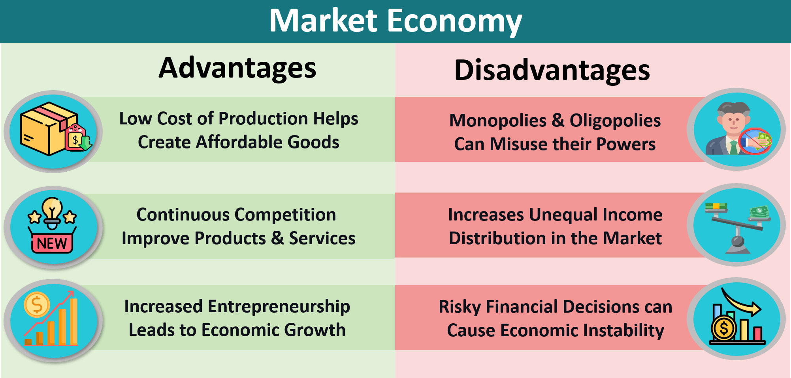

## Table of Contents

## What is market chasing?

Market chasing is when a business keeps changing its products or services to try to catch up with what's popular at the moment. Instead of sticking to a plan, the business jumps from one trend to another, hoping to make more sales. This can be risky because it's hard to keep up with trends, and it might confuse customers who don't know what the business stands for anymore.

Sometimes, market chasing can work if a business is quick and good at spotting trends. But usually, it's better for a business to have a clear idea of what it does best and stick to it. This way, customers know what to expect and the business can build a strong reputation over time. Trying to chase every new trend can lead to wasting time and money, and might make the business lose its focus.

## How does market chasing work?

Market chasing happens when a business tries to keep up with what's popular right now. They change their products or services to match what people seem to want at the moment. For example, if a lot of people start buying eco-friendly products, a company might start making their own eco-friendly items to try to get some of that business. The idea is to quickly jump on trends to boost sales and stay relevant in the market.

However, market chasing can be tricky. It's hard to always know what the next big thing will be, and by the time a business changes its products, the trend might already be over. This can lead to wasted time and money. Plus, if a business keeps changing what it offers, customers might get confused about what the company stands for. It's often better for a business to focus on what it does best and build a strong brand that people trust, rather than constantly chasing after the latest trends.

## What are the basic mechanisms involved in market chasing?

Market chasing involves a few key steps that businesses use to keep up with what's popular. First, a business needs to keep an eye on the market to spot new trends. This means watching what customers are buying, what competitors are doing, and what's being talked about in the news and on social media. Once they spot a trend, they have to quickly figure out if it's something they can use to make more money. If it looks good, they'll start changing their products or services to fit the trend. This could mean adding new features, changing how things look, or even starting to sell completely new items.

The next part of market chasing is getting these new or changed products out to customers as fast as possible. This often means speeding up the design and production process. The business might also need to change how they tell people about their products, using ads and promotions that fit the new trend. The goal is to get customers excited about the new stuff and start buying it right away. But there's a risk here. If the trend doesn't last long, or if the business can't get their new products out quickly enough, they might not make any money and could even lose some. So, market chasing is all about being quick and smart about jumping on trends.

## Can you explain the concept of market chasing with a simple example?

Imagine a small bakery that usually sells cakes and cookies. One day, the bakery owner notices that a lot of people in town are buying gluten-free bread because it's become a big trend. The owner decides to start making gluten-free bread too, hoping to attract these new customers. This is an example of market chasing: the bakery is changing what it sells to follow what's popular right now.

The bakery quickly adds gluten-free bread to its menu and starts telling everyone about it through ads and signs in the shop. At first, it works, and they sell a lot of gluten-free bread. But after a few months, people start buying less gluten-free bread because the trend is fading. The bakery spent time and money changing their products, but now they're back to selling mostly cakes and cookies. This shows how market chasing can be risky because trends can change fast, and it's hard to keep up.

## What are the advantages of market chasing for businesses?

Market chasing can help businesses make more money by jumping on popular trends. If a business is quick to spot what people want, they can start selling it and get more customers. For example, if a lot of people start buying eco-friendly products, a business that starts selling eco-friendly items might see their sales go up. This can be especially good for businesses that can change what they sell fast. It helps them stay ahead of competitors who are slower to catch on.

Another advantage is that market chasing can keep a business interesting and exciting. When a business keeps changing its products to match what's popular, it can keep customers coming back to see what's new. This can help keep the business fresh and relevant in the market. If done right, market chasing can make a business seem like it's always on top of the latest trends, which can attract more customers and make them want to buy more.

## How can market chasing help in expanding market share?

Market chasing can help a business grow its market share by quickly jumping on popular trends. When a business sees that people are buying a lot of a certain type of product, like organic foods, they can start selling their own version of it. This can attract new customers who are looking for those trendy items. If the business is fast and good at this, they can take some of the market share away from other companies that are slower to catch on.

By keeping up with what's popular, a business can also keep its current customers interested. When customers see that a business is always offering new and trendy products, they might keep coming back to see what's new. This can help the business hold onto its existing market share while also growing it by attracting new customers who are drawn to the latest trends. Over time, this can lead to a bigger share of the market for the business.

## What are the potential disadvantages of market chasing?

Market chasing can be risky because trends change fast. If a business spends a lot of time and money changing its products to fit a trend, but the trend goes away quickly, the business might lose money. It's hard to always guess what will be popular next, so a business might end up making products that nobody wants to buy. This can waste resources and make it hard for the business to make a profit.

Another problem with market chasing is that it can confuse customers. If a business keeps changing what it sells, people might not know what the business stands for anymore. This can make it hard for the business to build a strong brand that people trust. Customers like to know what to expect from a business, and if it's always changing, they might go somewhere else where they feel more sure about what they'll get.

## How does market chasing affect long-term business sustainability?

Market chasing can hurt a business's long-term sustainability because it focuses on short-term gains instead of building a strong foundation. When a business keeps changing its products to follow trends, it might make some quick money, but it can lose sight of what makes it special. Over time, this can make it hard for the business to keep customers who want something reliable and consistent. If the business is always chasing the next big thing, it might not have time to build a strong brand that people trust and come back to.

Also, market chasing can use up a lot of resources. Changing products to fit new trends takes time and money, and if the trends don't last, the business might not make back what it spent. This can make it hard for the business to stay healthy and grow over the long term. Instead of chasing trends, a business might do better by focusing on what it does best and building a loyal customer base that sticks with it through good times and bad.

## What advanced strategies can be used to optimize market chasing?

To optimize market chasing, a business can use data to make smarter decisions. By looking at what customers are buying and what's being talked about online, a business can spot trends early. They can use tools like social media analytics and market research to see what's popular and what might be popular soon. This helps them decide which trends to follow and which ones to ignore. Instead of jumping on every trend, they can focus on the ones that are most likely to last and make them money. This way, they can use their time and money more wisely and avoid wasting resources on short-lived fads.

Another strategy is to be flexible and quick. A business needs to be able to change its products fast to keep up with trends. This means having a good supply chain and production process that can switch gears quickly. It also means being ready to change marketing plans to fit new trends. But while being fast, the business should also keep some of its core products the same. This helps keep customers who like the business for what it usually does. By balancing quick changes with a strong core, a business can chase trends without losing its identity.

## How do companies measure the success of their market chasing efforts?

Companies measure the success of their market chasing efforts by looking at their sales numbers. If they see that sales go up after they start selling a new trendy product, they know their market chasing worked. They also look at how many new customers they get and if these customers keep coming back. If a lot of new people start buying their products and some of them become regular customers, that's a good sign. Companies also keep an eye on their profits to see if the money they made from the new products is more than what they spent to make and sell them.

Another way companies measure success is by seeing how their brand is doing. If people start talking about their company more on social media or if they get more positive reviews, it means their market chasing is helping their reputation. They might also do surveys to ask customers what they think about the new products. If the feedback is good, it shows that chasing the market trend was a smart move. By looking at all these things together, companies can figure out if their market chasing efforts are paying off.

## What are the ethical considerations in market chasing?

Market chasing can sometimes lead to ethical problems. One big issue is that companies might make products that aren't good quality just to follow a trend. They might rush to get new things out to customers without making sure they're safe or will last a long time. This can be bad for customers who might end up with things that break easily or could even be dangerous. It's not fair to customers if a company puts making money quickly ahead of making sure their products are good.

Another ethical concern is that market chasing can make companies do things that aren't honest. For example, they might say their new product is better than it really is just to get people to buy it. They might also use ads that trick people into thinking the product is something it's not. This kind of dishonesty can hurt the trust people have in the company. It's important for companies to be honest and fair with their customers, even when they're trying to follow the latest trends.

## Can you discuss case studies where market chasing led to significant business outcomes?

One famous case of market chasing is when McDonald's started offering healthier options on their menu. They saw that more people were eating healthy foods, so they added salads and wraps to their menu. This helped them keep up with what customers wanted and even brought in new customers who might not have eaten at McDonald's before. But, it was tricky because some people still wanted the classic McDonald's food. So, they had to balance the new healthy options with their regular menu items. Overall, this market chasing helped McDonald's stay relevant and grow their business.

Another example is when Nokia tried to chase the smartphone market. For a long time, Nokia was known for making good, simple cell phones. But when smartphones became popular, Nokia wanted to join in. They started making their own smartphones, but they didn't do it as well as companies like Apple and Samsung. Nokia's smartphones were late to the market and not as good, so people didn't buy them as much. This market chasing didn't work out for Nokia, and they lost a lot of their market share. Eventually, Nokia had to sell their phone business to another company.

## References & Further Reading

[1]: [Lopez de Prado, M. (2018). "Advances in Financial Machine Learning."](https://www.amazon.com/Advances-Financial-Machine-Learning-Marcos/dp/1119482089) Wiley.

[2]: [Aronson, D. R. (2007). "Evidence-Based Technical Analysis: Applying the Scientific Method and Statistical Inference to Trading Signals."](https://www.amazon.com/Evidence-Based-Technical-Analysis-Scientific-Statistical/dp/0470008741) Wiley.

[3]: [Jansen, S. (2020). "Machine Learning for Algorithmic Trading."](https://github.com/stefan-jansen/machine-learning-for-trading) Packt Publishing.

[4]: [Chan, E. (2009). "Quantitative Trading: How to Build Your Own Algorithmic Trading Business."](https://github.com/ftvision/quant_trading_echan_book) Wiley Trading.

[5]: [Bergstra, J., Bardenet, R., Bengio, Y., & Kégl, B. (2011). "Algorithms for Hyper-Parameter Optimization."](https://proceedings.neurips.cc/paper/2011/file/86e8f7ab32cfd12577bc2619bc635690-Paper.pdf) Advances in Neural Information Processing Systems 24.