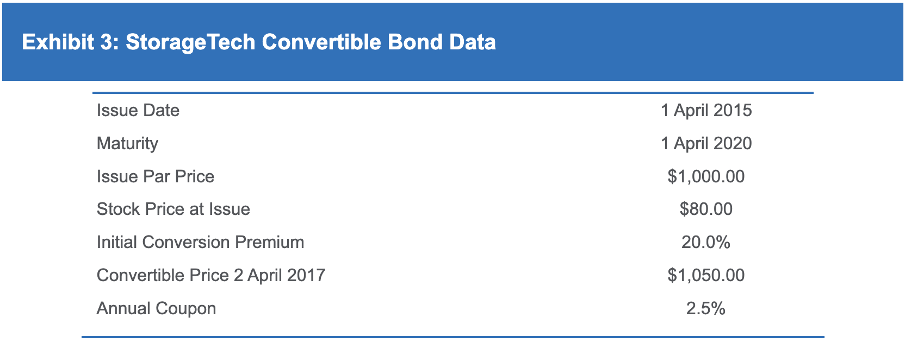

Understanding the complex world of finance can be daunting with its multitude of terms and concepts. It encompasses diverse areas such as stock exchanges, derivatives, commodities, and more, all of which have their own unique terminology and intricacies. This complexity is compounded when one considers the different financial products and strategies available to investors and traders. Navigating these waters requires not only an understanding of individual terms but also how they relate to and influence one another.

In this article, we focus on core concepts crucial to modern finance: stock conversion, market conversion price, key financial terms, and algorithmic trading. Stock conversion is a critical function that enables holders of certain types of securities to shift into common stock, thus potentially reaping the growth rewards associated with the equity markets. This process is intertwined with the market conversion price, an essential calculation for investors considering conversion opportunities.



Moreover, understanding fundamental financial terms provides the foundation required to leverage these mechanisms effectively. Terms such as conversion ratio and intrinsic value shape the landscape in which financial decisions are made. An awareness of these terms allows for a more comprehensive view of the potential benefits and limitations associated with various financial instruments.

Additionally, algorithmic trading, a rapidly evolving aspect of finance, introduces significant opportunities and challenges. Through the use of sophisticated algorithms, trades can be executed with high precision and speed, influencing market dynamics considerably. This method of trading plays an instrumental role in the liquidity and volatility of markets, and its adoption continues to shape the broader financial environment.

As we explore these topics, our goal is to offer insight and clarity, equipping readers with the knowledge necessary to navigate and succeed in the intricate and dynamic world of finance. Whether you are an experienced investor or new to trading, understanding these principles is essential for making informed decisions in today's markets.

## Table of Contents

## What is Stock Conversion?

Stock conversion involves the exchange of convertible securities, such as convertible bonds or preferred shares, for common stock in the issuing company. This process provides investors the opportunity to benefit from a company's potential growth by gaining equity ownership. Convertible securities are hybrid financial instruments, offering features of both debt and equity. They typically provide fixed income through interest or dividends, along with the option to convert into common stock at a later date, usually when the company's stock price has appreciated.

A pivotal aspect of stock conversion is the conversion ratio, which determines the number of shares an investor receives upon conversion. This ratio is established at the time the security is issued and is defined as:

$$
\text{Conversion Ratio} = \frac{\text{Par Value of Convertible Security}}{\text{Conversion Price}}
$$

For instance, if a convertible bond has a par value of $1,000 and a conversion price of $50, the conversion ratio would be 20, meaning the bond can be exchanged for 20 shares of the company's stock.

Investors must also consider the market conversion price, which is the effective cost per share upon conversion. This is calculated by dividing the current market price of the convertible security by the conversion ratio. For example, if a convertible bond is trading at $1,200 in the market and the conversion ratio is 20, the market conversion price would be $60 per share.

Stock conversion provides investors the chance to participate in equity gains while enjoying the safety of bond-like returns until conversion. This dual benefit makes convertible securities a compelling choice for those seeking to balance risk and return amidst volatile market conditions.

## Understanding Market Conversion Price

Market conversion price is a fundamental concept for investors holding convertible securities such as bonds or preferred shares. It represents the effective price an investor pays per share when they opt to convert their securities into the issuer's common stock. Calculating the market conversion price involves dividing the current market price of the convertible security by its conversion ratio.

$$
\text{Market Conversion Price} = \frac{\text{Market Price of Convertible Security}}{\text{Conversion Ratio}}
$$

Understanding this price is crucial for investors, as it helps determine whether converting the security into common stock would be financially advantageous. A lower market conversion price relative to the current market price of the common stock signifies a more favorable conversion. This situation can arise when the market perceives growth potential or other intrinsic advantages in the equity.

For example, if a convertible bond is trading at $1,000 with a conversion ratio allowing for the acquisition of 50 shares, the market conversion price would be $20 per share. If the current market price of the common stock exceeds this $20, the investor can potentially gain by executing the conversion.

Investors are tasked with comparing the market conversion price to the prevalent stock market price. This comparison aids in identifying possible [arbitrage](/wiki/arbitrage) opportunities or evaluating the potential for a successful conversion, factoring in elements such as market [volatility](/wiki/volatility-trading-strategies) and future growth projections. Understanding market conversion price thus empowers investors with the insights necessary for making informed conversion decisions, balancing immediate returns against long-term equity prospects.

## Important Financial Terms Related to Conversion

Conversion Ratio, Convertible Securities, and Intrinsic versus Extrinsic Value are fundamental concepts when dealing with stock conversion.

**Conversion Ratio** is defined as the number of shares an investor receives upon converting one unit of a convertible security into common stock. This ratio is crucial for investors as it directly impacts the potential returns from conversion. It is usually stipulated at the issuance of the convertible security and can be expressed mathematically as:

$$
\text{Conversion Ratio} = \frac{\text{Par Value of Convertible Security}}{\text{Conversion Price}}
$$

For example, if a convertible bond with a par value of $1,000 is convertible into common stock at a conversion price of $50 per share, the conversion ratio would be 20 shares per bond.

**Convertible Securities** are financial instruments that allow the owner to convert them into another form, commonly common stock of the issuing company. These include convertible bonds and convertible preferred stock. Convertible securities offer benefits such as fixed income (from bonds) or dividends (from preferred stocks) with the added advantage of capitalizing on potential stock price appreciation. However, the conditions under which these securities can be converted, including time frames and conversion prices, are pre-defined and must be carefully considered by investors.

Understanding **Intrinsic Value** and **Extrinsic Value** helps investors assess the worth of options and convertible securities:

- **Intrinsic Value** is the actual value of a company's asset, based on underlying perception of its actual value including all aspects of the business. For options, intrinsic value is the difference between the current price of the underlying asset and the strike price, representing profit that could be made if the option were exercised immediately. It can be represented mathematically as:

  \[ \text{Intrinsic Value (Options)} = \max(0, \text{Stock Price} - \text{Strike Price})
$$

  For instance, if a convertible bond allows conversion at $40 per share, and the current stock price is $50, the intrinsic value is $10 per share.

- **Extrinsic Value**, on the other hand, represents the value assigned to uncertainty and time. It is the difference between the price of the option (or convertible security) and its intrinsic value. This value accounts for factors such as time to expiration and volatility.

Investors and analysts use these financial terms to evaluate the potential benefits and drawbacks of converting securities and to strategize conversions optimally. Understanding these concepts can aid in making informed decisions about when and how to convert securities for maximum benefit.

## Algo Trading and Its Influence on Market Prices

Algorithmic trading, commonly referred to as algo trading, utilizes computer algorithms to execute trades across financial markets at rapid speeds and high volumes. These algorithms operate based on pre-established criteria, which can include variables such as timing, price, and quantity. As technology has evolved, so too has the complexity and prevalence of [algorithmic trading](/wiki/algorithmic-trading), leading to significant effects on market behavior.

Algo trading influences market prices by enhancing [liquidity](/wiki/liquidity-risk-premium). By facilitating the execution of a large number of transactions in a very short period, algo trading helps ensure there are enough buyers and sellers to meet market demands. This increased liquidity generally leads to narrower bid-ask spreads, making markets more efficient and lowering trading costs for investors.

Despite these benefits, algo trading can also result in significant price fluctuations, particularly during periods of market stress. High-frequency trading ([HFT](/wiki/high-frequency-trading-strategies)), a subset of algorithmic trading, can amplify volatility as large volumes of trades are executed in milliseconds. For example, events like the "Flash Crash" of May 6, 2010, where the Dow Jones Industrial Average briefly plummeted before rapidly recovering, demonstrate how algo trading can exacerbate market swings. This incident highlighted the potential for algorithmic trading to quickly move markets in unexpected directions, prompting regulatory scrutiny and adjustments to trading rules to mitigate such risks.

Understanding the impact of algo trading is essential for market participants. Participants must develop a keen awareness of the algorithms' mechanisms, as these can affect investment strategies and market outcomes. For investors and traders, this knowledge provides a strategic advantage, as they can better anticipate market movements and potentially exploit opportunities created by the trading activity of algorithms.

Below is an example of a simple Python algorithm that determines the optimal timing for executing trades based on moving averages, a commonly used strategy in algorithmic trading:

```python
import numpy as np
import pandas as pd

# Sample data representing closing prices
data = {'Close': [120, 122, 123, 121, 125, 126, 128, 127, 129]}
prices = pd.DataFrame(data)

# Calculate the short and long term moving averages
short_window = 3
long_window = 5

prices['Short_MA'] = prices['Close'].rolling(window=short_window, min_periods=1).mean()
prices['Long_MA'] = prices['Close'].rolling(window=long_window, min_periods=1).mean()

# Generate buy/sell signals
prices['Signal'] = 0
prices['Signal'][short_window:] = np.where(
    prices['Short_MA'][short_window:] > prices['Long_MA'][short_window:], 1, 0)

# The trading strategy is to buy at 1 and sell at 0
prices['Positions'] = prices['Signal'].diff()

print(prices)
```

In summary, while algorithmic trading offers significant advantages by improving efficiency and liquidity in markets, it also presents challenges, such as the potential for increased volatility. Thus, a comprehensive understanding of algorithmic trading's effects is crucial for investors aiming to navigate the complexities of modern financial markets effectively.

## Benefits and Risks of Stock Conversion and Algo Trading

Stock conversion is an investment strategy that offers both significant benefits and potential drawbacks. One of the primary advantages is that it provides investors with the opportunity to receive income from convertible securities, such as convertible bonds or preferred shares, while also potentially benefiting from equity appreciation. Convertible securities typically offer fixed interest or dividend yields, which can provide a stable income stream. When the issuing company's stock price increases, investors can convert these securities into common shares, thereby participating in the company's equity growth.

However, stock conversion is not without risks. A key concern is the potential dilution of existing shares. When additional shares are issued through the conversion of securities, the ownership percentage of existing shareholders may decrease, potentially reducing their voting power and dividends per share. This dilution can be detrimental to current shareholders, who may experience a decline in the value of their holdings.

Algo trading, or algorithmic trading, plays a significant role in modern financial markets by using computer algorithms to execute trades at high speed and [volume](/wiki/volume-trading-strategy). This approach enhances market liquidity and contributes to more efficient pricing by promptly adjusting to new information. The rapid execution of trades can reduce the bid-ask spread, benefiting all participants by representing fairer market prices.

Yet, algo trading carries its own set of risks, primarily related to market stability. High-frequency trading, a form of algorithmic trading, can lead to market volatility and significant price fluctuations. In extreme cases, it has the potential to trigger flash crashes—sudden and severe drops in securities prices within a very short time. These events can erode investor confidence and pose systemic risks to financial markets.

In summary, while stock conversion and algorithmic trading provide distinct advantages in terms of income potential and market liquidity, they also present challenges like share dilution and market instability. Investors should carefully assess these factors when employing strategies involving stock conversion and algorithmic trading.

## Conclusion

Navigating the financial markets requires a solid understanding of several complex concepts. Stock conversion, for instance, provides investors with opportunities to convert their securities into common shares, potentially profiting from the company's growth. However, it's critical to recognize the associated risks, such as the dilution of existing shares, which might impact current shareholders' equity value.

Similarly, market conversion prices play a pivotal role in determining the economic feasibility of conversion actions. The calculation of this price is fundamental: 

$$
\text{Market Conversion Price} = \frac{\text{Market Price of Convertible Security}}{\text{Conversion Ratio}}
$$

This formula aids investors in making informed decisions about whether to exercise their conversion rights. Understanding these calculations can tip the balance between profit and loss in stock conversion strategies.

Algo trading, or algorithmic trading, is becoming increasingly prevalent, reshaping how stock and securities transactions are conducted. This trading method utilizes highly sophisticated algorithms to execute trades at speeds and volumes that are beyond human capabilities. While it enhances liquidity and efficient pricing, it also introduces risks of market instability, particularly during periods of high-frequency trades. This dual nature underscores the need for investors and traders to remain informed about algorithmic mechanisms and their effects on market dynamics.

In summary, both stock conversion and algo trading present significant profit opportunities alongside inherent risks. A thorough grasp of these concepts, alongside vigilant market monitoring, is essential for any investor wishing to navigate the complexities of today's financial markets effectively.

## References & Further Reading

[1]: ["Advances in Financial Machine Learning"](https://www.amazon.com/Advances-Financial-Machine-Learning-Marcos/dp/1119482089) by Marcos Lopez de Prado

[2]: ["Machine Learning for Algorithmic Trading"](https://github.com/stefan-jansen/machine-learning-for-trading) by Stefan Jansen

[3]: ["Quantitative Trading: How to Build Your Own Algorithmic Trading Business"](https://www.amazon.com/Quantitative-Trading-Build-Algorithmic-Business/dp/1119800064) by Ernest P. Chan

[4]: ["Evidence-Based Technical Analysis: Applying the Scientific Method and Statistical Inference to Trading Signals"](https://www.amazon.com/Evidence-Based-Technical-Analysis-Scientific-Statistical/dp/0470008741) by David Aronson

[5]: "[Flash Crash of 2010](https://en.wikipedia.org/wiki/2010_Flash_Crash)" on Investopedia