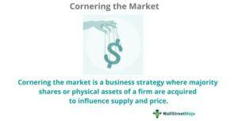

Market cornering, commodity trading, market manipulation, and algorithmic trading are pivotal elements shaping the financial landscape. This article aims to provide a comprehensive understanding of these concepts, exploring their dynamics and the implications they hold for financial markets.

Market cornering occurs when a single entity acquires enough control over a particular asset to manipulate its price for its advantage. This practice can disrupt market equilibrium, leading to significant price fluctuations and potential losses for other market participants. Historically, market cornering has caused substantial impacts on industries, exemplified by notable instances like the Hunt Brothers' attempt to corner the silver market in the late 1970s. While it can lead to short-term profits for the manipulator, market cornering often raises legal and ethical concerns due to its distortion of market fairness.



Commodity trading involves the buying and selling of raw materials such as metals, energy products, and agricultural goods. As these commodities form the backbone of the global economy, their trading is susceptible to manipulation. Market manipulation in the commodity markets can manifest through techniques such as spreading false information, creating artificial demand, or exploiting regulatory loopholes. The effects can ripple across supply chains, affecting global economics and commodity pricing.

Algorithmic trading has emerged as a significant force in modern markets, characterized by high-frequency trades executed by sophisticated computer algorithms. While these algorithms can enhance market efficiency and liquidity, they also possess the potential for manipulation, either by design or by unintended consequences. The infamous "Flash Crash" of 2010 exemplifies the risks associated with rogue algorithms, where the Dow Jones Industrial Average plunged nearly 1,000 points within minutes before recovering.

This article will guide readers through these complex topics and their intersection, focusing on the potential of algorithmic trading to facilitate market cornering. The narrative will unfold through structured sections, detailing the mechanisms and implications of market manipulation, the regulatory and ethical landscapes, the impact on investors, and the preventative measures necessary to ensure market integrity. By understanding these elements, stakeholders can better navigate and contribute to fair and transparent financial markets.

## Table of Contents

## Understanding Market Cornering

Market cornering is a strategic practice where an individual or group acquires enough control over a particular market to manipulate the price of a commodity or security. This control is typically achieved by buying up large quantities of the asset, thus creating scarcity and driving up prices. Successful market cornering can result in significant financial gain for the cornerers but often comes at the expense of market integrity and fairness.

Historically, several notable cases of market cornering have captured public and regulatory attention. One of the earliest and most infamous examples is the cornering of the silver market by the Hunt Brothers in the late 1970s. The Hunts attempted to corner the silver market by purchasing large quantities of the metal, which led to a dramatic increase in prices from around $6 per ounce to nearly $50 in early 1980. Their control over the market was eventually challenged, leading to regulatory interventions and a subsequent crash in silver prices.

Another historical example is the attempted cornering of the wheat market by Arthur Cutten in the 1920s. Cutten, a wealthy trader, utilized his resources to buy up large positions in wheat futures, significantly influencing the prices. While initially successful, his actions led to increased scrutiny and regulatory changes in the commodity markets.

Legal and ethical considerations are central to the discourse on market cornering. From a legal standpoint, most jurisdictions have regulations in place to prevent unfair market manipulation practices, including cornering. Such regulations are designed to maintain fair pricing mechanisms and protect investors from fraudulent activities. Ethical considerations involve the moral responsibility of traders to engage in practices that do not harm market participants or destabilize financial systems. Market cornering is often viewed as unethical because it manipulates supply and demand dynamics to the disadvantage of other market players.

The influence of market cornering on prices and market dynamics is profound. By artificially creating scarcity, the cornerer can drive prices up, leading to increased market [volatility](/wiki/volatility-trading-strategies). This manipulation disrupts the natural balance of supply and demand, resulting in prices that do not reflect actual market conditions. Such distortions can have ripple effects across broader financial markets, affecting everything from individual investors' portfolios to global supply chains.

In conclusion, while market cornering can offer significant profit opportunities for those able to execute the strategy successfully, it poses serious risks to market fairness and integrity. Regulatory oversight and adherence to ethical trading practices are essential in preventing the negative consequences of such market manipulations.

## Commodity Trading and Market Manipulation

Commodity trading is a fundamental component of the global economy, involving the buying and selling of raw materials and primary products. This trading can be broadly categorized into two types: hard commodities, which include natural resources extracted through mining such as gold, oil, and copper, and soft commodities, which are typically agricultural goods like wheat, coffee, and sugar. Commodities serve as essential inputs for various industries, and their trading significantly impacts global supply chains and price stability.

Market manipulation in commodity trading refers to the actions taken by individuals or entities to artificially influence the price or supply of these goods. Several methods are employed to manipulate commodity markets. One common tactic is "cornering," where a trader gains control of a sufficient share of the commodity to unilaterally influence its price. Another strategy is "pumping and dumping," where manipulators create misleading hype around a commodity to inflate its price, only to later sell their holdings at the peak before the price inevitably crashes.

To prevent and oversee such manipulative activities, regulatory bodies play a pivotal role. In the United States, the Commodity Futures Trading Commission (CFTC) is primarily responsible for regulating the derivatives markets, which include futures, swaps, and certain kinds of options tied to commodities. The CFTC's functions include monitoring trading to ensure transparency, integrity, and compliance with federal regulations aimed at deterring fraud and manipulation. In addition to government bodies, self-regulatory organizations such as the National Futures Association (NFA) provide oversight and enforce rules to maintain market order.

The consequences of market manipulation are far-reaching. When prices are artificially skewed, it can lead to misallocation of resources, where investments are drawn away from more efficient uses. Furthermore, such manipulation can disrupt global supply chains, leading to shortages or surpluses that affect industries reliant on these commodities. For instance, if the price of [crude oil](/wiki/crude-oil) is manipulated upward, it can raise transportation and production costs across various sectors, leading to inflationary pressures in the broader economy.

In conclusion, while commodity trading is vital to economic stability and growth, it remains vulnerable to manipulation that can have detrimental effects on prices and supply chains worldwide. Regulatory oversight and continuous monitoring are essential to fostering an environment where commodity markets function fairly and efficiently, benefiting industries and consumers alike.

## Algorithmic Trading: The Invisible Hand

Algorithmic trading has become an integral component of modern financial markets, leveraging complex mathematical models and high-speed computations to execute trades at speeds and frequencies unreachable by human traders. This form of trading utilizes algorithms—predetermined sequences of computational instructions—to make trading decisions, reducing latency and human error.

Algorithms serve various purposes in today’s trading ecosystems, ranging from executing large orders in smaller, sequential transactions to managing portfolios and implementing trading strategies that require rapid, decisive action. The growth of [algorithmic trading](/wiki/algorithmic-trading) is largely attributed to technological advancements and the increasing [liquidity](/wiki/liquidity-risk-premium) of financial markets.

### Use of Algorithms for Beneficial and Manipulative Activities

Algorithms are programmed to maximize efficiency, minimize costs, and explore [arbitrage](/wiki/arbitrage) opportunities. They optimize trading by analyzing market conditions and patterns—using techniques like [statistical arbitrage](/wiki/statistical-arbitrage), [trend following](/wiki/trend-following), and [market making](/wiki/market-making)—to achieve better price execution and risk management.

However, the same tools that facilitate efficiency can also enable market manipulation. Tactics such as "spoofing"—where a trader places a large order they intend to cancel before execution to create a false perception of demand or supply—can distort market reality. Similarly, algorithms can engage in "quote stuffing," flooding the market with excessive order activity, slowing down competitors' strategies, and gaining unfair advantages.

### Notable Cases and Impacts of Algorithmic Trading Gone Rogue

High-profile failures of algorithmic trading have highlighted its potential pitfalls. One notable example is the "Flash Crash" of May 6, 2010, when the Dow Jones Industrial Average dropped nearly 1,000 points in minutes, triggered by a single large sell order executed algorithmically across multiple markets. The event demonstrated how high-frequency trading algorithms interacting with market anomalies could generate rapid and large-scale volatility.

Another significant case was the collapse of Knight Capital in August 2012. A software malfunction caused the firm’s algorithms to execute erroneous trades amounting to billions of dollars within 45 minutes, resulting in a $440 million loss, forcing the firm into bankruptcy.

### The Future of Algorithmic Trading and Potential Regulations

The advancement of [artificial intelligence](/wiki/ai-artificial-intelligence) and [machine learning](/wiki/machine-learning) continues to evolve algorithmic trading. These technologies enable algorithms to learn from historical data, adapt to shifting market conditions, and improve over time. Such progress could lead to more robust and resilient trading systems with improved predictive capabilities.

Nonetheless, the increased sophistication of algorithmic trading demands enhanced regulatory frameworks to mitigate risks associated with automation and prevent misuse. Regulatory bodies are considering measures like stricter testing and validation procedures for trading algorithms, and real-time monitoring systems to detect suspicious activities promptly. The European Union’s Markets in Financial Instruments Directive II (MiFID II) is an example, implementing rules to enhance transparency and oversight in algorithmic trading activities.

The future landscape of algorithmic trading will likely balance technological innovation with prudent regulatory oversight, ensuring fair and stable financial markets. Maintaining this equilibrium is crucial for fostering trust among market participants and safeguarding market integrity.

## The Intersection of Market Cornering and Algorithmic Trading

Algorithmic trading has fundamentally changed the landscape of financial markets, allowing for rapid and sophisticated trading strategies that were previously unattainable. Its intersection with market cornering, where a trader seeks to gain control over a particular market, can lead to significant ramifications in market structure and fairness.

Algorithmic trading systems can facilitate market cornering by executing large volumes of trades with unprecedented speed and precision. Sophisticated algorithms can identify and exploit market inefficiencies quickly, allowing traders to accumulate a dominant position in a particular asset or commodity. For instance, a trading algorithm might continuously purchase a specific commodity futures contract, ultimately controlling the majority of the available supply and thus cornering the market. Once control is established, the price of the commodity can be manipulated to benefit the trader, often at the expense of other market participants.

An example of a combined strategy might involve algorithmically detecting thin markets, where liquidity is sparse, allowing traders to incrementally build a controlling position without initially disrupting market prices. Through strategic acquisitions and disposals executed by algorithms, a cornering attempt might go unnoticed until the investor holds a significant market influence. 

The detection of such illicit practices in algorithmic trades is fraught with challenges. Algorithmic trading generates vast amounts of data, making it difficult for regulators to differentiate between legitimate high-frequency trading and abusive practices like market cornering. The complexity and opacity of algorithms further complicate oversight, as regulators tend to lack the technical expertise necessary to dissect and understand sophisticated trading strategies fully.

One key challenge is identifying manipulative intent amid the market noise generated by myriad trading algorithms operating simultaneously. The use of artificial intelligence and machine learning techniques in trading algorithms makes it harder to trace decision-making processes to specific manipulative activities. These advanced systems can adapt and shift tactics based on market conditions, making traditional regulatory approaches less effective.

The implications for market fairness and integrity are profound. If left unchecked, the intersection of market cornering and algorithmic trading could lead to lower market confidence, reduced liquidity, and increased volatility. It challenges the foundational principles of transparent price discovery and level playing fields for all market participants. 

Ensuring fairness and integrity in such a technologically advanced trading environment will likely require enhanced collaboration between market regulators, trading institutions, and technology developers. Advanced data analytics and monitoring systems must be developed to identify potential cornering strategies effectively and ensure robust mechanisms are in place to deter and penalize those who engage in market manipulation. 

By promoting technological innovations alongside regulatory vigilance, markets may better navigate the complexities introduced by the fusion of algorithmic trading and market cornering strategies.

## Legal and Ethical Implications

Legal and ethical implications in market manipulation and trading practices form the cornerstone of ensuring fair and transparent financial markets. Regulatory frameworks have been established worldwide to prevent market abuses and maintain investor confidence. In many jurisdictions, laws such as the U.S. Securities Exchange Act, the European Union's Market Abuse Regulation (MAR), and various national securities laws lay out clear standards to prevent practices like insider trading, market cornering, and the dissemination of false information.

These legal frameworks are designed to protect market integrity and prevent exploitation by well-positioned traders. They mandate disclosure requirements, prohibit fraudulent conduct, and impose penalties for violations, thereby providing a structured environment for fair trading.

Ethical considerations go hand-in-hand with legal frameworks and emphasize the moral responsibilities of traders and financial institutions. These responsibilities include acting with integrity, ensuring transparency in operations, and fostering trust among market participants. Financial institutions are expected to maintain robust internal controls and adhere to ethical guidelines to prevent manipulative practices.

Case studies illustrate the enforcement of legal actions against market manipulation. For example, the Hunt Brothers’ infamous silver market manipulation in the late 1970s highlights how regulatory intervention was necessary to restore market confidence. The brothers attempted to corner the silver market, causing prices to skyrocket until the authorities stepped in, implementing new rules to deter such manipulative strategies.

Public awareness and investor education serve as crucial tools in preventing market manipulation. Educated investors are better equipped to recognize and report suspicious activities. Initiatives by regulatory bodies to disseminate information about market practices can empower investors and enhance market vigilance. Programs focus on explaining market mechanisms, the potential signs of manipulation, and the importance of ethical trading practices.

Overall, maintaining a balanced interplay between regulation and ethical practice is vital for the health of financial markets. A proactive approach by traders to adhere to legal and ethical standards, supplemented by informed and vigilant investors, can mitigate the risks associated with market manipulation.

## The Impact on Investors and Markets

Market manipulation can have profound effects on both individual investors and the broader financial markets. Its impact extends beyond immediate financial losses, potentially undermining confidence and altering market dynamics in the long term.

Market manipulation often distorts the true value of assets, leading to inaccurate pricing. For individual investors, this can result in substantial financial losses, as they may buy overvalued assets or sell at undervalued prices. Retail investors, who may lack the advanced tools and resources of institutional investors, are particularly vulnerable. This vulnerability is amplified when markets are cornered, leading to exaggerated price movements. For example, during the infamous Hunt Brothers silver cornering in 1980, prices soared from less than $10 to over $50 per ounce, then plummeted dramatically, causing massive losses for investors caught on the wrong side of the trade.

To safeguard against such manipulation, investors can adopt several strategies. Diversification remains a key tactic. By spreading investments across different asset classes, sectors, or geographies, investors can mitigate risks associated with any single market distortion. Additionally, they should remain informed by leveraging financial news, analysis, and tools that track market anomalies or unusual trading volumes, which may signal manipulation. Institutional investors and hedge funds often employ advanced algorithmic tools for this purpose, though these can be out of reach for individual investors.

Historical case studies highlight the severe impact of market cornering on individual investors. Apart from the Hunt Brothers, other instances, such as the 1997 manipulation of the Hong Kong stock market, demonstrate how coordinated actions can intentionally destabilize markets to the detriment of individual and institutional investors alike. The Asian Financial Crisis further illustrated how unchecked market activities could cause cascading effects on national economies, leading to widespread financial hardships.

If market manipulation is not addressed, it can erode trust in financial systems, deterring participation by both domestic and international investors. This loss of confidence can result in reduced liquidity, increased volatility, and potentially a higher cost of capital, as investors demand greater risk premiums for staying in or entering the market.

In summary, the repercussions of unchecked market manipulation are far-reaching, affecting not only those directly trading in manipulated securities but also the broader market ecosystem. Ensuring vigilance and adopting protective strategies remain crucial for investors at all levels.

## Preventative Measures and Market Safeguards

Regulatory bodies employ a range of strategies to prevent market manipulation and ensure market integrity. Key among these strategies is the enforcement of stringent legal frameworks designed to detect and deter fraudulent activities. Regulations often mandate transparency in trading activities and require detailed reporting to allow oversight agencies to monitor market behavior effectively.

Technological advancements play a crucial role in the real-time monitoring and detection of irregular trading patterns indicative of market manipulation. Cutting-edge technologies, including machine learning and artificial intelligence, are increasingly being integrated into these monitoring systems. For example, algorithms can be programmed to recognize atypical patterns in trading data that may suggest manipulative strategies, such as spoofing or wash trading. These systems enable regulators to swiftly identify and investigate suspicious activities, thus acting as a deterrent against potential violations.

Corporate governance and internal controls form the first lines of defense against market manipulation within organizations. Companies are encouraged to implement robust compliance programs to ensure adherence to ethical trading practices. These programs often include establishing clear policies, conducting regular audits, and training employees on the legal and ethical standards expected in trading activities. In addition, internal surveillance systems are often employed to continuously monitor trades and flag any discrepancies that could signal manipulative practices.

To create a fair and transparent trading environment, several recommendations can be proposed. First, enhancing cross-border regulatory cooperation can ensure that manipulative activities do not exploit jurisdictional gaps. Joint investigations and information sharing between regulatory bodies can significantly enhance the effectiveness of enforcement actions against manipulation. Second, regulators can promote greater transparency by requiring more detailed transaction reporting and making this information accessible to market participants. Enhanced transparency allows for better price discovery and reduces the potential for information asymmetry, which manipulators often exploit. Lastly, fostering an industry culture that prioritizes market integrity and ethical behavior can further safeguard against manipulation. This involves encouraging market participants, including trading firms and exchanges, to adopt self-regulatory measures and actively participate in initiatives aimed at maintaining a level playing field for all investors.

In conclusion, the combined efforts of regulatory frameworks, technological advancements, corporate governance, and a commitment to transparency and ethics are essential in safeguarding against market manipulation and ensuring the integrity of financial markets.

## The Future of Market Fairness and Transparency

The future of market fairness and transparency is poised for significant evolution, driven by advancements in technology, increased regulatory focus, and enhanced international cooperation. As markets grow more complex, the accompanying regulations must also adapt to protect market integrity and ensure fair trading practices.

### Forecasting Trends in Market Regulation and Enforcement

Regulatory frameworks are increasingly leaning towards real-time monitoring and adaptive compliance systems. Regulators are expected to deploy more sophisticated analytical tools that utilize artificial intelligence and machine learning to detect anomalous trading patterns indicative of manipulation or unfair practices. The implementation of predictive models could help anticipate market disruptions before they occur. With increased computational power, the role of technology in preempting and responding to suspicious activities will become a central component of regulatory strategies.

```python
# Example of a simple anomaly detection model using Python
import numpy as np
from sklearn.ensemble import IsolationForest

# Simulated market data
data = np.random.normal(0, 0.5, 1000)

# Training anomaly detection model
model = IsolationForest(contamination=0.01)
model.fit(data.reshape(-1, 1))

# Detecting anomalies
anomalies = model.predict(data.reshape(-1, 1))
anomalies = np.where(anomalies == -1)[0]  # Indices of anomalous data
```

### The Potential Role of Technology in Ensuring Market Integrity

Technology stands as a formidable ally in the quest for market integrity. Distributed ledger technologies, such as blockchain, offer transparency and immutability, which can prevent unauthorized alterations and provide clear audit trails for transactions. Moreover, advancements in secure multiparty computation and homomorphic encryption ensure privacy while allowing data to be analyzed for suspicious patterns. Such innovations make it possible to maintain confidentiality without compromising on oversight and responsibility.

### The Importance of International Collaboration

Global markets necessitate coordinated regulatory efforts. International bodies and agreements play a crucial role in harmonizing standards and enforcement procedures, thus preventing regulatory arbitrage, where companies exploit the differences in regulation between jurisdictions. Effective collaboration is facilitated through shared intelligence, joint task forces, and standardization of reporting requirements. By aligning objectives and practices, countries can construct a cohesive front against global market manipulation.

### Promoting a Fair Trading Environment

Investors and traders have an active role in sustaining fair markets. They can champion strategies such as ethical investing, supporting companies that adhere to transparent practices and prioritize corporate governance. Education is critical; investors equipped with knowledge about potential signs of market manipulation are less susceptible to exploitation. Advocacy for stricter regulatory policies and more robust market infrastructure further aids in developing a resilient market ecosystem, inherently deterring manipulation and fostering confidence in the financial system.

In conclusion, while challenges in maintaining market fairness and transparency persist, the confluence of advanced technology, regulatory vigilance, and international cooperation offers a promising path forward. By adopting proactive measures and fostering cooperation, a more equitable market landscape can be achieved, benefitting all stakeholders involved.

## Conclusion

This article has explored various facets of market dynamics, focusing on the phenomena of market cornering, commodity trading, market manipulation, and algorithmic trading. The intricate relationships and impacts of these elements highlight a complex ecosystem that demands vigilance from all stakeholders involved.

Vigilance against market manipulation is crucial for maintaining the integrity and stability of financial markets. Manipulative practices, whether through cornering or advanced algorithmic techniques, can distort market realities, leading to unfair advantages and potential economic repercussions. The integrity of commodity trading, crucial to global supply chains, hinges on transparent and fair market conditions, undisturbed by unethical manipulation.

As we look to the future, the role of technology in both promoting and safeguarding market fairness cannot be understated. Algorithmic trading, while efficient and often beneficial, represents a double-edged sword that requires stringent oversight to prevent potential misuse. Regulatory frameworks must evolve in line with technological advancements to ensure a robust defense against manipulative activities.

A concerted effort involving regulators, traders, and investors is necessary to foster a fairer market environment. Regulators must enhance their strategies and tools for detecting and deterring manipulative actions, while traders and investors should commit to ethical standards and practices. Collaborative measures, both at domestic and international levels, are indispensable in upholding market fairness and transparency.

Ultimately, the sustainability of financial markets depends on a collective commitment to vigilance, transparency, and ethical conduct. By prioritizing these principles, we can work towards a more equitable and resilient trading landscape, safeguarding the interests of all market participants and promoting long-term economic stability.

## References & Further Reading

[1]: Silber, W. L. (1981). ["The Hunt Silver Corner: Market and Public Policy Implications."](https://www.scottsdalemint.com/articles/2024/the-hunt-brothers-how-two-billionaires-broke-the-silver-market/) The Journal of Financial and Quantitative Analysis, 16(1), 29-45.

[2]: Lynch, A. W., & Foster, F. D. (1999). ["Market Efficiency and Corporate Effluents: Comment."](https://pages.stern.nyu.edu/~alynch/pdfs/vit02lynch.pdf) The Journal of Finance, 54(4), 1585-1594.

[3]: MacKenzie, D. (2015). ["Mechanizing the Merc: The Chicago Mercantile Exchange and the Rise of High-Frequency Trading."](https://pubmed.ncbi.nlm.nih.gov/26387525/) Technology and Culture, 56(3), 646-671.

[4]: Durbin, M. (2010). ["All About High-Frequency Trading."](https://www.mhebooklibrary.com/doi/book/10.1036/9780071743457) McGraw-Hill.

[5]: De Prado, M. L. (2018). ["Advances in Financial Machine Learning."](https://www.amazon.com/Advances-Financial-Machine-Learning-Marcos/dp/1119482089) John Wiley & Sons.

[6]: Fox, J. (2009). ["The Myth of the Rational Market: A History of Risk, Reward, and Delusion on Wall Street."](https://www.amazon.com/Myth-Rational-Market-History-Delusion/dp/0060599030) Harper Business.

[7]: Cummings, J. R., & Kattuman, P. A. (2015). ["High Frequency Trading and Market Jumps."](https://pubmed.ncbi.nlm.nih.gov/28384733/) The Journal of Futures Markets, 35(7), 597-620.