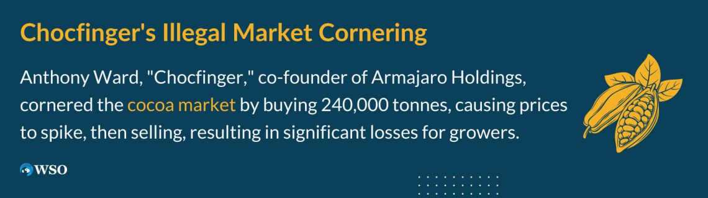

## Table of Contents

## What is market cornering?

Market cornering is when someone or a group tries to control a big part of a market. They do this by buying up a lot of the product or resource so they can control the price and supply. This can be bad for other people because it can make prices go up and make it hard for others to get what they need.

Sometimes, market cornering can be against the law because it can hurt competition. Governments have rules to stop people from doing this. When someone corners a market, it can cause problems for the whole economy, not just the people who can't get the product. It's important for markets to be fair so everyone has a chance to buy and sell.

## How does market cornering work?

Market cornering happens when someone or a group buys up a lot of a certain product or resource. They do this so they can control how much of it is available and how much it costs. Imagine if someone bought all the apples in a town. They could decide to sell the apples for a high price because they are the only ones with apples to sell. This is what cornering a market looks like.

When someone corners a market, it can be bad for everyone else. Other people who need the product might have to pay more money to get it. Also, other businesses that want to sell the product can't because they can't get enough of it to sell. Governments don't like market cornering because it can hurt the economy and make things unfair. That's why there are laws to stop people from doing it.

## What are the historical examples of market cornering?

One famous example of market cornering happened in the late 1800s with a man named Daniel Drew. He tried to corner the market on Erie Railroad stock. Drew and his friends bought a lot of the stock, which made the price go up. They did this so they could make a lot of money when they sold the stock. But, it didn't work out as planned. Other people found out what they were doing and the price of the stock went down fast. Drew and his friends lost a lot of money.

Another example is from 1903, when a businessman named James Keene tried to corner the market on cotton. He bought a lot of cotton, thinking he could control the price. But, just like with Daniel Drew, things went wrong. The price of cotton didn't go up as much as Keene thought it would. When people realized what he was doing, they sold their cotton, and the price went down. Keene lost a lot of money too.

These examples show that cornering a market is very risky. It can lead to big losses if it doesn't work out. That's why governments have rules to stop people from trying to do it.

## What are the different mechanisms used to achieve market cornering?

One way to corner a market is by buying up a lot of the product or resource. When someone does this, they can control how much of it is available. For example, if someone buys all the wheat in a region, they can decide how much wheat is sold and for how much money. This is called stockpiling. By controlling the supply, they can make the price go up because people who need the product will have to pay more to get it.

Another way is by using financial tools like futures contracts. Futures contracts are agreements to buy or sell a product at a certain price in the future. If someone buys a lot of these contracts, they can control the price of the product when the time comes to buy or sell it. This method was used in the famous attempt to corner the silver market by the Hunt brothers in the late 1970s. They bought a lot of silver futures, hoping to control the price, but it didn't work out and they lost a lot of money.

These mechanisms can be risky and are often against the law because they can hurt competition and the economy. Governments have rules to stop people from trying to corner markets. When someone tries to corner a market, it can lead to big problems, not just for them but for everyone who needs the product.

## What are the economic impacts of market cornering?

When someone corners a market, it can cause prices to go up a lot. This is because they control most of the product or resource, and they can decide to sell it for more money. When prices go up, it can be hard for other people to afford the product. This can hurt businesses that need the product to make their own things. For example, if someone corners the market on wheat, bread prices might go up because bakers have to pay more for the wheat they need.

Market cornering can also hurt the economy in other ways. It can make it hard for other businesses to compete because they can't get enough of the product to sell. This can lead to fewer choices for people who want to buy things. When there is less competition, it can make the whole economy weaker. Governments don't like market cornering because it can cause big problems. That's why there are laws to stop people from trying to do it.

## How can market cornering affect consumers?

When someone corners a market, it can make things more expensive for consumers. If one person or group controls most of a product, like all the apples in a town, they can decide to sell them for a higher price. This means that people who want to buy apples have to pay more money. It can be hard for families to afford the things they need when prices go up like this.

Market cornering can also make it hard for consumers to find the products they need. If the person who cornered the market decides not to sell much of the product, there might not be enough for everyone. This can be frustrating for people who are looking for the product but can't find it. It can also lead to people having to buy less of what they need or finding other, sometimes more expensive, options.

## What are the legal definitions and regulations regarding market cornering?

Market cornering is against the law in many places because it can hurt competition and make things unfair. In the United States, it's covered by laws like the Sherman Antitrust Act. This law says that it's illegal to try to control a market by buying up all of a product or resource. The idea is to keep markets fair so everyone has a chance to buy and sell. If someone tries to corner a market, they can get in big trouble, like paying fines or even going to jail.

Regulations around the world are similar. They all want to stop people from controlling markets because it can cause big problems for the economy. Governments watch markets closely to make sure no one is trying to corner them. If they find out someone is doing this, they can step in and stop it. This helps keep prices fair and makes sure there's enough of everything for everyone.

## What are the penalties for engaging in market cornering?

If someone tries to corner a market, they can face big penalties. In the United States, the Sherman Antitrust Act says it's illegal to control a market by buying up all of a product. If someone breaks this law, they might have to pay a lot of money in fines. The fines can be so big that they can ruin a person's business. Sometimes, people who try to corner a market can even go to jail. The government takes this very seriously because it wants to keep markets fair for everyone.

Other countries have similar rules. They don't want people to control markets because it can hurt the economy and make things unfair. If someone is caught trying to corner a market, they can face fines or other punishments. Governments watch markets closely to make sure no one is trying to do this. They step in quickly if they see someone trying to control a market, to stop it before it causes too many problems.

## How do regulatory bodies detect and prevent market cornering?

Regulatory bodies keep a close watch on markets to spot when someone might be trying to corner them. They look at how much of a product or resource someone is buying. If they see that one person or group is buying a lot more than usual, it could be a sign of market cornering. They also check for unusual price changes. If prices start going up a lot and there's less of the product available, that's another clue. By keeping an eye on these things, regulatory bodies can catch market cornering early.

To stop market cornering, regulatory bodies can step in and take action. They might issue warnings to the people trying to corner the market, telling them to stop. If the people don't listen, the regulatory bodies can impose fines or even take them to court. They can also make rules that limit how much of a product someone can buy at one time. This helps keep the market fair and makes sure everyone has a chance to buy and sell what they need.

## What are the ethical considerations of market cornering?

Market cornering raises big ethical questions because it's about fairness. When someone tries to control a market, they can make prices go up and make it hard for other people to get what they need. This isn't fair to other businesses that want to sell the same product, and it's not fair to people who just want to buy it. It can hurt a lot of people and make the economy weaker. That's why many people think market cornering is wrong.

Governments have laws to stop market cornering because they want to keep markets fair. These laws help make sure everyone has a chance to buy and sell. If someone tries to corner a market and gets caught, they can face big punishments like fines or jail time. This shows how serious the ethical issues are with market cornering. It's not just about making money; it's about doing what's right for everyone in the market.

## How does market cornering differ from other forms of market manipulation?

Market cornering is when someone tries to control a big part of a market by buying up a lot of the product or resource. They do this so they can decide the price and how much is available. This is different from other kinds of market manipulation, like spreading false information to change prices or doing fake trades to make it look like there's more interest in a product than there really is. Market cornering is about controlling the actual supply, while other manipulations might focus on changing how people think about the market.

Other forms of market manipulation can include things like "pump and dump" schemes, where people talk up a product to make the price go up, then sell it for a profit. Or they might do "spoofing," where they place orders they don't plan to follow through on, just to trick others into buying or selling. These methods don't involve controlling the supply like market cornering does. Instead, they try to trick the market into moving in a certain way. Both market cornering and these other manipulations can hurt the market and are often against the law, but they work in different ways.

## What are the current trends and future predictions regarding market cornering?

Market cornering is less common today because governments and regulatory bodies are better at watching markets and stopping it before it happens. They use technology and data to keep an eye on how much of a product someone is buying and how prices are changing. If they see anything that looks like market cornering, they can step in quickly. This makes it harder for people to try to control a market without getting caught. Also, more people know about the risks and problems with market cornering, so fewer people try to do it.

In the future, market cornering might become even harder because technology will keep getting better. Governments will have more tools to watch markets and stop people from trying to control them. But, new types of products and markets might also appear, and some people might still try to corner them. It's important for everyone to keep learning about market cornering and why it's bad, so we can all help keep markets fair and open for everyone.

## References & Further Reading

[1]: Silber, W. L. (1981). ["The Hunt Silver Corner: Market and Public Policy Implications."](https://www.scottsdalemint.com/articles/2024/the-hunt-brothers-how-two-billionaires-broke-the-silver-market/) The Journal of Financial and Quantitative Analysis, 16(1), 29-45.

[2]: Lynch, A. W., & Foster, F. D. (1999). ["Market Efficiency and Corporate Effluents: Comment."](https://pages.stern.nyu.edu/~alynch/pdfs/vit02lynch.pdf) The Journal of Finance, 54(4), 1585-1594.

[3]: MacKenzie, D. (2015). ["Mechanizing the Merc: The Chicago Mercantile Exchange and the Rise of High-Frequency Trading."](https://pubmed.ncbi.nlm.nih.gov/26387525/) Technology and Culture, 56(3), 646-671.

[4]: Durbin, M. (2010). ["All About High-Frequency Trading."](https://www.mhebooklibrary.com/doi/book/10.1036/9780071743457) McGraw-Hill.

[5]: De Prado, M. L. (2018). ["Advances in Financial Machine Learning."](https://www.amazon.com/Advances-Financial-Machine-Learning-Marcos/dp/1119482089) John Wiley & Sons.

[6]: Fox, J. (2009). ["The Myth of the Rational Market: A History of Risk, Reward, and Delusion on Wall Street."](https://www.amazon.com/Myth-Rational-Market-History-Delusion/dp/0060599030) Harper Business.

[7]: Cummings, J. R., & Kattuman, P. A. (2015). ["High Frequency Trading and Market Jumps."](https://pubmed.ncbi.nlm.nih.gov/28384733/) The Journal of Futures Markets, 35(7), 597-620.