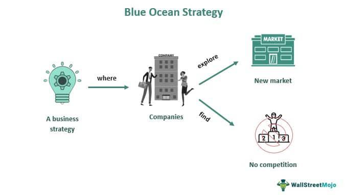

The financial markets are essential components of the global economy, serving as the main channels through which capital flows, investment opportunities arise, and wealth is generated. These markets encompass a wide range of platforms where diverse assets, including stocks, bonds, currencies, and derivatives, are traded. Understanding the mechanisms that create and drive these markets is imperative for traders of all levels, as these elements directly impact trading strategies, market efficiency, and potential profitability.

Today's financial landscape is heavily influenced by technological advancements. One of the most significant changes in recent years has been the advent of algorithmic trading. This approach involves using complex computer algorithms to execute trades at speeds and efficiencies unattainable by manual trading methods. Algorithmic trading capitalizes on vast quantities of market data and real-time analytical capabilities, reshaping the way markets operate and the roles participants play within them.



This article will examine how market creation and various economic mechanisms underlie the efficient functioning of financial markets. It will also explore how the introduction of algorithmic trading has altered market dynamics, improved liquidity, and contributed to more precise price discovery processes. By understanding these elements, traders can better navigate the complexities of modern financial markets, enhancing their capability to profit within this rapidly evolving sector.

## Table of Contents

## Understanding Financial Markets

Financial markets serve as essential platforms where buyers and sellers interact to trade a wide variety of financial instruments, including stocks, bonds, currencies, and derivatives. They are integral to the global economic framework as they facilitate the mobilization of capital, enabling businesses to raise funds necessary for expansion and innovation, and providing investors with opportunities to earn returns on their investments.

Markets are typically categorized based on the types of instruments traded. Equity markets focus on the trading of stocks, where ownership shares in companies are exchanged. Forex markets, or foreign exchange markets, involve the trading of currencies and are crucial for international trade and investment. Other markets, such as bond markets and derivatives markets, specialize in the trading of debt securities and complex financial instruments that derive their value from underlying assets, indices, or interest rates.

A fundamental aspect of market creation is the establishment of mechanisms for price discovery and liquidity. Price discovery is the process through which market prices are determined based on supply and demand dynamics. It involves the aggregation of information about a particular asset, analyzing factors such as economic indicators, market sentiments, and company performance, to reflect the asset's fair market value. Liquidity refers to the ease with which assets can be bought or sold in the market without causing significant price changes. High liquidity is typically associated with lower trading costs and increased confidence among market participants.

One of the key roles of financial markets is to optimize the allocation of resources, thereby contributing to economic growth. Well-functioning markets ensure that capital is directed towards the most productive uses. They achieve this through efficient allocation mechanisms that distribute resources based on the relative risk and potential returns of different investment opportunities. When markets operate efficiently, they enhance the capacity for economic expansion by supporting innovation, improving productivity, and creating jobs.

To illustrate the efficiency of price discovery and [liquidity](/wiki/liquidity-risk-premium) in markets, we can consider an example using Python to analyze stock prices:

```python
import yfinance as yf  # For more datasets, visit: https://paperswithbacktest.com/datasets
import matplotlib.pyplot as plt

# Download historical market data for a stock
stock_data = yf.download('AAPL', start='2020-01-01', end='2023-01-01')

# Plot the historical closing prices
plt.figure(figsize=(10, 6))
plt.plot(stock_data['Close'], label='AAPL Closing Prices')
plt.title('AAPL Stock Price (2020-2023)')
plt.xlabel('Date')
plt.ylabel('Price (USD)')
plt.legend()
plt.grid(True)
plt.show()
```

In this Python example, we download historical market data for Apple's stock (AAPL) and plot the closing prices over a specified period. This visual representation of data is an example of how traders and investors utilize historical price movements to inform their trading strategies and decision-making processes, highlighting the importance of price discovery in financial markets.

By ensuring efficient price discovery and liquidity, financial markets enable the optimal allocation of resources, thereby driving economic growth and stability.

## The Role of Market Makers

Market makers play a critical role in the financial markets by ensuring liquidity and stability, which are essential for efficient market operation. Their main function is to be ready to buy and sell securities, thus facilitating smooth and prompt execution of trades. This role is particularly crucial in financial markets where delays in transactions can lead to inefficiencies and increased risks.

Market makers operate by constantly quoting bid (buy) and ask (sell) prices for securities. The difference between these two prices is known as the "spread," which represents the market maker's potential profit. This spread compensates market makers for the risks they assume, which include price shifts and holding large inventories of particular securities. For instance, if a market maker quotes a bid price of $100 and an ask price of $102 for a stock, the spread is $2, which translates into profit when the stock is bought at the ask price and sold at the bid price.

One of the significant benefits of market makers is the mitigation of the risk of illiquid markets, where there are insufficient buyers or sellers to execute trades readily. Illiquidity can lead to higher [volatility](/wiki/volatility-trading-strategies) and transaction costs, which disadvantage both small and large investors. By providing a constant presence in the market, market makers help ensure that investors can enter or [exit](/wiki/exit-strategy) positions without substantial price movements.

The presence of market makers is particularly vital in times of market stress or extreme price movements. During such periods, natural liquidity providers, such as retail or institutional investors, might refrain from participating in the market due to heightened risks. Market makers fill this gap, ensuring that trading can continue and helping to stabilize prices.

In addition to trading profits, market makers benefit from taking on an inventory of securities and benefiting from the buy/sell spread. However, this also exposes them to significant risks, such as market fluctuations. To manage these risks, market makers implement sophisticated risk management strategies, using derivatives or other financial instruments to hedge against unfavorable price changes.

In summary, market makers are indispensable participants in financial markets, providing essential functions that enhance market fluidity, reduce transaction costs, and stabilize asset prices. Their role supports small and large investors by ensuring continuous market access and helping maintain orderly market conduct.

## Economic Mechanisms in Market Creation

Economic mechanisms in market creation comprise crucial elements such as supply and demand dynamics, regulatory frameworks, and technological advancements. Each plays a significant role in shaping the financial markets and optimizing their function.

Supply and demand are fundamental economic principles that influence liquidity and price discovery. In financial markets, demand refers to the quantity of an asset buyers are willing to purchase at various price levels, while supply is the quantity sellers are willing to offer. The interaction of supply and demand determines the market equilibrium price and affects the asset's liquidity. High liquidity in a market indicates that assets can be quickly bought or sold with minimal impact on their price. This liquidity is crucial for the efficiency of financial markets as it facilitates smoother transactions and enhances market stability. The mathematical representation of market equilibrium occurs where the demand function $Q_d = f(P)$ intersects with the supply function $Q_s = g(P)$, resulting in an equilibrium price $P_e$.

Regulatory frameworks are established by governing bodies to oversee the creation and execution of financial markets, ensuring that they operate with fairness and transparency. Regulations are essential for maintaining investor confidence, preventing market manipulation, and safeguarding against systemic risks. These governing bodies, such as the Securities and Exchange Commission (SEC) in the United States, implement rules and standards to protect market integrity and foster an environment conducive to economic growth.

Technological advancements have substantially transformed market operations, particularly with innovations in digital and automated trading systems. Technologies such as blockchain, high-frequency trading, and [algorithmic trading](/wiki/algorithmic-trading) have introduced efficiency and speed to market transactions. These innovations allow for the processing of vast amounts of data to identify optimal trading strategies, thereby improving price discovery mechanisms. For instance, algorithmic trading programs use complex algorithms to make split-second trading decisions, optimizing execution beyond human capability. This rapid analysis and execution can reduce bid-ask spreads, enhance liquidity, and minimize transaction costs, ultimately leading to more efficient markets.

Together, these economic mechanisms — supply and demand, regulatory oversight, and technological progress — ensure that financial markets are capable of supporting economic growth and adapting to new challenges and opportunities presented by a constantly evolving global economy.

## Algorithmic Trading and Its Impact

Algorithmic trading, often referred to as algo trading, employs sophisticated computer algorithms to execute market trades with speed and precision beyond the capabilities of human traders. These algorithms analyze vast amounts of financial market data to identify trading opportunities and perform transactions at speeds that are fractions of a second. This rapid processing power allows traders to capitalize on even fleeting disparities in market prices, thus enhancing their ability to generate profits.

One of the primary benefits of algorithmic trading is improved liquidity in financial markets. Liquidity refers to the ease with which an asset can be bought or sold without causing a significant impact on its price. By executing trades swiftly and efficiently, algorithmic trading ensures that there is a continuous flow of buy and sell orders in the market, thereby reducing the bid-ask spread. This compression of the spread contributes not only to improved market liquidity but also to enhanced price discovery, as it allows for more accurate reflection of an asset's true market value.

Moreover, algorithmic trading can contribute to reduced volatility. By executing trades based on predefined criteria and models, there is a more structured flow of transactions entering the market, which can help stabilize price movements. This characteristic is particularly beneficial during periods of market stress, when maintaining stability becomes crucial. 

However, the introduction of algorithmic trading into financial markets also presents substantial challenges. One major issue is risk management. The rapid and automatic nature of these trades can lead to considerable losses in a very short time if market conditions change unexpectedly. Additionally, the magnitude and velocity of trades can exacerbate market movements if not properly controlled.

The regulatory challenges associated with algorithmic trading are another significant consideration. With the market largely underpinned by automated algorithms, ensuring compliance with prevailing financial regulations becomes complex. Regulatory bodies face the task of keeping pace with technological advancements to prevent market manipulation and ensure fair trading practices.

In summary, while algorithmic trading offers notable advantages in terms of liquidity, price discovery, and volatility management, it is not without its challenges. Risk management and adherence to regulatory standards are critical to harnessing its full potential while safeguarding the stability of financial markets.

## Benefits and Challenges of Using Market-Making Algorithms

Market-making algorithms have become indispensable tools in modern financial markets, significantly contributing to market efficiency and liquidity. By continuously providing bid and ask quotes, these algorithms facilitate smoother trading processes and ensure that liquidity is consistently available, even in volatile market conditions. This continuous provision of liquidity is crucial because it helps narrow the bid-ask spread, thereby minimizing transaction costs for traders. Lower transaction costs can enhance profitability for traders by reducing the overhead associated with large order executions. 

Furthermore, market-making algorithms are designed to execute trades swiftly. The speed at which these algorithms operate is fundamental to their effectiveness, as it not only aids in the rapid movement of large volumes of orders but also supports price discovery by ensuring market prices reflect the latest available information. Swift execution mitigates the impact of price slippage and helps in maintaining orderly market conditions, which is beneficial to both institutional and retail investors.

Despite their advantages, market-making algorithms also present several challenges. Managing the risks associated with high-speed trading is one of the primary concerns. The rapid nature of algorithmic trading can lead to significant financial risks if systems are not robustly designed or if there are faults in the algorithms. A malfunction or unforeseen market condition can result in substantial losses in fractions of a second. 

Compliance with financial regulations poses additional challenges. As financial markets evolve, so do the regulatory frameworks governing them. Market-making algorithms must be regularly updated to ensure compliance with current regulations, which vary across jurisdictions. This requires substantial resources and expertise, as non-compliance can result in significant penalties or trading bans.

The development of AI-enhanced algorithms has ushered in new opportunities and competitive dynamics in algorithmic trading. These advanced algorithms leverage [machine learning](/wiki/machine-learning) techniques to make more informed decisions, often improving on traditional model-based approaches. AI-enhanced algorithms can adapt to changing market conditions more effectively by learning from historical data patterns. This adaptability offers the potential for superior market performance and efficiency.

As the trading landscape evolves, firms that effectively integrate AI into their market-making strategies may gain a competitive edge by anticipating market movements more accurately and optimizing trade executions. However, the competitive advantage gained from AI also raises ethical and regulatory considerations, particularly around accountability and transparency, as algorithmic decision-making becomes more autonomous.

In conclusion, while market-making algorithms undeniably enhance market operations by improving liquidity and reducing costs, they require diligent oversight and robust risk management practices. The continuous advancement of AI and machine learning in these algorithms holds promise for furthering market efficiencies but also necessitates cautious navigation of the accompanying challenges and regulatory requirements.

## Future Trends and Implications

The future trajectory of financial markets is deeply intertwined with the evolution of technology, especially in areas like [artificial intelligence](/wiki/ai-artificial-intelligence) (AI) and machine learning. These technologies are poised to redefine the landscape of trading, enhancing the capability and reach of market-making algorithms. As these algorithms advance, they are anticipated to expand their application across various asset classes, such as cryptocurrencies and bonds. This diversification allows for the optimization of transaction execution and liquidity provision across the financial spectrum, offering potential for increased market participation and efficiency.

The adoption of fully automated trading systems presents significant implications for employment within the finance sector. Traditional roles are expected to evolve, requiring professionals to develop new skills and adapt to a technology-driven environment. This shift necessitates a re-evaluation of job functions, encouraging workforce upskilling and continual learning to remain relevant in this rapidly changing ecosystem.

Moreover, the increased reliance on technology in financial markets demands a proactive approach from regulatory bodies and market participants to ensure stability and security. Striking a balance between fostering innovation and maintaining robust systemic oversight is crucial. Regulators must evolve their frameworks to accommodate new technologies, ensuring they do not compromise the integrity or security of the markets. Collaboration between tech developers, financial institutions, and regulators is essential to harness innovation responsibly, promoting the sustainable growth of global financial systems while safeguarding against potential disruptions.

## Conclusion

Financial markets are intricate structures built on the foundation of market creation and economic mechanisms, requiring a balance between innovation and regulation to operate effectively. Technological advancements, prominently algorithmic trading, have become essential in maintaining market efficiency and liquidity. These technologies leverage sophisticated algorithms to enhance trading speed and accuracy, contributing significantly to the evolution of financial markets.

Despite the challenges presented by these advancements, such as the complexities of risk management and increased regulatory scrutiny, their benefits are substantial. Algorithmic trading offers enhanced market access and performance, leading to tighter spreads, improved liquidity, and robust price discovery. This evolution enables more participants to engage in markets efficiently, trimming down transaction costs and ensuring the swift execution of trades.

To fully capitalize on these technological innovations, stakeholders must remain adaptable to the rapidly changing financial landscape. This flexibility involves understanding and integrating new technologies and aligning them with regulatory requirements to maintain market integrity and stability. By doing so, market participants can effectively harness the opportunities presented by these advancements, ensuring that financial markets continue to operate efficiently while accommodating future growth and novel asset classes.

## References & Further Reading

[1]: Cartea, Á., Jaimungal, S., & Penalva, J. (2015). ["Algorithmic and High-Frequency Trading."](https://assets.cambridge.org/97811070/91146/frontmatter/9781107091146_frontmatter.pdf) Cambridge University Press.

[2]: Aldridge, I. (2013). ["High-Frequency Trading: A Practical Guide to Algorithmic Strategies and Trading Systems."](https://www.amazon.com/High-Frequency-Trading-Practical-Algorithmic-Strategies/dp/1118343506) Wiley.

[3]: Kissell, R. (2013). ["The Science of Algorithmic Trading and Portfolio Management."](https://www.sciencedirect.com/book/9780124016897/the-science-of-algorithmic-trading-and-portfolio-management) Academic Press.

[4]: Gsell, M. (2010). ["Algorithmic Trading Strategies."](https://www.semanticscholar.org/paper/Assessing-the-Impact-of-Algorithmic-Trading-on-A-Gsell/820fa261b451f5b57decf4f8ccf526247fcbc2ff) Zeitschrift für Betriebswirtschaftlicher Forschung, 62(1), 32-38.

[5]: Treleaven, P., Galas, M., & Lalchand, V. (2013). ["Algorithmic Trading Review."](https://dl.acm.org/doi/10.1145/2500117) Communications of the ACM, 56(11), 76-85.

[6]: Lopez de Prado, M. (2018). ["Advances in Financial Machine Learning."](https://www.amazon.com/Advances-Financial-Machine-Learning-Marcos/dp/1119482089) Wiley.

[7]: Narang, R. (2013). ["Inside the Black Box: The Simple Truth About Quantitative Trading."](https://onlinelibrary.wiley.com/doi/book/10.1002/9781118267738) Wiley.