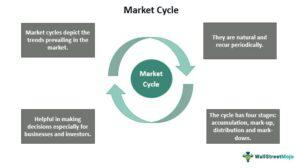

## Table of Contents

## What are market cycles and why are they important?

Market cycles are patterns that happen in the economy over time. They go up and down, like a roller coaster. Sometimes the economy grows and people feel good about buying things. Other times, the economy slows down and people are more careful with their money. These cycles can last for months or even years. Understanding market cycles can help people and businesses make better decisions about when to buy, sell, or invest.

Knowing about market cycles is important because it helps us prepare for changes. When we know that the economy might slow down, we can save more money or avoid big purchases. On the other hand, when the economy is growing, it might be a good time to invest or start a new business. By understanding these cycles, we can make smarter choices and be less surprised by economic changes. This can lead to more stable finances and better planning for the future.

## How do market cycles affect investment decisions?

Market cycles can really change how people decide to invest their money. When the economy is doing well and growing, people often feel more confident. They might choose to invest in stocks or start new businesses because they think the value of their investments will go up. This is a good time to take some risks because the market is generally moving upwards.

On the other hand, when the economy is slowing down or in a recession, people tend to be more careful. They might move their money into safer investments like bonds or savings accounts. This is because they want to protect their money from losing value. Knowing where we are in the market cycle can help investors decide when to buy, sell, or hold onto their investments, making their decisions smarter and more informed.

## What are the main phases of a typical market cycle?

A typical market cycle has four main phases: expansion, peak, contraction, and trough. During the expansion phase, the economy is growing. Businesses are doing well, people are buying more things, and jobs are easy to find. This is a time when stock prices usually go up, and people feel good about investing. The peak is when the growth slows down and the economy reaches its highest point. It's like the top of a hill; things can't keep going up forever, so they start to level off.

After the peak comes the contraction phase. This is when the economy starts to shrink. Businesses might struggle, people might buy less, and jobs can become harder to find. Stock prices often go down during this time, and people might feel less confident about investing. The trough is the bottom of the cycle, where the economy hits its lowest point. Things can't get much worse, and this is usually when the cycle starts to turn around and head back into expansion. Understanding these phases can help people make better choices about when to invest or save their money.

## Can you explain the difference between bull and bear markets?

A bull market is when the economy is doing well and stock prices are going up. People feel good about investing because they think their money will grow. It's like when a bull charges forward with its horns up, pushing everything ahead. During a bull market, people are more likely to buy stocks and take risks because they believe the market will keep going up.

A bear market is the opposite. It's when the economy is struggling and stock prices are going down. People might feel worried about their investments losing value. It's like when a bear swipes down with its paws, pulling everything down with it. In a bear market, people might sell their stocks and be more cautious with their money because they think the market will keep going down.

## What indicators signal the beginning of a new market cycle?

The beginning of a new market cycle can often be spotted by looking at certain signs. One big sign is when the economy starts to grow again after being slow for a while. This can be seen in things like more jobs being created, businesses doing better, and people spending more money. Another sign is when stock prices start to go up after being down for a while. When investors start feeling more confident and start buying stocks again, it can mean the start of a new cycle.

Interest rates can also tell us something about the start of a new market cycle. When the central bank lowers interest rates, it can make borrowing money cheaper, which can help the economy grow. This often happens when the economy is coming out of a tough time. Also, if you see businesses starting to invest in new projects or expanding, that can be another hint that a new market cycle is beginning. By keeping an eye on these signs, people can get a sense of when things might be turning around.

## How long do market cycles typically last?

Market cycles can last different amounts of time, but they usually go on for a few years. One full cycle, from the start of growth to the end of a slowdown, can take anywhere from two to ten years. It depends a lot on what's happening in the world and the economy.

Sometimes, a market cycle might be shorter if something big happens, like a new technology or a big change in government rules. Other times, it might be longer if the economy is having a hard time getting back on its feet after a big drop. Knowing how long cycles usually last can help people plan better and not be surprised by changes in the economy.

## What are the psychological factors influencing market cycles?

People's feelings play a big part in market cycles. When people feel good and confident about the economy, they are more likely to spend money and invest in stocks. This feeling of hope and optimism can make the economy grow even more, pushing it into the expansion phase of the market cycle. But if everyone starts feeling this way at the same time, it can lead to a bubble where prices get too high because everyone thinks they will keep going up forever.

On the other hand, when people start to feel worried or scared about the economy, they might stop spending and start selling their investments. This fear can make the economy slow down and go into the contraction phase. If everyone feels this way at the same time, it can lead to a crash where prices drop a lot because everyone is trying to get out at once. These feelings of hope and fear can make market cycles even stronger and can cause big swings in the economy.

## How do economic policies impact the duration and intensity of market cycles?

Economic policies can really change how long market cycles last and how strong they are. When the government or central bank makes rules about money, like setting interest rates or spending a lot on things like roads and schools, it can help the economy grow faster or slow down. If they lower interest rates, it's cheaper for people and businesses to borrow money. This can make the economy grow more and make the good times in the market cycle last longer. But if they raise interest rates to stop the economy from growing too fast, it can make the economy slow down and make the bad times last longer.

Also, the government can spend a lot of money to help the economy when it's not doing well. This can make the bad times in the market cycle shorter and less bad. But if they spend too much, it might make the economy grow too fast and create a bubble that could burst later. So, economic policies are like tools that can help smooth out the ups and downs of market cycles, but they need to be used carefully to keep things balanced.

## What are some advanced tools or models used to predict market cycles?

People use a lot of fancy tools and models to try to guess what the market will do next. One popular tool is called technical analysis. This is when people look at past prices and trading volumes to spot patterns that might tell them if the market will go up or down. Another tool is called econometric models. These use math and [statistics](/wiki/bayesian-statistics) to look at things like jobs, spending, and interest rates to predict how the economy will change. There are also computer programs that use something called [machine learning](/wiki/machine-learning). These programs can look at tons of data really fast and find patterns that humans might miss.

Another way to predict market cycles is by using something called sentiment analysis. This tool looks at what people are saying on social media, in the news, and in reports to see if people feel good or bad about the economy. If a lot of people are feeling hopeful, it might mean the market will go up. If they're feeling worried, it might mean the market will go down. All these tools help people make better guesses about where the market is heading, but they're not perfect. The economy can be hard to predict, and sometimes things happen that no one saw coming.

## How do global events influence market cycles?

Global events can shake up market cycles a lot. When something big happens around the world, like a war, a big health crisis, or a natural disaster, it can make people feel worried about the economy. This worry can make people stop spending money and start selling their investments, which can push the economy into a downturn. For example, when there was a big health crisis like the COVID-19 pandemic, it made a lot of businesses close and people lose their jobs, which made the economy slow down a lot.

But global events can also help the economy grow. If a country finds a lot of oil or a new technology comes out, it can make people feel good about the future and start spending more money. This can help the economy grow and push it into an expansion phase. For instance, when new technology like the internet or smartphones came out, it made a lot of new businesses start up and people buy more things, which helped the economy grow. So, global events can make market cycles go up and down in big ways.

## What are the different types of market cycles and their characteristics?

Market cycles come in different types, but the main ones are business cycles and stock market cycles. Business cycles are about the ups and downs of the whole economy. They have four phases: expansion, when the economy is growing and people are buying more; peak, when growth slows down; contraction, when the economy starts to shrink; and trough, when things hit the bottom before starting to grow again. These cycles can last from a few years to over a decade and are influenced by things like jobs, spending, and government policies.

Stock market cycles focus on the ups and downs of stock prices. They also have four phases: accumulation, when smart investors start buying stocks quietly; markup, when more people start buying and prices go up fast; distribution, when people start selling and prices level off; and markdown, when everyone is selling and prices drop a lot. These cycles can be shorter than business cycles, often lasting from months to a few years. They are affected by things like how people feel about the economy, big news, and what's happening in the world.

Both types of cycles are important because they help people understand what might happen next in the economy or the stock market. By watching these cycles, people can make better choices about when to spend, save, or invest their money. Knowing where we are in a cycle can help us be ready for changes and make our financial plans smarter.

## How can investors strategically position themselves at different stages of a market cycle?

During the expansion phase of a market cycle, when the economy is growing and people are feeling good, investors should think about buying stocks. This is a time when stock prices are usually going up, so it can be a good time to take some risks and invest in companies that might grow a lot. Investors might also want to put some money into things like real estate or new businesses, because these can do well when the economy is strong. It's important to keep an eye on things, though, because the expansion won't last forever.

When the economy hits the peak and starts to slow down, investors should be more careful. This is a good time to start selling some stocks and moving money into safer investments like bonds or savings accounts. Bonds can give you steady income and help protect your money if the market starts to go down. As the economy moves into the contraction phase and things get tougher, it's smart to have a lot of your money in safe places. But don't forget, even in tough times, there can be good deals on stocks that might do well when the economy starts to grow again. When the market hits the trough and things start to look up, it might be time to start buying stocks again, getting ready for the next expansion.

## References & Further Reading

[1]: ["Business Cycles, Indicators, and Forecasting"](https://www.nber.org/system/files/chapters/c10371/c10371.pdf) by James H. Stock and Mark W. Watson

[2]: Hull, J. (2006). ["Options, Futures and Other Derivatives"](https://drive.google.com/file/d/0B156xe8jOD8kOXJhWWpEeU9aY2M/view?usp=drive_web&resourcekey=0-vUbkwTB86kemjpdRPeu_kw). Pearson.

[3]: Lo, A. W., & MacKinlay, A. C. (1999). ["A Non-Random Walk Down Wall Street"](https://www.jstor.org/stable/j.ctt7tccx). Princeton University Press.

[4]: ["Trading and Exchanges: Market Microstructure for Practitioners"](https://www.amazon.com/Trading-Exchanges-Market-Microstructure-Practitioners/dp/0195144708) by Larry Harris

[5]: ["The Econometrics of Financial Markets"](https://www.jstor.org/stable/j.ctt7skm5) by John Y. Campbell, Andrew W. Lo, and A. Craig MacKinlay