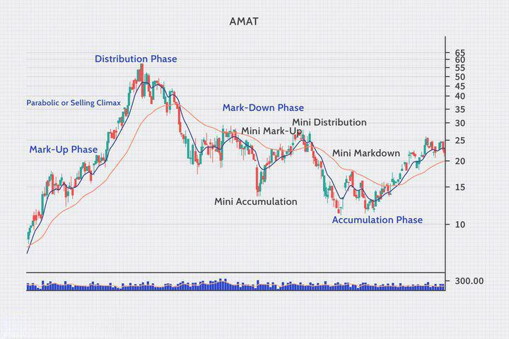

Financial markets exhibit complex behaviors influenced by various factors, including market cycles, which significantly impact investment returns. These cycles often dictate the ebb and flow of asset prices, guiding investor sentiment and strategy. Within this dynamic environment, algorithmic trading, or algo trading, offers a systematic approach to managing investments. By leveraging technology, algo trading optimizes how investments are executed and adjusted in response to changing market conditions.

Understanding market cycles is crucial as they consist of distinct phases, each presenting specific opportunities and challenges. Recognizing these phases helps investors tailor their strategies, potentially enhancing returns. Algorithmic trading, with its ability to process vast amounts of data and execute trades with precision, can further influence investment outcomes within these cycles. It allows for responsiveness to cyclical patterns that might be difficult to capitalize on through traditional trading methods.



In this article, we will examine how awareness of market cycles can lead to more informed investment decisions and how algorithmic trading can play a pivotal role in maximizing investment returns. This exploration is vital for investors seeking to optimize their strategies in an increasingly automated and fast-paced financial world.

## Table of Contents

## Understanding Financial Market Cycles

Financial markets are known to exhibit cyclical behavior that can be consistently observed through four distinct phases: accumulation, markup, distribution, and markdown. Recognizing and understanding these cycles is essential for investors, as they provide insights into market behavior and the formulation of effective investment strategies tailored to each phase.

### Accumulation Phase

The accumulation phase occurs at the bottom of the market cycle, following a downturn when the market sentiment is generally pessimistic. During this phase, informed investors begin purchasing assets at discounted prices. The accumulation phase is characterized by low volatility and stable prices, where market participants with long-term outlooks, such as institutional investors or well-informed individual investors, start buying assets anticipating a recovery. Identifying this phase can provide investors with opportunities to build positions in undervalued securities before the market transitions to the next phase.

### Markup Phase

The markup phase follows accumulation and is marked by increasing prices and rising market sentiment. During this phase, more investors notice the emerging upward trend, leading to increased buying activity and higher asset prices. Volume typically increases as bullish sentiment becomes widespread. In the markup phase, [growth stocks](/wiki/growth-stocks) and assets with high beta often outperform, as investors become more risk-tolerant seeking higher returns. Strategically, investors may increase their exposure to equities and riskier asset classes to take advantage of the general uptrend in the markets.

### Distribution Phase

During the distribution phase, the bullish market sentiment begins to wane, and the market becomes more volatile. Here, assets are distributed from confident investors and institutions to less informed or less sophisticated investors. Volume remains high, but the market shows signs of instability as buying pressure is met with increasing selling pressure. Investors aiming to protect their gains may start taking profits and reducing their risk exposure. Recognizing signs of an impending transition to a markdown phase can be crucial, allowing investors to adjust their portfolios to minimize potential losses.

### Markdown Phase

The markdown phase signals the onset of a downturn, where market prices steadily decline as pessimism prevails. During this phase, investors seek to [exit](/wiki/exit-strategy) their positions, leading to increased selling pressure and further declines in asset values. Defensive assets like bonds and safe-haven currencies may become attractive as investors prioritize capital preservation over growth. Tactical strategies, such as short selling or moving to cash, may also be employed to protect against losses. Recognizing the distinctive features of the markdown phase can help investors mitigate their exposure to adverse market movements until the cycle moves back into accumulation.

In summary, understanding financial market cycles involves identifying these four phases and leveraging this knowledge to refine investment strategies. Investors who can accurately differentiate between these phases stand to gain by optimizing their asset allocation, managing risk more effectively, and potentially increasing their returns in varying market conditions.

## The Impact of Market Cycles on Investment Returns

Financial market cycles significantly influence investment returns, with each phase offering distinctive characteristics that affect how various asset classes perform. Understanding and recognizing these cycles enable investors to tailor their strategies to enhance potential returns. 

The market cycle typically comprises four phases: accumulation, markup, distribution, and markdown. Each phase exerts different pressures on asset prices and trends, creating varying environments in which certain asset classes can excel.

### Accumulation Phase

The accumulation phase occurs after a market downturn. Asset prices are relatively low, and investor sentiment is generally pessimistic. Savvy investors start to enter the market, anticipating a recovery. During this phase, fixed income and high-dividend-yielding stocks might appear attractive due to their perceived safety and income generation potential.

### Markup Phase

The next phase is the markup phase, characterized by rising asset prices and increasing investor optimism. This period often sees a significant influx of new participants as the market gains [momentum](/wiki/momentum). Growth stocks and commodities often outperform in this phase, as economic indicators begin to improve and investors become more willing to take on risk.

### Distribution Phase

As the market reaches a peak, it enters the distribution phase. Here, prices have risen substantially, and valuations might begin to appear stretched. Investors often begin to sell and realize profits, which could lead to increased [volatility](/wiki/volatility-trading-strategies). In this environment, more defensive assets, such as bonds and utility stocks, may offer better performance as they provide stability and continue generating income.

### Markdown Phase

Finally, the markdown phase sees declining asset prices and a potential market slump. Investor sentiment turns negative, and risk-aversion prevails. During this phase, cash positions and defensive sectors become favored, minimizing losses as the market declines.

Investors who strategically adjust their portfolios in response to these phases can optimize returns by tilting their asset allocation towards those classes that are likely to perform best. For instance, increasing allocation to equities during the markup phase and shifting towards bonds during the markdown phase can enhance performance.

In conclusion, awareness and understanding of market cycles allow investors to navigate volatile periods and maximize returns effectively. Adjusting strategies to align with the prevailing cycle phase is key to optimizing investment performance over time.

## Algorithmic Trading: An Overview

Algorithmic trading, often referred to as algo trading, is a method of executing trades in financial markets using advanced algorithms and programming to automate the trading process. The primary objective of [algorithmic trading](/wiki/algorithmic-trading) is to enhance the speed, precision, and efficiency of trading operations, allowing traders to capitalize on market opportunities that may arise during different phases of market cycles.

### Basics of Algorithmic Trading

At its core, algorithmic trading relies on predefined sets of rules and mathematical models to generate trading signals and execute orders. These algorithms are typically programmed to analyze vast amounts of market data, such as price quotes, volumes, and other relevant financial indicators, to identify potential trading opportunities. The speed at which these algorithms can process data and execute trades is a significant advantage over traditional manual trading, where human emotions and slower reaction times can adversely impact decision-making.

The basic structure of an algorithmic trading system involves several key components:

1. **Data Acquisition**: Collecting real-time market data feeds, including price, volume, and historical data, to inform trading decisions.

2. **Signal Generation**: Using statistical models, technical indicators, or machine learning algorithms to identify trading signals that suggest buying or selling a particular asset.

3. **Risk Management**: Implementing strategies to manage potential losses, ensuring that trades align with predetermined risk parameters. This may include setting stop-loss levels and position size limits.

4. **Execution**: Automatically sending trade orders to the market based on the generated signals, taking into account factors like order size, market impact, and latency.

5. **Performance Evaluation**: Continuously assessing the performance of the algorithm and making adjustments to improve its efficiency and profitability.

### Advantages Over Traditional Trading Methods

Algorithmic trading offers several advantages over traditional trading approaches:

- **Speed**: Algorithms can execute orders at higher speeds and frequencies than a human trader, capturing short-lived opportunities that may not be visible to the human eye. 

- **Precision**: Algo trading minimizes human error, ensuring trades are executed at the exact parameters specified by the algorithm without deviation.

- **Backtesting**: Algorithms can be tested against historical data to evaluate their effectiveness before deploying them in live markets, allowing for optimization and refinement.

- **Emotional Detachment**: By removing emotional biases from trading decisions, algorithms adhere strictly to their programmed rules, potentially reducing the impact of psychological factors such as fear and greed.

- **Scale**: Algorithms can process and analyze data from multiple markets or assets simultaneously, enabling traders to diversify and manage larger portfolios more efficiently.

Python is a popular programming language in the field of algorithmic trading due to its simplicity, versatility, and the availability of numerous financial libraries such as NumPy, pandas, and TA-Lib for data manipulation and technical analysis. Here's a simple Python snippet illustrating how a moving average crossover strategy might be implemented:

```python
import numpy as np
import pandas as pd

# Sample historical data
data = pd.DataFrame({
    'price': [100, 102, 104, 102, 100, 98, 96, 94, 96, 98, 100, 102]
})

# Calculate two simple moving averages
data['SMA_short'] = data['price'].rolling(window=2).mean()
data['SMA_long'] = data['price'].rolling(window=5).mean()

# Generate signals
data['signal'] = np.where(data['SMA_short'] > data['SMA_long'], 1, 0)

# Shift signals to avoid lookahead bias
data['positions'] = data['signal'].diff()

print(data)
```

This code calculates short-term and long-term simple moving averages and generates buy or sell signals based on their crossover. It illustrates how algorithms can be developed to systematically identify and act upon trading signals in financial markets.

Algorithmic trading has transformed the landscape of financial markets, offering a range of tools and techniques that enhance the speed and efficiency of trading. As market environments continue to evolve, the sophistication of algorithmic strategies is likely to advance, further solidifying their role in modern trading practices.

## Algorithmic Trading and Market Cycles

Algorithmic trading systems are designed to efficiently interpret and respond to the varying phases of financial market cycles, which are typically categorized as accumulation, markup, distribution, and markdown. By integrating specific trading strategies such as [trend following](/wiki/trend-following) or mean reversion, these systems can dynamically adjust to leverage opportunities inherent in each phase.

### Trend Following Strategy

Trend following is a strategy where algorithms detect and capitalize on emerging market trends. In the markup phase of a market cycle, characterized by increasing asset prices, trend-following algorithms identify upward price movements and generate buy signals. Conversely, during the markdown phase, these algorithms signal sales as the trend reverses to a downward direction. A common tool used in this strategy is the moving average crossover, where a short-term moving average crosses above or below a long-term moving average to signify a market trend change. Below is a basic example of a trend-following algorithm using the moving average crossover in Python:

```python
import pandas as pd

def trend_following(prices, short_window, long_window):
    signals = pd.DataFrame(index=prices.index)
    signals['price'] = prices
    signals['short_mavg'] = prices.rolling(window=short_window, min_periods=1, center=False).mean()
    signals['long_mavg'] = prices.rolling(window=long_window, min_periods=1, center=False).mean()
    signals['signal'] = 0.0  
    signals['signal'][short_window:] = np.where(signals['short_mavg'][short_window:] > signals['long_mavg'][short_window:], 1.0, 0.0)
    signals['positions'] = signals['signal'].diff()
    return signals

# Example usage
# prices = pd.Series([...])
# signals = trend_following(prices, short_window=40, long_window=100)
```

### Mean Reversion Strategy

Mean reversion strategies assume that asset prices will return to their historical means over time. During the distribution and accumulation phases, where prices often plateau or stabilize, mean reversion algorithms search for price divergences from established averages or moving averages, predicting a reversion back to the average. This approach usually involves setting thresholds for entry and exit signals around a mean value. An example of a basic mean reversion algorithm is shown below:

```python
import numpy as np

def mean_reversion(prices, window, z_score_threshold):
    signals = pd.DataFrame(index=prices.index)
    signals['price'] = prices
    signals['moving_avg'] = prices.rolling(window=window).mean()
    signals['std_dev'] = prices.rolling(window=window).std()
    signals['z_score'] = (prices - signals['moving_avg']) / signals['std_dev']
    signals['signal'] = np.where(signals['z_score'] > z_score_threshold, -1, np.where(signals['z_score'] < -z_score_threshold, 1, 0))
    signals['positions'] = signals['signal'].diff()
    return signals

# Example usage
# prices = pd.Series([...])
# signals = mean_reversion(prices, window=20, z_score_threshold=2)
```

By aligning these algorithmic strategies with respective cycle phases, traders can potentially achieve higher returns. Trend following tends to excel in trending markets, often seen in markup and markdown phases, while mean reversion capitalizes on the consolidation seen during accumulation and distribution phases. Algorithmic systems, through their ability to process large datasets rapidly and execute trades with precision, offer significant advantages in adapting strategies to the evolving market landscape.

## Maximizing Returns with Algo Trading

Combining an understanding of market cycles with sophisticated algorithmic trading strategies presents a lucrative opportunity for enhancing investment returns. Algorithmic trading, which utilizes mathematical models and computational algorithms, can effectively exploit the repetitive nature of market cycles. 

### Case Studies of Successful Algo Trading Firms

Several algorithmic trading firms have successfully harnessed market cycles to achieve superior returns. Renaissance Technologies, for instance, has been a pioneer in utilizing statistical methods and computational techniques to capture inefficiencies in financial markets. Their Medallion Fund, renowned for its high returns, employs complex algorithms that adapt to various market conditions, highlighting the power of integrating data and market cycle analysis.

Another example is Two Sigma Investments, known for its scientific approach to finance. By leveraging [machine learning](/wiki/machine-learning) and quantitative analysis, Two Sigma develops trading strategies capable of navigating the complexities of different market phases. Their success reflects the firm's ability to adjust strategies dynamically based on prevailing market conditions, underscoring the potential of combining market cycle awareness with algorithmic methods.

### Tips for Investors Incorporating Algo Trading

Investors aiming to incorporate algorithmic trading into their strategies can consider the following approaches:

1. **Data-Driven Insights**: Access to accurate and high-quality data is crucial for developing effective algorithms. Investors should invest in acquiring datasets that provide insights into market cycle indicators, such as moving averages, volume trends, and sentiment analysis.

2. **Backtesting and Simulation**: Before deploying algorithms in live markets, rigorous backtesting on historical data should validate their effectiveness across different market cycles. Simulation techniques, like Monte Carlo methods, can help assess the robustness of strategies under various scenarios.

   ```python
   # Example of a simple backtesting setup in Python
   import pandas as pd
   import numpy as np

   def backtest_strategy(strategy, data):
       profits = []
       for cycle_phase in data['cycle_phase'].unique():
           strategy.apply_phase(cycle_phase)
           profits.append(strategy.execute(data[data['cycle_phase'] == cycle_phase]))
       return np.mean(profits)

   # Assuming `Strategy` is a class with methods `apply_phase` and `execute`
   ```

3. **Dynamic Strategy Adjustment**: Algorithms should be flexible and capable of adjusting to the changing dynamics of market cycles. Implementing machine learning models that adapt and evolve based on new data can enhance the effectiveness of trading strategies.

4. **Risk Management**: A comprehensive risk management framework is critical, especially given the automated nature of algorithmic trading. Techniques such as stop-loss orders and portfolio diversification can help manage exposure and mitigate potential losses.

5. **Continuous Monitoring and Refinement**: Algorithmic systems require constant monitoring to ensure they perform optimally as market conditions evolve. Regular updates and refinements based on performance metrics and market feedback can sustain long-term profitability.

Through these approaches, investors can harness market cycles' cyclical patterns to optimize algorithmic trading strategies, potentially achieving superior returns compared to traditional investment methods. As financial markets continue to evolve, the integration of market cycle theory with algorithmic trading is poised to play an increasingly significant role in investment strategies.

## Challenges and Risks in Algo Trading

Algorithmic trading, while offering numerous advantages, presents various challenges that need to be managed effectively. One of the primary concerns is market volatility, which can disrupt algorithmic strategies and result in suboptimal trading decisions. Volatility is the rate at which the price of a security increases or decreases within a certain period, leading to unpredictable market conditions. Algorithms, while capable of making rapid decisions, might struggle to adapt to sudden market shifts, potentially leading to significant financial losses.

Algorithmic errors are another significant risk. These errors can arise from bugs in the trading software, incorrect data inputs, or unexpected market conditions that the algorithms were not programmed to handle. For example, a coding error could cause an algorithm to buy or sell stocks at the wrong time or at incorrect prices, leading to financial losses. Moreover, since algorithms operate at high speeds, even a small error can result in substantial losses in a very short time.

To mitigate these risks, effective risk management strategies are essential, particularly during the transitional phases of market cycles. One effective risk management technique is the implementation of stop-loss orders, which automatically sell a security when its price falls to a certain level. This approach helps limit losses in volatile markets by capping potential financial exposure.

Diversification of trading strategies can also reduce risk. By deploying multiple algorithms that react differently to market conditions, traders can hedge against losses that any single strategy might incur during unexpected market shifts. For instance, combining trend-following algorithms with mean-reversion strategies can help balance risks, as these strategies typically perform well under different market conditions.

Regular [backtesting](/wiki/backtesting) and stress testing of algorithms are crucial for identifying potential flaws and ensuring robust performance under different market scenarios. Backtesting involves running the algorithm using historical market data to evaluate how it would have performed, while stress testing simulates extreme market conditions to assess the algorithm's resilience.

Proper risk assessment and monitoring frameworks are necessary to continuously analyze and mitigate risks associated with algo trading. Implementing real-time monitoring tools can provide insights into the algorithm's performance, enabling timely adjustments to trading strategies as needed.

In conclusion, while algorithmic trading offers the potential for enhanced returns, it is accompanied by risks that must be managed diligently. By strategically implementing risk management techniques such as diversification, backtesting, and continuous monitoring, traders can safeguard against the inherent risks of algorithmic trading and optimize their trading strategies in varying market conditions.

## Conclusion

Understanding financial market cycles is crucial for optimizing investment returns. Market cycles consist of phases such as accumulation, markup, distribution, and markdown. By identifying these phases, investors can adjust their strategies to maximize returns. When combined with algorithmic trading, which automates trading strategies and enhances decision-making speed, significant advantages can be achieved. 

Algorithmic trading systems, designed to recognize and respond to these cycles, can implement strategies like trend following or mean reversion. For instance, during an accumulation phase, an algorithm might increase holdings of undervalued assets, while in a distribution phase, it could opt to reduce exposures. This adaptability allows for a dynamic response to market changes, mitigating risks and capitalizing on opportunities.

As we look to the future, the integration of market cycle theory with algorithmic trading is expected to become increasingly important. Investors leveraging these technologies and insights can enhance their performance, often outperforming their peers who rely on traditional methods. Thus, mastering both market cycles and algorithmic trading will likely be key for success in the evolving financial landscape.

## References & Further Reading

[1]: Park, C. J., & Irwin, S. H. (2007). ["What Do We Know About the Profitability of Technical Analysis?"](https://onlinelibrary.wiley.com/doi/abs/10.1111/j.1467-6419.2007.00519.x) Journal of Banking & Finance, 31(11).

[2]: Fernandez, P. (2014). "Market Timing and Investment Returns: An Analytical Framework." Available on [SSRN](https://papers.ssrn.com/sol3/Delivery.cfm/3f0a19cc-20bb-44f0-8159-58fc8b8e034d-MECA.pdf?abstractid=5005433&mirid=1).

[3]: Aldridge, I. (2013). ["High-Frequency Trading: A Practical Guide to Algorithmic Strategies and Trading Systems"](https://www.amazon.com/High-Frequency-Trading-Practical-Algorithmic-Strategies/dp/1118343506). Wiley.

[4]: ["Algorithmic Trading: Winning Strategies and Their Rationale"](https://www.wiley.com/en-us/Algorithmic+Trading%3A+Winning+Strategies+and+Their+Rationale-p-9781118746912) by Ernie Chan

[5]: Zakamulin, V. (2010). ["Market Timing with Moving Averages"](https://www.semanticscholar.org/paper/Market-Timing-with-Moving-Averages%3A-Anatomy-and-of-Zakamulin/d2b021a050fb78327ca18d2a9401871d74c0871b). The Journal of Portfolio Management, 36(3).

[6]: Narang, R. K. (2009). ["Inside the Black Box: A Simple Guide to Quantitative and High-Frequency Trading"](https://onlinelibrary.wiley.com/doi/book/10.1002/9781118267738) Wiley.

[7]: Tsay, R. S. (2005). ["Analysis of Financial Time Series"](https://cpb-us-w2.wpmucdn.com/blog.nus.edu.sg/dist/0/6796/files/2017/03/analysis-of-financial-time-series-copy-2ffgm3v.pdf). Wiley-Interscience.

[8]: Hasbrouck, J. (2007). ["Empirical Market Microstructure: The Institutions, Economics, and Econometrics of Securities Trading"](https://academic.oup.com/book/52241). Oxford University Press.