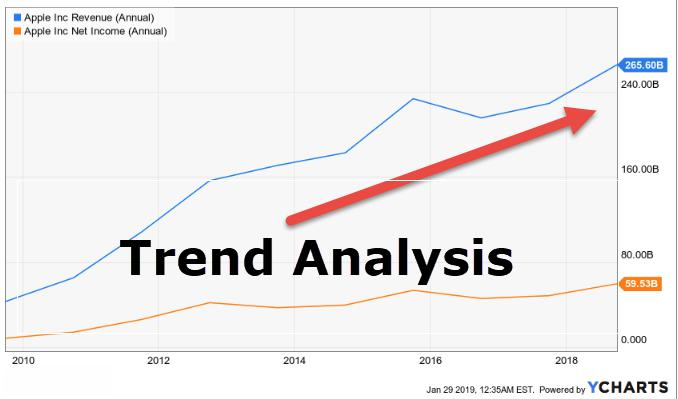

Market data is the lifeblood of financial trading, providing the crucial information traders need to make informed decisions. It encompasses a comprehensive range of data elements, including prices, volumes, and other financial metrics related to various financial instruments such as stocks, bonds, commodities, and derivatives. This data is essential for analyzing market conditions, evaluating trends, and executing trades effectively.

The significance of market data in aiding trading decisions lies in its ability to reflect real-time market activities and provide insights into market dynamics. For example, traders rely on bid and ask prices to assess supply and demand, while historical price data is used to identify patterns and predict future movements. Volume data is another critical component, indicating the quantity of transactions and potentially signaling the strength of a trend or a reversal.

In algorithmic trading, market data plays an integral role by supplying the information necessary for algorithms to execute trades with precision and speed. Algorithms utilize market data to monitor real-time changes, evaluate trading signals, and execute buy or sell orders within milliseconds. This is increasingly important in today's high-frequency trading environments, where the speed and accuracy of data-driven decisions can mean the difference between profit and loss.

Furthermore, market data allows for backtesting, a technique used to simulate trading strategies against historical data to assess their potential effectiveness. By understanding past market behavior, algorithms can be fine-tuned to improve performance and minimize risk. In summary, market data serves as the foundation for making informed trading decisions and supports the sophisticated strategies employed in algorithmic trading, underscoring its critical importance in the financial markets.

## Table of Contents

## Understanding Market Data

Market data is the lifeblood of financial trading, providing the information necessary to make informed decisions about buying and selling financial instruments. The fundamental components of market data include details about the assets themselves, such as equities, derivatives, bonds, currencies, and commodities. Each of these instruments has specific attributes that are captured in market data feeds, enabling traders to analyze and act upon them effectively.

Key identifiers like ticker symbols and exchange codes are integral to market data. Ticker symbols are unique identifiers assigned to publicly traded stocks, enabling traders to quickly reference a specific asset. For example, "AAPL" is the ticker for Apple Inc., recognized across global exchanges. Exchange codes, on the other hand, denote the venue where trading occurs, important for identifying the source and nature of the data. Together, these identifiers ensure precision in financial transactions and enable seamless communication between trading parties and systems.

Market data encompasses various types of information critical for trading strategies. Bid-ask prices, for instance, represent the highest price a buyer is willing to pay (bid) and the lowest price a seller is willing to accept (ask). The bid-ask spread, which is the difference between these prices, provides insights into market [liquidity](/wiki/liquidity-risk-premium) and transaction costs. 

Trade [volume](/wiki/volume-trading-strategy), another crucial data point, indicates the number of shares or contracts traded within a specific period. High trade volumes signal heightened interest and can lead to price [volatility](/wiki/volatility-trading-strategies), while lower volumes might indicate less market activity. Trade times also form a part of market data, offering timestamps for each executed transaction. This temporal data is essential for identifying trends, assessing liquidity at various points in time, and optimizing trading algorithms to align with market dynamics. 

Overall, the accuracy and richness of market data are vital for the success of any trading endeavor. Understanding these components allows traders to make strategic decisions based on real-time market conditions.

## The Role of Market Data in Algorithmic Trading

Market data is at the core of [algorithmic trading](/wiki/algorithmic-trading), acting as both the foundation and fuel for trading algorithms. Real-time market data allows algorithms to react to market events as they occur. Trading strategies often depend on minute-by-minute data to make decisions, ranging from analyzing price movements to assessing market sentiment. The necessity for fast data inputs is especially crucial in environments such as high-frequency trading, where algorithms execute trades within microseconds.

The historical market data provides a basis for developing trading strategies through [backtesting](/wiki/backtesting) and trend analysis. Backtesting involves applying a trading strategy to historical data to evaluate its effectiveness. By doing this, traders can identify potential strengths and weaknesses in the strategy before deploying it in live markets. For instance, a simple moving average crossover strategy can be tested using historical pricing data to determine its profitability over a given time frame. Trend analysis, on the other hand, involves studying long-term price movements to predict future market direction, utilizing historical data to identify consistent patterns.

To put high-frequency trading into perspective, consider the importance of high-speed data. In strategies executed in fractions of a second, any latency can result in missed opportunities or adverse pricing. The data must reach trading systems almost instantaneously, often necessitating high-performance data feeds and sophisticated processing systems. In these cases, firms invest heavily in technology infrastructure to ensure the lowest possible latency, directly influencing the success of these strategies.

In summary, real-time and historical market data jointly drive the efficiency of algorithmic trading. Real-time data equips traders with the latest market conditions, enabling agile decision-making, while historical data supports robust strategy development through backtesting and pattern recognition. The precision and speed of high-frequency trading underscore the critical role of advanced market data solutions in achieving optimal trading outcomes.

## Data Structure and Delivery in Market Data

Market data is integral to trading systems, especially for equities, where the structure and delivery of data can significantly impact trading performance. Typical data message structures for equities are designed to provide comprehensive information that traders use to make informed decisions. Each data message contains essential components such as ticker symbols, bid and ask prices, trade sizes, volume, and timestamps. These elements allow traders to reconstruct the market state at any given time, enabling precise analysis and execution of trades. 

For instance, a typical message for an equity trade might include fields such as:
- `Ticker Symbol`: Identifies the specific equity. For example, "AAPL" for Apple Inc.
- `Bid Price` and `Ask Price`: Indicating current buying and selling prices, respectively.
- `Trade Volume`: Number of shares traded.
- `Timestamp`: The exact time at which the data was recorded.

Low latency in data delivery is crucial for trading systems, particularly those employing high-frequency trading ([HFT](/wiki/high-frequency-trading-strategies)) strategies. Low latency refers to the minimal delay in the transmission of data from exchanges to traders. In algorithmic trading, even microseconds can differentiate between a profitable trade and a loss. High-speed networks and efficient processing systems are vital in achieving low-latency data dissemination.

Market data can be real-time or delayed. Real-time data is provided instantly as trades are executed on exchanges, allowing traders immediate access to market conditions. This immediacy is vital for executing trades based on current market conditions. In contrast, delayed data is distributed after a set period, which can be useful for non-time-sensitive analysis but is not suitable for immediate trading decisions. Reference data, on the other hand, includes static or slow-changing information such as historical prices and fundamental data, used for various analyses, including trend identification and backtesting algorithmic strategies.

In sum, the data structure and delivery in market data for equities requires careful consideration of message composition and latency elements to optimize trading strategies. Advanced technological solutions and efficient network architectures are paramount to maintaining the competitiveness of trading systems.

## Market Data Technology Solutions

Market data technology solutions have become integral in managing and distributing the massive volumes of data that traders and firms rely upon daily. As trading systems evolve, so too do the methods through which they handle market data, ensuring reliability, speed, and precision.

### Technological Solutions in Market Data Management and Distribution

Modern financial markets demand robust systems to efficiently handle the flood of data generated every second. Several technological advancements facilitate this:

1. **Technological Solutions Used in Market Data Management and Distribution**: Advanced data management systems have transformed how financial institutions process and analyze data. These systems are designed to handle large datasets, extract relevant insights, and ensure rapid data delivery, which are crucial for making informed trading decisions.

2. **Rise of Enterprise Data Management Systems**: In recent years, there has been a significant shift towards enterprise data management (EDM) systems. These systems provide centralized data architecture to manage data inflow and outflow effectively. They offer benefits such as data consistency, increased efficiency in data processing, and enhanced decision-making capabilities. EDM systems are crucial for ensuring that traders and analysts have access to accurate and timely data, ultimately impacting their trading strategies.

3. **Role of 'Feed Handlers' in Redistributing Data Efficiently**: Feed handlers are specialized software components essential in the financial markets data ecosystem. They are designed to process and distribute financial data feeds from various sources, including stock exchanges and data vendors. The primary function of feed handlers is to parse raw data streams and transform them into usable formats for trading systems. This rapid processing capability ensures that trading systems receive the most current data, which is vital for time-sensitive decisions such as those required in high-frequency trading.

Feed handlers also help alleviate the burden on internal systems by managing the complexities associated with multiple data formats and sources. By doing so, they play a critical role in reducing latency, a key [factor](/wiki/factor-investing) in competitive trading environments where speed is of the essence.

Overall, technological solutions in market data management and distribution continue to evolve, driven by advancements in IT infrastructure and software engineering. Their development ensures trading entities remain at the forefront, capable of handling data with the precision and speed necessary for modern financial markets.

## Types of Market Data Vendors

Market data vendors play a crucial role in the financial trading ecosystem by providing essential data services that facilitate informed trading decisions and strategic planning. These vendors fall into two main categories: exchanges and software vendors. Each offers distinct yet overlapping services pivotal for data dissemination and trading success.

### Market Data Providers

#### Exchanges
Exchanges such as the New York Stock Exchange (NYSE) and NASDAQ are primary sources of market data. They provide real-time price quotations, trading volumes, and historical data directly from the trading floor. This data is seen as highly reliable given its direct source, making it invaluable for traders seeking the most current and accurate information. Exchanges typically offer different levels of data services, ranging from basic data feeds to premium packages that include detailed analytical tools.

#### Software Vendors
Software vendors aggregate data from various exchanges and other sources, processing it to deliver added value. Companies like Bloomberg, Thomson Reuters, and Morningstar fall into this category. These vendors often offer platforms that include sophisticated analytics, visualizations, risk management tools, and more. By providing aggregated data along with interpretative tools, software vendors enable traders to execute more informed trading strategies without the overhead of collecting and processing raw data.

### Services Offered

Both exchanges and software vendors offer a range of services designed to add value for different stakeholders in the financial markets. Common services include:

1. **Data Aggregation and Standardization:** Ensures consistency across multiple sources, which is fundamental for accurate analyses and decision making.

2. **Analytics and Visualization Tools:** Provides insights into market trends, helping traders to refine strategies based on historical and real-time data patterns.

3. **Historical Data Analysis:** Facilitates backtesting trading algorithms, which is essential for optimizing trading strategies before implementing them in live markets.

4. **Customized Data Solutions:** Tailored data feeds and reports that meet the specific needs of institutional traders who require bespoke data sets for unique trading strategies.

### Fee Structures

Market data vendors use varying fee structures, often depending on the level of data and services provided. Common models include:

- **Subscription-Based:** Typically involves a recurring monthly or annual fee for accessing data feeds and platform tools. Pricing tiers may depend on the depth and breadth of data provided.

- **Pay-Per-Use:** Charges users based on the volume of data accessed. This model is often used for historical data or for niche market analyses.

- **License Fees:** Larger institutions may opt for licensing agreements that provide unlimited access to a vendor’s data and services for a flat fee.

Understanding the landscape of market data vendors and their offerings is critical for traders and financial institutions aiming to stay competitive. Choosing the right vendor and fee structure can significantly impact a trader's ability to implement effective trading strategies efficiently and cost-effectively.

## Challenges and Management of Market Data

Managing the massive volumes and variety of market data is a significant challenge in the financial trading industry. As trading platforms and strategies become increasingly sophisticated, the demand for comprehensive, high-frequency data has surged. This complexity requires robust data management systems capable of processing vast quantities of information rapidly and accurately.

One primary challenge is the sheer volume of data generated every second. Financial exchanges produce enormous datasets, encompassing bid-ask spreads, trade volumes, and historical price data. This volume necessitates efficient storage and retrieval systems to ensure timely access and analysis. For example, a high-frequency trading firm might need to process millions of data points within fractions of a second to make informed trading decisions. Traditional relational databases often fall short in handling such large-scale data requirements, pushing firms towards more advanced solutions like distributed databases and in-memory computing platforms.

To optimize costs and efficiency, professional data management practices are crucial. Leveraging data compression techniques, firms can reduce storage costs while maintaining data integrity. Data deduplication is another vital practice, ensuring that only unique data points are stored, thereby conserving storage resources and improving retrieval speeds. Implementing cloud-based solutions also provides scalability and flexibility, allowing firms to adjust their data storage and processing capacity according to demand.

Compliance and regulatory requirements add another layer of complexity to market data management. Financial regulators impose stringent data handling and reporting standards to ensure market transparency and integrity. Firms must ensure that their data management practices meet these regulatory standards, which often involves maintaining detailed records of data processing activities and establishing audit trails. Failure to comply can result in significant penalties and reputational damage.

Cloud computing solutions have become increasingly popular as they offer scalable infrastructures that adapt to the fluctuating nature of market data demands. Additionally, using Application Programming Interfaces (APIs) facilitates seamless data integration and sharing across disparate systems, streamlining operations and enhancing data consistency.

Finally, the advent of [artificial intelligence](/wiki/ai-artificial-intelligence) and machine learning presents opportunities for improved data management. These technologies can automate data classification and anomaly detection, enhancing data quality and enabling faster decision-making processes. By addressing the inherent challenges of managing vast volumes of market data with professional practices and technological innovations, firms can maintain a competitive edge while adhering to essential compliance standards.

## Conclusion

Market data stands as a cornerstone in algorithmic trading, providing the foundation upon which trading strategies are developed and executed. Its significance lies in its ability to feed algorithms with real-time inputs and historical records necessary for making informed trading decisions. Without robust market data, the precision and effectiveness of algorithmic systems would markedly diminish.

Looking ahead, the management and technology of market data are poised to evolve significantly. One of the future trends is the increased adoption of artificial intelligence and [machine learning](/wiki/machine-learning) to analyze vast amounts of market data rapidly, offering deeper insights and predictions. AI-driven analysis will likely become more sophisticated, providing traders with advanced predictive analytics that can anticipate market shifts.

Another trend is the shift towards cloud-based data solutions that enable scalability, lower costs, and enhanced accessibility. As trading environments become more intricate, cloud technology will play an essential role in supporting the increasing demand for fast, reliable data delivery. Additionally, blockchain technology may offer innovative ways to ensure data integrity and transparency.

Finally, as algorithms become more reliant on high-quality data, the impact of market data on trading success cannot be overstated. The precision of executions, risk management, and overall trading performance hinge on the accuracy, speed, and relevance of the data available to traders. Leveraging superior data not only enhances algorithmic trading success but also empowers traders to adapt to rapidly changing market conditions more effectively. As technology and data management practices continue to advance, embracing these changes will be critical for staying competitive in the financial markets.

## References & Further Reading

[1]: ["Advances in Financial Machine Learning"](https://www.amazon.com/Advances-Financial-Machine-Learning-Marcos/dp/1119482089) by Marcos Lopez de Prado

[2]: ["Machine Learning for Algorithmic Trading"](https://www.amazon.com/Machine-Learning-Algorithmic-Trading-intelligence/dp/9918608013) by Stefan Jansen

[3]: ["Quantitative Trading: How to Build Your Own Algorithmic Trading Business"](https://www.amazon.com/Quantitative-Trading-Build-Algorithmic-Business/dp/0470284889) by Ernest P. Chan

[4]: ["High-Frequency Trading: A Practical Guide to Algorithmic Strategies and Trading Systems"](https://www.amazon.com/High-Frequency-Trading-Practical-Algorithmic-Strategies/dp/0470563761) by Irene Aldridge

[5]: ["Evidence-Based Technical Analysis: Applying the Scientific Method and Statistical Inference to Trading Signals"](https://www.wiley.com/en-gb/Evidence+Based+Technical+Analysis:+Applying+the+Scientific+Method+and+Statistical+Inference+to+Trading+Signals-p-9780470008744) by David Aronson