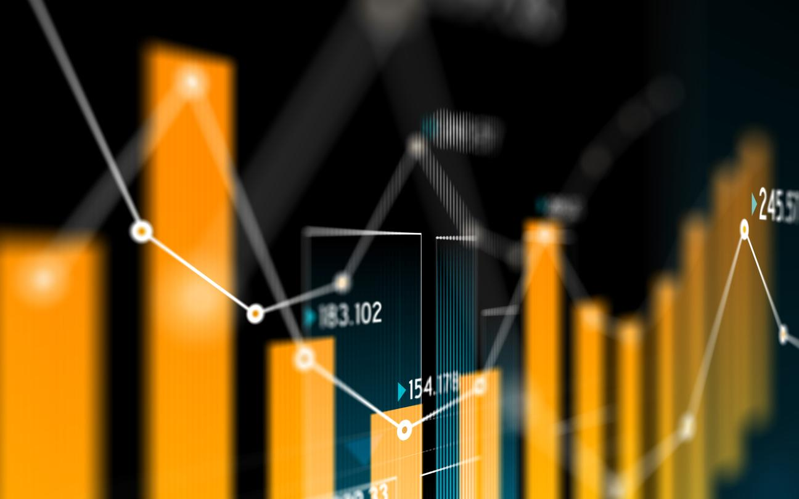

## Table of Contents

## What is market data?

Market data is information about the buying and selling of things like stocks, bonds, and commodities. It shows prices, how much is being traded, and other details that help people make decisions about investing or trading. This data comes from places like stock exchanges, where people and companies trade these items.

This information is very important for people who want to understand how markets are doing. They use it to see trends, make predictions, and decide when to buy or sell. Market data can be shown in real-time, which means it updates as trades happen, or it can be historical data, which shows what happened in the past. Both types help people make smarter choices in the market.

## Why is market data important for investors?

Market data is important for investors because it helps them make smart choices about where to put their money. By looking at market data, investors can see which stocks or other investments are going up or down in price. This information helps them decide if they should buy, sell, or hold onto their investments. For example, if the data shows that a certain stock is increasing in price and more people are buying it, an investor might decide it's a good time to buy that stock too.

Additionally, market data provides historical information that investors can use to spot patterns and trends. This can help them predict what might happen in the future. For instance, if a stock usually goes up in price during a certain time of year, an investor might plan to buy it before that time. Understanding these patterns can lead to better investment decisions and potentially higher returns. Overall, market data is a crucial tool for investors to navigate the market successfully.

## What are the main sources of market data?

The main sources of market data are stock exchanges, financial news services, and data providers. Stock exchanges like the New York Stock Exchange and NASDAQ collect data from all the trades that happen on their platforms. This data shows the prices of stocks, how many shares are traded, and other important information. Investors can access this data directly from the exchanges or through brokers who are connected to the exchanges.

Financial news services like Bloomberg and Reuters also provide market data. They gather information from stock exchanges and other sources and then share it with their subscribers. These services often offer real-time data, which means the information is updated as soon as trades happen. They also provide analysis and news that can help investors understand what's happening in the market.

Another source of market data is data providers like Refinitiv and S&P Global. These companies collect, organize, and sell market data to investors, financial institutions, and other clients. They often combine data from different sources to give a complete picture of the market. Some data providers also offer tools and software that help investors analyze the data and make better decisions.

## How can individuals access market data?

Individuals can access market data in several ways. One common way is through financial websites and apps. Websites like Yahoo Finance and Google Finance offer free access to real-time and historical market data. You can look up stock prices, see how much is being traded, and even get news and analysis about the market. Many brokerages also provide their clients with access to market data through their trading platforms. If you have an account with a broker like Robinhood or E*TRADE, you can see market data right on their website or app.

Another way to get market data is by subscribing to financial news services. Services like Bloomberg Terminal and Reuters provide detailed and often real-time market data, but they usually require a paid subscription. These services are popular among professional investors and traders because they offer a lot of data and tools for analysis. For those who need more specialized data, there are also data providers like Refinitiv and S&P Global. These companies sell market data to individuals and businesses, and they often have different packages depending on what kind of data you need.

## What are the different types of market data?

Market data comes in different forms, but the two main types are real-time data and historical data. Real-time data shows what is happening in the market right now. It updates as trades happen, so you can see the latest prices and how much is being traded at any moment. This is really useful if you want to make quick decisions about buying or selling stocks. Historical data, on the other hand, shows what happened in the market in the past. It can help you see patterns and trends over time, which can be useful for making predictions about what might happen in the future.

There are also different kinds of market data depending on what you're looking at. For example, stock market data includes information about stocks, like their prices, trading volumes, and stock indices like the S&P 500. Bond market data gives you information about bonds, such as their yields and prices. Commodity market data covers things like oil, gold, and agricultural products, showing their prices and trading volumes. Each type of market data helps you understand different parts of the market and can be useful for different kinds of investments.

## How is market data used in trading and investment strategies?

Market data is a key tool for people who trade and invest. It helps them make choices about when to buy and sell. For example, if someone sees that a stock's price is going up and more people are buying it, they might decide to buy it too. They use real-time data to make quick decisions, like buying a stock before its price goes up even more. Historical data is also important because it shows patterns over time. Traders might look at how a stock did in the past to guess what it might do in the future. This can help them plan when to buy or sell.

Market data also helps in creating different trading and investment strategies. Some people use it to follow trends, buying stocks that are going up and selling them when they start to go down. Others might use it to find stocks that are priced lower than they should be, hoping to buy them cheap and sell them later for a profit. Market data can also be used to manage risk. By looking at how much a stock's price moves up and down, investors can decide how much to invest and when to sell to avoid big losses. Overall, market data gives traders and investors the information they need to make smart choices and build successful strategies.

## What are the key components of market data?

Market data includes several key pieces of information that help people understand what's happening in the market. The first important part is price data, which shows how much stocks, bonds, or commodities are selling for at any given time. This includes the current price, the highest and lowest prices of the day, and the opening and closing prices. Another key part is trading [volume](/wiki/volume-trading-strategy), which tells you how many shares or units of something have been bought and sold. This can show how popular or in demand an investment is.

In addition to price and volume, market data also includes other important details. One of these is market indices, like the S&P 500 or Dow Jones, which give a general idea of how the whole market or certain parts of it are doing. Another part is bid and ask prices, which show what people are willing to pay for something and what sellers are asking for it. This can help you see how easy or hard it might be to buy or sell something. All these pieces together help people make decisions about investing or trading.

## How does real-time market data differ from delayed market data?

Real-time market data shows what is happening in the market right now. It updates as soon as trades happen, so you can see the latest prices and how many shares are being bought and sold at any moment. This is really useful if you want to make quick decisions about buying or selling stocks. Traders who need to act fast often use real-time data because it helps them stay on top of the market's changes.

Delayed market data, on the other hand, does not update right away. Instead, it shows prices and trading information from a little while ago, often with a delay of 15 to 20 minutes. This type of data is usually free and can still be helpful for people who do not need to make instant decisions. For example, long-term investors might use delayed data to look at trends over time without needing the most up-to-the-second information.

## What are the challenges in managing and analyzing large volumes of market data?

Managing and analyzing large volumes of market data can be really hard because there is so much of it. Every day, stock exchanges and other places where trades happen create a lot of data. This data comes in fast and keeps growing, which means you need powerful computers and special software to keep track of it all. If you don't have the right tools, it can be tough to store and organize the data in a way that makes it easy to use. Also, making sure the data is correct and complete is a big job. Mistakes or missing information can lead to bad decisions.

Another challenge is figuring out what the data means. When you have a lot of data, it can be hard to see the important parts. You need to use special methods and tools to look for patterns and trends that can help you make good choices about buying or selling. Sometimes, the data can be confusing or hard to understand, and it takes a lot of time and skill to analyze it properly. Plus, the market changes all the time, so you need to keep analyzing new data to stay up to date.

## How do regulations affect the collection and dissemination of market data?

Regulations play a big role in how market data is collected and shared. Governments and financial watchdogs make rules to make sure that the data is fair and correct. For example, they might say that everyone should be able to see the same data at the same time, so no one gets an unfair advantage. These rules also make sure that the people who collect and share the data are doing it the right way. If they don't follow the rules, they could get in trouble.

These regulations can also make it harder to collect and share market data. Companies have to spend time and money to make sure they are following all the rules. Sometimes, the rules can slow down how fast data is shared or make it more expensive. But, these rules are important because they help keep the market fair and safe for everyone.

## What advanced tools and technologies are used for market data analysis?

People use fancy tools and technology to help them understand market data better. One popular tool is called "big data analytics." It helps them look at huge amounts of data quickly and find patterns that they might miss otherwise. Another tool is "[machine learning](/wiki/machine-learning)," which is a kind of computer program that learns from the data it sees. It can help predict what might happen in the market next. There are also special software programs, like trading algorithms, that use market data to make quick decisions about buying and selling.

Another important technology is called "data visualization." This makes it easier to see what the data is saying by turning it into charts, graphs, and other pictures. It helps people spot trends and understand the data without getting lost in numbers. Many traders and investors use "high-frequency trading" systems, which use real-time data to make a lot of trades very quickly. All these tools and technologies make it easier for people to manage and analyze market data, helping them make smarter choices about investing and trading.

## How can market data be integrated with artificial intelligence and machine learning for predictive analytics?

Market data can be used with [artificial intelligence](/wiki/ai-artificial-intelligence) (AI) and machine learning (ML) to help predict what might happen in the market. AI and ML can look at a lot of data really fast and find patterns that people might not see. For example, they can look at past stock prices, how much people are buying and selling, and even news and social media to guess if a stock's price will go up or down. This can help investors and traders make better choices about when to buy or sell.

To do this, people feed market data into AI and ML systems. These systems learn from the data and can make predictions based on what they see. They can also keep learning as new data comes in, so their predictions get better over time. This is really helpful because the market changes a lot, and having a system that can keep up with those changes can give investors an edge. By using AI and ML with market data, people can make smarter decisions and maybe even make more money.

## References & Further Reading

[1]: ["Advances in Financial Machine Learning"](https://www.amazon.com/Advances-Financial-Machine-Learning-Marcos/dp/1119482089) by Marcos Lopez de Prado

[2]: ["Machine Learning for Algorithmic Trading"](https://www.amazon.com/Machine-Learning-Algorithmic-Trading-intelligence/dp/9918608013) by Stefan Jansen

[3]: ["Quantitative Trading: How to Build Your Own Algorithmic Trading Business"](https://www.amazon.com/Quantitative-Trading-Build-Algorithmic-Business/dp/0470284889) by Ernest P. Chan

[4]: ["High-Frequency Trading: A Practical Guide to Algorithmic Strategies and Trading Systems"](https://www.amazon.com/High-Frequency-Trading-Practical-Algorithmic-Strategies/dp/0470563761) by Irene Aldridge

[5]: ["Evidence-Based Technical Analysis: Applying the Scientific Method and Statistical Inference to Trading Signals"](https://www.wiley.com/en-gb/Evidence+Based+Technical+Analysis:+Applying+the+Scientific+Method+and+Statistical+Inference+to+Trading+Signals-p-9780470008744) by David Aronson