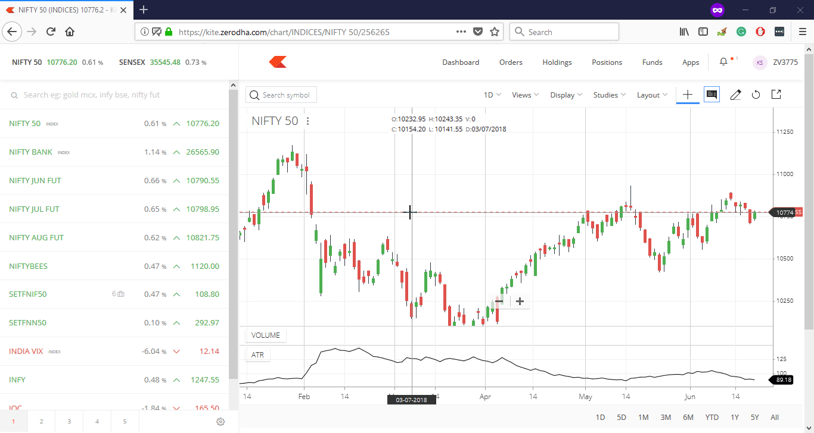

Market depth analysis serves as a crucial element in algorithmic trading, offering a comprehensive view of supply and demand at various price levels for financial instruments. This analysis provides traders with critical insights into the market's liquidity and enables them to assess the ease with which large orders can be executed without significantly impacting the market price.

This article aims to explore the complexities of market depth, illuminating its key components and the pivotal role it plays in trading, especially within the scope of algorithmic trading. The understanding of market depth involves dissecting elements like the order book, bid-ask spread, and levels of depth, each contributing uniquely to the creation of a transparent trading environment.



Furthermore, the article will detail how traders utilize market depth data to make informed decisions, anticipating market movements with a higher degree of accuracy. By analyzing order book dynamics and price levels, traders can identify significant trading opportunities and potential risks, enabling them to execute timely and effective trades.

Additionally, this discussion will cover the integration of market depth with algorithmic trading strategies, a process that can optimize trading outcomes by minimizing slippage and enhancing execution efficiency. Algorithmic systems can be programmed to respond in real-time to changes in market conditions reflected in the depth data, thus fostering a more data-driven and unemotional trading approach.

By the conclusion of this article, readers will have gained a comprehensive understanding of market depth analysis, its critical components, and its diverse applications across various trading scenarios. This knowledge will empower traders to leverage market depth to enhance their trading strategies and improve overall trading performance in an ever-evolving financial landscape.

## Table of Contents

## Understanding Market Depth

Market depth describes the volume of buy and sell orders at varying price points for a financial instrument, offering critical insights into market liquidity. This concept allows traders to gauge how liquid a market is and anticipates how price changes will affect the market.

The primary component of market depth is the [order book](/wiki/order-book-trading-strategies), a real-time list of buy (bids) and sell (asks) orders for a specific asset, categorized by price levels. The order book is a visual representation of market demand and supply, where the depth indicates the number of orders waiting to be executed at each price level.

Another key element is the bid-ask spread, which is the difference between the highest price a buyer is willing to pay (bid) and the lowest price a seller is willing to accept (ask). This spread serves as a crucial indicator of market [liquidity](/wiki/liquidity-risk-premium) and trading costs. A narrow bid-ask spread suggests high liquidity and lower transaction costs, whereas a wider spread points to lower liquidity and higher costs.

Market depth is typically divided into levels, commonly referred to as Level I and Level II. Level I market data provides basic information, including the best bid and ask prices and their respective sizes, making it useful for gauging immediate market conditions. Level II data, however, offers a more comprehensive view by displaying the full order book with multiple bids and asks at different price levels. This detailed information helps traders understand the supply and demand dynamics beyond the best prices, facilitating more informed trading decisions.

## Importance of Market Depth Analysis

Market depth analysis is integral to assessing asset liquidity, providing traders with insights into how easily large orders can be executed without significantly impacting market prices. This assessment is vital as it helps traders gauge the elasticity of the market and anticipate potential shifts that large transactions could cause. 

One of the key roles of market depth analysis is identifying support and resistance levels. Support levels are price points where a substantial amount of buy orders are concentrated, indicating that an asset's price might stop falling and begin to rise due to increased demand. Conversely, resistance levels hold a significant number of sell orders, suggesting that an asset's price could cease rising and begin to decline as supply outweighs demand. Recognizing these levels allows traders to make strategic entry and [exit](/wiki/exit-strategy) decisions, improving the timing of their trades and potentially enhancing profit margins.

Market depth analysis also significantly influences [algorithmic trading](/wiki/algorithmic-trading) strategies, particularly those such as [scalping](/wiki/gamma-scalping), [arbitrage](/wiki/arbitrage), and [trend following](/wiki/trend-following). In scalping, traders exploit small price gaps created by order flows or spreads, and detailed market depth information can facilitate identifying these opportunities rapidly. Arbitrage strategies benefit from insights into discrepancies between different market exchanges, leveraging depth data to find underpriced or overpriced assets. Trend-following strategies utilize market depth data to confirm trends and assess their strength based on order imbalances.

Another critical aspect of market depth analysis is its ability to detect fake orders or spoofing. Spoofing involves placing large orders with no intention of executing them, aiming to create a false impression of demand or supply. This tactic can distort a trader's perception of market conditions, leading to suboptimal trading decisions. By analyzing market depth, traders can identify such deceptive practices by cross-verifying order consistency over time and across various exchanges.

Overall, understanding market depth enhances decision-making and risk management in trading. Traders can better anticipate market movements and adjust their strategies accordingly, leading to more informed and rational trading decisions. This comprehensive insight allows for effective positioning in the market, ultimately aiding in achieving consistent profitability.

## Integrating Market Depth with Algorithmic Trading

Market depth data integration with algorithmic trading aims to improve the efficiency and effectiveness of trade execution while minimizing slippage. By incorporating order book dynamics into algorithms, traders can execute trades with precision and reliability. Automated systems can analyze vast datasets to determine optimal entry and exit points, freeing human traders from the constraints of emotional decision-making. 

The integration process involves creating algorithms capable of utilizing real-time market depth information. These algorithms are designed to adjust trading strategies based on the fluctuations within the order book. For example, market participants can develop Python scripts to automate trading decisions. These scripts may include functions to monitor order sizes and price movements, thereby executing trades when certain market depth criteria are met. The following Python pseudo-code illustrates a basic implementation:

```python
import time
import your_trading_platform as tp

def check_market_depth(symbol):
    depth_data = tp.get_market_depth(symbol)
    bid_volume = depth_data['bid_volume']
    ask_volume = depth_data['ask_volume']
    return bid_volume, ask_volume

def execute_trade(symbol, buy_threshold, sell_threshold):
    while True:
        bid_volume, ask_volume = check_market_depth(symbol)
        if bid_volume > buy_threshold:
            tp.place_buy_order(symbol)
        elif ask_volume < sell_threshold:
            tp.place_sell_order(symbol)
        time.sleep(1)

execute_trade('AAPL', 1000, 500)
```

In this pseudo-code, the `check_market_depth` function retrieves current market depth data, and the `execute_trade` function uses this data to make automated trading decisions. The algorithm ensures trades are performed without human intervention, thus enhancing consistency in decision-making.

The combination of market depth data and algorithmic trading creates a synergistic effect, allowing traders to capitalize on opportunities that might be fleeting. Algorithms are capable of analyzing data with higher speed and accuracy than manual methods, leading to improved handling of large volumes and rapid market shifts. This integration not only refines trading strategies but also mitigates the risk of slippage by allowing traders to act swiftly in highly dynamic environments.

Overall, incorporating market depth into algorithmic trading streamlines operations and enhances the capacity for informed decision-making, crucial for achieving success in fast-paced financial markets. As algorithmic trading technologies evolve, the significance and utilization of market depth data will likely continue to expand.

## Tools and Platforms for Market Depth Analysis

Several trading platforms offer advanced tools designed for effective market depth analysis, crucial for informed trading and strategy development. Among these platforms, MetaTrader, NinjaTrader, and Thinkorswim stand out for their robust features tailored to meet the needs of both individual and institutional traders.

MetaTrader is renowned for its user-friendly interface and extensive capabilities including real-time data feeds, algorithmic trading support through Expert Advisors, and customizable charting tools. NinjaTrader is preferred for its comprehensive market analytics, offering advanced charting, [backtesting](/wiki/backtesting), and automated trading functionalities. Thinkorswim, provided by TD Ameritrade, excels with its sophisticated analytics, advanced trading options, and educational resources, making it a versatile tool for traders seeking detailed market insights.

In addition to these platforms, market data providers like Bloomberg Terminal and Reuters Eikon deliver in-depth market depth information crucial for professional trading environments. Bloomberg Terminal provides real-time financial data, powerful analytics, and news updates, making it indispensable for traders who require comprehensive market intelligence. Reuters Eikon offers similar benefits, providing fast access to market information and analytics tools.

Selecting the right tools for market depth analysis involves evaluating several critical factors. Execution speed is vital for traders who rely on quick market responses, while data accuracy ensures that trading decisions are based on precise information. User-friendliness is also crucial, particularly for traders who may not possess sophisticated technical expertise.

These platforms and tools significantly enhance a trader's ability to perform effective market depth analysis and implement algorithmic trading strategies. By leveraging high-quality market data and advanced analytical capabilities, traders can make more accurate predictions, optimize trading decisions, and achieve more consistent trading outcomes.

## Challenges in Market Depth Analysis

Market depth analysis is not without its challenges, particularly due to market manipulation tactics like spoofing and quote stuffing. Spoofing involves placing large orders with the intent to cancel them before execution, creating false impressions of demand or supply. Quote stuffing further complicates the issue by flooding the market with a high number of orders to delay execution or crowd out competitors. These tactics can significantly distort genuine market data, leading to misleading market depth signals that traders could misinterpret.

Additionally, high-frequency trading ([HFT](/wiki/high-frequency-trading-strategies)) and latency are critical considerations that impact market depth analysis. In HFT environments, the speed at which data is processed becomes crucial. Any delay, or latency, in data transmission can result in outdated information, thereby affecting the reliability of market depth data. This is especially problematic for algorithmic trading, where milliseconds can mean the difference between profit and loss.

To navigate these challenges, traders must develop adaptive algorithms capable of responding to rapidly changing market conditions. These algorithms can be programmed to dynamically adjust parameters based on real-time data inputs, maintaining trading effectiveness even in volatile markets. For instance, traders can employ [machine learning](/wiki/machine-learning) techniques to predict the likelihood of spoofing behavior and adjust their strategies accordingly.

Ensuring data quality is another paramount task in market depth analysis. Inaccuracies in data can arise from various sources, including incorrect price feeds or technical errors from data providers. Discrepancies in data can lead to erroneous trading signals, resulting in poor decision-making and financial losses. Hence, traders should prioritize using reliable and accurate data sources while employing robust validation mechanisms to cross-verify the information before executing trades.

Overall, addressing these challenges is essential for achieving consistent and profitable trading outcomes. As the financial markets continue to evolve, traders will need to stay vigilant and continuously refine their strategies to account for the complexities inherent in market depth analysis. This will involve not only technological advancements but also a nuanced understanding of market behaviors and potential manipulation tactics.

## Applications in Various Markets

Market depth analysis is extensively utilized across various financial markets, playing crucial roles in enhancing trading strategies and decision-making processes. In equities, market depth provides insights into the supply and demand dynamics specific to stocks, helping traders evaluate liquidity conditions and the potential impact of large orders. By examining the [volume](/wiki/volume-trading-strategy) and price levels in the order book, equity traders can anticipate the possible movement of stock prices and identify support and resistance levels.

In the foreign exchange ([forex](/wiki/forex-system)) market, where currency liquidity and exchange rates can be volatile, market depth is instrumental in assessing the liquidity of currency pairs. Forex traders use market depth to gauge the depth of buy and sell orders, which can signal potential price trends or reversals. Analyzing the market depth data helps traders understand the liquidity available at various price levels, informing strategic decisions related to trade entry and exit points.

Futures and options markets also benefit from market depth analysis by providing insights into market sentiment. Traders in these markets closely monitor market depth data to understand investor sentiment, as well as identify hedging opportunities. For options, in particular, market depth can reveal the interest in different strike prices and expiration dates, aiding in constructing comprehensive hedging strategies.

The [cryptocurrency](/wiki/cryptocurrency) market, known for its high [volatility](/wiki/volatility-trading-strategies), relies heavily on market depth to manage risk and identify strategic entry or exit points. Given the rapid price changes in cryptocurrencies, understanding market depth helps traders navigate these fluctuations by identifying liquidity pools that may indicate potential resistance or support levels. Additionally, market depth analysis in cryptocurrencies is vital for detecting potentially manipulative practices that can temporarily distort market conditions.

Python scripts can automate the process of analyzing market depth across these markets, taking advantage of APIs provided by various trading platforms to fetch real-time order book data. Such automation allows traders to react quickly to market changes using pre-defined criteria, leading to more informed trading decisions and potentially improved profitability.

## Conclusion

Market depth analysis serves as a crucial instrument for algorithmic traders, offering detailed insights into order book dynamics that significantly enhance trading decisions. This analytical approach allows traders to observe and interpret the intricate market data, which leads to more informed decisions on when to enter or exit positions. By utilizing market depth data, traders can manage risk more effectively. This capability not only reduces potential losses but also allows traders to capitalize on market opportunities that might otherwise go unnoticed.

One of the key advantages of market depth analysis is its capacity to mitigate risks associated with large orders and market impact. It enables traders to detect liquidity levels and optimize trade execution, thus minimizing slippage and preserving intended profit margins. However, challenges such as market manipulation tactics, including spoofing, and latency issues persist. Despite these obstacles, market depth analysis remains integral to algorithmic trading strategies, providing vital information that complements traditional trading indicators.

As trading technologies continue to evolve, the significance of market depth analysis only increases. The development of faster, more robust trading platforms and analytical tools enhances the accuracy and efficiency of market depth data interpretation. This evolution reinforces the role of market depth in achieving consistent profitability in financial markets. Consequently, traders are increasingly relying on advanced computational methodologies and automated systems that incorporate market depth analytics to maintain a competitive edge.

In conclusion, market depth analysis is undeniably a vital component of modern algorithmic trading. It offers a detailed understanding of market structure, thereby aiding traders in executing trades that are both well-informed and strategically sound. As the trading landscape continues to transform, mastering market depth analysis will be crucial for traders aiming to achieve sustained success in the ever-competitive financial markets.

## References & Further Reading

[1]: Koul, S. (2018). ["Market Microstructure in Practice."](https://worldscientific.com/worldscibooks/10.1142/10739) World Scientific Publishing Company.

[2]: Lopez de Prado, M. (2018). ["Advances in Financial Machine Learning."](https://books.google.com/books/about/Advances_in_Financial_Machine_Learning.html?id=oU9KDwAAQBAJ) Wiley.

[3]: Easley, D., López de Prado, M. M., & O'Hara, M. (2012). ["Flow Toxicity and Liquidity in a High-Frequency World."](https://www.jstor.org/stable/41485533) Financial Analysts Journal.

[4]: Hasbrouck, J. (2007). ["Empirical Market Microstructure: The Institutions, Economics, and Econometrics of Securities Trading."](https://academic.oup.com/book/52241) Oxford University Press.

[5]: Nuti, G., Mirghaemi, M., Treleaven, P., & Yingsaeree, C. (2011). ["Algorithmic Trading."](https://www.semanticscholar.org/paper/Algorithmic-Trading-Nuti-Mirghaemi/dec841dd0f1fce55ba930b26f3fb945e330dfcbb) Risk Books.

[6]: Chan, E. P. (2009). ["Quantitative Trading: How to Build Your Own Algorithmic Trading Business."](https://github.com/egorpe/EPChan-QuantitativeTrading/blob/master/example7_6.m) Wiley.